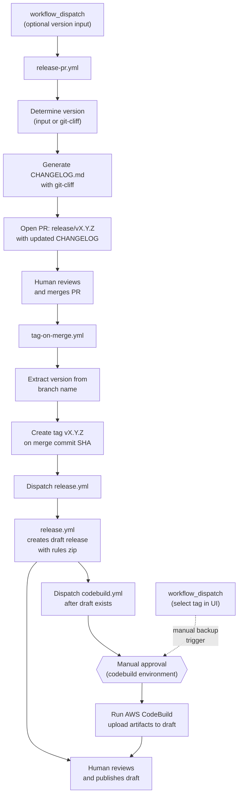
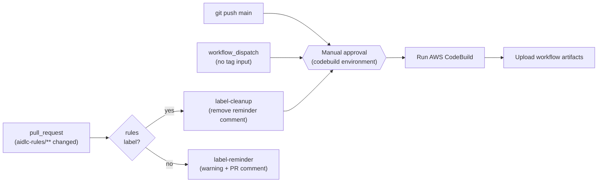
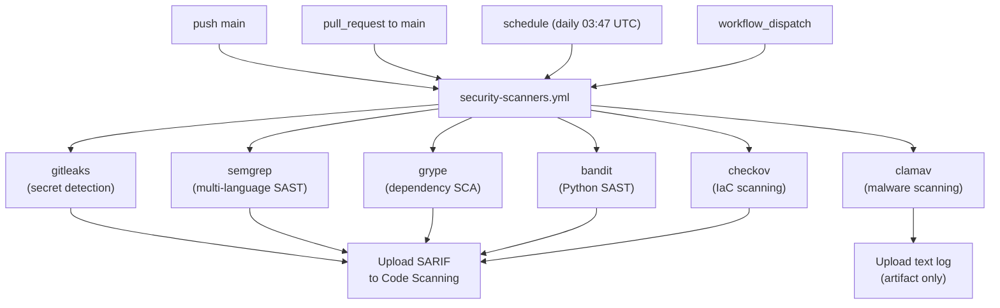
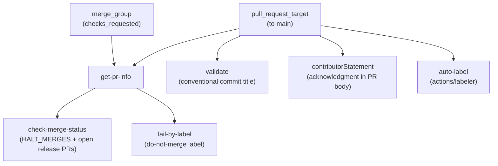

# awslabs/aidlc-workflows

Source: https://github.com/awslabs/aidlc-workflows
Ingested: 2026-04-24
Type: documentation

---

# README

# AI-DLC (AI-Driven Development Life Cycle)

> [!IMPORTANT]
> Generative AI can make mistakes. You should consider reviewing all output and costs generated by your chosen AI model and agentic coding assistant. See [AWS Responsible AI Policy](https://aws.amazon.com/ai/responsible-ai/policy/).

<!-- TODO: Replace this Amplify URL with a permanent/stable URL when available -->
AI-DLC is an intelligent software development workflow that adapts to your needs, maintains quality standards, and keeps you in control of the process. For learning more about AI-DLC Methodology, read this [blog](https://aws.amazon.com/blogs/devops/ai-driven-development-life-cycle/) and the [Method Definition Paper](https://prod.d13rzhkk8cj2z0.amplifyapp.com/) referred in it.

## Table of Contents

- [Common](#common)
- [Platform-Specific Setup](#platform-specific-setup)
- [Usage](#usage)
- [Three-Phase Adaptive Workflow](#three-phase-adaptive-workflow)
- [Key Features](#key-features)
- [Extensions](#extensions)
- [Tenets](#tenets)
- [Prerequisites](#prerequisites)
- [Troubleshooting](#troubleshooting)
- [Version Control Recommendations](#version-control-recommendations)
- [Additional Resources](#additional-resources)
- [Generated aidlc-docs/ Reference](#generated-aidlc-docs-reference)
- [Experimental: AI-Assisted Setup (Release Download)](#experimental-ai-assisted-setup-release-download)
- [Contributing](#contributing)
- [License](#license)

---

## Common

1. Download the latest release zip file named `ai-dlc-rules-v<release-number>.zip` from the [Releases page](../../releases/latest) to a folder **outside** your project directory (e.g., `~/Downloads`).
2. Extract the zip. It contains an `aidlc-rules/` folder with two subdirectories:
   - `aws-aidlc-rules/` — the core AI-DLC workflow rules
   - `aws-aidlc-rule-details/` — detailed rules conditionally referenced by the core rules
3. Follow the setup instructions for your coding agent and platform below.

---

## Platform-Specific Setup

- [Kiro](#kiro)
- [Amazon Q Developer IDE Plugin](#amazon-q-developer-ide-pluginextension)
- [Cursor IDE](#cursor-ide)
- [Cline](#cline)
- [Claude Code](#claude-code)
- [GitHub Copilot](#github-copilot)
- [OpenAI Codex](#openai-codex)
- [Other Agents](#other-agents)

---

### Kiro

AI-DLC uses [Kiro Steering Files](https://kiro.dev/docs/cli/steering/) within your project workspace.  

The commands below assume you extracted the zip to your `Downloads` folder. If you used a different location, replace `Downloads` with your actual folder path.

On macOS/Linux:

```bash
mkdir -p .kiro/steering
cp -R ~/Downloads/aidlc-rules/aws-aidlc-rules .kiro/steering/
cp -R ~/Downloads/aidlc-rules/aws-aidlc-rule-details .kiro/
```

On Windows (PowerShell):

```powershell
New-Item -ItemType Directory -Force -Path ".kiro\steering"
Copy-Item -Recurse "$env:USERPROFILE\Downloads\aidlc-rules\aws-aidlc-rules" ".kiro\steering\"
Copy-Item -Recurse "$env:USERPROFILE\Downloads\aidlc-rules\aws-aidlc-rule-details" ".kiro\"
```

On Windows (CMD):

```cmd
mkdir .kiro\steering
xcopy %USERPROFILE%\Downloads\aidlc-rules\aws-aidlc-rules .kiro\steering\aws-aidlc-rules\ /E /I
xcopy %USERPROFILE%\Downloads\aidlc-rules\aws-aidlc-rule-details .kiro\aws-aidlc-rule-details\ /E /I
```

Your project should look like:

```text
<project-root>/
    ├── .kiro/
    │     ├── steering/
    │     │      ├── aws-aidlc-rules/
    │     ├── aws-aidlc-rule-details/
```

To verify the rules are loaded:

#### Verify in Kiro IDE

Open the steering files panel and confirm you see an entry for `core-workflow` under `Workspace` as shown in the screenshot below.


We use Kiro IDE in Vibe mode to run the AI-DLC workflow. This ensures that AI-DLC workflow guides the development workflow in Kiro. At times, Kiro may nudge you to switch to spec mode. Select `No` to such prompts to stay in Vibe mode.


#### Verify in Kiro CLI

Run `kiro-cli`, then `/context show`, and confirm entries for `.kiro/steering/aws-aidlc-rules`.


---

### Amazon Q Developer IDE Plugin/Extension

AI-DLC uses [Amazon Q Rules](https://docs.aws.amazon.com/amazonq/latest/qdeveloper-ug/context-project-rules.html) within your project workspace.

The commands below assume you extracted the zip to your `Downloads` folder. If you used a different location, replace `Downloads` with your actual folder path.

On macOS/Linux:

```bash
mkdir -p .amazonq/rules
cp -R ~/Downloads/aidlc-rules/aws-aidlc-rules .amazonq/rules/
cp -R ~/Downloads/aidlc-rules/aws-aidlc-rule-details .amazonq/
```

On Windows (PowerShell):

```powershell
New-Item -ItemType Directory -Force -Path ".amazonq\rules"
Copy-Item -Recurse "$env:USERPROFILE\Downloads\aidlc-rules\aws-aidlc-rules" ".amazonq\rules\"
Copy-Item -Recurse "$env:USERPROFILE\Downloads\aidlc-rules\aws-aidlc-rule-details" ".amazonq\"
```

On Windows (CMD):

```cmd
mkdir .amazonq\rules
xcopy %USERPROFILE%\Downloads\aidlc-rules\aws-aidlc-rules .amazonq\rules\aws-aidlc-rules\ /E /I
xcopy %USERPROFILE%\Downloads\aidlc-rules\aws-aidlc-rule-details .amazonq\aws-aidlc-rule-details\ /E /I
```

Your project should look like:

```text
<project-root>/
    ├── .amazonq/
    │     ├── rules/
    │     │     ├── aws-aidlc-rules/
    │     ├── aws-aidlc-rule-details/
```

To verify the rules are loaded:

1. In the Amazon Q Chat window, click the `Rules` button in the lower right corner.
2. Confirm you see entries for `.amazonq/rules/aws-aidlc-rules`.


---

### Cursor IDE

AI-DLC uses [Cursor Rules](https://cursor.com/docs/context/rules) to implement its intelligent workflow.

The commands below assume you extracted the zip to your `Downloads` folder. If you used a different location, replace `Downloads` with your actual folder path.

#### Option 1: Project Rules (Recommended)

**Unix/Linux/macOS:**

```bash
mkdir -p .cursor/rules

cat > .cursor/rules/ai-dlc-workflow.mdc << 'EOF'
---
description: "AI-DLC (AI-Driven Development Life Cycle) adaptive workflow for software development"
alwaysApply: true
---

EOF
cat ~/Downloads/aidlc-rules/aws-aidlc-rules/core-workflow.md >> .cursor/rules/ai-dlc-workflow.mdc

mkdir -p .aidlc-rule-details
cp -R ~/Downloads/aidlc-rules/aws-aidlc-rule-details/* .aidlc-rule-details/
```

**Windows PowerShell:**

```powershell
New-Item -ItemType Directory -Force -Path ".cursor\rules"

$frontmatter = @"
---
description: "AI-DLC (AI-Driven Development Life Cycle) adaptive workflow for software development"
alwaysApply: true
---

"@
$frontmatter | Out-File -FilePath ".cursor\rules\ai-dlc-workflow.mdc" -Encoding utf8

Get-Content "$env:USERPROFILE\Downloads\aidlc-rules\aws-aidlc-rules\core-workflow.md" | Add-Content ".cursor\rules\ai-dlc-workflow.mdc"

New-Item -ItemType Directory -Force -Path ".aidlc-rule-details"
Copy-Item "$env:USERPROFILE\Downloads\aidlc-rules\aws-aidlc-rule-details\*" ".aidlc-rule-details\" -Recurse
```

**Windows CMD:**

```cmd
mkdir .cursor\rules

(
echo ---
echo description: "AI-DLC (AI-Driven Development Life Cycle) adaptive workflow for software development"
echo alwaysApply: true
echo ---
echo.
) > .cursor\rules\ai-dlc-workflow.mdc

type "%USERPROFILE%\Downloads\aidlc-rules\aws-aidlc-rules\core-workflow.md" >> .cursor\rules\ai-dlc-workflow.mdc

mkdir .aidlc-rule-details
xcopy "%USERPROFILE%\Downloads\aidlc-rules\aws-aidlc-rule-details" ".aidlc-rule-details\" /E /I
```

#### Option 2: AGENTS.md (Simple Alternative)

**Unix/Linux/macOS:**

```bash
cp ~/Downloads/aidlc-rules/aws-aidlc-rules/core-workflow.md ./AGENTS.md
mkdir -p .aidlc-rule-details
cp -R ~/Downloads/aidlc-rules/aws-aidlc-rule-details/* .aidlc-rule-details/
```

**Windows PowerShell:**

```powershell
Copy-Item "$env:USERPROFILE\Downloads\aidlc-rules\aws-aidlc-rules\core-workflow.md" ".\AGENTS.md"
New-Item -ItemType Directory -Force -Path ".aidlc-rule-details"
Copy-Item "$env:USERPROFILE\Downloads\aidlc-rules\aws-aidlc-rule-details\*" ".aidlc-rule-details\" -Recurse
```

**Windows CMD:**

```cmd
copy "%USERPROFILE%\Downloads\aidlc-rules\aws-aidlc-rules\core-workflow.md" ".\AGENTS.md"
mkdir .aidlc-rule-details
xcopy "%USERPROFILE%\Downloads\aidlc-rules\aws-aidlc-rule-details" ".aidlc-rule-details\" /E /I
```

**Verify Setup:**

1. Open **Cursor Settings → Rules, Commands**
2. Under **Project Rules**, you should see `ai-dlc-workflow` listed
3. For `AGENTS.md`, it will be automatically detected and applied


**Directory Structure (Option 1):**

```text
<my-project>/
├── .cursor/
│   └── rules/
│       └── ai-dlc-workflow.mdc
└── .aidlc-rule-details/
    ├── common/
    ├── inception/
    ├── construction/
    ├── extensions/
    └── operations/
```

---

### Cline

AI-DLC uses Cline Rules to implement its intelligent workflow.

The commands below assume you extracted the zip to your `Downloads` folder. If you used a different location, replace `Downloads` with your actual folder path.

#### Option 1: .clinerules Directory (Recommended)

**Unix/Linux/macOS:**

```bash
mkdir -p .clinerules
cp ~/Downloads/aidlc-rules/aws-aidlc-rules/core-workflow.md .clinerules/
mkdir -p .aidlc-rule-details
cp -R ~/Downloads/aidlc-rules/aws-aidlc-rule-details/* .aidlc-rule-details/
```

**Windows PowerShell:**

```powershell
New-Item -ItemType Directory -Force -Path ".clinerules"
Copy-Item "$env:USERPROFILE\Downloads\aidlc-rules\aws-aidlc-rules\core-workflow.md" ".clinerules\"
New-Item -ItemType Directory -Force -Path ".aidlc-rule-details"
Copy-Item "$env:USERPROFILE\Downloads\aidlc-rules\aws-aidlc-rule-details\*" ".aidlc-rule-details\" -Recurse
```

**Windows CMD:**

```cmd
mkdir .clinerules
copy "%USERPROFILE%\Downloads\aidlc-rules\aws-aidlc-rules\core-workflow.md" ".clinerules\"
mkdir .aidlc-rule-details
xcopy "%USERPROFILE%\Downloads\aidlc-rules\aws-aidlc-rule-details" ".aidlc-rule-details\" /E /I
```

#### Option 2: AGENTS.md (Alternative)

**Unix/Linux/macOS:**

```bash
cp ~/Downloads/aidlc-rules/aws-aidlc-rules/core-workflow.md ./AGENTS.md
mkdir -p .aidlc-rule-details
cp -R ~/Downloads/aidlc-rules/aws-aidlc-rule-details/* .aidlc-rule-details/
```

**Windows PowerShell:**

```powershell
Copy-Item "$env:USERPROFILE\Downloads\aidlc-rules\aws-aidlc-rules\core-workflow.md" ".\AGENTS.md"
New-Item -ItemType Directory -Force -Path ".aidlc-rule-details"
Copy-Item "$env:USERPROFILE\Downloads\aidlc-rules\aws-aidlc-rule-details\*" ".aidlc-rule-details\" -Recurse
```

**Windows CMD:**

```cmd
copy "%USERPROFILE%\Downloads\aidlc-rules\aws-aidlc-rules\core-workflow.md" ".\AGENTS.md"
mkdir .aidlc-rule-details
xcopy "%USERPROFILE%\Downloads\aidlc-rules\aws-aidlc-rule-details" ".aidlc-rule-details\" /E /I
```

**Verify Setup:**

1. In Cline's chat interface, look for the Rules popover under the chat input field
2. Verify that `core-workflow.md` is listed and active
3. You can toggle the rule file on/off as needed


**Directory Structure (Option 1):**

```text
<my-project>/
├── .clinerules/
│   └── core-workflow.md
└── .aidlc-rule-details/
    ├── common/
    ├── inception/
    ├── construction/
    ├── extensions/
    └── operations/
```

---

### Claude Code

AI-DLC uses Claude Code's project memory file (`CLAUDE.md`) to implement its intelligent workflow.

The commands below assume you extracted the zip to your `Downloads` folder. If you used a different location, replace `Downloads` with your actual folder path.

#### Option 1: Project Root (Recommended)

**Unix/Linux/macOS:**

```bash
cp ~/Downloads/aidlc-rules/aws-aidlc-rules/core-workflow.md ./CLAUDE.md
mkdir -p .aidlc-rule-details
cp -R ~/Downloads/aidlc-rules/aws-aidlc-rule-details/* .aidlc-rule-details/
```

**Windows PowerShell:**

```powershell
Copy-Item "$env:USERPROFILE\Downloads\aidlc-rules\aws-aidlc-rules\core-workflow.md" ".\CLAUDE.md"
New-Item -ItemType Directory -Force -Path ".aidlc-rule-details"
Copy-Item "$env:USERPROFILE\Downloads\aidlc-rules\aws-aidlc-rule-details\*" ".aidlc-rule-details\" -Recurse
```

**Windows CMD:**

```cmd
copy "%USERPROFILE%\Downloads\aidlc-rules\aws-aidlc-rules\core-workflow.md" ".\CLAUDE.md"
mkdir .aidlc-rule-details
xcopy "%USERPROFILE%\Downloads\aidlc-rules\aws-aidlc-rule-details" ".aidlc-rule-details\" /E /I
```

#### Option 2: .claude Directory

**Unix/Linux/macOS:**

```bash
mkdir -p .claude
cp ~/Downloads/aidlc-rules/aws-aidlc-rules/core-workflow.md .claude/CLAUDE.md
mkdir -p .aidlc-rule-details
cp -R ~/Downloads/aidlc-rules/aws-aidlc-rule-details/* .aidlc-rule-details/
```

**Windows PowerShell:**

```powershell
New-Item -ItemType Directory -Force -Path ".claude"
Copy-Item "$env:USERPROFILE\Downloads\aidlc-rules\aws-aidlc-rules\core-workflow.md" ".claude\CLAUDE.md"
New-Item -ItemType Directory -Force -Path ".aidlc-rule-details"
Copy-Item "$env:USERPROFILE\Downloads\aidlc-rules\aws-aidlc-rule-details\*" ".aidlc-rule-details\" -Recurse
```

**Windows CMD:**

```cmd
mkdir .claude
copy "%USERPROFILE%\Downloads\aidlc-rules\aws-aidlc-rules\core-workflow.md" ".claude\CLAUDE.md"
mkdir .aidlc-rule-details
xcopy "%USERPROFILE%\Downloads\aidlc-rules\aws-aidlc-rule-details" ".aidlc-rule-details\" /E /I
```

**Verify Setup:**

1. Start Claude Code in your project directory (CLI: `claude` or VS Code extension)
2. Use the `/config` command to view current configuration
3. Ask Claude: "What instructions are currently active in this project?"

**Directory Structure (Option 1):**

```text
<my-project>/
├── CLAUDE.md
└── .aidlc-rule-details/
    ├── common/
    ├── inception/
    ├── construction/
    ├── extensions/
    └── operations/
```

---

### GitHub Copilot

AI-DLC uses [GitHub Copilot custom instructions](https://code.visualstudio.com/docs/copilot/customization/custom-instructions) to implement its intelligent workflow. The `.github/copilot-instructions.md` file is automatically detected and applied to all chat requests in the workspace.

The commands below assume you extracted the zip to your `Downloads` folder. If you used a different location, replace `Downloads` with your actual folder path.

**Unix/Linux/macOS:**

```bash
mkdir -p .github
cp ~/Downloads/aidlc-rules/aws-aidlc-rules/core-workflow.md .github/copilot-instructions.md
mkdir -p .aidlc-rule-details
cp -R ~/Downloads/aidlc-rules/aws-aidlc-rule-details/* .aidlc-rule-details/
```

**Windows PowerShell:**

```powershell
New-Item -ItemType Directory -Force -Path ".github"
Copy-Item "$env:USERPROFILE\Downloads\aidlc-rules\aws-aidlc-rules\core-workflow.md" ".github\copilot-instructions.md"
New-Item -ItemType Directory -Force -Path ".aidlc-rule-details"
Copy-Item "$env:USERPROFILE\Downloads\aidlc-rules\aws-aidlc-rule-details\*" ".aidlc-rule-details\" -Recurse
```

**Windows CMD:**

```cmd
mkdir .github
copy "%USERPROFILE%\Downloads\aidlc-rules\aws-aidlc-rules\core-workflow.md" ".github\copilot-instructions.md"
mkdir .aidlc-rule-details
xcopy "%USERPROFILE%\Downloads\aidlc-rules\aws-aidlc-rule-details" ".aidlc-rule-details\" /E /I
```

**Verify Setup:**

1. Open VS Code with your project folder
2. Open the Copilot Chat panel (Cmd/Ctrl+Shift+I)
3. Select **Configure Chat** (gear icon) > **Chat Instructions** and verify that `copilot-instructions` is listed
4. Alternatively, type `/instructions` in the chat input to view active instructions

**Directory Structure:**

```text
<my-project>/
├── .github/
│   └── copilot-instructions.md
└── .aidlc-rule-details/
    ├── common/
    ├── inception/
    ├── construction/
    ├── extensions/
    └── operations/
```

---

### OpenAI Codex

AI-DLC supports OpenAI Codex as a supported coding agent, using the [Codex AGENTS.md](https://developers.openai.com/codex/guides/agents-md) convention to deliver its intelligent workflow. Codex automatically discovers and loads `AGENTS.md` from your project root when you start a session.

The commands below assume you extracted the zip to your `Downloads` folder. If you used a different location, replace `Downloads` with your actual folder path.

**Unix/Linux/macOS:**

```bash
cp ~/Downloads/aidlc-rules/aws-aidlc-rules/core-workflow.md ./AGENTS.md
mkdir -p .aidlc-rule-details
cp -R ~/Downloads/aidlc-rules/aws-aidlc-rule-details/* .aidlc-rule-details/
```

**Windows PowerShell:**

```powershell
Copy-Item "$env:USERPROFILE\Downloads\aidlc-rules\aws-aidlc-rules\core-workflow.md" ".\AGENTS.md"
New-Item -ItemType Directory -Force -Path ".aidlc-rule-details"
Copy-Item "$env:USERPROFILE\Downloads\aidlc-rules\aws-aidlc-rule-details\*" ".aidlc-rule-details\" -Recurse
```

**Windows CMD:**

```cmd
copy "%USERPROFILE%\Downloads\aidlc-rules\aws-aidlc-rules\core-workflow.md" ".\AGENTS.md"
mkdir .aidlc-rule-details
xcopy "%USERPROFILE%\Downloads\aidlc-rules\aws-aidlc-rule-details" ".aidlc-rule-details\" /E /I
```

**Verify Setup:**

1. Start a Codex session in your project directory
2. Ask Codex: For existing project - "Using AIDLC analyze the project?" or For new project "Using Aidlc what workflow do you see" .
3. Codex should describe the AI-DLC three-phase workflow (Inception → Construction → Operations)

> [!NOTE]
> The `AGENTS.md` file is designed to fit within Codex's instruction budget under default settings. If you add substantial project-specific content and Codex reports that the project documentation exceeds its instruction limit, you can increase the limit in your Codex configuration (for example, by adjusting `project_doc_max_bytes` in your `config.toml` file):
>
> ```toml
> project_doc_max_bytes = 65536  # Example value; choose a limit appropriate for your project
> ```

**Directory Structure:**

```text
<my-project>/
├── AGENTS.md
└── .aidlc-rule-details/
    ├── common/
    ├── inception/
    ├── construction/
    ├── extensions/
    └── operations/
```

---

### Other Agents

AI-DLC works with any coding agent that supports project-level rules or steering files. The general approach:

1. Place `aws-aidlc-rules/` wherever your agent reads project rules from (consult your agent's documentation).
2. Place `aws-aidlc-rule-details/` at a sibling level so the rules can reference it.

If your agent has no convention for rules files, place both folders at your project root and point the agent to `aws-aidlc-rules/` as its rules directory.

---

## Usage

1. Start any software development project by stating your intent starting with the phrase **"Using AI-DLC, ..."** in the chat
2. AI-DLC workflow automatically activates and guides you from there
3. Answer structured questions that AI-DLC asks you
4. Carefully review every plan that AI generates. Provide your oversight and validation
5. Review the execution plan to see which stages will run
6. Carefully review the artifacts and approve each stage to maintain control
7. All the artifacts will be generated in the `aidlc-docs/` directory

---

## Three-Phase Adaptive Workflow

AI-DLC follows a structured three-phase approach that adapts to your project's complexity:

### 🔵 INCEPTION PHASE

Determines **WHAT** to build and **WHY**

- Requirements analysis and validation
- User story creation (when applicable)
- Application Design and creating units of work for parallel development
- Risk assessment and complexity evaluation

### 🟢 CONSTRUCTION PHASE

Determines **HOW** to build it

- Detailed component design
- Code generation and implementation
- Build configuration and testing strategies
- Quality assurance and validation

### 🟡 OPERATIONS PHASE

Deployment and monitoring (future)

- Deployment automation and infrastructure
- Monitoring and observability setup
- Production readiness validation

---

## Key Features

| Feature                   | Description                                                                                               |
| ------------------------- | --------------------------------------------------------------------------------------------------------- |
| **Adaptive Intelligence** | Only executes stages that add value to your specific request                                              |
| **Context-Aware**         | Analyzes existing codebase and complexity requirements                                                    |
| **Risk-Based**            | Complex changes get comprehensive treatment, simple changes stay efficient                                |
| **Question-Driven**       | Structured multiple-choice questions in files, not chat                                                   |
| **Always in Control**     | Review execution plans and approve each phase                                                             |
| **Extensible**            | Layer custom rules e.g. security, compliance, and organization-specific rules on top of the core workflow |

---

## Extensions

AI-DLC supports an extension system that lets you layer additional rules on top of the core workflow. Extensions are markdown files organized under `aws-aidlc-rule-details/extensions/` and grouped by category (e.g., `security/`, `testing/`).

### How Extensions Work

Each extension consists of two files placed in the same directory:

- A **rules file** (e.g., `security-baseline.md`) containing the extension's rules.
- An **opt-in file** (e.g., `security-baseline.opt-in.md`) containing a structured multiple-choice question presented to the user during Requirements Analysis.

At workflow start, AI-DLC scans the `extensions/` directory and loads only `*.opt-in.md` files. During Requirements Analysis, it presents each opt-in prompt to the user. When the user opts in, the corresponding rules file is loaded (derived by naming convention: strip `.opt-in.md`, append `.md`). When the user opts out, the rules file is never loaded. Extensions without a matching `*.opt-in.md` file are always enforced.

Once enabled, extension rules are blocking constraints — at each stage, the model verifies compliance before allowing the stage to proceed.

### Built-in Extensions

The `extensions/` directory ships with the following (new extensions may be added over time):

```text
aws-aidlc-rule-details/
└── extensions/
    ├── security/                      # Extension category
    │   └── baseline/
    │       ├── security-baseline.md          # Baseline security rules
    │       └── security-baseline.opt-in.md   # Opt-in prompt
    └── testing/                       # Extension category
        └── property-based/
            ├── property-based-testing.md          # Property-based testing rules
            └── property-based-testing.opt-in.md   # Opt-in prompt
```

> [!IMPORTANT]
> The security extension rules are provided as a directional reference for building effective security rules within AI-DLC workflows. Each organization should build, customize, and thoroughly test their own security rules before deploying in production workflows.

### Adding Your Own Extensions

You can extend an existing category or create an entirely new one.

1. Create a directory under `extensions/` (e.g., `security/compliance/` or `performance/baseline/`).
2. Add a **rules file** (e.g., `compliance.md`). Follow the same structure as `security-baseline.md`:
   - Define each rule as a heading in the format `## Rule <PREFIX-NN>: <Title>` where the prefix is a short category identifier and NN is a sequential number (e.g., `COMPLIANCE-01`, `COMPLIANCE-02`). These IDs are referenced in audit logs and compliance summaries, so they must be unique across all loaded extensions.
   - Include a **Rule** section describing the requirement.
   - Include a **Verification** section with concrete checks the model should evaluate.
3. Add a matching **opt-in file** using the naming convention `<name>.opt-in.md` (e.g., `compliance.opt-in.md`). See `security-baseline.opt-in.md` for the expected format. Omitting this file means the extension is always enforced with no user opt-out.
4. Rules are blocking by default — if verification criteria are not met, the stage cannot proceed until the finding is resolved.

---

## Tenets

These are our core principles to guide our decision making.

- **No duplication**. The source of truth lives in one place. If we add support for new tools or formats that require specific files, we generate them from the source rather than maintaining separate copies.

- **Methodology first**. AI-DLC is fundamentally a methodology, not a tool. Users shouldn't need to install anything to get started. That said, we're open to convenience tooling (scripts, CLIs) down the road if it helps users adopt or extend the methodology.

- **Reproducible**. Rules should be clear enough that different models produce similar outcomes. We know models behave differently, but the methodology should minimize variance through explicit guidance.

- **Agnostic**. The methodology works with any IDE, agent, or model. We don't tie ourselves to specific tools or vendors.

- **Human in the loop**. Critical decisions require explicit user confirmation. The agent proposes, the human approves.

---

## Prerequisites

Have one of our supported platforms/tools for Assisted AI Coding installed:

| Platform                      | Installation Link                                                                                                                                               |
| ----------------------------- | --------------------------------------------------------------------------------------------------------------------------------------------------------------- |
| Kiro                          | [Install](https://kiro.dev/)                                                                                                                                    |
| Kiro CLI                      | [Install](https://kiro.dev/cli/)                                                                                                                                |
| Amazon Q Developer IDE Plugin | [Install](https://docs.aws.amazon.com/amazonq/latest/qdeveloper-ug/q-in-IDE.html)                                                                               |
| Cursor IDE                    | [Install](https://cursor.com/)                                                                                                                                  |
| Cline VS Code Extension       | [Install](https://marketplace.visualstudio.com/items?itemName=saoudrizwan.claude-dev)                                                                           |
| Claude Code CLI               | [Install](https://github.com/anthropics/claude-code)                                                                                                            |
| GitHub Copilot                | [Install](https://marketplace.visualstudio.com/items?itemName=GitHub.copilot) + [Chat](https://marketplace.visualstudio.com/items?itemName=GitHub.copilot-chat) |

---

## Troubleshooting

### General Issues

| Problem                      | Solution                                                    |
| ---------------------------- | ----------------------------------------------------------- |
| Rules not loading            | Check file exists in the correct location for your platform |
| File encoding issues         | Ensure files are UTF-8 encoded                              |
| Rules not applied in session | Start a new chat session after file changes                 |
| Rule details not loading     | Verify `.aidlc-rule-details/` exists with subdirectories    |

### Platform-Specific Issues

#### Kiro

- Use `/context show` in Kiro CLI to verify rules are loaded
- Check `.kiro/steering/` directory structure
- Note: Kiro uses `aws-aidlc-rule-details` (not `.aidlc-rule-details/`) under the `.kiro/` directory

#### Amazon Q Developer

- Check `.amazonq/rules/` directory structure
- Verify rules are listed in the Amazon Q Chat Rules panel
- Note: Amazon Q uses `aws-aidlc-rule-details` (not `.aidlc-rule-details/`) under the `.amazonq/` directory

#### Cursor

- For "Apply Intelligently", ensure a description is defined in frontmatter
- Check **Cursor Settings → Rules** to ensure the rule is enabled
- If rule is too large (>500 lines), split into multiple focused rules

#### Cline

- Check the Rules popover under the chat input field
- Toggle rule files on/off as needed using the popover UI

#### Claude Code

- Use `/config` command to view current configuration
- Ask "What instructions are currently active in this project?"

#### GitHub Copilot

- Select **Configure Chat** (gear icon) > **Chat Instructions** to verify instructions are loaded
- Type `/instructions` in the chat input to view active instruction files
- Check that `.github/copilot-instructions.md` exists in your workspace root

### File Path Issues on Windows

- Use forward slashes `/` in file paths within markdown files
- Windows paths with backslashes may not work correctly

---

## Version Control Recommendations

**Commit to repository:**

```gitignore
# These should be version controlled
CLAUDE.md
AGENTS.md
.amazonq/rules/
.amazonq/aws-aidlc-rule-details/
.kiro/steering/
.kiro/aws-aidlc-rule-details/
.cursor/rules/
.clinerules/
.github/copilot-instructions.md
.aidlc-rule-details/
```

**Optional - Add to `.gitignore` (if needed):**

```gitignore
# Local-only settings
.claude/settings.local.json
```

---

## Generated aidlc-docs/ Reference

For the complete reference of all documentation artifacts generated by the AI-DLC workflow, see [docs/GENERATED_DOCS_REFERENCE.md](docs/GENERATED_DOCS_REFERENCE.md).

---

## Experimental: AI-Assisted Setup (Release Download)

> Instead of manually copying files, let your AI agent handle the setup. This is an experimental workflow — currently validated with Kiro, Claude code, Cursor, Antigravity.
>
> **Note:** This approach requires your agent to have shell access (e.g., Kiro, Claude Code, Cline). For agents without shell access, follow the [Common](#common) setup above.

Paste this prompt into your AI agent:

```text
Set up AI-DLC in this project by doing the following:

1. Download the latest AI-DLC release:
   - Use the GitHub API to find the latest release asset URL:
     curl -sL https://api.github.com/repos/awslabs/aidlc-workflows/releases/latest \
       | grep -o '"browser_download_url": *"[^"]*"' \
       | head -1 \
       | cut -d'"' -f4
   - Download the zip from that URL to /tmp/aidlc-rules.zip
   - Extract it: unzip -o /tmp/aidlc-rules.zip -d /tmp/aidlc-release
   - Copy the aidlc-rules/ folder from the extracted contents into .aidlc at the project root
   - Clean up: rm -rf /tmp/aidlc-rules.zip /tmp/aidlc-release

2. Create the appropriate rules/steering file for your IDE using the options below.
   Pick the one that matches the agent you are running in:

   - Kiro IDE or Kiro CLI     → create `.kiro/steering/ai-dlc.md`
   - Amazon Q Developer       → create `.amazonq/rules/ai-dlc.md`
   - Antigravity              → create `.agent/rules/ai-dlc.md`
   - Cursor                   → create `.cursor/rules/ai-dlc.mdc` with frontmatter:
                                  ---
                                  description: "AI-DLC workflow"
                                  alwaysApply: true
                                  ---
   - Cline                    → create `.clinerules/ai-dlc.md`
   - Claude Code              → create `CLAUDE.md`
   - GitHub Copilot           → create `.github/copilot-instructions.md`
   - Any other agent          → create `AGENTS.md`

3. The file content should be:
   When the user invokes AI-DLC, read and follow
   `.aidlc/aidlc-rules/aws-aidlc-rules/core-workflow.md` to start the workflow.

4. Add `.aidlc` to `.gitignore` unless I explicitly ask you not to.

5. Confirm what file you created and that `.aidlc` is gitignored.
```

The agent will download the latest release, create the correct config file for your IDE, and gitignore the `.aidlc` directory automatically.

**Updating AI-DLC** — Re-run the prompt above. The agent will download the latest release and overwrite the existing `.aidlc/` folder.

---

## Additional Resources

<!-- TODO: Replace this Amplify URL with a permanent/stable URL when available -->
| Resource                                            | Link                                                                                                                          |
| --------------------------------------------------- | ----------------------------------------------------------------------------------------------------------------------------- |
| AI-DLC Method Definition Paper                      | [Paper](https://prod.d13rzhkk8cj2z0.amplifyapp.com/)                                                                          |
| AI-DLC Methodology Blog                             | [AWS Blog](https://aws.amazon.com/blogs/devops/ai-driven-development-life-cycle/)                                             |
| AI-DLC Open-source Launch Blog                      | [AWS Blog](https://aws.amazon.com/blogs/devops/open-sourcing-adaptive-workflows-for-ai-driven-development-life-cycle-ai-dlc/) |
| AI-DLC Example Walkthrough Blog                     | [AWS Blog](https://aws.amazon.com/blogs/devops/building-with-ai-dlc-using-amazon-q-developer/)                                |
| Amazon Q Developer Documentation                    | [Docs](https://docs.aws.amazon.com/amazonq/latest/qdeveloper-ug/q-in-IDE.html)                                                |
| Kiro CLI Documentation                              | [Docs](https://kiro.dev/docs/cli/steering/)                                                                                   |
| Cursor Rules Documentation                          | [Docs](https://cursor.com/docs/context/rules)                                                                                 |
| Claude Code Documentation                           | [GitHub](https://github.com/anthropics/claude-code)                                                                           |
| GitHub Copilot Documentation                        | [Docs](https://docs.github.com/en/copilot)                                                                                    |
| Working with AI-DLC (interaction patterns and tips) | [docs/WORKING-WITH-AIDLC.md](docs/WORKING-WITH-AIDLC.md)                                                                      |
| Contributing Guidelines                             | [CONTRIBUTING.md](CONTRIBUTING.md)                                                                                            |
| Code of Conduct                                     | [CODE_OF_CONDUCT.md](CODE_OF_CONDUCT.md)                                                                                      |

---

## Contributing

See [CONTRIBUTING](CONTRIBUTING.md#security-issue-notifications) for more information.

## License

This library is licensed under the MIT-0 License. See the [LICENSE](LICENSE) file.


> **Deep fetch: 30 key files fetched beyond README.**


---

# FILE: .checkov.yaml

# Checkov configuration
# https://www.checkov.io/2.Basics/CLI%20Command%20Reference.html

# Scan GitHub Actions workflows and Dockerfiles
framework:
  - github_actions
  - dockerfile

# Skip checks that conflict with this repo's patterns.
#
# Repo-wide suppressions go here. For file-level suppressions, use inline
# comments in the source file:
#
#   Dockerfile:
#     # checkov:skip=CKV_DOCKER_2:healthcheck not needed for build-only image
#     FROM python:3.12-slim
#
#   GitHub Actions YAML:
#     # checkov:skip=CKV_GHA_7:buildspec-override requires user parameters
#     - uses: aws-actions/aws-codebuild-run-build@v1
#
# Multiple skips on one line:
#     # checkov:skip=CKV_DOCKER_2,CKV_DOCKER_3:reason for both
skip-check:
  # CKV_GHA_7: "The build output cannot be affected by user parameters other
  # than the build entry point and the top-level source location"
  # — conflicts with inline buildspec-override in codebuild.yml
  - CKV_GHA_7


---

# FILE: .grype.yaml

# Grype configuration
# https://github.com/anchore/grype#configuration

# Only fail on high or critical vulnerabilities
fail-on-severity: high

# Ignore specific CVEs that have been reviewed and accepted.
#
# Grype is an SCA scanner (dependencies, not source lines), so there are no
# inline source-code comments. All suppressions go here.
#
# To suppress a finding, add an entry with the CVE and a reason:
#   - vulnerability: CVE-YYYY-NNNNN
#     reason: "explanation of why this is acceptable"
#
# You can also scope a suppression to a specific package:
#   - vulnerability: CVE-YYYY-NNNNN
#     package:
#       name: "package-name"
#       version: "1.2.3"
#     reason: "only affects feature X which we don't use"
ignore: []


---

# FILE: .markdownlint-cli2.yaml

# markdownlint-cli2 configuration
# https://github.com/DavidAnson/markdownlint-cli2
# Run: npx markdownlint-cli2 "**/*.md"
# Fix: npx markdownlint-cli2 --fix "**/*.md"

config:
  # ============================================================
  # PERMANENTLY DISABLED — conflict with project documentation style
  # ============================================================

  # Line-length — long URLs, tables, code examples, ASCII diagrams
  MD013: false

  # Inline HTML —  tags for screenshots/badges in README
  MD033: false

  # Duplicate headings — section names repeat across platform guides
  MD024: false

  # Emphasis as heading — bold text used as sub-labels in lists
  MD036: false

  # ============================================================
  # STYLE SETTINGS
  # ============================================================

  # Tables must use aligned column style (pipes vertically aligned)
  MD060:
    style: "aligned"

# Ignore generated/vendored/test fixture files
ignores:
  - "node_modules/**"
  - ".claude/**"
  - "scripts/aidlc-evaluator/test_cases/**"
  # CHANGELOG.md is auto-generated by git-cliff (cliff.toml controls its format).
  # git-cliff postprocessors run per-body so inter-body spacing and trailing
  # whitespace cannot be fully controlled via template alone.
  - "CHANGELOG.md"


---

# FILE: .pre-commit-config.yaml

repos:
  - repo: https://github.com/DavidAnson/markdownlint-cli2
    rev: v0.22.1
    hooks:
      - id: markdownlint-cli2


---

# FILE: AGENTS.md

# AGENTS.md

## Project overview

AI-DLC (AI-Driven Development Life Cycle) is a methodology for guiding AI coding
agents through structured software development workflows. This repository contains
the core workflow rules, detailed phase-specific rules, and an evaluator framework.

The distributable product is the `aidlc-rules/` directory, which is zipped and
published via GitHub Releases.

## Repository structure

```text
aidlc-rules/
├── aws-aidlc-rules/              # Core workflow entry point (DO NOT rename)
│   └── core-workflow.md
└── aws-aidlc-rule-details/       # Detailed rules referenced by the workflow (DO NOT rename)
    ├── common/                   # Shared guidance across all phases
    ├── inception/                # Planning and architecture rules
    ├── construction/             # Design and implementation rules
    ├── extensions/               # Optional cross-cutting constraint rules
    └── operations/               # Deployment and monitoring rules
scripts/aidlc-evaluator/          # Python evaluation framework (uv-managed)
docs/
├── ADMINISTRATIVE_GUIDE.md       # CI/CD, workflows, secrets, release process
├── DEVELOPERS_GUIDE.md           # Local builds (CodeBuild, act), security scanners
├── WORKING-WITH-AIDLC.md         # User guide for the AI-DLC methodology
├── GENERATED_DOCS_REFERENCE.md   # Full aidlc-docs/ directory reference
└── writing-inputs/               # Guides and examples for vision/tech-env documents
.github/
├── workflows/                    # CI/CD pipelines (8 workflows)
├── dependabot.yml                # Dependabot dependency update configuration
├── CODEOWNERS                    # Code ownership rules for PR reviews
├── ISSUE_TEMPLATE/               # Issue templates
├── pull_request_template.md      # PR template with contributor statement
└── labeler.yml                   # Auto-label rules (path → label mapping)
.claude/                          # Claude Code project settings
```

## Key documentation

- [CONTRIBUTING.md](CONTRIBUTING.md) — contribution process and conventions
- [docs/ADMINISTRATIVE_GUIDE.md](docs/ADMINISTRATIVE_GUIDE.md) — CI/CD architecture,
  protected environments, secrets, permissions, and release process
- [docs/DEVELOPERS_GUIDE.md](docs/DEVELOPERS_GUIDE.md) — running CodeBuild locally,
  security scanner details and remediation instructions
- [docs/WORKING-WITH-AIDLC.md](docs/WORKING-WITH-AIDLC.md) — user guide for the
  AI-DLC methodology (context management, prompt patterns, phase walkthroughs)
- [docs/GENERATED_DOCS_REFERENCE.md](docs/GENERATED_DOCS_REFERENCE.md) — complete
  reference for the `aidlc-docs/` directory structure generated during workflows
- [docs/writing-inputs/](docs/writing-inputs/) — guides and examples for vision and
  technical environment documents

**Which docs to read by task type:**

- CI/CD, workflows, or releases → `ADMINISTRATIVE_GUIDE.md`, `DEVELOPERS_GUIDE.md`
- aidlc-rules content → `WORKING-WITH-AIDLC.md`, `GENERATED_DOCS_REFERENCE.md`
- Vision or technical environment documents → `docs/writing-inputs/`

## Setup commands

```bash
# Lint all markdown files
npx markdownlint-cli2 "**/*.md"

# Fix markdown lint issues automatically
npx markdownlint-cli2 --fix "**/*.md"

# Run evaluator tests (from scripts/aidlc-evaluator/)
cd scripts/aidlc-evaluator && uv run pytest
```

## Code style

- All content is Markdown — follow the `.markdownlint-cli2.yaml` configuration
- MD013 (line length) is disabled — long URLs, tables, and code examples are acceptable
- MD033 (inline HTML) is disabled — `` tags are used for screenshots
- MD024 (duplicate headings) is disabled — section names repeat across platform guides
- MD036 (emphasis as heading) is disabled — bold text used as sub-labels in lists
- MD060 (table alignment) is enforced — table pipes must be vertically aligned
- MD040 (fenced code language) is enforced — always specify a language on code fences
- Commit messages follow [conventional commits](https://www.conventionalcommits.org/)
  (e.g., `feat:`, `fix:`, `docs:`, `chore:`)

## Testing instructions

- Test rule changes with at least one supported platform (Amazon Q Developer, Kiro,
  Cursor, Cline, Claude Code, or GitHub Copilot) before submitting
- If adding or updating installation instructions, test on macOS, Windows CMD, and
  Windows PowerShell
- Run `npx markdownlint-cli2 "**/*.md"` before committing to catch lint issues
- The pre-commit hook runs markdownlint automatically if configured

## PR instructions

- PR titles must follow conventional commits format (e.g., `fix: description`)
- Always include this contributor statement at the end of the PR body:

  > By submitting this pull request, I confirm that you can use, modify, copy,
  > and redistribute this contribution, under the terms of the
  > [project license](https://github.com/awslabs/aidlc-workflows/blob/main/LICENSE).

- CI enforces: conventional commit title, contributor statement, markdownlint, and
  a do-not-merge label check
- Use the structure from `.github/pull_request_template.md`

## Security scanners

Six scanners run on every push to `main`, every PR, and daily. All HIGH and CRITICAL
findings must be remediated or have documented risk acceptance before merge.

| Scanner  | Detects                | Fails on                    | Config                                      |
| -------- | ---------------------- | --------------------------- | ------------------------------------------- |
| Bandit   | Python SAST issues     | High confidence findings    | `.bandit`                                   |
| Semgrep  | Multi-language SAST    | Any finding (PRs: new only) | `.semgrepignore`                            |
| Grype    | Dependency CVEs        | High/critical CVEs          | `.grype.yaml`                               |
| Gitleaks | Secrets in git history | Any non-baselined secret    | `.gitleaks.toml`, `.gitleaks-baseline.json` |
| Checkov  | IaC misconfigurations  | Any check failure           | `.checkov.yaml`                             |
| ClamAV   | Malware                | Any detection               | None                                        |

Inline suppression patterns:

- Bandit: `# nosec BXXX — justification`
- Semgrep: `# nosemgrep: rule-id — justification`
- Checkov: `# checkov:skip=CKV_ID:justification`

For full remediation and suppression details, see
[docs/DEVELOPERS_GUIDE.md](docs/DEVELOPERS_GUIDE.md#security-scanners).

## Important constraints

- The folder names `aws-aidlc-rules/` and `aws-aidlc-rule-details/` are part of the
  public contract — do not rename, move, or reorganize them
- Do not duplicate content across rules — place shared guidance in `common/` and
  reference it
- Keep the core methodology IDE/agent/model agnostic
- Security issues must be reported via
  [AWS vulnerability reporting](http://aws.amazon.com/security/vulnerability-reporting/),
  not public GitHub issues
- `CHANGELOG.md` is auto-generated by git-cliff — do not edit manually

## Agent-run snippets (added by Copilot)

Short guidance for agents: prefer the repository uv wrapper and npx-based tools. Read docs/DEVELOPERS_GUIDE.md and docs/ADMINISTRATIVE_GUIDE.md before running any commands.

Tests (uv):

```bash
uv run pytest
uv run pytest --cov --cov-report=term-missing
```

Markdown lint (npx):

```bash
npx markdownlint-cli2 "**/*.md"
npx markdownlint-cli2 --fix "**/*.md"
```

Dockerized security scans (recommended for local, cross-platform):

```bash
# Grype
docker run --rm -v "$PWD:/workspace" anchore/grype:latest grype dir:/workspace -o sarif=grype.sarif
# Gitleaks
docker run --rm -v "$PWD:/repo" zricethezav/gitleaks:latest detect --source /repo --report-format sarif --report-path gitleaks.sarif
# Semgrep
docker run --rm -v "$PWD:/src" returntocorp/semgrep semgrep --config=r/all --sarif /src > semgrep.sarif
# Checkov
docker run --rm -v "$PWD:/src" bridgecrew/checkov --directory /src --output-file-path checkov.sarif --output sarif
# Bandit
docker run --rm -v "$PWD:/src" python:3.12-slim bash -c "pip install -q bandit && bandit -r /src -f sarif -o /src/bandit.sarif"
# ClamAV
docker run --rm -v "$PWD:/data" mkodockx/docker-clamav clamscan -r /data --log=/data/clamdscan.txt
```

Notes:

- These commands write SARIF/text artifacts to the project root so CI/agents can consume them.
- CI already runs scanners; use these for local verification when Docker is available.
- If Docker is unavailable, use the platform-specific installs documented in docs/DEVELOPERS_GUIDE.md.


---

# FILE: CHANGELOG.md

# Changelog

All notable changes to this project will be documented in this file.

## [0.1.8] - 2026-04-20

### Bug Fixes

- restore PR head branch detection lost in #172 merge (#173)
- Modify tag creation process in tag-on-merge workflow (#174)
- Update CodeBuild action version and add trigger (#175)
- forks skip codebuild (#178)
- present extension opt-in prompts in user's conversation language (#177)
- Minor updates to README (#192)

### CI/CD

- add markdownlint infrastructure (#159)

### Features

- post trend report executive summary as PR comment (#172)
- add security scanners workflow (#161)
- agent-driven setup —  drop the manual steps (#109)

### Miscellaneous

- bump cryptography in /scripts/aidlc-evaluator (#179)
- bump pytest in /scripts/aidlc-evaluator (#184)
- bump pillow in /scripts/aidlc-evaluator (#183)
- Fix CodeQL action versions in workflow (#191)
- bump python-multipart in /scripts/aidlc-evaluator (#186)

## [0.1.7] - 2026-04-02

### Bug Fixes

- add required environmental github token (#137)
- Add security extension disclaimer (#134)
- refactor error handling and PR creation in release workflow (#140)
- address PR #140 review feedback for release workflow (#141)
- remove retention-days limit from CodeBuild workflow artifacts (#149)
- skip PR comment steps for fork PRs with read-only GITHUB_TOKEN (#154)
- correct GitHub API path for deleting label-reminder comment (#157)
- remove report-bundle CodeBuild secondary artifact and add --local-run-dir support (#162)
- use PR head branch for rules-ref instead of merge ref (#168)
- write aidlc-rules/VERSION in release PR to trigger CodeBuild (#169)

### Documentation

- add developer's guide for running CodeBuild locally (#94)
- add working-with-aidlc interaction guide and writing-inputs documents (#121)
- comprehensive documentation review and remediation (#113)

### Features

- add code owners (#112)
- changelog-first release flow with build artifacts on draft releases (#125)
- add AIDLC Evaluation & Reporting Framework (#115)
- update pull request linting conditions (#131)
- add cross-release trend reporting package (#136)
- align CodeBuild workflow with current evaluator CLI and add trend report pipeline  (#147)
- gate CodeBuild on 'codebuild' label + aidlc-rules paths (#150)
- auto-label PRs touching aidlc-rules/ with codebuild label (#158)

### Miscellaneous

- bump pyjwt in /scripts/aidlc-evaluator (#129)
- bump pillow in /scripts/aidlc-evaluator (#130)
- bump requests in /scripts/aidlc-evaluator (#146)
- bump cryptography in /scripts/aidlc-evaluator (#148)
- bump pygments in /scripts/aidlc-evaluator (#151)
- bump aiohttp in /scripts/aidlc-evaluator (#163)

## [0.1.6] - 2026-03-05

### Bug Fixes

- codebuild cache and download fix (#93)
- correct copy-paste error in error-handling.md (#96)

### Features

- add CodeBuild workflow (#92)

### Miscellaneous

- add templates for github issues (#97)

## [0.1.4] - 2026-02-24

### Bug Fixes

- correct GitHub Copilot instructions and Kiro CLI rule-details path resolution (#82, #84) (#87)

## [0.1.3] - 2026-02-11

### Bug Fixes

- require actual system time for audit timestamps (#56)

### Documentation

- clarify ZIP download location and consolidate notes (#70)

## [0.1.2] - 2026-02-08

### Bug Fixes

- typo in core-workflow.md
- rename rule and move to bottom of Critical Rules section

### Documentation

- update README to direct users to GitHub Releases (#61)
- add Windows CMD setup instructions and ZIP note (#68)

### Features

- add test automation friendly code generation rules
- add frontend design coverage in Construction phase

## [0.1.1] - 2026-01-22

### Features

- adding AIDLC skill to work with IDEs such as Claude, OpenCode and others
- addin
- add leo file

### Miscellaneous

- removing wrong files
- removing wrong files

## [0.1.0] - 2026-01-22

### Features

- add Kiro CLI support and multi-platform architecture


---

# FILE: CODE_OF_CONDUCT.md

# Code of Conduct

This project has adopted the [Amazon Open Source Code of Conduct](https://aws.github.io/code-of-conduct).
For more information see the [Code of Conduct FAQ](https://aws.github.io/code-of-conduct-faq) or contact
<opensource-codeofconduct@amazon.com> with any additional questions or comments.


---

# FILE: CONTRIBUTING.md

# Contributing Guidelines

Thank you for your interest in contributing to AI-DLC. Whether it's a bug report, new rule, correction, or documentation improvement, we value feedback and contributions from the community.

Please read through this document before submitting any issues or pull requests.

## Tenets

Before contributing, familiarize yourself with our [tenets](README.md#tenets).

## Contributing Rules

AI-DLC rules live in `aidlc-rules/aws-aidlc-rule-details/`. When contributing:

- **Be reproducible**: Changes should be consistently reproducible either via test case or a series of steps.
- **Single source of truth**: Don't duplicate content. If guidance applies to multiple stages, put it in `common/` and reference it.
- **Keep it agnostic**: The core methodology shouldn't assume specific IDEs, agents, or models. Tool-specific files are generated from the source.

### Directory Structure — Do Not Rename or Move

The folder names `aws-aidlc-rules/` and `aws-aidlc-rule-details/` under `aidlc-rules/` are part of the public contract. Workshops, tests, and the `core-workflow.md` path-resolution logic all depend on these exact names. Do not flatten, rename, or reorganize them.

```text
aidlc-rules/
├── aws-aidlc-rules/            # Core workflow entry point
│   └── core-workflow.md
└── aws-aidlc-rule-details/     # Detailed rules referenced by the workflow
    ├── common/
    ├── inception/
    ├── construction/
    ├── extensions/
    └── operations/
```

### Rule Structure

Rules are organized by phase:

- `common/` - Shared guidance across all phases
- `inception/` - Planning and architecture rules
- `construction/` - Design and implementation rules
- `operations/` - Deployment and monitoring rules
- `extensions/` - Optional cross-cutting constraint rules

### Testing Changes

Test your rule changes with at least one supported platform (Amazon Q Developer, Kiro, or other tools) before submitting. Describe what you tested in your PR.

If you're adding or updating installation instructions, ensure you've tested them on Mac,
Windows CMD, and Windows Powershell.

## Reporting Bugs/Feature Requests

Use GitHub issues to report bugs or suggest features. Before filing, check existing issues to avoid duplicates.

Include:

- Which rule or stage is affected
- Expected vs actual behavior
- The platform/model you tested with

## Contributing via Pull Requests

Before sending a pull request:

1. Work against the latest `main` branch
2. Check existing open and recently merged PRs
3. Open an issue first for significant changes

To submit:

1. Fork the repository
2. Make your changes (keep them focused)
3. Use clear commit messages following [conventional commits](https://www.conventionalcommits.org/) (e.g., `feat:`, `fix:`, `docs:`)
4. Submit the PR and respond to feedback

## Code of Conduct

This project has adopted the [Amazon Open Source Code of Conduct](https://aws.github.io/code-of-conduct).

For more information see the [Code of Conduct FAQ](https://aws.github.io/code-of-conduct-faq) or contact <opensource-codeofconduct@amazon.com> with any additional questions or comments.

## Security Issue Notifications

If you discover a potential security issue, notify AWS/Amazon Security via the [vulnerability reporting page](http://aws.amazon.com/security/vulnerability-reporting/). Please do not create a public GitHub issue.

## Licensing

See the [LICENSE](LICENSE) file for our project's licensing. We will ask you to confirm the licensing of your contribution.


---

# FILE: docs/ADMINISTRATIVE_GUIDE.md

# Administrative Guide

This guide documents the CI/CD infrastructure, GitHub Workflows, protected environments, secrets, variables, permissions, and release process for the `awslabs/aidlc-workflows` repository.

**Audience:** Repository administrators, maintainers, and AI coding agents working on this repository.

**Related documentation:**

- [Developer's Guide](DEVELOPERS_GUIDE.md) — Running builds locally (CodeBuild + `act`)
- [Contributing Guidelines](../CONTRIBUTING.md) — Contribution process and conventions
- [README](../README.md) — User-facing setup and usage

---

## Table of Contents

- [Repository Overview](#repository-overview)
- [CI/CD Architecture](#cicd-architecture)
- [Workflow Reference](#workflow-reference)
  - [Release PR Workflow](#release-pr-workflow-release-pryml)
  - [Tag Release Workflow](#tag-release-workflow-tag-on-mergeyml)
  - [CodeBuild Workflow](#codebuild-workflow-codebuildyml)
  - [Release Workflow](#release-workflow-releaseyml)
  - [Pull Request Validation Workflow](#pull-request-validation-workflow-pull-request-lintyml)
  - [Security Scanners Workflow](#security-scanners-workflow-security-scannersyml)
- [Protected Environments](#protected-environments)
- [Secrets and Variables](#secrets-and-variables)
- [Permissions Model](#permissions-model)
- [Security Posture](#security-posture)
  - [Security Finding Requirements](#security-finding-requirements)
- [Code Ownership](#code-ownership)
- [Release Process](#release-process)
- [Changelog Configuration](#changelog-configuration)
- [Updating Pinned Versions](#updating-pinned-versions)

---

## Repository Overview

This repository publishes the **AI-DLC (AI-Driven Development Life Cycle)** methodology as a set of markdown rule files under `aidlc-rules/`. The CI/CD infrastructure handles:

- **Continuous integration** via AWS CodeBuild (evaluation and reporting)
- **Release distribution** via GitHub Releases (zipped rule files)
- **Changelog generation** via git-cliff (changelog-first: updated before release, included in the tagged commit)

```text
awslabs/aidlc-workflows/
├── .github/
│   ├── CODEOWNERS
│   ├── ISSUE_TEMPLATE/           # Bug, feature, RFC, docs templates
│   ├── labeler.yml               # Auto-label rules (path → label mapping)
│   ├── pull_request_template.md  # PR template with contributor statement
│   └── workflows/
│       ├── codebuild.yml         # CI via AWS CodeBuild
│       ├── pull-request-lint.yml # PR validation (title, labels, merge gates)
│       ├── release.yml           # GitHub Release on tag push
│       ├── release-pr.yml        # Changelog PR before release
│       ├── security-scanners.yml # Security scanning suite (6 scanners)
│       └── tag-on-merge.yml      # Auto-tag on release PR merge
├── .claude/
│   └── settings.json             # Shared Claude Code project settings
├── aidlc-rules/                  # The distributable product
│   ├── aws-aidlc-rules/          # Core workflow rules
│   └── aws-aidlc-rule-details/   # Detailed rules by phase
├── cliff.toml                    # git-cliff changelog configuration
├── docs/
│   ├── ADMINISTRATIVE_GUIDE.md   # This file
│   └── DEVELOPERS_GUIDE.md       # Local build instructions
└── scripts/
    └── aidlc-evaluator/          # Evaluation framework (in development)
```

---

## CI/CD Architecture

Six workflows form two distinct pipelines, a security scanning suite, plus a pull request validation gate:

### Pipeline 1: Release (changelog-first)



The release flow is **changelog-first**: the CHANGELOG is updated *before* the tag is created, so the tagged commit always contains its own changelog entry. The flow has three human touchpoints:

1. **Merge the release PR** — reviews the changelog, triggers automatic tagging
2. **Approve the CodeBuild environment** — gates access to AWS credentials for the build
3. **Publish the draft release** — reviews artifacts, makes the release public

`tag-on-merge.yml` explicitly dispatches `release.yml` and `codebuild.yml` via `gh workflow run --ref vX.Y.Z` after creating the tag. The dispatches are **sequential**: `release.yml` runs first and is watched to completion so that the draft release exists before `codebuild.yml` uploads artifacts. This is necessary because tags created with `GITHUB_TOKEN` do not trigger `on: push: tags` events — but `workflow_dispatch` is exempt from this limitation. Both workflows also retain `push: tags: v*` as a fallback for manual tag pushes. The `codebuild.yml` workflow requires **manual approval** via the `codebuild` protected environment before the build proceeds. The upload step handles all release states resiliently:

- **Draft exists** (normal case) — `release.yml` finishes in ~30s creating the draft; CodeBuild takes minutes, so the draft is ready when artifacts are uploaded
- **No release yet** (codebuild finished first) — creates a draft with build artifacts; `release.yml` will update it later
- **Already published** (re-run) — attempts to replace artifacts, warns gracefully if immutable

**Backup strategy:** If the tag-triggered CodeBuild run fails or is blocked, an admin can manually dispatch the workflow via `workflow_dispatch` and select the `v*` tag in the GitHub UI branch/tag selector. Since `github.ref` resolves to the selected tag, the upload step activates automatically.

### Pipeline 2: Continuous Integration



### Pipeline 3: Security Scanning



All six scanner jobs run in parallel. Each scanner (except ClamAV) produces a SARIF report uploaded to both GitHub Code Scanning (Security tab) and as a downloadable workflow artifact. All scanners use a **deferred-failure pattern**: the scan runs to completion, results are always uploaded, and only then does the job fail if findings exceed the configured threshold. See the [Security Scanners Workflow](#security-scanners-workflow-security-scannersyml) reference for details.

### Pipeline 4: Pull Request Validation



`pull-request-lint.yml` runs on every PR targeting `main` and on merge queue checks. It enforces four gates (conventional commit PR titles, the contributor statement from the PR template, a configurable merge-halt mechanism, and a do-not-merge label check) and automatically applies labels based on changed file paths. The workflow uses `pull_request_target` (not `pull_request`) so it runs in the context of the base branch — this is safe because it never checks out PR code and the `auto-label` job uses `actions/labeler` which only reads file paths from the API.

---

## Workflow Reference

### Release PR Workflow (`release-pr.yml`)

| Property        | Value                                             |
| --------------- | ------------------------------------------------- |
| **File**        | `.github/workflows/release-pr.yml`                |
| **Trigger**     | `workflow_dispatch` with optional `version` input |
| **Environment** | *(none)*                                          |
| **Runner**      | `ubuntu-latest`                                   |

**Purpose:** Generates an updated `CHANGELOG.md` from conventional commits using git-cliff, writes the release version to `aidlc-rules/VERSION`, and opens a PR on a `release/vX.Y.Z` branch. This is the first step in the changelog-first release flow. The `aidlc-rules/VERSION` update ensures the PR touches `aidlc-rules/`, which triggers the `codebuild.yml` path filter and the `rules` auto-label.

**Job: `release-pr` ("Create Release PR")**

| Step | Name                     | Action                                                                                                                                                                                    |
| ---- | ------------------------ | ----------------------------------------------------------------------------------------------------------------------------------------------------------------------------------------- |
| 1    | Checkout code            | `actions/checkout` with `fetch-depth: 0` (full history for git-cliff)                                                                                                                     |
| 2    | Install git-cliff        | `orhun/git-cliff-action` to make the CLI available                                                                                                                                        |
| 3    | Determine version        | Use `inputs.version` (with semver validation) or `git-cliff --bumped-version` for auto-detection; falls back to patch bump from latest tag                                                |
| 4    | Check tag does not exist | Fail early if the target tag already exists                                                                                                                                               |
| 5    | Generate changelog       | `orhun/git-cliff-action` with `--tag vX.Y.Z` to generate `CHANGELOG.md`                                                                                                                   |
| 6    | Create release PR        | Write version to `aidlc-rules/VERSION`, check branch doesn't already exist, commit, push `release/vX.Y.Z` branch, open PR (with labels `release` and `rules` if they exist in the repo)   |

**Version detection:** If a version is specified, it must be valid semver (`MAJOR.MINOR.PATCH`); both `v0.2.0` and `0.2.0` are accepted. If no version is specified, `git-cliff --bumped-version` determines the next version from conventional commit prefixes. The `[bump]` config in `cliff.toml` controls the rules (e.g., `feat` → minor bump, breaking change → major bump). If no conventional commits are found, the workflow falls back to a patch bump from the latest tag. If no tags exist at all, it exits cleanly with a warning (no PR is created).

**External actions (SHA-pinned):**

| Action                   | Version | SHA                                        |
| ------------------------ | ------- | ------------------------------------------ |
| `actions/checkout`       | v6.0.1  | `8e8c483db84b4bee98b60c0593521ed34d9990e8` |
| `orhun/git-cliff-action` | v4.7.0  | `e16f179f0be49ecdfe63753837f20b9531642772` |

---

### Tag Release Workflow (`tag-on-merge.yml`)

| Property        | Value                                                 |
| --------------- | ----------------------------------------------------- |
| **File**        | `.github/workflows/tag-on-merge.yml`                  |
| **Trigger**     | `pull_request: types: [closed]`                       |
| **Condition**   | PR was merged AND branch name starts with `release/v` |
| **Environment** | *(none)*                                              |
| **Runner**      | `ubuntu-latest`                                       |

**Purpose:** Automatically creates a version tag on the merge commit when a release PR is merged, then dispatches `release.yml` (waits for completion) followed by `codebuild.yml`.

**Job: `tag` ("Create Release Tag")**

| Step | Name                               | Action                                                                                      |
| ---- | ---------------------------------- | ------------------------------------------------------------------------------------------- |
| 1    | Create tag                         | Extract version from branch name, verify tag doesn't exist, create via GitHub API           |
| 2    | Dispatch release workflow and wait | `gh workflow run release.yml --ref $TAG --repo $REPO`, then `gh run watch` until completion |
| 3    | Dispatch codebuild workflow        | `gh workflow run codebuild.yml --ref $TAG --repo $REPO` (runs after draft release exists)   |

**Tag creation:** Uses `gh api repos/.../git/refs` to create a lightweight tag.

**Workflow dispatch:** Tags created with `GITHUB_TOKEN` do not trigger `on: push: tags` events in other workflows. To work around this, `tag-on-merge.yml` explicitly dispatches `release.yml` and `codebuild.yml` via `gh workflow run --ref $TAG`. The `workflow_dispatch` event is exempt from this `GITHUB_TOKEN` limitation. Since `--ref` is set to the tag, both dispatched workflows see `github.ref = refs/tags/vX.Y.Z` — identical to a real tag push. The dispatches are **sequential**: `release.yml` runs first (watched via `gh run watch`) to ensure the draft release exists before `codebuild.yml` attempts to upload artifacts. If the release run cannot be found or fails, `codebuild.yml` is dispatched anyway as a fallback.

**Security:** The branch name `release/vX.Y.Z` is passed through an environment variable (not directly interpolated) to prevent command injection. The job-level `if` condition uses `github.event.pull_request.merged == true` to ensure only merged PRs trigger tagging.

---

### CodeBuild Workflow (`codebuild.yml`)

| Property        | Value                                                                                                                                                                                                           |
| --------------- | --------------------------------------------------------------------------------------------------------------------------------------------------------------------------------------------------------------- |
| **File**        | `.github/workflows/codebuild.yml`                                                                                                                                                                               |
| **Triggers**    | `push` to `main`, `push` tags `v*`, `pull_request` to `main` (label-gated, path-filtered), `workflow_dispatch` (dispatched by `tag-on-merge.yml` or manual — select a tag in the UI to trigger a release build) |
| **Environment** | `codebuild` (protected, manual approval)                                                                                                                                                                        |
| **Runner**      | `ubuntu-latest`                                                                                                                                                                                                 |
| **Concurrency** | Groups by `{workflow}-{event_name}-{ref}`, cancels in-progress                                                                                                                                                  |

**Purpose:** Runs an AWS CodeBuild project, downloads primary and secondary artifacts from S3, caches them in GitHub Actions cache, uploads them as workflow artifacts, and (when triggered from a `v*` tag) attaches them to the GitHub Release.

**PR label gate:** For `pull_request` events, the workflow only fires when files under `aidlc-rules/**` are changed (via `paths` filter) and the `build` job only runs when the `rules` label is present on the PR (via `contains(github.event.pull_request.labels.*.name, 'rules')`). The `rules` label is applied automatically by the `auto-label` job in `pull-request-lint.yml` (see [Pull Request Validation Workflow](#pull-request-validation-workflow-pull-request-lintyml)). The trigger includes `types: [opened, synchronize, reopened, labeled]` so that subsequent pushes to a labeled PR re-trigger the build automatically. `push`, `workflow_dispatch`, and tag events bypass the label check entirely.

**Job: `label-reminder`** (PR only, no `rules` label)

| Step | Name                             | Action                                                                                       |
| ---- | -------------------------------- | -------------------------------------------------------------------------------------------- |
| 1    | Warn about missing rules label   | Emits a `::warning::` annotation visible in the Actions summary                              |
| 2    | Comment on PR                    | Posts a one-time PR comment (idempotent — skips if the reminder comment already exists)      |

This job runs only for `pull_request` events where `aidlc-rules/**` changed but the `rules` label is absent. It alerts maintainers and reviewers that the evaluation pipeline was not triggered. The comment is posted once per PR using an HTML comment marker (`<!-- rules-label-reminder -->`) to avoid duplicates. In normal operation, the `auto-label` job in `pull-request-lint.yml` applies the `rules` label automatically, so this job serves as a fallback safety net.

**Job: `label-cleanup`** (PR only, `rules` label present)

| Step | Name                          | Action                                                                                   |
| ---- | ----------------------------- | ---------------------------------------------------------------------------------------- |
| 1    | Remove label reminder comment | Finds and deletes the `label-reminder` PR comment (no-op if it doesn't exist)            |

This job runs when the `rules` label is applied, immediately removing the reminder comment without waiting for the `codebuild` environment approval gate.

**Job: `build`**

| Step | Name                         | Condition                 | Action                                                        |
| ---- | ---------------------------- | ------------------------- | ------------------------------------------------------------- |
| 1    | List caches                  | *(always)*                | `gh cache list` for existing project caches                   |
| 2    | Check cache                  | *(always)*                | `actions/cache/restore` with `lookup-only: true`              |
| 3    | Configure AWS credentials    | cache miss                | `aws-actions/configure-aws-credentials` (OIDC)                |
| 4    | Run CodeBuild                | cache miss                | `aws-actions/aws-codebuild-run-build` with inline buildspec   |
| 5    | Build ID                     | cache miss (always)       | Echo CodeBuild build ID                                       |
| 6    | Download CodeBuild artifacts | cache miss                | Download primary + secondary artifacts from S3                |
| 7    | List CodeBuild artifacts     | cache miss                | List and inspect downloaded zip files                         |
| 8    | Clean old report caches      | cache miss                | Delete 3 oldest matching caches for branch                    |
| 9    | Save report to cache         | cache miss                | `actions/cache/save` with key `{project}-{branch}-{sha}`      |
| 10   | Upload primary artifact      | `!env.ACT`                | `actions/upload-artifact` for `{project}.zip`                 |
| 11   | Upload evaluation artifact   | `!env.ACT`                | `actions/upload-artifact` for `evaluation.zip`                |
| 12   | Upload trend artifact        | `!env.ACT`                | `actions/upload-artifact` for `trend.zip`                     |
| 13   | Upload artifacts to release  | triggered from a `v*` tag | Attach build artifacts to GitHub Release (draft or published) |

**Caching strategy:** The cache key `{project}-{branch}-{sha}` ensures that the same commit on the same branch is never built twice. On cache hit, steps 3–9 are skipped entirely.

**Inline buildspec:** The workflow embeds a full `buildspec-override` rather than referencing an external file. The buildspec:

- Installs `gh` CLI (via dnf) and `uv` (Python package manager)
- Determines build context: release (tagged), pre-release (default branch), or pre-merge (feature branch)
- Creates placeholder evaluation and trend report files under `.codebuild/`
- Outputs a primary artifact (all files under `.codebuild/`) and two secondary artifacts (`evaluation`, `trend`)

**Artifact upload compatibility:** Upload steps are gated by `!env.ACT` because `actions/upload-artifact` v6 is incompatible with the [`act`](https://github.com/nektos/act) local runner.

**External actions (all SHA-pinned):**

| Action                                  | Version | SHA                                        |
| --------------------------------------- | ------- | ------------------------------------------ |
| `actions/cache/restore`                 | v5.0.3  | `cdf6c1fa76f9f475f3d7449005a359c84ca0f306` |
| `aws-actions/configure-aws-credentials` | v6.0.0  | `8df5847569e6427dd6c4fb1cf565c83acfa8afa7` |
| `aws-actions/aws-codebuild-run-build`   | v1.0.18 | `d8279f349f3b1b84e834c30e47c20dcb8888b7e5` |
| `actions/cache/save`                    | v5.0.3  | `cdf6c1fa76f9f475f3d7449005a359c84ca0f306` |
| `actions/upload-artifact`               | v6.0.0  | `b7c566a772e6b6bfb58ed0dc250532a479d7789f` |

---

### Release Workflow (`release.yml`)

| Property        | Value                                                                                                                 |
| --------------- | --------------------------------------------------------------------------------------------------------------------- |
| **File**        | `.github/workflows/release.yml`                                                                                       |
| **Triggers**    | `workflow_dispatch` (dispatched by `tag-on-merge.yml`), `push` on tags matching `v*` (fallback for manual tag pushes) |
| **Environment** | *(none)*                                                                                                              |
| **Runner**      | `ubuntu-latest`                                                                                                       |

**Purpose:** Creates a **draft** GitHub Release with a zip of `aidlc-rules/` when dispatched or when a version tag is pushed. The release is kept as a draft so that CodeBuild artifacts can be attached and reviewed before publishing.

**Job: `release` ("Create Release")**

| Step | Name                    | Condition         | Action                                                                                                                                              |
| ---- | ----------------------- | ----------------- | --------------------------------------------------------------------------------------------------------------------------------------------------- |
| 1    | Checkout code           | *(always)*        | `actions/checkout` with `fetch-depth: 0`                                                                                                            |
| 2    | Extract version         | *(always)*        | Guard: if `GITHUB_REF` is not a `v*` tag, emit `::warning::` and skip remaining steps. Otherwise parse into `version` (no `v`) and `tag` (with `v`) |
| 3    | Create release artifact | ref is a `v*` tag | `zip -r ai-dlc-rules-v{VERSION}.zip aidlc-rules/`                                                                                                   |
| 4    | Create GitHub Release   | ref is a `v*` tag | `softprops/action-gh-release` with `draft: true` and zip attached                                                                                   |

**Graceful skip:** If dispatched from a branch instead of a tag (e.g., someone manually runs the workflow from `main`), the job completes successfully with a warning annotation rather than failing. This prevents confusing red X failures in the Actions UI.

**Release naming:** `AI-DLC Workflow v{VERSION}` (e.g., `AI-DLC Workflow v0.1.6`)

**External actions (SHA-pinned):**

| Action                        | Version | SHA                                        |
| ----------------------------- | ------- | ------------------------------------------ |
| `actions/checkout`            | v6.0.1  | `8e8c483db84b4bee98b60c0593521ed34d9990e8` |
| `softprops/action-gh-release` | v2.5.0  | `a06a81a03ee405af7f2048a818ed3f03bbf83c7b` |

---

### Pull Request Validation Workflow (`pull-request-lint.yml`)

| Property        | Value                                                                                                                                           |
| --------------- | ----------------------------------------------------------------------------------------------------------------------------------------------- |
| **File**        | `.github/workflows/pull-request-lint.yml`                                                                                                       |
| **Triggers**    | `pull_request_target` to `main` (edited, labeled, opened, ready_for_review, reopened, synchronize, unlabeled); `merge_group` (checks_requested) |
| **Environment** | *(none)*                                                                                                                                        |
| **Runner**      | `ubuntu-latest`                                                                                                                                 |
| **Concurrency** | Groups by `{workflow}-{event_name}-{ref}`, cancels in-progress                                                                                  |

**Purpose:** Validates pull requests before merge. Enforces conventional commit PR titles, the contributor acknowledgment statement, merge-halt controls, and a do-not-merge label gate. Also runs as a merge queue check.

**Why `pull_request_target`:** This trigger runs the workflow in the context of the base branch (not the PR head). This is safe here because no step checks out or executes PR code — the workflow only inspects PR metadata (title, labels, body). Using `pull_request_target` ensures the workflow has access to repository secrets and labels even for PRs from forks.

**Job: `get-pr-info`**

| Step | Name        | Action                                                                                                   |
| ---- | ----------- | -------------------------------------------------------------------------------------------------------- |
| 1    | Get PR info | Extract PR number and labels from event context (`pull_request_target`) or by API lookup (`merge_group`) |

Outputs `pr_number` and `pr_labels` for downstream jobs. For `merge_group` events, the PR number is extracted from the ref name and labels are fetched via the GitHub API. For `pull_request_target` events, values come directly from the event payload.

**Job: `check-merge-status` ("Check Merge Status")**

Depends on `get-pr-info`. Runs `if: always()` so it executes even if the upstream job fails.

| Check                | Behavior                                                                      |
| -------------------- | ----------------------------------------------------------------------------- |
| Open release PRs     | Blocks merge if other `release/` PRs are open (prevents concurrent releases)  |
| `HALT_MERGES = 0`    | All merges allowed (default)                                                  |
| `HALT_MERGES = -N`   | All merges blocked                                                            |
| `HALT_MERGES = N`    | Only PR #N is allowed to merge                                                |

**Job: `fail-by-label` ("Fail by Label")**

Depends on `get-pr-info`. Runs `if: always()`. Fails the check if the PR has the `do-not-merge` label (configurable via `DO_NOT_MERGE_LABEL` variable).

**Job: `validate` ("Validate PR title")**

Only runs for `pull_request` and `pull_request_target` events (not `merge_group`). Uses `amannn/action-semantic-pull-request` to enforce conventional commit format on PR titles.

Allowed types: `fix`, `feat`, `build`, `chore`, `ci`, `docs`, `style`, `refactor`, `perf`, `test`. Scopes are optional (`requireScope: false`).

**Job: `auto-label` ("Auto-label")**

Only runs for `pull_request_target` events. Uses [`actions/labeler`](https://github.com/actions/labeler) v6.0.1 to automatically apply and remove labels based on changed file paths. Label rules are defined in `.github/labeler.yml`:

| Label           | Path Pattern                                    | Description                                       |
| --------------- | ----------------------------------------------- | ------------------------------------------------- |
| `rules`         | `aidlc-rules/**`                                | Triggers CodeBuild evaluation pipeline            |
| `documentation` | `**/*.md` (excluding `aidlc-rules/**`)          | Non-rules markdown file changes                   |
| `github`        | `.github/**`                                    | Workflow, template, or config changes             |

With `sync-labels: true`, labels are automatically removed when the matching files are no longer in the PR diff (e.g., after a rebase drops those changes). New label rules can be added by editing `.github/labeler.yml` — no workflow changes required.

**Job: `contributorStatement` ("Require Contributor Statement")**

Only runs for `pull_request` and `pull_request_target` events. Skipped for bot accounts (`dependabot[bot]`, `github-actions[bot]`, `github-actions`, `aidlc-workflows`). Verifies the PR body contains the contributor acknowledgment text from `.github/pull_request_template.md`:

> By submitting this pull request, I confirm that you can use, modify, copy, and redistribute this contribution, under the terms of the project license.

**External actions (SHA-pinned):**

| Action                                  | Version | SHA                                        |
| --------------------------------------- | ------- | ------------------------------------------ |
| `actions/labeler`                       | v6.0.1  | `634933edcd8ababfe52f92936142cc22ac488b1b` |
| `amannn/action-semantic-pull-request`   | v6.1.1  | `48f256284bd46cdaab1048c3721360e808335d50` |
| `actions/github-script`                 | v8.0.0  | `ed597411d8f924073f98dfc5c65a23a2325f34cd` |

---

### Security Scanners Workflow (`security-scanners.yml`)

| Property        | Value                                                                                          |
| --------------- | ---------------------------------------------------------------------------------------------- |
| **File**        | `.github/workflows/security-scanners.yml`                                                      |
| **Triggers**    | `push` to `main`, `pull_request` to `main`, `schedule` (daily 03:47 UTC), `workflow_dispatch`  |
| **Environment** | *(none)*                                                                                       |
| **Runner**      | `ubuntu-latest`                                                                                |
| **Concurrency** | Groups by `{workflow}-{event_name}-{ref}`, cancels in-progress                                 |

**Purpose:** Runs six independent security scanners in parallel to detect secrets, vulnerabilities, misconfigurations, and malware. All HIGH and CRITICAL findings must be remediated or have a documented risk acceptance before merge (see [Security Finding Requirements](#security-finding-requirements)).

**Permissions model:** Deny-all at workflow level, then each job grants only `actions: read`, `contents: read`, and `security-events: write`.

**Jobs:**

| Job        | Scanner  | What it detects                                     | Fails on                                                     |
| ---------- | -------- | --------------------------------------------------- | ------------------------------------------------------------ |
| `gitleaks` | Gitleaks | Secrets in git history                              | Any secret not in `.gitleaks-baseline.json`                  |
| `semgrep`  | Semgrep  | Security anti-patterns (all languages)              | Any finding (PRs: new findings only via `--baseline-commit`) |
| `grype`    | Grype    | Known CVEs in dependencies                          | High or critical CVEs (`fail-on-severity: high`)             |
| `bandit`   | Bandit   | Python security issues                              | Any finding with high confidence                             |
| `checkov`  | Checkov  | IaC misconfigurations (GitHub Actions, Dockerfiles) | Any check failure (minus skipped checks)                     |
| `clamav`   | ClamAV   | Malware and viruses                                 | Any detection                                                |

**Deferred-failure pattern:** All scanners capture the exit code without failing the step (`set +e`), upload the SARIF report as an artifact and to GitHub Code Scanning, then fail the job if findings were detected. This ensures results are always preserved regardless of outcome. ClamAV follows the same pattern but uploads a text log instead of SARIF.

**Configuration files:**

| File                      | Purpose                                        |
| ------------------------- | ---------------------------------------------- |
| `.bandit`                 | Bandit targets, excludes, confidence level     |
| `.semgrepignore`          | Semgrep path exclusions                        |
| `.gitleaks.toml`          | Gitleaks ruleset extension and path allowlist  |
| `.gitleaks-baseline.json` | Pre-existing known findings (test credentials) |
| `.grype.yaml`             | Grype severity threshold and CVE ignore list   |
| `.checkov.yaml`           | Checkov frameworks and skipped checks          |

**Version pinning:** All scanner tool versions and GitHub Actions are pinned to specific versions or commit SHAs in the workflow file to ensure reproducible builds and prevent supply-chain attacks. These pins should be reviewed and updated periodically (at least quarterly). See [Updating Pinned Versions](#updating-pinned-versions) for the update procedure.

For detailed remediation and suppression instructions, see [Developer's Guide — Security Scanners](DEVELOPERS_GUIDE.md#security-scanners).

---

## Protected Environments

| Environment | Used By                     | Purpose                                       |
| ----------- | --------------------------- | --------------------------------------------- |
| `codebuild` | `codebuild.yml` job `build` | Gates access to AWS credentials for CodeBuild |

The `codebuild` environment is the only protected environment. It contains:

- The `AWS_CODEBUILD_ROLE_ARN` secret (required for OIDC-based AWS role assumption)
- Possibly the repository variables `CODEBUILD_PROJECT_NAME`, `AWS_REGION`, and `ROLE_DURATION_SECONDS` (these may alternatively be set at the repository level)

Environment protection rules (configured in GitHub repository settings) may include required reviewers or deployment branch restrictions.

---

## Secrets and Variables

### Secrets

| Secret                   | Scope                       | Used By                                                                      | Purpose                                                                                                       |
| ------------------------ | --------------------------- | ---------------------------------------------------------------------------- | ------------------------------------------------------------------------------------------------------------- |
| `AWS_CODEBUILD_ROLE_ARN` | Environment (`codebuild`)   | `codebuild.yml`                                                              | IAM Role ARN for OIDC-based AWS STS role assumption                                                           |
| `GITHUB_TOKEN`           | Automatic (GitHub-provided) | `release.yml`, `release-pr.yml`, `tag-on-merge.yml`, `pull-request-lint.yml` | Authenticate GitHub API calls (release creation, PR creation, tag creation, workflow dispatch, PR validation) |

The `codebuild.yml` workflow also uses `github.token` (the automatic token, accessed without the `secrets.` prefix) for cache management and release asset uploads.

### Repository Variables

| Variable                  | Used By                 | Default Fallback    | Purpose                                                          |
| ------------------------- | ----------------------- | ------------------- | ---------------------------------------------------------------- |
| `CODEBUILD_PROJECT_NAME`  | `codebuild.yml`         | `codebuild-project` | AWS CodeBuild project name                                       |
| `AWS_REGION`              | `codebuild.yml`         | `us-east-1`         | AWS region for CodeBuild and STS                                 |
| `ROLE_DURATION_SECONDS`   | `codebuild.yml`         | `7200`              | STS session duration (seconds)                                   |
| `DO_NOT_MERGE_LABEL`      | `pull-request-lint.yml` | `do-not-merge`      | Label name that blocks PR merging                                |
| `HALT_MERGES`             | `pull-request-lint.yml` | `0`                 | Merge gate: `0` = allow all, `-N` = block all, `N` = only PR #N  |

All variables have sensible defaults via `${{ vars.VAR || 'default' }}` syntax, so workflows run even without explicit variable configuration.

---

## Permissions Model

### Workflow-level permissions

| Workflow                  | Permissions                               |
| ------------------------- | ----------------------------------------- |
| `codebuild.yml`           | All 16 scopes explicitly set to `none`    |
| `pull-request-lint.yml`   | All 16 scopes explicitly set to `none`    |
| `release.yml`             | All 16 scopes explicitly set to `none`    |
| `release-pr.yml`          | All 16 scopes explicitly set to `none`    |
| `security-scanners.yml`   | All 16 scopes explicitly set to `none`    |
| `tag-on-merge.yml`        | All 16 scopes explicitly set to `none`    |

### Job-level permissions (overrides)

| Workflow                | Job                    | Permissions                                               | Rationale                                                                                                    |
| ----------------------- | ---------------------- | --------------------------------------------------------- | ------------------------------------------------------------------------------------------------------------ |
| `codebuild.yml`         | `label-reminder`       | `pull-requests: write`                                    | Post reminder comment when `rules` label is missing                                                          |
| `codebuild.yml`         | `label-cleanup`        | `pull-requests: write`                                    | Delete reminder comment when `rules` label is applied                                                        |
| `codebuild.yml`         | `build`                | `actions: write`, `contents: write`, `id-token: write`    | Cache management, release asset upload, OIDC token for AWS STS                                               |
| `pull-request-lint.yml` | `auto-label`           | `contents: read`, `issues: write`, `pull-requests: write` | Apply/remove labels based on changed file paths; `issues: write` allows creating labels that don't yet exist |
| `pull-request-lint.yml` | `get-pr-info`          | `contents: read`, `pull-requests: read`                   | Read PR metadata and labels via API                                                                          |
| `pull-request-lint.yml` | `check-merge-status`   | `pull-requests: read`                                     | Read PR state for merge gate checks                                                                          |
| `pull-request-lint.yml` | `validate`             | `pull-requests: read`                                     | Read PR title for conventional commit validation                                                             |
| `pull-request-lint.yml` | `contributorStatement` | `pull-requests: read`                                     | Read PR body for contributor acknowledgment                                                                  |
| `release.yml`           | `release`              | `contents: write`                                         | Create draft release and attach zip artifact                                                                 |
| `release-pr.yml`        | `release-pr`           | `contents: write`, `pull-requests: write`                 | Generate changelog, push branch, open PR                                                                     |
| `tag-on-merge.yml`      | `tag`                  | `contents: write`, `actions: write`                       | Create tag via API, dispatch release and codebuild workflows                                                 |

All six workflows follow a **deny-all-then-grant** pattern: every permission scope is set to `none` at the workflow level, then only the required scopes are granted at the job level. This is the strictest possible configuration and prevents privilege escalation from compromised steps. `security-scanners.yml` grants each of its six jobs `actions: read`, `contents: read`, and `security-events: write`.

---

## Security Posture

| Control                     | Implementation                                                                                                                                                                                                                                          |
| --------------------------- | ------------------------------------------------------------------------------------------------------------------------------------------------------------------------------------------------------------------------------------------------------- |
| **Supply-chain protection** | All external actions pinned to full commit SHAs (not mutable version tags)                                                                                                                                                                              |
| **AWS authentication**      | OIDC-based role assumption via `id-token: write` — no static credentials stored                                                                                                                                                                         |
| **Least-privilege tokens**  | All six workflows explicitly deny all 16 permission scopes at workflow level, grant only required scopes at job level                                                                                                                                   |
| **Environment protection**  | `codebuild` environment gates AWS credential access with potential reviewer/branch rules                                                                                                                                                                |
| **Security scanning**       | Six automated scanners (SAST, SCA, secrets, IaC, malware) run on every push to `main`, every PR, and daily. Findings are published to GitHub Code Scanning. All HIGH and CRITICAL findings require remediation or documented risk acceptance            |
| **Label-gated CI**          | `codebuild.yml` requires the `rules` label on PRs and only triggers for `aidlc-rules/**` changes, preventing unnecessary builds and environment approval prompts. The label is applied automatically by the `auto-label` job in `pull-request-lint.yml` |
| **Concurrency control**     | `codebuild.yml`, `pull-request-lint.yml`, and `security-scanners.yml` cancel in-progress runs for the same branch                                                                                                                                       |
| **Safe PR trigger**         | `pull-request-lint.yml` uses `pull_request_target` but never checks out PR code — only inspects metadata (title, labels, body)                                                                                                                          |
| **Injection-safe inputs**   | Zero `${{ }}` expression interpolation in `run:` blocks — all dynamic values (`github.ref_name`, `github.repository`, `env.*`, event inputs) passed via step-level `env:` or auto-exported workflow `env:` variables                                    |
| **Code ownership**          | `.github/` (including workflows) owned exclusively by `@awslabs/aidlc-admins` via CODEOWNERS                                                                                                                                                            |
| **Account masking**         | `mask-aws-account-id: true` in AWS credential configuration                                                                                                                                                                                             |

### Security Finding Requirements

All **HIGH** and **CRITICAL** security findings from any scanner must be either **remediated** or have a **documented risk acceptance** before a PR can be merged to `main`. This applies to:

- **Bandit / Semgrep (SAST):** High-severity code findings must be fixed or suppressed with an inline comment (`# nosec` / `# nosemgrep`) that includes a justification explaining why the finding is acceptable
- **Grype (SCA):** High and critical CVEs must be resolved by upgrading the affected dependency. If no fix is available, add an entry to `.grype.yaml` `ignore` with the CVE, affected package, and reason for acceptance
- **Gitleaks (Secrets):** Any detected secret must be rotated immediately. Only synthetic/test credentials may be added to the baseline (`.gitleaks-baseline.json`)
- **Checkov (IaC):** Failing checks must be fixed or suppressed with an inline `# checkov:skip=` comment with a reason, or added to `.checkov.yaml` `skip-check` with a comment
- **ClamAV (Malware):** Any detection must be investigated and the file removed. No suppression mechanism exists

**Risk acceptance process:**

1. The developer adds the appropriate suppression (inline comment or config entry) with a clear justification
2. The suppression is reviewed as part of the normal PR code review process
3. Reviewers from `@awslabs/aidlc-admins` or `@awslabs/aidlc-maintainers` must approve any risk acceptance
4. LOW and MEDIUM findings should be addressed when practical but do not block merge

For detailed remediation and suppression instructions per scanner, see [Developer's Guide — Security Scanners](DEVELOPERS_GUIDE.md#security-scanners).

---

## Code Ownership

Defined in `.github/CODEOWNERS`:

| Path                                          | Owners                                                                        |
| --------------------------------------------- | ----------------------------------------------------------------------------- |
| `*` (default)                                 | `@awslabs/aidlc-admins` `@awslabs/aidlc-maintainers`                          |
| `.github/`                                    | `@awslabs/aidlc-admins`                                                       |
| `.github/CODEOWNERS`                          | `@awslabs/aidlc-admins`                                                       |
| `aidlc-rules/`                                | `@awslabs/aidlc-admins` `@awslabs/aidlc-maintainers` `@awslabs/aidlc-writers` |
| `assets/`                                     | `@awslabs/aidlc-admins` `@awslabs/aidlc-maintainers` `@awslabs/aidlc-writers` |
| `scripts/`                                    | `@awslabs/aidlc-admins` `@awslabs/aidlc-maintainers`                          |
| `CHANGELOG.md`, `cliff.toml`, `LICENSE`, etc. | `@awslabs/aidlc-admins`                                                       |

**Key implication:** Only `@awslabs/aidlc-admins` can approve changes to `.github/` (workflows, CODEOWNERS, issue templates).

---

## Release Process

Releases follow a **changelog-first** flow: the CHANGELOG is updated *before* the tag is created, so the tagged commit always contains its own changelog entry. The process has three human touchpoints (merge PR, approve CodeBuild, publish release).

1. **Dispatch the Release PR workflow** via the GitHub Actions UI:
   - Navigate to Actions → Release PR → Run workflow
   - Optionally specify a version (e.g., `0.2.0`); leave blank to auto-determine from conventional commits
   - `release-pr.yml` generates `CHANGELOG.md`, writes the version to `aidlc-rules/VERSION`, and opens a PR on branch `release/v1.2.0` with labels `release` and `rules`

2. **Review and merge the release PR:**
   - Verify the changelog content is correct
   - Merge the PR (requires `@awslabs/aidlc-admins` approval since `CHANGELOG.md` is owned by them)
   - `tag-on-merge.yml` automatically creates tag `v1.2.0` on the merge commit and dispatches the release and build workflows

3. **`release.yml` runs automatically** (dispatched by `tag-on-merge.yml` with `--ref v1.2.0`):
   - Zips `aidlc-rules/` into `ai-dlc-rules-v1.2.0.zip`
   - Creates a **draft** GitHub Release named "AI-DLC Workflow v1.2.0" with the zip attached

4. **`codebuild.yml` runs automatically** (dispatched by `tag-on-merge.yml`; requires `codebuild` environment approval):
   - Runs CodeBuild on the tagged commit
   - Downloads build artifacts (primary, evaluation, trend)
   - Attaches artifacts to the draft release (or creates a draft if one doesn't exist yet)

5. **Publish the release** by clicking "Publish release" in the GitHub UI:
   - Verify all expected artifacts are attached (rules zip + build artifacts)
   - Review release notes and edit if needed

**Note:** The `codebuild` protected environment may need its deployment branch rules updated to allow `v*` tags (in addition to `main`) for tag-triggered builds to proceed.

---

## Changelog Configuration

Defined in `cliff.toml` (used by `release-pr.yml`):

| Setting           | Value                                                 |
| ----------------- | ----------------------------------------------------- |
| **Commit format** | Conventional commits (`feat:`, `fix:`, `docs:`, etc.) |
| **Tag pattern**   | `v[0-9].*`                                            |
| **Sort order**    | Oldest first                                          |

**Commit groups:**

| Prefix     | Group Name    |
| ---------- | ------------- |
| `feat`     | Features      |
| `fix`      | Bug Fixes     |
| `docs`     | Documentation |
| `perf`     | Performance   |
| `refactor` | Refactoring   |
| `style`    | Style         |
| `test`     | Tests         |
| `build`    | CI/CD         |
| `ci`       | CI/CD         |
| `chore`    | Miscellaneous |

**Filtered commits:**

| Pattern                  | Action                                     |
| ------------------------ | ------------------------------------------ |
| `docs: update changelog` | Skipped (noise from previous release flow) |

Unconventional commits are filtered out (`filter_unconventional = true`).

**Version bump rules** (defined in `[bump]` section):

| Rule                                | Effect                                        |
| ----------------------------------- | --------------------------------------------- |
| `features_always_bump_minor = true` | `feat:` commits trigger a minor version bump  |
| `breaking_always_bump_major = true` | Breaking changes trigger a major version bump |

These rules are used by `git-cliff --bumped-version` when auto-determining the next version in `release-pr.yml`.

---

## Updating Pinned Versions

All scanner tools, GitHub Actions, and container images in the workflow files are pinned to specific versions or commit SHAs. This prevents supply-chain attacks and ensures reproducible builds, but requires periodic maintenance to stay current with security patches and new features.

Pinned versions should be reviewed and updated **at least quarterly**.

<!-- TODO: Add step-by-step instructions for updating pinned versions, including:
  - How to check for latest versions of each scanner tool (PyPI, GitHub releases, Docker Hub)
  - How to look up commit SHAs for GitHub Actions (gh api repos/OWNER/REPO/git/ref/tags/TAG)
  - How to look up Docker image digests (docker manifest inspect)
  - How to verify the update works (run the workflow on a feature branch)
  - How to handle breaking changes in scanner tool upgrades
  - Consider automating this with Dependabot or Renovate
-->

Agent pre-commit checklist (recommended):

- npx markdownlint-cli2 --fix "**/*.md"  # auto-fix markdown lint issues
- npx markdownlint-cli2 "**/*.md"    # verify no lint errors
- uv run pytest                            # run tests via uv wrapper

Agents must run the checklist above and ensure all checks pass before committing and pushing changes.


---

# FILE: docs/DEVELOPERS_GUIDE.md

# Developer's Guide

## Running CodeBuild Locally

You can run AWS CodeBuild builds locally using the [CodeBuild local agent](https://docs.aws.amazon.com/codebuild/latest/userguide/use-codebuild-agent.html). This is useful for testing buildspec changes without pushing to the remote.

### Prerequisites

- Docker installed and running
- The `codebuild_build.sh` script:

### Basic Usage

1. Setup

- Download the local CodeBuild script and make it executable.
- Send the `GH_TOKEN` environmental GitHub Personal Access Token (PAT) into a `./.env` file

```bash
if [ ! -f codebuild_build.sh ]; then
  curl -O https://raw.githubusercontent.com/aws/aws-codebuild-docker-images/master/local_builds/codebuild_build.sh && chmod +x codebuild_build.sh;
fi;
echo "GH_TOKEN=${GH_TOKEN:-ghp_notset}" > "./.env";
```

1. Iterate

- _Optionally edit the `buildspec-override` value in the `.github/workflows/codebuild.yml` GitHub workflow_
- Update `./buildspec.yml` based on the workflow contents to a local file
- Run AWS CodeBuild build locally with images based on the machine architecture

```bash
cat .github/workflows/codebuild.yml \
    | uvx yq -r '.jobs.build.steps[] | select(.id == "codebuild") | .with["buildspec-override"]' \
    > buildspec.yml
./codebuild_build.sh \
  -i "public.ecr.aws/codebuild/amazonlinux-$([ "$(arch)" = "arm64" -o "$(arch)" = "aarch64" ] && echo "aarch64" || echo "x86_64")-standard:$([ "$(arch)" = "arm64" -o "$(arch)" = "aarch64" ] && echo "3.0" || echo "5.0")" \
  -a "./.codebuild/artifacts/" \
  -l "public.ecr.aws/codebuild/local-builds:$([ "$(arch)" = "arm64" -o "$(arch)" = "aarch64" ] && echo "aarch64" || echo "latest")" \
  -c \
  -e "./.env"
```

### All Script Options

| Flag           | Required   | Description                                                                                                                                                                                           |
| -------------- | ---------- | ----------------------------------------------------------------------------------------------------------------------------------------------------------------------------------------------------- |
| `-i IMAGE`     | Yes        | Customer build container image (e.g. `aws/codebuild/standard:5.0`)                                                                                                                                    |
| `-a DIR`       | Yes        | Artifact output directory                                                                                                                                                                             |
| `-b FILE`      | No         | Buildspec override file. Defaults to `buildspec.yml` in the source directory                                                                                                                          |
| `-s DIR`       | No         | Source directory. First `-s` is the primary source; additional `-s` flags use `<sourceIdentifier>:<sourceLocation>` format for secondary sources. Defaults to the current working directory           |
| `-l IMAGE`     | No         | Override the default local agent image                                                                                                                                                                |
| `-r DIR`       | No         | Report output directory                                                                                                                                                                               |
| `-c`           | No         | Use AWS configuration and credentials from your local host (`~/.aws` and `AWS_*` environment variables)                                                                                               |
| `-p PROFILE`   | No         | AWS CLI profile to use (requires `-c`)                                                                                                                                                                |
| `-e FILE`      | No         | File containing environment variables (`VAR=VAL` format, one per line)                                                                                                                                |
| `-m`           | No         | Mount the source directory into the build container directly                                                                                                                                          |
| `-d`           | No         | Run the build container in Docker privileged mode                                                                                                                                                     |

## Security Scanners

The [`security-scanners.yml`](../.github/workflows/security-scanners.yml) workflow runs six scanners on every push to `main`, every PR targeting `main`, and on a daily schedule. Each scanner uploads a SARIF report to GitHub Code Scanning (visible under the **Security** tab) and as a downloadable artifact.

All scanners except ClamAV use a **deferred-failure pattern**: the scan always runs to completion and uploads results before the job fails. This ensures findings are recorded even when the build breaks.

### Bandit — Python SAST

**What it detects:** Common security issues in Python code (e.g., use of `subprocess`, `eval`, hardcoded passwords, weak crypto).

**What triggers failure:** Any finding with **high confidence**, at any severity level. See the Bandit configuration in [`.github/workflows/security-scanners.yml`](../.github/workflows/security-scanners.yml) for the exact filters used.

**Scope:** Runs against all tracked Python files in the repository; see [`.github/workflows/security-scanners.yml`](../.github/workflows/security-scanners.yml) for the precise include/exclude patterns.

**How to review findings:**

1. Check the **Code Scanning** alerts in the GitHub Security tab, or download the `bandit.sarif` artifact
2. Each finding includes a Bandit rule ID (e.g., `B603`) and a description of the risk

**How to remediate:**

- **Fix the code** — the preferred approach. Bandit docs list safe alternatives for each rule
- **Suppress inline** — add `# nosec BXXX` (with a justification) to the affected line:

  ```python
  subprocess.run(cmd, check=True)  # nosec B603 — cmd is built from validated config, not user input
  ```

- **Exclude a path** — add to the `exclude` list in `.bandit`

### Semgrep — Multi-language SAST

**What it detects:** Security anti-patterns, dangerous API usage, and code quality issues across all languages using the full Semgrep Registry (`--config=r/all`).

**What triggers failure:** Any finding. On PRs, only **new** findings (vs the PR base commit) trigger failure — pre-existing findings are ignored via `--baseline-commit`.

**How to review findings:**

1. Check **Code Scanning** alerts or download the `semgrep.sarif` artifact
2. Each finding includes a rule ID (e.g., `python.lang.security.dangerous-subprocess-use-audit`) and a link to the rule documentation

**How to remediate:**

- **Fix the code** — follow the rule's suggested fix in the Semgrep Registry docs
- **Suppress inline** — add `# nosemgrep: <rule-id>` to the affected line:

  ```python
  time.sleep(5)  # nosemgrep: arbitrary-sleep — polling for server startup
  ```

  For YAML files:

  ```yaml
  run: exit ${{ steps.scan.outputs.exit_code }}  # nosemgrep: yaml.github-actions.security.curl-eval.curl-eval
  ```

- **Exclude a path** — add the path to `.semgrepignore` (note: the `changed-semgrepignore` audit rule will flag new entries for app-sec review)

### Grype — Dependency Vulnerability Scanning (SCA)

**What it detects:** Known CVEs in project dependencies by scanning lock files, manifests, and container images.

**What triggers failure:** Any vulnerability rated **high or critical** (`fail-on-severity: high` in `.grype.yaml`). Low and medium vulnerabilities are reported but do not fail the build.

**How to review findings:**

1. Check **Code Scanning** alerts or download the `grype.sarif` artifact
2. Each finding includes the CVE ID, affected package, installed version, and fixed version (if available)

**How to remediate:**

- **Upgrade the dependency** — the preferred approach. Check if a patched version exists and update the relevant `pyproject.toml` or lock file
- **Suppress in config** — add an entry to the `ignore` list in `.grype.yaml` with a reason:

  ```yaml
  ignore:
    - vulnerability: CVE-2024-12345
      reason: "only affects server-side XML parsing which we don't use"
  ```

  You can scope to a specific package:

  ```yaml
  ignore:
    - vulnerability: CVE-2024-12345
      package:
        name: "some-package"
        version: "1.2.3"
      reason: "pinned version; affected code path is unreachable"
  ```

> **Note:** Grype is an SCA scanner — it analyzes dependencies, not source lines. There are no inline code comments for suppression; all accepted risks go in `.grype.yaml`.

### Gitleaks — Secret Detection

**What it detects:** Secrets (API keys, tokens, passwords, private keys) committed anywhere in the git history.

**What triggers failure:** Any secret not present in the baseline file (`.gitleaks-baseline.json`).

**How to review findings:**

1. Download the `gitleaks.sarif` artifact
2. Each finding identifies the secret type (e.g., `generic-api-key`, `jwt`), file, and commit

**How to remediate:**

- **Rotate the secret immediately** — treat any detected secret as compromised
- **Remove from history** — use `git filter-repo` or BFG Repo-Cleaner to purge the secret from all commits
- **Add to baseline** — only for known false positives (e.g., test fixtures with synthetic credentials). Regenerate the baseline:

  ```bash
  gitleaks git --config=.gitleaks.toml --report-path=.gitleaks-baseline.json --report-format=json .
  ```

  Review the updated baseline carefully before committing
- **Allowlist a path** — add a regex to `.gitleaks.toml` under `[allowlist] paths` for files that intentionally contain secret-like patterns (e.g., test credential scrubbers)

### Checkov — Infrastructure as Code Scanning

**What it detects:** Misconfigurations in GitHub Actions workflows and Dockerfiles (e.g., unpinned actions, missing security settings, overly broad permissions).

**Scope:** Only scans `github_actions` and `dockerfile` frameworks (configured in `.checkov.yaml`).

**What triggers failure:** Any check failure, except checks listed in `skip-check`.

**How to review findings:**

1. Check **Code Scanning** alerts or download the `checkov.sarif` artifact
2. Each finding includes a check ID (e.g., `CKV_GHA_7`, `CKV_DOCKER_2`) and a description of the misconfiguration

**How to remediate:**

- **Fix the configuration** — follow the Checkov docs for the specific check ID
- **Suppress inline** — add a comment above or on the affected line:

  In a Dockerfile:

  ```dockerfile
  # checkov:skip=CKV_DOCKER_2:healthcheck not needed for build-only image
  FROM python:3.12-slim
  ```

  In a GitHub Actions workflow:

  ```yaml
  # checkov:skip=CKV_GHA_7:buildspec-override requires user parameters
  - uses: aws-actions/aws-codebuild-run-build@v1
  ```

  Multiple skips on one line:

  ```yaml
  # checkov:skip=CKV_DOCKER_2,CKV_DOCKER_3:reason for both
  ```

- **Skip repo-wide** — add the check ID to the `skip-check` list in `.checkov.yaml` with a comment explaining why

### ClamAV — Malware Scanning

**What it detects:** Malware, viruses, and trojans in repository files using ClamAV's signature database.

**What triggers failure:** Any malware detection (binary pass/fail).

**How to review findings:**

1. Download the `clamdscan.txt` artifact — it contains the full scan log with any infected file paths

> **Note:** ClamAV does not produce SARIF output and does not integrate with GitHub Code Scanning. Results are only available as the text log artifact.

**How to remediate:**

- **Remove the infected file** and investigate how it was introduced
- **Verify the detection** — false positives are rare but possible. Check the ClamAV signature name against known FP databases

### Summary of Failure Thresholds

| Scanner  | Fails on                         | Severity filter       | Config file                                 |
| -------- | -------------------------------- | --------------------- | ------------------------------------------- |
| Bandit   | Any finding with high confidence | All severities        | `.bandit`                                   |
| Semgrep  | Any finding (PRs: new only)      | All severities        | `.semgrepignore`                            |
| Grype    | High or critical CVEs            | Low/medium don't fail | `.grype.yaml`                               |
| Gitleaks | Any secret not in baseline       | All                   | `.gitleaks.toml`, `.gitleaks-baseline.json` |
| Checkov  | Any check failure                | All (minus skipped)   | `.checkov.yaml`                             |
| ClamAV   | Any malware detection            | Binary pass/fail      | None                                        |

### Summary of Suppression Methods

| Scanner  | Inline comment              | Config-level                  | Baseline/differential       |
| -------- | --------------------------- | ----------------------------- | --------------------------- |
| Bandit   | `# nosec BXXX`              | `.bandit` `exclude`           | —                           |
| Semgrep  | `# nosemgrep: rule-id`      | `.semgrepignore`              | `--baseline-commit` on PRs  |
| Grype    | _(not applicable — SCA)_    | `.grype.yaml` `ignore`        | —                           |
| Gitleaks | —                           | `.gitleaks.toml` `allowlist`  | `.gitleaks-baseline.json`   |
| Checkov  | `# checkov:skip=ID:reason`  | `.checkov.yaml` `skip-check`  | —                           |
| ClamAV   | —                           | —                             | —                           |

## Running GitHub Actions locally

_NOTE: This uses the [`act`](https://github.com/nektos/act) tool and assumes access to a valid AWS CodeBuild project `codebuild-project` in "us-east-1"_

```shell
act --platform ubuntu-latest=-self-hosted \
    --job build \
    --workflows .github/workflows/codebuild.yml \
    --env-file .env \
    --var CODEBUILD_PROJECT_NAME=codebuild-project \
    --var AWS_REGION=us-east-1 \
    --var ROLE_DURATION_SECONDS=7200 \
    --artifact-server-path=$PWD/.codebuild/artifacts \
    --cache-server-path=$PWD/.codebuild/artifacts \
    --env ACT_CODEBUILD_DIR=$PWD/.codebuild/downloads \
    --bind
```


---

# FILE: docs/GENERATED_DOCS_REFERENCE.md

# Generated aidlc-docs/ Reference

When you run the AI-DLC workflow, all documentation artifacts are generated inside an `aidlc-docs/` directory at your workspace root. The exact files created depend on your project type (greenfield vs brownfield), complexity, and which stages the workflow executes or skips.

Below is the fully populated structure showing every possible file across all phases and stages. Conditional files are annotated with notes indicating when they appear.

```text
aidlc-docs/
├── aidlc-state.md                                          # Workflow state tracker — project info, stage progress, current status
├── audit.md                                                # Complete audit trail — every user input, AI response, and approval with timestamps
│
├── inception/                                              # 🔵 INCEPTION PHASE — determines WHAT to build and WHY
│   ├── plans/
│   │   ├── execution-plan.md                               # Workflow visualization and phase execution decisions (always created)
│   │   ├── story-generation-plan.md                        # Story development methodology and questions (if User Stories executes)
│   │   ├── user-stories-assessment.md                      # Assessment of whether user stories add value (if User Stories executes)
│   │   ├── application-design-plan.md                      # Component and service design plan with questions (if Application Design executes)
│   │   └── unit-of-work-plan.md                            # System decomposition plan with questions (if Units Generation executes)
│   │
│   ├── reverse-engineering/                                # Created only for brownfield projects (existing codebase detected)
│   │   ├── business-overview.md                            # Business context, transactions, and dictionary
│   │   ├── architecture.md                                 # System architecture diagrams, component descriptions, data flow
│   │   ├── code-structure.md                               # Build system, key classes/modules, design patterns, file inventory
│   │   ├── api-documentation.md                            # REST APIs, internal APIs, and data models
│   │   ├── component-inventory.md                          # Inventory of all packages by type (application, infrastructure, shared, test)
│   │   ├── technology-stack.md                             # Languages, frameworks, infrastructure, build tools, testing tools
│   │   ├── dependencies.md                                 # Internal and external dependency graphs and relationships
│   │   ├── code-quality-assessment.md                      # Test coverage, code quality indicators, technical debt, patterns
│   │   └── reverse-engineering-timestamp.md                # Analysis metadata and artifact checklist
│   │
│   ├── requirements/
│   │   ├── requirements.md                                 # Functional and non-functional requirements with intent analysis (always created)
│   │   └── requirement-verification-questions.md           # Clarifying questions with [Answer]: tags for user input (always created)
│   │
│   ├── user-stories/                                       # Created only if User Stories stage executes
│   │   ├── stories.md                                      # User stories following INVEST criteria with acceptance criteria
│   │   └── personas.md                                     # User archetypes, characteristics, and persona-to-story mappings
│   │
│   └── application-design/                                 # Created only if Application Design and/or Units Generation execute
│       ├── application-design.md                           # Consolidated design document (if Application Design executes)
│       ├── components.md                                   # Component definitions, responsibilities, and interfaces
│       ├── component-methods.md                            # Method signatures, purposes, and input/output types
│       ├── services.md                                     # Service definitions, responsibilities, and orchestration patterns
│       ├── component-dependency.md                         # Dependency matrix and communication patterns between components
│       ├── unit-of-work.md                                 # Unit definitions and responsibilities (if Units Generation executes)
│       ├── unit-of-work-dependency.md                      # Dependency matrix between units (if Units Generation executes)
│       └── unit-of-work-story-map.md                       # Mapping of user stories to units (if Units Generation executes)
│
├── construction/                                           # 🟢 CONSTRUCTION PHASE — determines HOW to build it
│   ├── plans/
│   │   ├── {unit-name}-functional-design-plan.md           # Business logic design plan with questions (per unit, if Functional Design executes)
│   │   ├── {unit-name}-nfr-requirements-plan.md            # NFR assessment plan with questions (per unit, if NFR Requirements executes)
│   │   ├── {unit-name}-nfr-design-plan.md                  # NFR design patterns plan with questions (per unit, if NFR Design executes)
│   │   ├── {unit-name}-infrastructure-design-plan.md       # Infrastructure mapping plan with questions (per unit, if Infrastructure Design executes)
│   │   └── {unit-name}-code-generation-plan.md             # Detailed code generation steps with checkboxes (per unit, always created)
│   │
│   ├── {unit-name}/                                        # Per-unit artifacts — one directory per unit of work
│   │   ├── functional-design/                              # Created only if Functional Design executes for this unit
│   │   │   ├── business-logic-model.md                     # Detailed business logic and algorithms
│   │   │   ├── business-rules.md                           # Business rules, validation logic, and constraints
│   │   │   ├── domain-entities.md                          # Domain models with entities and relationships
│   │   │   └── frontend-components.md                      # UI component hierarchy, props, state, interactions (if unit has frontend)
│   │   │
│   │   ├── nfr-requirements/                               # Created only if NFR Requirements executes for this unit
│   │   │   ├── nfr-requirements.md                         # Scalability, performance, availability, security requirements
│   │   │   └── tech-stack-decisions.md                     # Technology choices and rationale
│   │   │
│   │   ├── nfr-design/                                     # Created only if NFR Design executes for this unit
│   │   │   ├── nfr-design-patterns.md                      # Resilience, scalability, performance, and security patterns
│   │   │   └── logical-components.md                       # Logical infrastructure components (queues, caches, etc.)
│   │   │
│   │   ├── infrastructure-design/                          # Created only if Infrastructure Design executes for this unit
│   │   │   ├── infrastructure-design.md                    # Cloud service mappings and infrastructure components
│   │   │   └── deployment-architecture.md                  # Deployment model, networking, scaling configuration
│   │   │
│   │   └── code/                                           # Markdown summaries of generated code (always created per unit)
│   │       └── *.md                                        # Code generation summaries (actual code goes to workspace root)
│   │
│   ├── shared-infrastructure.md                            # Shared infrastructure across units (if applicable)
│   │
│   └── build-and-test/                                     # Always created after all units complete code generation
│       ├── build-instructions.md                           # Prerequisites, build steps, troubleshooting
│       ├── unit-test-instructions.md                       # Unit test execution commands and expected results
│       ├── integration-test-instructions.md                # Integration test scenarios, setup, and execution
│       ├── performance-test-instructions.md                # Load/stress test configuration and execution (if performance NFRs exist)
│       ├── contract-test-instructions.md                   # API contract validation between services (if microservices)
│       ├── security-test-instructions.md                   # Vulnerability scanning and security testing (if security NFRs exist)
│       ├── e2e-test-instructions.md                        # End-to-end user workflow testing (if applicable)
│       └── build-and-test-summary.md                       # Overall build status, test results, and readiness assessment
│
└── operations/                                             # 🟡 OPERATIONS PHASE — placeholder for future expansion
```

## Notes

- `{unit-name}` is replaced with the actual unit name (e.g., `api-service`, `frontend-app`, `data-processor`). For single-unit projects, there is typically one unit directory under `construction/`.
- For simpler single-unit projects, the model may simplify naming — for example, `construction/plans/code-generation-plan.md` instead of `construction/plans/{unit-name}-code-generation-plan.md`, or place `application-design.md` as a single consolidated file without the individual component files.
- The `build-and-test/` directory always includes `build-and-test-summary.md`. The individual instruction files (`build-instructions.md`, `unit-test-instructions.md`, `integration-test-instructions.md`, etc.) are generated based on project complexity and testing needs.
- Plans in `inception/plans/` and `construction/plans/` contain `[Answer]:` tags where users provide input, and `[ ]`/`[x]` checkboxes that track execution progress.
- Application code is never placed inside `aidlc-docs/` — it goes to the workspace root. Only markdown documentation lives here.
- The `audit.md` file is append-only and captures every interaction with ISO 8601 timestamps.
- The `aidlc-state.md` file tracks which stages have been completed, skipped, or are in progress, along with extension configuration.


---

# FILE: docs/WORKING-WITH-AIDLC.md

# Working with AIDLC

This guide helps you get the most out of AI-DLC (AI-Driven Development Life Cycle). It covers how to interact effectively with the AI at each stage — from first prompt to working code.

Start with the basics in each section. The advanced tips are drawn from real workshop experience and address the patterns that teams found most useful once they got comfortable with the fundamentals.

---

## Table of Contents

1. [General Rules](#1-general-rules)
2. [Inception Phase](#2-inception-phase)
3. [Construction Phase](#3-construction-phase)
4. [Never Vibe Code](#4-never-vibe-code)

---

## 1. General Rules

### Asking Questions Without Changing Files

One of the most important habits to build early: **not every question should trigger a document update**.

When you ask the AI something without guarding your question, it may interpret it as a change request and immediately update design documents. To prevent this, prefix exploratory questions with a clear no-change instruction.

**Basic pattern:**

```text
Do not update any documents. Help me understand why [this decision] was made.
```

```text
Do not update any documents. For [component name], is it reasonable to use [library or technology] here?
```

```text
Do not change anything. Assess the impact of [proposed change].
I want to understand the consequences before we decide.
```

These patterns let you think out loud with the AI, evaluate options, and challenge decisions without committing to anything. Once you're satisfied with the answer, follow up with a deliberate update instruction if needed.

> **Tip**: Start every exploratory message with "Do not update any documents." You can always drop that constraint once you're ready to act.

---

### The Question → Doc → Approval Flow

AIDLC never asks clarifying questions inline in the chat. It writes questions into a markdown file and waits for you to fill in your answers there. This keeps a durable record of every decision and makes it easy for the whole team to contribute.

**Step 1 — AIDLC creates a question file**

The AI creates a file like `aidlc-docs/inception/requirements/requirement-verification-questions.md` and stops. It will not proceed until you answer.

**Step 2 — You fill in your answers**

Open the file and fill in each `[Answer]:` tag. Questions use multiple-choice format:

```markdown
## Question: Deployment model
Where will this service be deployed?

A) AWS Lambda (serverless)
B) AWS ECS Fargate (containerized)
C) Existing on-premises infrastructure
X) Other (please describe after [Answer]: tag below)

[Answer]: B
```

A few things that work well when answering:

- **Add a label alongside the letter.** `C — financial summary and debt service coverage` is clearer than just `C`.
- **Include a brief justification.** `A — design-first; generate the OpenAPI spec before writing code` confirms intent and gives the AI context it carries forward.
- **Combine options when you mean both.** `B and C — rate limiting at both API Gateway level and application level (not D)` is unambiguous.
- **Add a caveat when the option is almost right.** `B — migration is a separate project; however, include a one-time migration into the new data structures.`
- **Use X freely.** If none of the options fit, X is the right choice over forcing a wrong answer.

**Step 3 — Tell the AI your answers are ready**

Return to the chat and say: "We have answered your clarification questions. Please re-read the file and proceed."

Tip: explicitly asking the AI to *re-read* the file ensures it loads your answers from disk rather than relying on an in-memory version that may not reflect your latest edits.

**Step 4 — AIDLC validates and proceeds**

The AI reads your answers, flags any remaining ambiguities, and proceeds to generate the next artifact.

> **Advanced tip**: If you have documentation that answers some of the AI's questions, you can instruct it to resolve those itself: "Analyze the rationale for each question. If a question has already been answered through the provided documentation, answer it yourself. Only ask me if it is still unclear." This reduces unnecessary back-and-forth at gate points.

**Approval gates**

At the end of each stage, AIDLC presents a completion message with two options:

- **Request Changes** — ask for modifications before moving on
- **Approve and Continue** — accept the output and advance

Read the generated artifact before approving. Discuss with your team if needed. Only approve when you're satisfied.

---

### Context Management

Context is the AI's working memory for the session. AIDLC depends on having the full chain of artifacts and instructions in context to generate consistent downstream outputs. Managing it well is one of the highest-leverage habits you can develop.

**The core rule: clear the context at every natural decision point.**

AIDLC is built around gates — moments where the AI stops and asks you something: a question file to answer, a document to approve, a plan to review. These pauses are not just approval checkpoints. They are the right moments to start a fresh context before continuing.

Clearing context at a gate is low-risk because the AI's current work is already saved to files. The next context starts clean, loads the relevant artifacts from disk, and proceeds without carrying accumulated noise from all the earlier steps.

If you let context accumulate across multiple gates, the AI starts working from a compressed or partially lost version of earlier instructions and artifacts. Output quality degrades in ways that are subtle and hard to diagnose.

**In practice:**

- When the AI asks you to answer a question file — answer the questions, then **start a fresh context** and tell the AI to re-read the file and continue
- When the AI presents a document for approval — review it, then **start a fresh context** to either request changes or approve and proceed
- If your tool offers a "compact context" prompt mid-workflow, **always decline it** — compaction is not the same as a clean reset and loses more than it saves

**How to resume after a context reset:**

Option 1 — State file method (recommended):

```text
Go to aidlc-docs/aidlc-state.md, find the first unchecked item,
then go to the corresponding plan file and resume from that point.
```

Option 2 — Manual handoff:

```text
I am resuming a previously stopped conversation. Here is the context:
[paste summary of last output or recent change]
Please continue with [next action or section X].
```

> **Tip**: Commit and push all current changes to the repository whenever you reset context. It takes seconds and means you always have a clean recovery point.

```text
Please commit and push all current changes to the repository.
```

---

### Batching Prompts

Not all prompts should be sent separately. A simple rule from workshop experience:

**When two changes are tightly coupled to the same subject, include both in one prompt. When two changes are unrelated, do them one at a time.**

Over-batching (combining unrelated changes) causes the AI to lose focus and miss details. Under-batching (separate prompts for closely related things) adds unnecessary round-trips. When in doubt, err on the side of separating.

---

### Loading External Reference Files

You can point AIDLC to any existing document — a schema, an architecture diagram, a data dictionary, an API spec — and it will incorporate that content into the current stage.

**Basic pattern:**

```text
Please read [file path or description]. Use it as the basis for [what you want].
```

```text
We have an existing audit table structure. Please add it to the inception documents
and reference it for this service. When we proceed, expect new requirements and
stories related to this service.
```

> **Advanced tip**: You can load documents at any stage, not just at the start. If a new constraint surfaces during Construction — an updated security policy, a revised data model — load it and ask AIDLC to assess the impact before proceeding.
>
> **Advanced tip — Enterprise standards as extensions**: If your organization has security, compliance, or API guidelines that should apply to every project, add them as a markdown steering file in `aidlc-rules/extensions/`. AIDLC will automatically load them into every phase without requiring manual injection.

---

### Getting Independent Critiques

AIDLC will defend its own prior decisions. When you want an unbiased evaluation of an artifact, ask for a critique in a **fresh context** — one where the AI has no memory of why it made those decisions.

```text
Produce a critique document of [the requirements document / the component design].
Do this in a new context separate from everything else.
```

This produces more useful, objective feedback than asking for a critique in the same session where the artifact was created.

---

### Depth Levels

AIDLC adapts how deeply it executes each stage based on the complexity of your request. You can influence this.

```text
Keep this at minimal depth — we just need the basic structure documented.
```

```text
This is a production-critical component. Please run at comprehensive depth.
```

---

## 2. Inception Phase

The Inception phase is where you and the AI align on *what to build and why* before any design or code work begins. The more context you bring in here, the fewer clarifying questions and the less rework you'll encounter in Construction.

### Prepare Your Inputs Before Starting

The single most effective thing you can do before kicking off AIDLC is prepare two documents:

1. **Vision Document** — what to build and why
2. **Technical Environment Document** — what tools and constraints apply

These documents dramatically reduce the number of clarifying questions AIDLC will ask and ensure the AI starts from your team's actual context rather than making assumptions.

**Where to start:**

- [writing-inputs/inputs-quickstart.md](writing-inputs/inputs-quickstart.md) — quick summary for both greenfield and brownfield
- [writing-inputs/vision-document-guide.md](writing-inputs/vision-document-guide.md) — full vision guide with templates
- [writing-inputs/technical-environment-guide.md](writing-inputs/technical-environment-guide.md) — full technical environment guide with templates

**Brownfield projects** (adding to an existing codebase) need slightly different inputs. The vision doc needs a current state description and an explicit list of what must not change. The technical environment doc should describe the existing stack rather than a desired one, and example code should come from actual existing files. See [writing-inputs/inputs-quickstart.md](writing-inputs/inputs-quickstart.md) for the brownfield minimum and worked examples.

**Minimum viable input** if you want to start quickly:

For the Vision: one paragraph describing what you're building and for whom, a list of MVP features in scope, a list of features explicitly out of scope, and any open questions — things you already know are uncertain. Open questions feed directly into Requirements Analysis as pre-declared ambiguities, so they get resolved early rather than surfacing as surprises mid-design.

For the Technical Environment: language and version, package manager, web framework, cloud provider and deployment model, test framework, a prohibited libraries table (with reason and recommended alternative for each entry), security basics, and at least one example each for a typical endpoint, function, and test.

The prohibited libraries table matters more than a plain list — the reason and alternative columns tell AI-DLC *why* a library is banned, which leads to better substitution decisions. The example code patterns are the single highest-leverage addition beyond the basics: they give AI-DLC a concrete pattern to follow during code generation rather than inventing its own.

> **Tip**: Every gap you fill in up front is one fewer clarifying question during Requirements Analysis.

---

### Kicking Off a New Project

Once your input documents are ready:

```text
I want to start a new project. Please read [path to vision document] and
[path to technical environment document], then begin the AIDLC workflow.
```

AIDLC will scan the workspace, determine greenfield vs. brownfield, and proceed into Requirements Analysis using your documents as the primary source — asking only for what they don't cover.

For a brownfield project, AIDLC will first run Reverse Engineering, analyzing your existing codebase and producing architecture, component, and API documentation. Review these artifacts carefully — they become the foundation for everything that follows.

---

### Answering Requirements Questions

See the answering tips in [Section 1](#the-question--doc--approval-flow) for the full guidance on using letters, adding labels, combining options, and using X for custom answers. A few additional points specific to Requirements Analysis:

- **Separate the full vision from the MVP explicitly.** If AIDLC asks what features to include, name them. If something is out of scope, say so — don't leave it ambiguous.
- **State deliberate "no" decisions clearly.** `D — no caching required at this time` signals intent. An empty answer invites the AI to make a speculative choice.
- **Describe phased approaches inline.** `X — simple role-based workflow now; replace with external workflow engine when available` lets AIDLC design the current solution with the right extension points.

> **Advanced tip — Security Extensions**: During Requirements Analysis, AIDLC will ask whether you want to enforce security extension rules. For production-grade applications, choose Yes. For prototypes, No is fine. This decision is recorded and enforced throughout Construction, so choose deliberately.

---

### Inception-Specific Interactions

**Deferring a feature mid-stream:**

```text
We are going to backlog the [feature name] capability for the current release.
Please remove it from the component design and flag the related user stories as backlogged.
```

Backlogging (rather than deleting) preserves the work for future iterations without it influencing the current build.

**Registering an existing data structure:**

```text
We have an existing [schema/structure name]. Please add it to the inception documents
and reference it for this service. When we proceed, expect new requirements and
stories related to this service.
```

**Making implicit data sources explicit:**

```text
For the [service name], add the understanding that [new data source] is also a
data source for this feature, in addition to [existing data source]. Then review
requirements and user stories to ensure this is captured.
```

**Checking for upstream impact after a design change:**

After any meaningful change to a design artifact, ask AIDLC to check whether earlier documents are still consistent:

```text
Now review the previous steps — user stories and requirements — to ensure
this change does not require updates to any of those documents.
```

> **Advanced tip — Standing back-propagation rule**: Instead of asking after each change, set this as a standing instruction at the start of a phase: "Every time you update a document, check whether the change impacts the requirements document and user stories, and prompt me if it does." This creates an automatic safety net without requiring you to remember.

**Parallel team review of component design:**

If your team splits up to review different components simultaneously:

```text
Restrict your edits to the files under your team's control. When all teams are done,
we will ask the AI to review all changes and confirm there are no conflicts.
Then we will ask it to review impacts to user stories and requirements.
```

When everyone is done, trigger the conflict check:

```text
We had [N] independent groups editing component design files. Please review all files
and report any conflicts or inconsistencies. Do not edit the files — produce a report
for our review.
```

Resolve each conflict explicitly by number:

```text
For conflict #[number] ([conflict description]):
update [target file] to reflect [your decision].
```

```text
For conflict #[number] ([capability name]):
this capability is backlogged. Update the documentation to clearly mark it as
backlogged so code generation does not attempt to implement it.
```

**Archiving stale design files:**

If exploration during design produced files that are no longer needed:

```text
Move the [file descriptions] to an archive folder — do not delete them.
Then confirm whether they are required for code generation.
```

> **Advanced tip — Component size constraints**: If you want to prevent oversized components that would be too large to implement in a single sprint, set a story-point cap during Application Design: "At the component design phase, inject the following instruction: no single component should have more than [X] aggregate story points. If a component exceeds this limit, break it down into smaller sub-components."
>
> **Advanced tip — Context resets mid-phase**: If your session gets interrupted, use this to re-establish state:
>
> ```text
> Stop. New context. We just completed [description of recent work].
> Please review [upstream artifacts] to assess any impact of the recent change.
> [Paste the change description here.]
> ```

---

## 3. Construction Phase

The Construction phase is where designs become code. Each unit of work goes through a series of design stages (conditional) followed by Code Generation (always). After all units are complete, Build and Test closes out the work.

### The Design Review Process

For each unit of work, AIDLC may execute some or all of these design stages before generating code:

- **Functional Design** — business logic, domain models, data schemas
- **NFR Requirements** — performance, security, scalability, tech stack selection
- **NFR Design** — applying NFR patterns to the design
- **Infrastructure Design** — mapping the design to actual cloud services

Each stage produces a document in `aidlc-docs/construction/{unit-name}/`. Your job at each gate is to read the document and decide: request changes or approve.

**Read before you approve.** The design documents are the source of truth for code generation. Mistakes that slip through here are harder to fix later.

**Advancing from design to code:**

When you're ready to transition to Code Generation, give the AI the structural context it needs up front:

```text
We have completed component design review. We are ready for code creation.
Please use the following directory and source code structure:
[reference an existing service or folder structure].
Use this pattern for APIs. For the UI, follow the [Vue.js composables/components/store]
directory structure. Please ask any questions you have before proceeding.
```

Inviting questions before generation starts resolves ambiguities in the plan rather than in the middle of file creation.

**Requesting a targeted correction:**

Be precise — name the element, what is wrong, and what it should be:

```text
The [endpoint description] should use [correct parameter], not [incorrect parameter].
Please update the [component name] accordingly.
```

**Choosing between AI-presented options:**

```text
Please implement Option B — [option description] — for [feature name].
Update all component design documents accordingly.
```

Reference the option by letter *and* description, and explicitly scope the update to all affected documents, not just the one where the question arose.

**Overriding a design pattern:**

```text
We prefer to deviate from [standard pattern] and use [our preferred approach]
to allow [rationale]. Please update the component design documents accordingly.
```

The rationale matters. AIDLC carries it forward into later stages, which prevents the deviation from being silently reversed.

> **Advanced tip — Impact assessment before committing**: For any significant design change, assess before acting:
>
> ```text
> Do not change anything. Assess the impact of [proposed change].
> [Describe the proposed change in detail.]
> ```
>
> **Advanced tip — Inline code documentation**: If you want inline documentation applied consistently to every unit, add it as a standing rule at the start of the Construction phase rather than repeating it per unit: "Add inline code documentation as a standard rule for the construction phase."

---

### The Code Generation Process

Code Generation has two distinct parts. Both require your explicit approval.

**Part 1 — Planning**

AIDLC creates a numbered, checkbox-tracked plan of every file to be created or modified. Review this plan before approving. Check that:

- Every file is in the right location (application code in the workspace root, never in `aidlc-docs/`)
- The steps cover everything your design documents specified
- Brownfield projects list existing files to modify, not new duplicates alongside them

> **Advanced tip — Internal libraries**: Before approving the plan, inject your internal library requirements into the Q&A file or implementation plan:
>
> ```text
> In addition to my answers, you must use the following libraries from our
> [starter project / building blocks]: [list each library explicitly].
> Explain why and when each should be used, not just what it is.
> ```
>
> A curated markdown guide to your internal libraries works better than pointing the AI at a repository. Create one and reference it as a code generation input.
>
> **Advanced tip — UI from Figma designs**: Take a screenshot of your Figma design, pass it to a vision-capable model (e.g. ChatGPT) to generate framework code from the screenshot, then provide that output to AIDLC as the UI implementation input. This produces a concrete, tool-readable specification rather than a raw design-tool export.

**Part 2 — Generation**

AIDLC executes each step sequentially, checking off each step as it completes. When all steps are done, it presents the completion message with paths to generated files.

Review the generated code before approving. If something isn't right:

```text
Request Changes: [describe specifically what needs to change]
```

> **Advanced tip — Brownfield file modifications**: For existing codebases, AIDLC modifies files in place. If you see `ClassName_modified.java` or `service_new.ts` alongside the original, flag it immediately:
>
> ```text
> I see [ClassName_modified.java] alongside [ClassName.java]. Please merge the changes
> into the original file and delete the duplicate.
> ```

---

### Build and Test

After all units are complete, AIDLC generates build and test instructions for all units. A few patterns worth knowing:

**Injecting test tooling at the right moment:**

Don't add test framework or test management system instructions at project start. By the time code generation begins, those details may have been compressed or lost across many intervening stages. Inject them just-in-time:

```text
At the functional test generation step, inject the following instruction:
generate functional tests using the [test management system] format described
in this document: [attach specification]. Use this API endpoint to push the
generated test cases to the [test management system] repository: [endpoint details].
```

This principle applies to any tool-specific instruction: inject it at the phase where it's needed, not at project start.

**Scoping unit test coverage:**

```text
When generating unit tests, exclude third-party external dependencies from
code coverage calculations. Require a minimum of 80% coverage on internal
code paths only.
```

---

### After Code Generation: Back-Propagating Changes

Changes made during code generation — small design decisions, adjustments discovered while writing code — need to flow back up to the design documents. Do this as a deliberate sweep after code polish is complete, not ad hoc:

```text
When you have finished polishing the code, review each unit's final design files
and propagate any changes back up the chain to requirements and user stories.
Make a plan for how to do this step by step before executing.
```

Asking for a plan before execution ensures the sweep is systematic across all units rather than selective.

> **Advanced tip — Extracting reusable specs**: At the end of a completed project, extract the patterns you established into reusable specification documents for future projects:
>
> ```text
> Create a set of reusable specification documents from the patterns expressed
> in this project: one for API design, one for security, one for UI specifications,
> one for the technology stack, and one for directory structure. Use the completed
> units as the source. I will review and approve each document before it is used
> in future projects.
> ```

---

## 4. Never Vibe Code

Vibe coding means directly editing generated code files to make quick fixes or try things out — bypassing the design documents entirely. It feels fast in the moment and creates problems shortly after.

The issue isn't the edit itself. It's that the design documents — the source of truth AIDLC uses for every subsequent operation — no longer reflect what the code actually does. The next time AIDLC runs Code Generation for a related unit, or you resume a session, or a colleague picks up the work, the disconnect causes confusion and rework.

One team described it directly during workshops:

> "You never fix code directly. If you discover an issue, go back to AIDLC and say: I have discovered issue X. Review the design and make a plan to fix it. If this affects the design, update it, then update the code."

**The rule: update the design first, then generate the code.**

---

### The Right Way to Make a Change

Whether you've spotted a bug, changed your mind about a design decision, or received new requirements, the flow is the same:

**Step 1 — Describe the issue without touching anything:**

```text
Do not update any documents yet. I have discovered issue [X].
Review the design and help me understand where this needs to be addressed.
```

**Step 2 — Fix the design document:**

```text
Please update [specific design document] to reflect [the fix].
Then check whether any upstream documents — requirements, user stories —
also need to be updated.
```

**Step 3 — Regenerate the affected code:**

```text
The design for [unit name] has been updated. Please re-run code generation
for the affected files only.
```

This flow takes a few extra minutes compared to directly editing a file. It keeps your documentation in sync, your audit trail complete, and your team aligned on what was actually built.

---

### When You're Tempted to "Just Edit the File"

**"It's just a one-line fix."**

One-line fixes that bypass the design still create drift. Note the fix in the relevant design document and let AIDLC apply it:

```text
In [functional-design.md for unit X], update [method or rule] to [the fix].
Then regenerate [the affected file].
```

**"We're just exploring — nothing is final yet."**

Exploration is exactly what "Do not update any documents" is for. Explore freely in the chat. Commit only when you're ready.

**"I need to unblock the team right now."**

Sometimes you have to move fast. If you make a direct edit, log it honestly so the audit trail stays accurate:

```text
We made a temporary direct edit to [file] to unblock the team.
The fix was [description]. Please update [design document] to reflect this
and verify no other documents are inconsistent.
```

---

### Standing Rules That Prevent Drift

Two standing instructions you can set at the start of a Construction phase that catch problems early, without requiring you to remember to ask each time:

**Back-propagation on every update:**

```text
Every time you update a document, check whether the change impacts the
requirements document and user stories, and prompt me if it does.
```

**Design-first on every code decision:**

```text
When you make a design decision during code generation, always make sure
the documentation reflects this change before proceeding.
```

Set these once at the start of Construction and they apply for the entire phase.

---

### Keeping Reports Out of aidlc-docs

One practical note: if you ask AIDLC to produce human-facing reports — architecture diagrams, component summaries, stakeholder presentations — don't let it save them into `aidlc-docs/`. Those files will be loaded as artifacts in subsequent stages, inflating the token count and potentially confusing the AI about what is authoritative design input.

Use a separate `reports/` folder and, for cleaner output, generate reports in a fresh context with a dedicated report specification file:

```text
Pause the process. Start a new context. Read [report specification markdown file]
and produce the report based on the current state of the AIDLC artifacts.
Save the output to a reports/ folder, not aidlc-docs/.
```

---

*For guides on preparing your input documents, see [writing-inputs/inputs-quickstart.md](writing-inputs/inputs-quickstart.md).*


---

# FILE: docs/writing-inputs/example-minimal-tech-env-brownfield.md

# Technical Environment: Returns and Refunds Module — OrderFlow Platform

> **Brownfield project.** The existing stack is the baseline. New code must fit
> into the established patterns. Where a choice is not listed below, follow the
> existing codebase — do not introduce new patterns without justification.

---

## Existing Stack (must be preserved)

| Layer              | Current Technology  | Version   | Notes                                                                |
| ------------------ | ------------------- | --------- | -------------------------------------------------------------------- |
| Language           | TypeScript          | 5.x       | Strict mode. Do not introduce JavaScript files.                      |
| Runtime            | Node.js             | 20.x LTS  |                                                                      |
| API framework      | Express             | 4.x       | All existing services use Express. Do not introduce Fastify or Koa.  |
| Database           | PostgreSQL          | 15        | Via pg and node-postgres. No ORM — raw SQL with typed query helpers. |
| Infrastructure     | AWS ECS Fargate     | —         | Services deploy as Docker containers. CDK for all infra.             |
| Message bus        | Amazon SQS          | —         | Used by notification-service for async email dispatch.               |
| Auth               | AWS Cognito         | —         | JWT tokens validated at API Gateway. Do not build a new auth layer.  |
| Package manager    | npm                 | 10.x      | Do not introduce yarn or pnpm.                                       |
| Test framework     | Jest                | 29.x      | With ts-jest. All tests in `__tests__/` alongside source.            |
| Linter / formatter | ESLint + Prettier   | —         | Config files are in the repo root. Do not modify them.               |

---

## What to Add (new for this module)

- A new `returns-service` following the same structure as `order-service`
- New PostgreSQL tables: `return_requests`, `return_items`, `return_status_history`
- New React components for the customer return form and operations dashboard
- These additions must not modify existing tables or service contracts

---

## What to Keep Unchanged

- `order-service`, `payment-service`, `notification-service` — do not modify these services
- Existing PostgreSQL tables — additive migrations only (new tables, new columns on new tables)
- The `notification-service` API contract — call it as documented, do not extend it
- Existing CDK stacks — add a new stack for `returns-service`, do not edit existing stacks
- Frontend design system components — use existing components, do not create replacements

---

## What to Remove / Not Introduce

| Prohibited                          | Reason                                                                                       | Use Instead                                                                 |
| ----------------------------------- | -------------------------------------------------------------------------------------------- | --------------------------------------------------------------------------- |
| ORMs (TypeORM, Prisma, Sequelize)   | Existing codebase uses raw SQL with typed helpers. Introducing an ORM creates inconsistency. | node-postgres with typed query functions, matching existing pattern         |
| Axios                               | Project uses native fetch (Node 20 built-in).                                                | fetch                                                                       |
| Any new CSS framework               | Existing frontend uses Tailwind CSS.                                                         | Tailwind CSS, existing design system components                             |
| New state management library        | Existing frontend uses React Context + useReducer.                                           | React Context + useReducer                                                  |
| New test runner (Vitest, Mocha)     | Project uses Jest throughout.                                                                | Jest                                                                        |
| Separate auth service or middleware | Auth is handled at API Gateway via Cognito JWT.                                              | Validate the JWT passed in the Authorization header, same as other services |

---

## Security Basics

- Authentication: Cognito JWT validated at API Gateway. Services receive `x-user-id` and `x-user-role` headers — trust these, do not re-validate the JWT in the service
- Authorization: Operations dashboard endpoints require `role === 'operations'` — check this header
- Input validation: Validate all request bodies with Zod schemas before processing
- PII: Return requests contain customer names and addresses — do not log these fields
- Secrets: Database credentials and service URLs via AWS Secrets Manager, same as existing services

---

## Example Code Patterns

Follow these patterns from the existing codebase. Do not invent alternatives.

**A service endpoint (Express route handler):**

```typescript
import { Router, Request, Response } from 'express';
import { z } from 'zod';
import { createReturnRequest } from '../domain/returns';
import { AppError } from '../errors';

const router = Router();

const CreateReturnSchema = z.object({
  orderId: z.string().uuid(),
  items: z.array(z.object({ orderItemId: z.string().uuid(), reason: z.string().min(1) })).min(1),
});

router.post('/returns', async (req: Request, res: Response) => {
  const parsed = CreateReturnSchema.safeParse(req.body);
  if (!parsed.success) {
    return res.status(400).json({ error: 'VALIDATION_ERROR', details: parsed.error.flatten() });
  }
  try {
    const result = await createReturnRequest(parsed.data, req.headers['x-user-id'] as string);
    return res.status(201).json(result);
  } catch (err) {
    if (err instanceof AppError) {
      return res.status(err.statusCode).json({ error: err.code, message: err.message });
    }
    throw err;
  }
});

export default router;
```

**A database query function:**

```typescript
import { pool } from '../db/pool';

export interface ReturnRequest {
  id: string;
  orderId: string;
  customerId: string;
  status: 'submitted' | 'approved' | 'rejected' | 'refunded';
  createdAt: Date;
}

export async function getReturnRequestById(id: string): Promise<ReturnRequest | null> {
  const { rows } = await pool.query<ReturnRequest>(
    'SELECT id, order_id AS "orderId", customer_id AS "customerId", status, created_at AS "createdAt" FROM return_requests WHERE id = $1',
    [id]
  );
  return rows[0] ?? null;
}
```

**A Jest test:**

```typescript
import { getReturnRequestById } from '../db/return-requests';
import { pool } from '../db/pool';

jest.mock('../db/pool');
const mockQuery = pool.query as jest.Mock;

describe('getReturnRequestById', () => {
  it('returns the request when found', async () => {
    mockQuery.mockResolvedValueOnce({ rows: [{ id: 'abc', orderId: '123', status: 'submitted' }] });
    const result = await getReturnRequestById('abc');
    expect(result?.id).toBe('abc');
  });

  it('returns null when not found', async () => {
    mockQuery.mockResolvedValueOnce({ rows: [] });
    const result = await getReturnRequestById('missing');
    expect(result).toBeNull();
  });
});
```


---

# FILE: docs/writing-inputs/example-minimal-tech-env-scientific-calculator-api.md

# Technical Environment: CalcEngine

## Language and Package Manager

- **Python 3.12+**
- **uv** for all package management (no pip, poetry, or conda)
- `pyproject.toml` for all project and tool configuration
- `uv.lock` committed to Git

## Web Framework

- **FastAPI** with Pydantic v2 for request/response validation
- **Mangum** to run FastAPI on AWS Lambda

## Cloud and Deployment

- **AWS**, single account, `us-east-1`
- **Serverless**: Lambda behind API Gateway (HTTP API type)
- **DynamoDB** for API key storage and usage metering
- **S3 + CloudFront** for documentation site
- **AWS CDK (Python)** for all infrastructure -- no manual console changes

## Testing

- **pytest** with pytest-cov (90% line coverage minimum)
- **hypothesis** for property-based math accuracy testing
- **mypy** strict mode for type checking
- **ruff** for linting and formatting
- **moto** for mocking AWS services in tests

## Do NOT Use

| Prohibited                      | Reason                                            | Use Instead                 |
| ------------------------------- | ------------------------------------------------- | --------------------------- |
| `eval()`, `exec()`, `compile()` | Security -- arbitrary code execution              | AST-based expression parser |
| Flask, Django                   | Project uses FastAPI                              | FastAPI                     |
| requests                        | Blocks async event loop                           | httpx                       |
| sympy                           | Too heavy for MVP                                 | Custom expression parser    |
| pandas                          | Not needed -- single calculations, not dataframes | Standard Python             |
| pip, poetry, pipenv             | Project uses uv exclusively                       | uv                          |
| black, flake8, isort            | Replaced by ruff                                  | ruff                        |
| AWS EC2, ECS, RDS               | Serverless model preferred for MVP                | Lambda, DynamoDB            |

## Security Basics

- API key auth via `Authorization: Bearer {key}` header
- Keys stored as bcrypt hashes in DynamoDB, never logged in plaintext
- Expression parser uses a character allowlist and AST evaluation -- no dynamic code execution
- Expression length capped at 4,096 characters, nesting depth capped at 100 levels
- TLS 1.2+ enforced, no HTTP endpoints
- Secrets in AWS Secrets Manager, not in environment variables or code

## Example Code Pattern

An endpoint should follow this structure:

```python
from fastapi import APIRouter, Depends
from pydantic import BaseModel, Field

from calcengine.api.middleware.auth import get_api_key_id
from calcengine.api.models.errors import error_response
from calcengine.api.models.responses import CalculationResponse
from calcengine.engine.errors import CalcEngineError
from calcengine.engine.trigonometry import sin

router = APIRouter()


class SinRequest(BaseModel):
    value: float
    angle_mode: str = Field(default="radians", pattern="^(radians|degrees)$")


@router.post("/v1/trigonometry/sin", response_model=CalculationResponse)
async def calculate_sin(
    request: SinRequest,
    api_key_id: str = Depends(get_api_key_id),
) -> CalculationResponse | dict:
    try:
        result = sin(request.value, angle_mode=request.angle_mode)
        return CalculationResponse(result=result, expression=f"sin({request.value})")
    except CalcEngineError as e:
        return error_response(e)
```

A math function should follow this structure:

```python
import math

from calcengine.engine.errors import DomainError


def log_base(value: float, base: float = 10.0) -> float:
    """Compute logarithm of value with given base. Raises DomainError for invalid input."""
    if value <= 0:
        raise DomainError(
            code="DOMAIN_ERROR",
            message=f"Cannot compute logarithm of {value}",
            detail="Logarithm is only defined for positive numbers",
        )
    if base <= 0 or base == 1.0:
        raise DomainError(
            code="DOMAIN_ERROR",
            message=f"Invalid logarithm base: {base}",
            detail="Base must be positive and not equal to 1",
        )
    return math.log(value) / math.log(base)
```

A test should follow this structure:

```python
import math
import pytest
from hypothesis import given, strategies as st
from calcengine.engine.errors import DomainError
from calcengine.engine.logarithmic import log_base


def test_log10_of_100() -> None:
    assert log_base(100, 10) == pytest.approx(2.0)


def test_log_of_negative_raises_domain_error() -> None:
    with pytest.raises(DomainError):
        log_base(-5)


@given(st.floats(min_value=1e-300, max_value=1e300, allow_nan=False, allow_infinity=False))
def test_log10_matches_stdlib(x: float) -> None:
    assert log_base(x, 10) == pytest.approx(math.log10(x), rel=1e-14)
```


---

# FILE: docs/writing-inputs/example-minimal-vision-brownfield.md

# Vision: Returns and Refunds Module — OrderFlow Platform

> **Brownfield project.** This document describes a change to an existing system.
> The Current State section is required. It gives AIDLC the context it needs to
> understand what already exists before generating requirements and design.

---

## Current State

OrderFlow is an existing e-commerce order management platform built in TypeScript
on Node.js. It handles order creation, payment capture, fulfilment routing, and
shipping notifications. It does not currently have any returns or refunds capability.
Customers who want to return an item contact support via email, and refunds are
processed manually by the finance team in the payment provider dashboard.

The existing platform has three backend services (order-service, payment-service,
notification-service) and a React frontend. All services are deployed on AWS ECS
Fargate. PostgreSQL is the primary data store.

---

## What We Are Adding

A returns and refunds module that allows customers to self-serve return requests
through the existing storefront, and allows operations staff to review, approve,
and process refunds without leaving the platform.

---

## Features In Scope (this iteration)

- Customer-facing return request form: select order, select items, select return reason
- Return request status tracking for customers (submitted, approved, rejected, refunded)
- Operations dashboard: view open return requests, approve or reject with a note
- Automated refund processing via the existing payment-service integration
- Email notifications to customers at each status change via notification-service
- Return reason codes: damaged, wrong item, changed mind, other

## Features Explicitly Out of Scope (this iteration)

- Return shipping label generation (manual process for now, Phase 2)
- Partial refunds at the line-item level (full order refunds only in MVP)
- Restocking or inventory management integration (Phase 2)
- Fraud detection or return abuse prevention (Phase 3)
- Self-service exchanges (return + reorder in one flow, Phase 2)
- Returns analytics or reporting dashboard (Phase 2)

---

## What Must Not Change

- Order creation, payment capture, and fulfilment flows — do not modify these
- The existing PostgreSQL schema for orders, payments, and customers — additive changes only
- The notification-service API contract — consume it as-is, do not modify it
- The existing React frontend component library and design system

---

## Open Questions

- Should return requests have an approval step, or should eligible returns be auto-approved based on policy rules (e.g., within 30 days, item not marked as final sale)?
- Who owns the return request in the operations dashboard — customer support team, warehouse team, or both with different views?
- Should refunds be issued immediately on approval, or batched and processed at end of day?
- Is there a return window policy (e.g., 30 days from delivery) that the system should enforce, or is it case-by-case for now?


---

# FILE: docs/writing-inputs/example-minimal-vision-scientific-calculator-api.md

# Vision: CalcEngine Scientific Calculator API

## Executive Summary

CalcEngine is a REST API that lets developers send math expressions as strings and get back accurate results. Instead of every team building their own math parser and trig functions, they call our API. We sell it as a subscription service with a free tier to drive adoption and paid tiers for volume.

## Features In Scope (MVP)

- Expression evaluation: accept a string like `"2 * sin(pi/4) + sqrt(16)"` and return the numeric result
- Basic arithmetic: add, subtract, multiply, divide, power, square root, modulo, absolute value, floor, ceiling, rounding
- Trigonometry: sin, cos, tan, asin, acos, atan, atan2 (degree and radian modes)
- Logarithms: log base 10, natural log, log with arbitrary base, exp
- Basic statistics: mean, median, mode, standard deviation, variance, min, max, sum, percentile (accepts arrays)
- Math constants: pi, e, phi, sqrt(2)
- Combinatorics: factorial, permutations (nPr), combinations (nCr)
- Error handling: clear error codes for division by zero, domain errors (log of negative), overflow, malformed expressions
- API key authentication with free tier (10K calls/month) and paid tiers
- API docs portal with interactive sandbox and code examples

## Features Explicitly Out of Scope (MVP)

- Arbitrary-precision arithmetic (Phase 2)
- Matrix and linear algebra (Phase 2)
- Calculus -- derivatives, integrals (Phase 2)
- Financial math -- amortization, NPV, IRR (Phase 2)
- Client SDKs for Python/JS/Java (Phase 2 -- raw HTTP is fine for MVP)
- Step-by-step solution breakdowns (Phase 3)
- Unit conversion and physical constants (Phase 3)
- Batch processing / async webhooks (Phase 3)
- Symbolic computation (Phase 3)
- On-premises deployment (Phase 3+)

## Target Users

- Application developers who need math in their products but do not want to build/maintain it
- EdTech companies that need a calculator backend for student-facing tools
- FinTech startups that need auditable calculations (paid tier, Phase 2 focus)

## Key Success Metrics

- 1,000 registered developer accounts within 3 months
- 50 paid subscribers within 6 months
- API uptime 99.9%
- Response time p50 under 50ms
- Zero critical accuracy bugs (wrong calculation results)

## Open Questions

- Should the expression evaluator support variable assignment (`x = 5; 2*x + 3`) or only single expressions?
- Should results be returned as strings (preserving precision) or JSON numbers?
- Should implicit multiplication be supported (`2pi` meaning `2 * pi`)?


---

# FILE: docs/writing-inputs/example-tech-env-scientific-calculator-api.md

# Technical Environment Document: CalcEngine Scientific Calculator API

## Project Technical Summary

- **Project Name**: CalcEngine
- **Project Type**: Greenfield
- **Primary Runtime Environment**: Cloud
- **Cloud Provider**: AWS
- **Target Deployment Model**: Serverless (API Gateway + Lambda)
- **Package Manager**: uv
- **Team Size**: 4 (2 backend developers, 1 frontend developer for docs portal, 1 QA engineer)
- **Team Experience**: Strong Python backend experience, moderate AWS experience, no prior math library development. Team has used FastAPI and Flask professionally. Familiar with pytest. Limited CDK experience (will need examples).

---

## Programming Languages

### Required Languages

| Language    | Version   | Purpose                                                       | Rationale                                                                                                              |
| ----------- | --------- | ------------------------------------------------------------- | ---------------------------------------------------------------------------------------------------------------------- |
| Python      | 3.12+     | API service, math engine, Lambda handlers, CDK infrastructure | Team's primary language. Rich math ecosystem (mpmath, numpy, scipy). uv provides fast, reliable dependency management. |
| HTML/CSS/JS | ES2022+   | Documentation portal (static site)                            | Minimal frontend for API docs. No framework needed; static generation with Jinja2 templates.                           |

### Permitted Languages

| Language   | Conditions for Use                                                                                                                                                                                 |
| ---------- | -------------------------------------------------------------------------------------------------------------------------------------------------------------------------------------------------- |
| Rust       | Approved for performance-critical math functions (e.g., expression parser) if Python performance is insufficient. Requires profiling evidence before adoption. Exposed to Python via PyO3/maturin. |
| TypeScript | Approved for CDK infrastructure if the team prefers CDK in TypeScript over Python CDK. Decision must be made before construction begins, not mid-project.                                          |

### Prohibited Languages

| Language   | Reason                                                                      | Use Instead                                   |
| ---------- | --------------------------------------------------------------------------- | --------------------------------------------- |
| Java       | No team expertise. Adds operational complexity (JVM cold starts in Lambda). | Python                                        |
| Go         | No team expertise. Python covers all current requirements.                  | Python                                        |
| C/C++      | Maintenance burden for native extensions.                                   | Rust via PyO3 if native performance is needed |

---

## Package and Environment Management

### uv as the Standard Tool

uv is the **sole package and environment management tool** for this project. Do not use pip, pip-tools, poetry, pipenv, or conda.

### uv Usage Standards

```bash
# Project initialization (already done; do not re-run)
uv init calcengine
cd calcengine

# Adding dependencies
uv add fastapi                      # Add a runtime dependency
uv add uvicorn[standard]            # Add with extras
uv add --dev pytest pytest-cov      # Add a development dependency
uv add --dev mypy ruff              # Add dev tooling

# Removing dependencies
uv remove requests                  # Remove a dependency

# Running commands in the project environment
uv run python -m calcengine.main    # Run application
uv run pytest                       # Run tests
uv run mypy src/                    # Run type checker
uv run ruff check src/              # Run linter

# Syncing environment from lockfile
uv sync                             # Install all dependencies from uv.lock
uv sync --dev                       # Include dev dependencies

# Lockfile management
# uv.lock is auto-generated. NEVER edit it manually.
# uv.lock MUST be committed to version control.
```

### Dependency File Standards

| File              | Purpose                                                       | Committed to Git  |
| ----------------- | ------------------------------------------------------------- | ----------------- |
| `pyproject.toml`  | Project metadata, dependency declarations, tool configuration | Yes               |
| `uv.lock`         | Deterministic lockfile with exact resolved versions           | Yes               |
| `.python-version` | Pin the Python version for the project (e.g., `3.12`)         | Yes               |

### pyproject.toml Conventions

All project configuration lives in `pyproject.toml`. Do not create separate config files for tools that support pyproject.toml configuration.

```toml
[project]
name = "calcengine"
version = "0.1.0"
description = "Scientific calculator REST API"
requires-python = ">=3.12"
dependencies = [
    # Runtime dependencies listed here by uv add
]

[dependency-groups]
dev = [
    # Dev dependencies listed here by uv add --dev
]

[tool.pytest.ini_options]
testpaths = ["tests"]
addopts = "-v --tb=short --strict-markers"
markers = [
    "unit: Unit tests (fast, no external dependencies)",
    "integration: Integration tests (may require services)",
    "accuracy: Mathematical accuracy validation tests",
]

[tool.mypy]
python_version = "3.12"
strict = true
warn_return_any = true
warn_unused_configs = true
disallow_untyped_defs = true

[tool.ruff]
target-version = "py312"
line-length = 100

[tool.ruff.lint]
select = ["E", "F", "W", "I", "N", "UP", "B", "A", "SIM", "TCH"]

[tool.coverage.run]
source = ["src/calcengine"]
branch = true

[tool.coverage.report]
fail_under = 90
show_missing = true
```

---

## Frameworks and Libraries

### Required Frameworks

| Framework/Library   | Version   | Domain                                           | Rationale                                                                                                 |
| ------------------- | --------- | ------------------------------------------------ | --------------------------------------------------------------------------------------------------------- |
| FastAPI             | 0.115+    | REST API framework                               | Async support, automatic OpenAPI spec generation, Pydantic validation, strong Python typing integration.  |
| Pydantic            | 2.x       | Request/response validation, settings management | Type-safe data models, JSON serialization, integral to FastAPI.                                           |
| uvicorn             | 0.30+     | ASGI server                                      | Standard production server for FastAPI. Used locally and in Lambda via Mangum.                            |
| Mangum              | 1.x       | Lambda adapter                                   | Wraps FastAPI ASGI app for AWS Lambda handler. Zero-config adapter.                                       |
| pytest              | 8.x       | Testing framework                                | Team standard. Rich plugin ecosystem.                                                                     |
| mypy                | 1.x       | Static type checking                             | Catch type errors before runtime. Strict mode enforced.                                                   |
| ruff                | 0.8+      | Linting and formatting                           | Replaces flake8, isort, and black in a single fast tool.                                                  |
| structlog           | 24.x+     | Structured JSON logging                          | All Lambda handlers and API endpoints must emit structured JSON logs. Configured once in a shared module. |
| aws-cdk-lib         | 2.x       | Infrastructure as Code                           | AWS deployment. Python CDK constructs for all infrastructure.                                             |

### Preferred Libraries

Use these when their capability is needed. Do not add them preemptively.

| Library        | Purpose                                          | Use When                                                                                                                         |
| -------------- | ------------------------------------------------ | -------------------------------------------------------------------------------------------------------------------------------- |
| mpmath         | Arbitrary-precision arithmetic                   | Phase 2: when arbitrary-precision mode is implemented. Not needed for MVP (IEEE 754 double is sufficient).                       |
| numpy          | Array operations, linear algebra                 | Phase 2: when matrix/vector operations are implemented. Do not use for basic arithmetic.                                         |
| scipy          | Statistical distributions, numerical integration | Phase 2+: when advanced statistics and calculus are implemented.                                                                 |
| httpx          | Async HTTP client                                | Outbound HTTP calls (e.g., currency rate fetching in Phase 3). Preferred over requests for async compatibility.                  |
| boto3          | AWS SDK                                          | Any direct AWS service interaction not handled by CDK at deploy time (e.g., DynamoDB queries, Secrets Manager reads at runtime). |
| pytest-cov     | Test coverage reporting                          | Always. Included in dev dependencies from project start.                                                                         |
| pytest-asyncio | Async test support                               | When testing async FastAPI endpoints or async functions.                                                                         |
| hypothesis     | Property-based testing                           | Mathematical function testing. Generates random inputs to find edge cases. Strongly recommended for all math modules.            |
| freezegun      | Time mocking                                     | When testing time-dependent logic (rate limiting, token expiry, audit timestamps).                                               |

### Prohibited Libraries

| Library                     | Reason                                                                             | Alternative                                                                               |
| --------------------------- | ---------------------------------------------------------------------------------- | ----------------------------------------------------------------------------------------- |
| Flask                       | Project uses FastAPI. Do not mix web frameworks.                                   | FastAPI                                                                                   |
| Django                      | Excessive for an API service. ORM not needed.                                      | FastAPI + direct DynamoDB access                                                          |
| requests                    | Synchronous-only. Blocks the async event loop in FastAPI.                          | httpx                                                                                     |
| sympy                       | Too heavy for MVP scope. Pulls in large dependency tree.                           | Implement expression parser directly. Re-evaluate for Phase 3 symbolic computation.       |
| pandas                      | Not needed. CalcEngine processes individual calculations, not dataframes.          | Standard Python or numpy for array operations when needed.                                |
| SQLAlchemy                  | No relational database in MVP. DynamoDB is the data store.                         | boto3 DynamoDB resource/client                                                            |
| celery                      | Unnecessary complexity for MVP. All calculations are synchronous and fast (<50ms). | Re-evaluate in Phase 3 for batch processing. Use SQS + Lambda if async is needed earlier. |
| poetry / pipenv / pip-tools | Project uses uv exclusively. Do not introduce alternative package managers.        | uv                                                                                        |
| black / isort / flake8      | Replaced by ruff, which combines all three.                                        | ruff                                                                                      |

### Library Approval Process

To add a library not on the required or preferred lists:

1. Open a GitHub issue titled "Dependency Request: [library-name]"
2. Include: purpose, alternatives considered, license (must be MIT, Apache 2.0, or BSD), maintenance status (last release date, open issues count), and size impact
3. Tech lead reviews and approves or rejects
4. If approved, add via `uv add` and update this document

---

## Cloud Environment

### Cloud Provider

- **Primary Provider**: AWS
- **Account Structure**: Single AWS account for MVP. Separate dev/staging/prod accounts in Phase 2.
- **Regions**: `us-east-1` (primary). No disaster recovery region for MVP. Multi-region planned for Phase 2.

### Service Allow List

| Service                       | Approved Use Cases                                                          | Constraints                                                                                                     |
| ----------------------------- | --------------------------------------------------------------------------- | --------------------------------------------------------------------------------------------------------------- |
| AWS Lambda                    | API request handlers, math computation                                      | Python 3.12 runtime. Max 256MB memory for MVP (increase if profiling shows need). 30-second timeout.            |
| Amazon API Gateway (HTTP API) | Public REST API endpoint                                                    | HTTP API type (not REST API type). Custom domain with TLS. Usage plans for rate limiting.                       |
| Amazon DynamoDB               | API key storage, usage metering, rate limit counters                        | On-demand capacity mode. Single-table design. TTL for rate limit windows.                                       |
| Amazon S3                     | OpenAPI spec hosting, static documentation site, Lambda deployment packages | Bucket encryption enabled. Public access blocked except for docs site bucket (CloudFront distribution).         |
| Amazon CloudFront             | CDN for documentation portal and API spec                                   | HTTPS only. Cache static assets aggressively.                                                                   |
| Amazon CloudWatch             | Logging, metrics, alarms, dashboards                                        | Structured JSON logs from all Lambdas. Custom metrics for calculation counts, latency percentiles, error rates. |
| AWS Secrets Manager           | Stripe API keys, signing keys                                               | Automatic rotation where supported. Lambda reads at cold start, caches in memory.                               |
| AWS Certificate Manager       | TLS certificates for custom domain                                          | Used with API Gateway and CloudFront.                                                                           |
| Amazon Cognito                | Developer account authentication for docs portal and API key management     | User pool for developer signup/login. Not used for API call authentication (API keys for that).                 |
| Amazon SQS                    | Dead-letter queue for failed async operations                               | Standard queue. Used for failed billing events and error capture. Not used for calculation requests in MVP.     |
| AWS CDK                       | Infrastructure as Code deployment                                           | Python CDK. All infrastructure defined in CDK. No manual console changes.                                       |
| AWS CloudTrail                | API audit logging                                                           | Enabled for all management events. Data events for S3 and Lambda in production.                                 |
| AWS IAM                       | Service permissions                                                         | Least-privilege policies per Lambda function. No wildcard resource permissions.                                 |

### Service Disallow List

| Service                    | Reason                                                                   | Alternative                                                         |
| -------------------------- | ------------------------------------------------------------------------ | ------------------------------------------------------------------- |
| Amazon EC2                 | Operational overhead. Serverless model preferred.                        | Lambda for compute.                                                 |
| Amazon ECS / Fargate       | Over-engineering for MVP request/response workload.                      | Lambda. Re-evaluate if cold starts become a problem.                |
| Amazon RDS / Aurora        | Relational database not needed. API key and usage data fits DynamoDB.    | DynamoDB.                                                           |
| Amazon ElastiCache / Redis | No caching layer needed for MVP. Calculations are stateless and fast.    | In-memory caching within Lambda execution context if needed.        |
| AWS Elastic Beanstalk      | Does not fit IaC model.                                                  | CDK + Lambda.                                                       |
| Amazon Kinesis             | Streaming not needed. All calculations are synchronous request/response. | SQS if async processing is needed.                                  |
| AWS Step Functions         | No multi-step orchestration in MVP.                                      | Direct Lambda invocation. Re-evaluate for Phase 3 batch processing. |
| Amazon SNS                 | No pub/sub needed in MVP.                                                | SQS for dead-letter queues.                                         |

### Service Approval Process

To use a service not on the allow list:

1. Open a GitHub issue titled "AWS Service Request: [service-name]"
2. Include: use case, cost estimate (monthly), security implications, operational burden, and why an allowed service cannot meet the need
3. Tech lead reviews. Services with PII access or network exposure require additional security review.
4. If approved, add CDK construct and update this document

---

## Preferred Technologies and Patterns

### Architecture Pattern

**Modular monolith deployed as serverless functions.**

CalcEngine is a single Python package with internal modules (arithmetic, trigonometry, statistics, etc.), exposed through a single FastAPI application, deployed to AWS Lambda behind API Gateway. This is not a microservice architecture.

| Decision           | Choice                                                   | Rationale                                                                                                                                                               |
| ------------------ | -------------------------------------------------------- | ----------------------------------------------------------------------------------------------------------------------------------------------------------------------- |
| Architecture style | Modular monolith                                         | Small team (4 people), single domain, no independent scaling requirements per module in MVP.                                                                            |
| Deployment model   | Single Lambda function serving all API routes via Mangum | Simplicity. One deployment artifact. Cold start amortized across all endpoints.                                                                                         |
| Module boundaries  | Python packages within `src/calcengine/`                 | Clean internal boundaries without the operational cost of separate services. Can extract to separate Lambdas later if specific endpoints need different memory/timeout. |

### API Design Standards

- **Style**: REST over HTTPS. JSON request and response bodies.
- **Base URL**: `https://api.calcengine.io/v1/`
- **Versioning**: URL path prefix (`/v1/`, `/v2/`). Major version only. Non-breaking changes do not increment version.
- **Documentation**: OpenAPI 3.1 specification auto-generated by FastAPI. Hosted at `https://docs.calcengine.io`.
- **Naming Convention**: snake_case for JSON field names (Python convention). kebab-case for URL paths.
- **Content Type**: `application/json` for all requests and responses. No XML support.

**Standard Request Format:**

```json
{
  "expression": "sin(pi/4) * 2 + sqrt(16)",
  "options": {
    "angle_mode": "radians",
    "precision": 15
  }
}
```

**Standard Success Response Format:**

```json
{
  "result": 5.414213562373095,
  "expression": "sin(pi/4) * 2 + sqrt(16)",
  "computation_time_ms": 2.3,
  "engine_version": "0.1.0"
}
```

**Standard Error Response Format:**

```json
{
  "error": {
    "code": "DOMAIN_ERROR",
    "message": "Cannot compute logarithm of a negative number",
    "detail": "log(-5) is undefined for real numbers",
    "parameter": "expression",
    "documentation_url": "https://docs.calcengine.io/errors/DOMAIN_ERROR"
  }
}
```

**Error Codes (MVP):**

| Code                  | HTTP Status  | Meaning                                                         |
| --------------------- | ------------ | --------------------------------------------------------------- |
| `PARSE_ERROR`         | 400          | Expression could not be parsed. Malformed syntax.               |
| `DOMAIN_ERROR`        | 422          | Mathematically undefined (log(-1), sqrt(-1), division by zero). |
| `OVERFLOW_ERROR`      | 422          | Result exceeds representable range.                             |
| `INVALID_PARAMETER`   | 400          | Request parameter has invalid type or value.                    |
| `EXPRESSION_TOO_LONG` | 400          | Expression exceeds maximum allowed length.                      |
| `RATE_LIMIT_EXCEEDED` | 429          | API key has exceeded its rate limit.                            |
| `UNAUTHORIZED`        | 401          | Missing or invalid API key.                                     |
| `INTERNAL_ERROR`      | 500          | Unexpected server error.                                        |

### Data Patterns

- **Primary Data Store**: DynamoDB (single-table design)
- **Entities in DynamoDB**: API keys, usage counters (per key per month), rate limit windows (per key per minute)
- **Access Pattern**: All reads and writes are by primary key (API key ID). No scans. No complex queries.
- **Caching**: No external cache. Lambda reuses DynamoDB connections across warm invocations. API key validation results cached in Lambda memory for 60 seconds.
- **No relational database**: If relational queries become necessary (reporting, analytics), evaluate DynamoDB export to S3 + Athena before adding RDS.

### Logging Pattern

All log output must be structured JSON via structlog. Human-readable console output for local development only.

```python
import structlog

logger = structlog.get_logger()

# Standard log call
logger.info(
    "calculation_completed",
    expression=expression,
    result=result,
    computation_time_ms=elapsed,
    api_key_id=api_key_id,
)

# Error log call
logger.error(
    "calculation_failed",
    expression=expression,
    error_code="DOMAIN_ERROR",
    error_detail=str(e),
    api_key_id=api_key_id,
)
```

**Required log fields for every API request:**

| Field         | Description                                           |
| ------------- | ----------------------------------------------------- |
| `request_id`  | Unique ID per request (from API Gateway or generated) |
| `api_key_id`  | Hashed API key identifier (never log the raw key)     |
| `endpoint`    | API path called                                       |
| `http_method` | GET, POST, etc.                                       |
| `http_status` | Response status code                                  |
| `duration_ms` | Total request processing time                         |
| `timestamp`   | ISO 8601 timestamp                                    |

---

## Security Requirements

### Authentication and Authorization

- **API Call Authentication**: API key passed in `Authorization: Bearer {key}` header. API keys are 32-character random strings, stored as bcrypt hashes in DynamoDB.
- **Developer Portal Authentication**: Amazon Cognito user pool. Email + password signup with email verification.
- **Authorization Model**: Flat. All API keys have access to all endpoints. Tier-based rate limits (free, starter, professional) enforced by usage metering, not endpoint-level permissions.
- **API Key Management**: Developers create, rotate, and revoke keys through the developer portal. Maximum 3 active keys per account.

### Data Protection

- **Encryption at Rest**: DynamoDB encrypted with AWS-managed KMS key. S3 buckets encrypted with SSE-S3.
- **Encryption in Transit**: TLS 1.2+ enforced on API Gateway custom domain and CloudFront distribution. No HTTP (plaintext) endpoints.
- **PII Handling**: Developer accounts store email and hashed password. No other PII collected. Mathematical expressions are not PII. Expressions are logged for debugging but not stored permanently (CloudWatch log retention: 30 days).
- **Data Classification**: API keys = Confidential. Developer emails = Internal. Mathematical expressions and results = Public.

### Input Validation

- **Expression length limit**: 4,096 characters maximum. Reject longer expressions with `EXPRESSION_TOO_LONG`.
- **Expression character allowlist**: Alphanumeric, arithmetic operators (`+ - * / ^ %`), parentheses, decimal point, comma, whitespace, and recognized function names. Reject unrecognized characters.
- **No code execution**: The expression parser must never call `eval()`, `exec()`, `compile()`, or any dynamic code execution. Expressions are parsed into an AST and evaluated by the math engine.
- **Recursion depth limit**: Expression parser limits nesting depth to 100 levels. Prevents stack overflow on deeply nested expressions like `(((((...))))`.
- **Numeric range validation**: Results that exceed IEEE 754 double-precision range return `OVERFLOW_ERROR` instead of `Infinity` or `NaN`.

### Secrets Management

- **Stripe API Keys**: Stored in AWS Secrets Manager. Read by Lambda at cold start, cached in memory.
- **Cognito Client Secret**: Stored in AWS Secrets Manager.
- **Prohibited Practices**:
  - No secrets in `pyproject.toml`, source code, or `.env` files committed to Git
  - No secrets in Lambda environment variables (use Secrets Manager at runtime)
  - No AWS access keys in code (Lambda uses IAM execution roles)
  - `.env` files for local development only, listed in `.gitignore`

### Dependency Security

- **Scanning**: GitHub Dependabot enabled for Python dependencies. Alerts on known vulnerabilities.
- **License Policy**: Allowed: MIT, Apache 2.0, BSD (2-clause and 3-clause), PSF, ISC. Prohibited: GPL, LGPL, AGPL, SSPL, proprietary. Check with `uv tree` before adding new dependencies.
- **Update Policy**: Critical/High CVEs patched within 7 days. Medium within 30 days. Low evaluated quarterly.

### OWASP Top 10 Compliance (2021)

#### A01:2021 - Broken Access Control

| Control                                 | CalcEngine Implementation                                                                                                                                                                                                |
| --------------------------------------- | ------------------------------------------------------------------------------------------------------------------------------------------------------------------------------------------------------------------------ |
| Authorization enforcement               | API key validated in FastAPI middleware (`api/middleware/auth.py`) on every request before the route handler executes. No endpoint is accessible without a valid key.                                                    |
| Default deny                            | API Gateway rejects requests without an `Authorization` header at the gateway level (401). Lambda handler rejects requests with invalid or revoked keys (401).                                                           |
| Resource ownership                      | Each API key is tied to a Cognito account. Developers can only list, rotate, and revoke their own keys. DynamoDB queries are scoped to the authenticated user's partition key.                                           |
| Rate limiting                           | Per-key rate limits enforced in middleware (`api/middleware/rate_limit.py`). Free: 10,000 calls/month, 10 calls/second. Starter: 1M/month, 50/second. Professional: 10M/month, 200/second. Exceeding limits returns 429. |
| CORS policy                             | API Gateway CORS configured to allow only the documentation portal origin (`https://docs.calcengine.io`). No wildcard origins. `GET` and `POST` methods only.                                                            |
| Directory traversal / path manipulation | Not applicable. CalcEngine does not serve files or accept file paths as input.                                                                                                                                           |

#### A02:2021 - Cryptographic Failures

| Control                     | CalcEngine Implementation                                                                                                                                                                          |
| --------------------------- | -------------------------------------------------------------------------------------------------------------------------------------------------------------------------------------------------- |
| Data in transit             | TLS 1.2+ enforced on API Gateway custom domain and CloudFront. HTTP endpoints do not exist. API Gateway configured with `SecurityPolicy: TLS_1_2`.                                                 |
| Data at rest                | DynamoDB encrypted with AWS-managed KMS key. S3 buckets encrypted with SSE-S3. CloudWatch logs encrypted with service-managed keys.                                                                |
| Password/credential storage | Developer portal passwords hashed with bcrypt (Cognito-managed). API keys stored as bcrypt hashes in DynamoDB. Raw API keys are returned exactly once at creation time and never stored or logged. |
| Sensitive data in responses | API responses never contain API keys, account credentials, or internal identifiers. Error messages do not leak table names, ARNs, or stack traces.                                                 |
| Sensitive data in logs      | API key IDs (hashed identifier, not the key itself) are logged. Raw API keys are never logged. Developer emails are not included in calculation logs.                                              |

#### A03:2021 - Injection

| Control               | CalcEngine Implementation                                                                                                                                                                                                                                                                                   |
| --------------------- | ----------------------------------------------------------------------------------------------------------------------------------------------------------------------------------------------------------------------------------------------------------------------------------------------------------- |
| Expression injection  | The expression parser builds an AST from a strict grammar. It does **not** use `eval()`, `exec()`, `compile()`, or any Python code execution mechanism. Only recognized tokens (numbers, operators, parentheses, whitelisted function names) are accepted. Unrecognized tokens cause a `PARSE_ERROR` (400). |
| Character allowlist   | Expression input restricted to: digits, decimal point, arithmetic operators (`+ - * / ^ %`), parentheses, comma, whitespace, and a fixed set of function names (`sin`, `cos`, `tan`, `log`, `sqrt`, etc.). All other characters are rejected before parsing.                                                |
| NoSQL injection       | DynamoDB queries use the boto3 SDK with parameterized key conditions. No string concatenation of user input into query expressions. Partition keys and sort keys are set programmatically, never interpolated from request bodies.                                                                          |
| HTTP header injection | FastAPI and Pydantic validate and type-check all request input. Response headers are set programmatically by the framework, not from user input.                                                                                                                                                            |
| Log injection         | structlog escapes special characters in log values. User-supplied expressions are logged as string values within structured JSON fields, not interpolated into log format strings.                                                                                                                          |

#### A04:2021 - Insecure Design

| Control               | CalcEngine Implementation                                                                                                                                                                                                           |
| --------------------- | ----------------------------------------------------------------------------------------------------------------------------------------------------------------------------------------------------------------------------------- |
| Threat modeling       | Threat model created during AIDLC NFR Requirements stage. Reviewed when new endpoints or integration points are added. Primary threats: expression injection, resource exhaustion, API key abuse.                                   |
| Defense in depth      | Validation at three layers: (1) API Gateway request validation, (2) Pydantic model validation in FastAPI, (3) domain validation in engine functions. Each layer rejects independently.                                              |
| Business logic limits | Expression length capped at 4,096 characters. Parser recursion depth capped at 100 levels. Maximum array size for statistics endpoints: 10,000 elements. These limits prevent resource exhaustion without affecting legitimate use. |
| Abuse case testing    | Test suite includes negative/abuse tests: oversized expressions, deeply nested parentheses, expressions designed to cause slow evaluation, rapid-fire requests exceeding rate limits, invalid/expired/revoked API keys.             |

#### A05:2021 - Security Misconfiguration

| Control                | CalcEngine Implementation                                                                                                                                                                                                                                        |
| ---------------------- | ---------------------------------------------------------------------------------------------------------------------------------------------------------------------------------------------------------------------------------------------------------------- |
| Infrastructure as Code | All infrastructure defined in AWS CDK (Python). No manual console changes. CDK diff reviewed in pull requests before deploy.                                                                                                                                     |
| Default credentials    | No default API keys, admin accounts, or hardcoded passwords in any environment. Cognito user pool requires email verification.                                                                                                                                   |
| Error messages         | Production error responses return the CalcEngine error code, a user-friendly message, and a documentation URL. They never expose Python tracebacks, Lambda ARNs, DynamoDB table names, or internal file paths. FastAPI `debug=False` in production.              |
| Unnecessary features   | No `/docs` or `/redoc` interactive endpoints exposed in production Lambda. OpenAPI spec served only from the static documentation site. No health-check endpoints that reveal version details beyond `engine_version`.                                           |
| Security headers       | API Gateway responses include: `Strict-Transport-Security: max-age=31536000; includeSubDomains`, `X-Content-Type-Options: nosniff`, `X-Frame-Options: DENY`, `Cache-Control: no-store` on API responses. CloudFront adds security headers to documentation site. |
| Lambda configuration   | Lambda functions use the minimum required memory (256MB). Timeout set to 30 seconds. Reserved concurrency configured to prevent runaway scaling. No environment variables containing secrets (Secrets Manager at runtime).                                       |

#### A06:2021 - Vulnerable and Outdated Components

| Control              | CalcEngine Implementation                                                                                                                                                  |
| -------------------- | -------------------------------------------------------------------------------------------------------------------------------------------------------------------------- |
| Dependency scanning  | GitHub Dependabot enabled. Scans `pyproject.toml` and `uv.lock` for known vulnerabilities. Alerts create GitHub issues automatically.                                      |
| Patch SLA            | Critical/High CVEs: patched within 7 days. Medium: 30 days. Low: evaluated quarterly.                                                                                      |
| License compliance   | Allowed: MIT, Apache 2.0, BSD, PSF, ISC. Prohibited: GPL, LGPL, AGPL, SSPL, proprietary. Checked with `uv tree` before adding dependencies.                                |
| Lockfile integrity   | `uv.lock` committed to Git and enforced in CI. `uv sync --locked` in CI pipeline fails if lockfile is out of date. No ad-hoc `uv add` in CI.                               |
| Minimal dependencies | Prohibited libraries list prevents bloated dependency trees (no pandas, Django, SQLAlchemy, sympy in MVP). Each new dependency requires a GitHub issue with justification. |

#### A07:2021 - Identification and Authentication Failures

| Control                     | CalcEngine Implementation                                                                                                                                                                                                                                       |
| --------------------------- | --------------------------------------------------------------------------------------------------------------------------------------------------------------------------------------------------------------------------------------------------------------- |
| API key hashing             | API keys are 32-character cryptographically random strings (via `secrets.token_urlsafe`). Stored as bcrypt hashes. Lookup uses a key prefix (first 8 chars, stored in plaintext) to find the record, then bcrypt verify confirms the full key.                  |
| Brute force protection      | API Gateway throttling: 100 requests/second per IP across all endpoints. Failed authentication attempts (invalid key) logged with `api_key_prefix` and source IP. After 50 failed auth attempts from a single IP in 5 minutes, temporary IP block via WAF rule. |
| Developer portal auth       | Cognito enforces: minimum 12-character password, email verification required, account lockout after 5 failed login attempts.                                                                                                                                    |
| Key rotation                | Developers can create a new key before revoking the old one (overlap period for zero-downtime rotation). Maximum 3 active keys per account prevents key hoarding.                                                                                               |
| Credential exposure         | API key returned exactly once at creation (in the HTTP response body). Not stored in plaintext anywhere. Not included in emails. Not visible in the developer portal after creation.                                                                            |
| Multi-factor authentication | Not required for MVP. Cognito MFA support is available and will be enabled as an option in Phase 2 when team/enterprise accounts are introduced.                                                                                                                |

#### A08:2021 - Software and Data Integrity Failures

| Control                       | CalcEngine Implementation                                                                                                                                                                                                                              |
| ----------------------------- | ------------------------------------------------------------------------------------------------------------------------------------------------------------------------------------------------------------------------------------------------------ |
| CI/CD pipeline security       | GitHub Actions. `main` branch protected: requires PR, at least 1 review, all CI checks passing. No direct pushes to `main`. Deploy workflow triggered only on merge to `main`.                                                                         |
| Dependency integrity          | `uv.lock` contains hashes for all dependencies. `uv sync --locked` verifies hashes on install. Lockfile changes in PRs are reviewed explicitly.                                                                                                        |
| Deployment artifact integrity | Lambda deployment package built in CI from a clean `uv sync --locked` install. No local builds deployed to production. CDK deploy runs only from the CI pipeline, not from developer machines.                                                         |
| Deserialization safety        | Pydantic v2 models parse and validate all incoming JSON. No use of `pickle`, `yaml.load()` (unsafe loader), or `marshal`. Only `json.loads()` via Pydantic's JSON parsing. Pydantic `model_config` has `extra = "forbid"` to reject unexpected fields. |

#### A09:2021 - Security Logging and Monitoring Failures

| Control                | CalcEngine Implementation                                                                                                                                                                                                                                                          |
| ---------------------- | ---------------------------------------------------------------------------------------------------------------------------------------------------------------------------------------------------------------------------------------------------------------------------------- |
| Security events logged | All events below are logged as structured JSON to CloudWatch: authentication failures (invalid/expired/revoked key), rate limit exceeded (429), input validation failures (400), authorization anomalies, and all 5xx errors.                                                      |
| Log protection         | CloudWatch logs are retained for 30 days. Log group resource policy prevents deletion by Lambda execution role. CloudTrail logs management events to a separate S3 bucket with object lock.                                                                                        |
| Alerting               | CloudWatch Alarms configured for: 5xx error rate > 1% over 5 minutes, authentication failure rate > 100/minute, single API key generating > 10x its rate limit in attempts, Lambda concurrent execution > 80% of reserved concurrency. Alarms notify via SNS to on-call email/SMS. |
| Monitoring dashboard   | CloudWatch dashboard displays: request count, error rate (4xx and 5xx), p50/p95/p99 latency, auth failure count, rate limit hit count, Lambda cold start percentage, DynamoDB consumed capacity. Reviewed weekly.                                                                  |

#### A10:2021 - Server-Side Request Forgery (SSRF)

| Control               | CalcEngine Implementation                                                                                                                                                                                                                                                                                                                                                    |
| --------------------- | ---------------------------------------------------------------------------------------------------------------------------------------------------------------------------------------------------------------------------------------------------------------------------------------------------------------------------------------------------------------------------- |
| Applicability         | **Low risk for MVP.** CalcEngine does not make outbound HTTP requests based on user input. The expression parser evaluates mathematical expressions; it does not fetch URLs, resolve hostnames, or make network calls.                                                                                                                                                       |
| Outbound requests     | The only outbound network calls from Lambda are: (1) DynamoDB queries via AWS SDK (endpoint determined by AWS region, not user input), (2) Secrets Manager reads at cold start (secret name hardcoded in config, not user input).                                                                                                                                            |
| Phase 3 consideration | When currency conversion is added (Phase 3), the service will fetch exchange rates from a financial data provider. At that point: the provider URL will be an environment variable (not user input), requests will use an allowlisted hostname, and responses will be validated against an expected schema before use. This section must be updated before Phase 3 launches. |
| Network segmentation  | Lambda functions run in the AWS-managed VPC (no customer VPC for MVP). They can only reach AWS services via public endpoints. No internal services, databases, or metadata endpoints are reachable from Lambda in this configuration.                                                                                                                                        |

---

## Testing Requirements

### Test Strategy Overview

| Test Type                   | Required         | Coverage Target                                 | Tooling                               |
| --------------------------- | ---------------- | ----------------------------------------------- | ------------------------------------- |
| Unit Tests                  | Yes              | 90% line, 80% branch                            | pytest + pytest-cov                   |
| Mathematical Accuracy Tests | Yes              | 100% of implemented functions                   | pytest + hypothesis                   |
| Integration Tests           | Yes              | All API endpoints, DynamoDB interactions        | pytest + moto (AWS mocking)           |
| Load Tests                  | Yes (pre-launch) | 1,000 concurrent requests, p50 < 50ms           | Locust                                |
| Security Tests              | Yes              | Input validation, injection prevention          | pytest (custom) + manual OWASP review |
| End-to-End Tests            | Conditional      | Critical user journeys against deployed staging | pytest + httpx against live API       |

### Unit Testing Standards

- **Coverage Minimum**: 90% line coverage, 80% branch coverage. Enforced by `pytest-cov` with `fail_under = 90` in `pyproject.toml`.
- **Mocking Policy**: Mock AWS services (DynamoDB, Secrets Manager) with moto. Mock time with freezegun. Do not mock internal math functions. Math functions must be tested with real computation.
- **Naming Convention**: Test files mirror source files. `src/calcengine/trig.py` tested in `tests/unit/test_trig.py`. Test functions named `test_<function>_<scenario>` (e.g., `test_sin_zero_returns_zero`, `test_sin_negative_pi_returns_zero`).
- **Test Location**: Separate `tests/` directory tree. Not co-located with source.

```text
tests/
  unit/
    test_arithmetic.py
    test_trig.py
    test_statistics.py
    test_expression_parser.py
    test_error_handling.py
  integration/
    test_api_evaluate.py
    test_api_trig.py
    test_api_keys.py
    test_rate_limiting.py
  accuracy/
    test_trig_accuracy.py
    test_arithmetic_accuracy.py
    test_statistics_accuracy.py
  conftest.py
```

### Mathematical Accuracy Testing

This is a CalcEngine-specific testing category that does not exist in most projects.

- **Reference implementation**: Every math function must be tested against Python's `math` module, `mpmath` library (at high precision), or published mathematical tables.
- **Property-based testing with hypothesis**: Use hypothesis to generate random valid inputs and verify properties hold (e.g., `sin(x)^2 + cos(x)^2 == 1`, `log(a*b) == log(a) + log(b)`).
- **Edge cases**: Every function must have explicit tests for: zero, negative zero, very small numbers (near epsilon), very large numbers, domain boundaries (e.g., asin(1), asin(1.0000001)), and special values (pi, e, multiples of pi/2 for trig).
- **Tolerance**: Results must match reference values within 1 ULP (unit in the last place) for basic functions. Document any functions where wider tolerance is accepted, with justification.

**Example accuracy test pattern:**

```python
import math
import pytest
from hypothesis import given, strategies as st
from calcengine.trig import sin, cos

class TestSinAccuracy:
    """Validate sin() accuracy against math.sin and known exact values."""

    @pytest.mark.accuracy
    @pytest.mark.parametrize("input_val, expected", [
        (0, 0.0),
        (math.pi / 6, 0.5),
        (math.pi / 4, math.sqrt(2) / 2),
        (math.pi / 2, 1.0),
        (math.pi, 0.0),
        (3 * math.pi / 2, -1.0),
        (2 * math.pi, 0.0),
        (-math.pi / 2, -1.0),
    ])
    def test_sin_known_values(self, input_val: float, expected: float) -> None:
        result = sin(input_val)
        assert result == pytest.approx(expected, abs=1e-15)

    @pytest.mark.accuracy
    @given(st.floats(min_value=-1e6, max_value=1e6, allow_nan=False, allow_infinity=False))
    def test_sin_matches_stdlib(self, x: float) -> None:
        assert sin(x) == pytest.approx(math.sin(x), rel=1e-15)

    @pytest.mark.accuracy
    @given(st.floats(min_value=-1e6, max_value=1e6, allow_nan=False, allow_infinity=False))
    def test_pythagorean_identity(self, x: float) -> None:
        assert sin(x) ** 2 + cos(x) ** 2 == pytest.approx(1.0, abs=1e-14)
```

### Integration Testing Standards

- **Scope**: Test full API request/response cycle through FastAPI test client. Test DynamoDB interactions with moto.
- **Environment**: Local. No deployed services needed. `moto` mocks all AWS services.
- **Data Management**: Each test creates its own DynamoDB table via moto fixture and tears down after. No shared test state.

### CI/CD Testing Gates

| Pipeline Stage           | Required Tests                                                | Tooling                         | Failure Action                                |
| ------------------------ | ------------------------------------------------------------- | ------------------------------- | --------------------------------------------- |
| Pre-commit               | ruff check, ruff format --check, mypy                         | ruff, mypy via pre-commit hooks | Block commit                                  |
| Pull Request             | Unit tests, accuracy tests, integration tests, coverage check | pytest, GitHub Actions          | Block merge                                   |
| Pre-deploy (staging)     | All PR tests + load test (100 concurrent, 60 seconds)         | pytest + Locust, GitHub Actions | Block deploy                                  |
| Post-deploy (production) | Smoke tests (10 representative calculations against live API) | pytest + httpx                  | Alert on-call. Auto-rollback if >50% failure. |

### Running Tests Locally

```bash
# Run all tests
uv run pytest

# Run only unit tests
uv run pytest tests/unit/ -m unit

# Run only accuracy tests
uv run pytest tests/accuracy/ -m accuracy

# Run with coverage report
uv run pytest --cov --cov-report=term-missing

# Run type checking
uv run mypy src/

# Run linter
uv run ruff check src/ tests/

# Run formatter check (no changes)
uv run ruff format --check src/ tests/

# Run formatter (apply changes)
uv run ruff format src/ tests/
```

---

## Project Structure

```text
calcengine/
  .github/
    workflows/
      ci.yml                         # GitHub Actions: lint, type check, test on PR
      deploy.yml                     # GitHub Actions: CDK deploy on merge to main
  src/
    calcengine/
      __init__.py
      main.py                        # FastAPI app creation, Mangum handler
      config.py                      # Settings via Pydantic BaseSettings
      api/
        __init__.py
        router.py                    # Top-level API router
        endpoints/
          __init__.py
          evaluate.py                # POST /v1/evaluate (expression evaluation)
          arithmetic.py              # POST /v1/arithmetic/{operation}
          trigonometry.py            # POST /v1/trigonometry/{function}
          statistics.py              # POST /v1/statistics/{function}
          constants.py               # GET  /v1/constants/{name}
        middleware/
          __init__.py
          auth.py                    # API key validation middleware
          rate_limit.py              # Rate limiting middleware
          request_logging.py         # Structured request/response logging
        models/
          __init__.py
          requests.py                # Pydantic request models
          responses.py               # Pydantic response models
          errors.py                  # Error response models and error codes
      engine/
        __init__.py
        expression_parser.py         # Tokenizer, AST builder, evaluator
        arithmetic.py                # Basic math operations
        trigonometry.py              # Trig functions with domain validation
        statistics.py                # Descriptive statistics functions
        constants.py                 # Mathematical constants
        combinatorics.py             # Factorial, permutations, combinations
        logarithmic.py               # Log, ln, exp functions
        validation.py                # Input validation, domain checking
        errors.py                    # Math-domain exception types
      storage/
        __init__.py
        dynamodb.py                  # DynamoDB client, table operations
        api_keys.py                  # API key CRUD, validation, hashing
        usage.py                     # Usage metering, rate limit counters
      logging.py                     # structlog configuration
  infrastructure/
    app.py                           # CDK app entry point
    stacks/
      __init__.py
      api_stack.py                   # Lambda, API Gateway, custom domain
      data_stack.py                  # DynamoDB tables
      monitoring_stack.py            # CloudWatch dashboards, alarms
      auth_stack.py                  # Cognito user pool
      docs_stack.py                  # S3 + CloudFront for documentation site
  tests/
    unit/
      test_arithmetic.py
      test_trig.py
      test_statistics.py
      test_expression_parser.py
      test_combinatorics.py
      test_logarithmic.py
      test_validation.py
      test_api_keys.py
    integration/
      test_api_evaluate.py
      test_api_arithmetic.py
      test_api_trig.py
      test_api_statistics.py
      test_api_auth.py
      test_api_rate_limiting.py
    accuracy/
      test_trig_accuracy.py
      test_arithmetic_accuracy.py
      test_statistics_accuracy.py
      test_logarithmic_accuracy.py
      test_expression_parser_accuracy.py
    conftest.py                      # Shared fixtures (FastAPI test client, moto mocks)
  examples/
    api-endpoint/
      README.md
      example_endpoint.py
      test_example_endpoint.py
    math-function/
      README.md
      example_function.py
      test_example_function.py
    cdk-construct/
      README.md
      example_stack.py
  docs/
    static/                          # Documentation portal source (Jinja2 templates)
  pyproject.toml
  uv.lock
  .python-version                    # Contains: 3.12
  .gitignore
  .pre-commit-config.yaml
  README.md
```

### Directory Rules

| Directory                 | Contains                           | Rules                                                                                                        |
| ------------------------- | ---------------------------------- | ------------------------------------------------------------------------------------------------------------ |
| `src/calcengine/`         | All application source code        | Only Python. No config files, no tests, no docs.                                                             |
| `src/calcengine/engine/`  | Pure math functions                | No AWS imports. No HTTP imports. No side effects. Pure functions only. Must be testable without any mocking. |
| `src/calcengine/api/`     | FastAPI routes, middleware, models | HTTP-layer only. Calls engine functions. Does not contain math logic.                                        |
| `src/calcengine/storage/` | DynamoDB access layer              | All AWS data access isolated here. No business logic.                                                        |
| `infrastructure/`         | CDK stacks                         | Python CDK only. No application code.                                                                        |
| `tests/`                  | All tests                          | Mirrors `src/` structure. Separate `unit/`, `integration/`, `accuracy/` directories.                         |
| `examples/`               | Template code for patterns         | Working code with tests and README. Updated when standards change.                                           |

---

## Example and Template Code

### Example 1: API Endpoint Pattern

`examples/api-endpoint/README.md`:

```markdown
# API Endpoint Pattern

## What This Demonstrates
Standard pattern for adding a new calculation endpoint to CalcEngine.
Shows: route definition, Pydantic models, engine call, error handling, logging.

## When to Use
- Adding any new calculation endpoint
- Adding any new HTTP route to the API

## When Not to Use
- Internal engine functions (see math-function example)
- Infrastructure changes (see cdk-construct example)

## Customization Guide
| Element | Customize? | Notes |
|---------|-----------|-------|
| Route path and method | Yes | Follow /v1/{category}/{function} convention |
| Request/response models | Yes | Define Pydantic models specific to the endpoint |
| Engine function call | Yes | Call the appropriate engine module function |
| Error handling structure | No | Always use CalcEngineError hierarchy and error_response() |
| Logging calls | No | Always log with request_id, api_key_id, duration_ms |
| Response envelope | No | Always return {"result": ..., "expression": ..., "computation_time_ms": ..., "engine_version": ...} |
```

`examples/api-endpoint/example_endpoint.py`:

```python
"""Example: Standard API endpoint pattern for CalcEngine."""

import time

import structlog
from fastapi import APIRouter, Depends
from pydantic import BaseModel, Field

from calcengine.api.middleware.auth import get_api_key_id
from calcengine.api.models.errors import error_response
from calcengine.api.models.responses import CalculationResponse
from calcengine.engine.errors import CalcEngineError
from calcengine.engine.trigonometry import sin

logger = structlog.get_logger()

router = APIRouter()


class SinRequest(BaseModel):
    """Request model for sine calculation."""

    value: float = Field(..., description="Input angle")
    angle_mode: str = Field(
        default="radians",
        pattern="^(radians|degrees)$",
        description="Angle unit: 'radians' or 'degrees'",
    )


@router.post("/v1/trigonometry/sin", response_model=CalculationResponse)
async def calculate_sin(
    request: SinRequest,
    api_key_id: str = Depends(get_api_key_id),
) -> CalculationResponse | dict:
    """Calculate the sine of the given value."""
    start = time.perf_counter()

    try:
        result = sin(request.value, angle_mode=request.angle_mode)
        elapsed = (time.perf_counter() - start) * 1000

        logger.info(
            "calculation_completed",
            endpoint="/v1/trigonometry/sin",
            input_value=request.value,
            angle_mode=request.angle_mode,
            result=result,
            computation_time_ms=round(elapsed, 3),
            api_key_id=api_key_id,
        )

        return CalculationResponse(
            result=result,
            expression=f"sin({request.value})",
            computation_time_ms=round(elapsed, 3),
        )

    except CalcEngineError as e:
        elapsed = (time.perf_counter() - start) * 1000
        logger.warning(
            "calculation_failed",
            endpoint="/v1/trigonometry/sin",
            input_value=request.value,
            error_code=e.code,
            error_detail=str(e),
            computation_time_ms=round(elapsed, 3),
            api_key_id=api_key_id,
        )
        return error_response(e)
```

`examples/api-endpoint/test_example_endpoint.py`:

```python
"""Example: Standard test pattern for a CalcEngine API endpoint."""

import math

import pytest
from fastapi.testclient import TestClient

from calcengine.main import app


@pytest.fixture
def client() -> TestClient:
    """Create a test client with a mocked API key."""
    return TestClient(app)


class TestSinEndpoint:
    """Tests for POST /v1/trigonometry/sin."""

    @pytest.mark.unit
    def test_sin_zero_radians(self, client: TestClient) -> None:
        response = client.post(
            "/v1/trigonometry/sin",
            json={"value": 0, "angle_mode": "radians"},
            headers={"Authorization": "Bearer test-api-key"},
        )
        assert response.status_code == 200
        data = response.json()
        assert data["result"] == pytest.approx(0.0)
        assert "computation_time_ms" in data

    @pytest.mark.unit
    def test_sin_pi_over_2_radians(self, client: TestClient) -> None:
        response = client.post(
            "/v1/trigonometry/sin",
            json={"value": math.pi / 2, "angle_mode": "radians"},
            headers={"Authorization": "Bearer test-api-key"},
        )
        assert response.status_code == 200
        assert response.json()["result"] == pytest.approx(1.0)

    @pytest.mark.unit
    def test_sin_90_degrees(self, client: TestClient) -> None:
        response = client.post(
            "/v1/trigonometry/sin",
            json={"value": 90, "angle_mode": "degrees"},
            headers={"Authorization": "Bearer test-api-key"},
        )
        assert response.status_code == 200
        assert response.json()["result"] == pytest.approx(1.0)

    @pytest.mark.unit
    def test_sin_invalid_angle_mode(self, client: TestClient) -> None:
        response = client.post(
            "/v1/trigonometry/sin",
            json={"value": 1.0, "angle_mode": "gradians"},
            headers={"Authorization": "Bearer test-api-key"},
        )
        assert response.status_code == 422  # Pydantic validation error

    @pytest.mark.unit
    def test_sin_missing_auth(self, client: TestClient) -> None:
        response = client.post(
            "/v1/trigonometry/sin",
            json={"value": 0},
        )
        assert response.status_code == 401
```

### Example 2: Pure Math Function Pattern

`examples/math-function/README.md`:

```markdown
# Math Function Pattern

## What This Demonstrates
Standard pattern for implementing a pure math function in the engine layer.
Shows: function signature, type hints, domain validation, error raising, docstring format.

## When to Use
- Adding any new mathematical function to src/calcengine/engine/

## When Not to Use
- API endpoints (see api-endpoint example)
- Functions that require AWS or HTTP access (those belong in api/ or storage/)

## Key Rules
- No imports from api/, storage/, or any external service
- Pure functions only: same input always produces same output
- Raise CalcEngineError subclasses for domain errors, never return None or NaN
- Type hints on all parameters and return values
```

`examples/math-function/example_function.py`:

```python
"""Example: Standard pattern for a pure math function in CalcEngine engine layer."""

import math

from calcengine.engine.errors import DomainError


def log_base(value: float, base: float = 10.0) -> float:
    """Compute the logarithm of a value with the given base.

    Args:
        value: The number to compute the logarithm of. Must be positive.
        base: The logarithm base. Must be positive and not equal to 1.
              Defaults to 10 (common logarithm).

    Returns:
        The logarithm of value in the given base.

    Raises:
        DomainError: If value <= 0, base <= 0, or base == 1.
    """
    if value <= 0:
        raise DomainError(
            code="DOMAIN_ERROR",
            message=f"Cannot compute logarithm of {value}",
            detail="Logarithm is only defined for positive numbers",
            parameter="value",
        )

    if base <= 0:
        raise DomainError(
            code="DOMAIN_ERROR",
            message=f"Cannot use {base} as logarithm base",
            detail="Logarithm base must be positive",
            parameter="base",
        )

    if base == 1.0:
        raise DomainError(
            code="DOMAIN_ERROR",
            message="Cannot use 1 as logarithm base",
            detail="Logarithm base 1 is undefined (division by zero in change-of-base)",
            parameter="base",
        )

    return math.log(value) / math.log(base)
```

`examples/math-function/test_example_function.py`:

```python
"""Example: Standard test pattern for a pure math function."""

import math

import pytest
from hypothesis import given, strategies as st

from calcengine.engine.errors import DomainError
from calcengine.engine.logarithmic import log_base


class TestLogBase:
    """Tests for log_base function."""

    # --- Known values ---

    @pytest.mark.unit
    def test_log10_of_100(self) -> None:
        assert log_base(100, 10) == pytest.approx(2.0)

    @pytest.mark.unit
    def test_log2_of_8(self) -> None:
        assert log_base(8, 2) == pytest.approx(3.0)

    @pytest.mark.unit
    def test_ln_of_e(self) -> None:
        assert log_base(math.e, math.e) == pytest.approx(1.0)

    @pytest.mark.unit
    def test_log_of_1_any_base(self) -> None:
        assert log_base(1, 10) == pytest.approx(0.0)
        assert log_base(1, 2) == pytest.approx(0.0)
        assert log_base(1, math.e) == pytest.approx(0.0)

    # --- Default base ---

    @pytest.mark.unit
    def test_default_base_is_10(self) -> None:
        assert log_base(1000) == pytest.approx(3.0)

    # --- Domain errors ---

    @pytest.mark.unit
    def test_log_of_zero_raises_domain_error(self) -> None:
        with pytest.raises(DomainError, match="Cannot compute logarithm"):
            log_base(0)

    @pytest.mark.unit
    def test_log_of_negative_raises_domain_error(self) -> None:
        with pytest.raises(DomainError, match="Cannot compute logarithm"):
            log_base(-5)

    @pytest.mark.unit
    def test_log_base_zero_raises_domain_error(self) -> None:
        with pytest.raises(DomainError, match="Cannot use 0"):
            log_base(10, 0)

    @pytest.mark.unit
    def test_log_base_one_raises_domain_error(self) -> None:
        with pytest.raises(DomainError, match="Cannot use 1"):
            log_base(10, 1)

    @pytest.mark.unit
    def test_log_base_negative_raises_domain_error(self) -> None:
        with pytest.raises(DomainError, match="Cannot use -2"):
            log_base(10, -2)

    # --- Property-based: accuracy against stdlib ---

    @pytest.mark.accuracy
    @given(
        st.floats(min_value=1e-300, max_value=1e300, allow_nan=False, allow_infinity=False),
    )
    def test_log10_matches_stdlib(self, x: float) -> None:
        assert log_base(x, 10) == pytest.approx(math.log10(x), rel=1e-14)

    @pytest.mark.accuracy
    @given(
        st.floats(min_value=1e-300, max_value=1e300, allow_nan=False, allow_infinity=False),
    )
    def test_log2_matches_stdlib(self, x: float) -> None:
        assert log_base(x, 2) == pytest.approx(math.log2(x), rel=1e-14)

    # --- Property-based: mathematical identity ---

    @pytest.mark.accuracy
    @given(
        a=st.floats(min_value=1e-100, max_value=1e100, allow_nan=False, allow_infinity=False),
        b=st.floats(min_value=1e-100, max_value=1e100, allow_nan=False, allow_infinity=False),
    )
    def test_log_product_identity(self, a: float, b: float) -> None:
        """log(a * b) should equal log(a) + log(b)."""
        if a * b > 0:
            assert log_base(a * b, 10) == pytest.approx(
                log_base(a, 10) + log_base(b, 10), rel=1e-10
            )
```

### Example 3: CDK Construct Pattern

`examples/cdk-construct/README.md`:

```markdown
# CDK Construct Pattern

## What This Demonstrates
Standard pattern for defining a CDK stack for CalcEngine infrastructure.
Shows: Lambda function, API Gateway integration, DynamoDB table, IAM permissions.

## When to Use
- Adding new infrastructure resources to the project

## Key Rules
- All infrastructure in infrastructure/stacks/ directory
- One stack per logical group (api, data, monitoring, auth, docs)
- Use environment variables from CDK context, never hardcode
- Least-privilege IAM: each Lambda gets only the permissions it needs
```

`examples/cdk-construct/example_stack.py`:

```python
"""Example: Standard CDK stack pattern for CalcEngine."""

from aws_cdk import Duration, Stack
from aws_cdk import aws_apigatewayv2 as apigwv2
from aws_cdk import aws_dynamodb as dynamodb
from aws_cdk import aws_lambda as lambda_
from aws_cdk import aws_logs as logs
from aws_cdk.aws_apigatewayv2_integrations import HttpLambdaIntegration
from constructs import Construct


class ExampleApiStack(Stack):
    """Example stack showing Lambda + API Gateway + DynamoDB pattern."""

    def __init__(self, scope: Construct, construct_id: str, **kwargs) -> None:
        super().__init__(scope, construct_id, **kwargs)

        # DynamoDB table - single table design
        table = dynamodb.Table(
            self,
            "ExampleTable",
            partition_key=dynamodb.Attribute(
                name="PK", type=dynamodb.AttributeType.STRING
            ),
            sort_key=dynamodb.Attribute(
                name="SK", type=dynamodb.AttributeType.STRING
            ),
            billing_mode=dynamodb.BillingMode.PAY_PER_REQUEST,
            encryption=dynamodb.TableEncryption.AWS_MANAGED,
            point_in_time_recovery=True,
        )

        # Lambda function
        handler = lambda_.Function(
            self,
            "ExampleHandler",
            runtime=lambda_.Runtime.PYTHON_3_12,
            handler="calcengine.main.handler",
            code=lambda_.Code.from_asset("src/"),
            memory_size=256,
            timeout=Duration.seconds(30),
            environment={
                "TABLE_NAME": table.table_name,
                "LOG_LEVEL": "INFO",
            },
            log_retention=logs.RetentionDays.ONE_MONTH,
        )

        # Grant Lambda read/write access to DynamoDB (least privilege)
        table.grant_read_write_data(handler)

        # HTTP API Gateway with Lambda integration
        api = apigwv2.HttpApi(
            self,
            "ExampleHttpApi",
            api_name="calcengine-api",
            default_integration=HttpLambdaIntegration(
                "LambdaIntegration",
                handler,
            ),
        )
```

---

## How This Document Feeds Into AI-DLC

| Section                       | AI-DLC Stage                       | How It Is Used                                                           |
| ----------------------------- | ---------------------------------- | ------------------------------------------------------------------------ |
| Project Technical Summary     | Workspace Detection                | Greenfield classification, team context                                  |
| Programming Languages         | Code Generation                    | Python 3.12 enforced, no other languages without approval                |
| uv Standards                  | Code Generation                    | All dependency operations use uv, pyproject.toml is single config source |
| Frameworks and Libraries      | Code Generation, NFR Design        | FastAPI + Pydantic + Mangum stack, prohibited library enforcement        |
| Cloud Services Allow/Disallow | Infrastructure Design              | Lambda + API Gateway + DynamoDB only for MVP                             |
| Architecture Pattern          | Application Design                 | Modular monolith, module boundaries in engine/ vs api/ vs storage/       |
| API Design Standards          | Functional Design, Code Generation | Endpoint conventions, error codes, response format                       |
| Security Requirements         | NFR Requirements, NFR Design       | Input validation rules, no eval(), API key auth pattern                  |
| Testing Requirements          | Code Generation, Build and Test    | pytest + hypothesis, 90% coverage, accuracy tests mandatory              |
| Project Structure             | Code Generation                    | Exact directory layout and file placement rules                          |
| Example Code                  | Code Generation                    | Canonical patterns for endpoints, engine functions, CDK stacks           |


---

# FILE: docs/writing-inputs/example-vision-scientific-calculator-api.md

# Vision Document: CalcEngine Scientific Calculator API

## Executive Summary

CalcEngine is a hosted scientific calculator library delivered as a REST API that enables software development teams to embed accurate, standards-compliant mathematical computation into their own applications without building or maintaining calculation logic themselves. It addresses the recurring problem of engineering teams spending months implementing, testing, and debugging mathematical functions that are peripheral to their core product. The expected outcome is a subscription API service generating $2M ARR within 24 months by capturing developers building in education technology, financial modeling, engineering simulation, and data analysis.

---

## Business Context

### Problem Statement

Software teams building products in education, finance, engineering, and science regularly need mathematical computation beyond basic arithmetic. They face a choice: use a local library (often language-specific, inconsistent across platforms, and a maintenance burden) or build the math functions themselves (expensive, error-prone, and slow).

The specific problems are:

- **Accuracy risk**: Teams without mathematics expertise introduce subtle floating-point errors, incorrect edge-case handling (division by zero, overflow, domain errors), and inconsistent rounding behavior that erode trust in their products.
- **Duplicated effort**: Every team that needs trigonometric functions, statistical distributions, matrix operations, or unit conversions builds them independently. This work is repeated across thousands of companies.
- **Cross-platform inconsistency**: A calculation performed in a Python backend may produce a different result than the same calculation in a JavaScript frontend. Customers who operate across platforms cannot guarantee consistency.
- **Compliance and auditability**: In regulated industries (finance, healthcare, engineering), calculations must be traceable, versioned, and validated. Ad-hoc implementations rarely meet audit requirements.

### Business Drivers

- **API-first economy**: Developers increasingly prefer consuming hosted APIs over embedding libraries. Stripe (payments), Twilio (communications), and SendGrid (email) have proven the model. No equivalent exists for mathematical computation.
- **EdTech growth**: The global education technology market is expanding rapidly, and calculator functionality is a universal requirement across math, science, and engineering courseware.
- **Regulatory pressure**: Financial services firms face increasing scrutiny on calculation accuracy. A certified, auditable API reduces their compliance burden.
- **AI/ML preprocessing**: Data science teams need reliable mathematical transformations as preprocessing steps. An API that guarantees precision and reproducibility has clear value in ML pipelines.

### Target Users and Stakeholders

| User Type                           | Description                                                  | Primary Need                                                                 |
| ----------------------------------- | ------------------------------------------------------------ | ---------------------------------------------------------------------------- |
| Application Developer               | Backend or frontend engineer integrating math into a product | Reliable, well-documented API with consistent results across calls           |
| EdTech Product Manager              | Non-technical stakeholder at an education company            | Confidence that calculation results shown to students are correct            |
| Financial Analyst / Quant Developer | Developer building financial models or trading systems       | Arbitrary-precision arithmetic with auditable, versioned calculation history |
| Engineering Simulation Developer    | Engineer building CAD, physics, or modeling tools            | High-performance matrix, vector, and differential equation operations        |
| Data Scientist                      | Analyst building preprocessing pipelines                     | Consistent statistical functions callable from any language or platform      |
| DevOps / Platform Engineer          | Engineer responsible for uptime and integration              | Low-latency, high-availability API with clear SLAs and monitoring            |

### Business Constraints

- **Bootstrap budget**: Initial development funded from existing revenue. No external investment planned for MVP. Total MVP budget is $150K (covering development, infrastructure, and initial marketing).
- **Small team**: Two backend developers, one frontend developer (for documentation portal), one QA engineer. No dedicated math PhD on staff for MVP phase.
- **Time to market**: MVP must be publicly available within 6 months to validate demand before committing to Phase 2 investment.
- **Pricing model**: Must support a free tier (to drive adoption) and usage-based paid tiers. Pricing infrastructure needed at launch.
- **Accuracy standards**: All functions must match or exceed the accuracy of IEEE 754 double-precision arithmetic. Arbitrary-precision mode is a Phase 2 feature, not MVP.

### Success Metrics

| Metric                               | Current State  | Target State (12 months post-MVP)   | Measurement Method                           |
| ------------------------------------ | -------------- | ----------------------------------- | -------------------------------------------- |
| Registered API accounts              | 0              | 5,000                               | API key registration count                   |
| Monthly active API consumers         | 0              | 1,200                               | Unique API keys making at least 1 call/month |
| API calls per month                  | 0              | 10 million                          | CloudWatch API Gateway metrics               |
| Paid subscribers                     | 0              | 200                                 | Billing system records                       |
| Monthly recurring revenue            | $0             | $80K                                | Billing system records                       |
| API uptime                           | N/A            | 99.9%                               | CloudWatch availability monitoring           |
| Mean response time (p50)             | N/A            | < 50ms                              | CloudWatch latency metrics                   |
| Customer-reported accuracy bugs      | N/A            | < 5 per quarter                     | Support ticket tracking                      |
| Developer documentation satisfaction | N/A            | > 4.2 / 5.0                         | Quarterly survey of registered developers    |

---

## Full Scope Vision

### Product Vision Statement

CalcEngine becomes the default computation layer for any application that needs mathematical operations beyond basic arithmetic, the way Stripe became the default for payments, by offering an API that is more accurate, more consistent, and easier to integrate than building it yourself.

### Feature Areas

#### Feature Area 1: Core Arithmetic and Algebra

- **Description**: Fundamental mathematical operations that go beyond what standard language math libraries provide reliably.
- **Key Capabilities**:
  - Arbitrary-precision integer and decimal arithmetic (configurable precision up to 1,000 digits)
  - Expression parsing and evaluation (accept string expressions like "2 * sin(pi/4) + log(100)")
  - Polynomial operations (evaluation, root finding, factoring)
  - Equation solving (linear, quadratic, cubic, systems of linear equations)
  - Fraction and rational number arithmetic (exact representation, simplification)
  - Complex number arithmetic (addition, multiplication, polar/rectangular conversion)
- **User Value**: Developers send a math expression as a string and get a precise, verified result without implementing a parser or worrying about operator precedence, floating-point drift, or edge cases.

#### Feature Area 2: Trigonometry and Geometry

- **Description**: Complete trigonometric and geometric calculation capabilities.
- **Key Capabilities**:
  - All six trigonometric functions and their inverses (sin, cos, tan, csc, sec, cot)
  - Hyperbolic functions and inverses
  - Degree/radian/gradian conversion
  - Coordinate system conversions (Cartesian, polar, spherical, cylindrical)
  - Geometric calculations (area, volume, perimeter for standard shapes)
  - Distance and angle calculations in 2D and 3D space
- **User Value**: Eliminates the need to implement trigonometric edge cases (exact values at special angles, quadrant handling, domain validation).

#### Feature Area 3: Statistics and Probability

- **Description**: Statistical analysis and probability distribution functions.
- **Key Capabilities**:
  - Descriptive statistics (mean, median, mode, variance, standard deviation, quartiles, percentiles)
  - Probability distributions (normal, binomial, Poisson, chi-squared, t-distribution, F-distribution) with PDF, CDF, and inverse CDF
  - Regression analysis (linear, polynomial, exponential, logarithmic)
  - Hypothesis testing (t-test, chi-squared test, ANOVA)
  - Combinatorics (permutations, combinations, factorial, binomial coefficients)
  - Random number generation with configurable distributions and seeds
- **User Value**: A single API call replaces importing and configuring statistical libraries. Results are reproducible and auditable.

#### Feature Area 4: Linear Algebra and Matrix Operations

- **Description**: Matrix and vector computation for engineering, graphics, and data science.
- **Key Capabilities**:
  - Matrix arithmetic (addition, multiplication, scalar operations)
  - Matrix decompositions (LU, QR, SVD, Cholesky, eigenvalue)
  - Determinant, inverse, rank, trace
  - Vector operations (dot product, cross product, normalization)
  - Systems of linear equations (Gaussian elimination, least squares)
  - Sparse matrix support for large-scale problems
- **User Value**: Teams building simulation, ML, or graphics applications get validated linear algebra without linking to LAPACK or maintaining native bindings.

#### Feature Area 5: Calculus

- **Description**: Symbolic and numerical calculus operations.
- **Key Capabilities**:
  - Numerical differentiation (first and higher-order derivatives)
  - Numerical integration (definite integrals with configurable methods: trapezoidal, Simpson's, Gaussian quadrature)
  - Symbolic differentiation and integration (for supported expression types)
  - Limits and series expansion (Taylor, Maclaurin)
  - Ordinary differential equation solvers (Euler, Runge-Kutta)
- **User Value**: Engineers and scientists get calculus operations via API without embedding a computer algebra system.

#### Feature Area 6: Unit Conversion and Physical Constants

- **Description**: Standard unit conversion and access to verified physical and mathematical constants.
- **Key Capabilities**:
  - Unit conversion across all SI and common imperial units (length, mass, temperature, time, energy, pressure, speed, etc.)
  - Currency conversion (with daily rate updates from a financial data provider)
  - Physical constants (speed of light, Planck's constant, Avogadro's number, etc.) with cited sources and uncertainty values
  - Mathematical constants to configurable precision (pi, e, golden ratio, etc.)
  - Dimensional analysis (validate that unit combinations are physically meaningful)
- **User Value**: One API replaces multiple conversion libraries and hardcoded constant values, with the guarantee that constants are sourced and current.

#### Feature Area 7: Financial Mathematics

- **Description**: Financial calculation functions for lending, investment, and risk analysis.
- **Key Capabilities**:
  - Time value of money (present value, future value, annuities, perpetuities)
  - Loan amortization schedules
  - Bond pricing and yield calculations
  - Option pricing (Black-Scholes, binomial model)
  - Internal rate of return (IRR) and net present value (NPV)
  - Depreciation methods (straight-line, declining balance, sum-of-years)
- **User Value**: FinTech companies get auditable, regulation-ready financial calculations without building proprietary math engines.

#### Feature Area 8: Developer Experience and Platform

- **Description**: The API platform, documentation, SDKs, and developer tools that make CalcEngine easy to adopt.
- **Key Capabilities**:
  - Interactive API documentation with live "try it" sandbox
  - Client SDKs for Python, JavaScript/TypeScript, Java, C#, Go, and Ruby
  - Webhook support for long-running calculations (batch processing)
  - Calculation history and audit log per API key
  - Rate limiting with clear quotas and overage handling
  - API versioning with 12-month deprecation policy
  - Workspace feature for teams (shared API keys, usage dashboards, billing management)
- **User Value**: Developers can go from signup to first successful API call in under 5 minutes.

### Integration Points

- **Payment processor** (Stripe) - Subscription billing and usage-based metering
- **Identity provider** (Auth0 or Cognito) - Developer account authentication
- **Financial data provider** (for currency rates) - Daily exchange rate feeds
- **NIST / CODATA** - Source of truth for physical constants
- **CI/CD systems** (GitHub Actions, GitLab CI) - SDK publishing and version management
- **Monitoring** (Datadog or CloudWatch) - API performance, error rates, usage dashboards

### User Journeys (Full Vision)

#### Journey 1: EdTech Developer Adds Calculation to a Course Platform

1. Developer discovers CalcEngine through a search for "scientific calculator API" and lands on the documentation site.
2. Developer creates a free account and gets an API key in under 2 minutes.
3. Developer browses the interactive documentation, finds the trigonometry endpoint, and tests `sin(pi/4)` in the sandbox.
4. Developer installs the Python SDK via pip and writes a 3-line integration that sends student-entered expressions to CalcEngine and displays the result.
5. Developer configures the API to return step-by-step solution breakdowns so students can see how the answer was derived.
6. Course platform goes live. Thousands of students submit calculations daily. The developer monitors usage through the CalcEngine dashboard and upgrades to a paid tier when free-tier limits are reached.

**Outcome**: The education platform ships a reliable calculator feature in one afternoon instead of spending weeks building and testing math parsing.

#### Journey 2: FinTech Startup Builds a Loan Comparison Tool

1. Product team at a lending startup needs amortization schedules, APR calculations, and present-value computations for a customer-facing loan comparison tool.
2. Developer signs up for CalcEngine and navigates to the Financial Mathematics section.
3. Developer uses the loan amortization endpoint to generate a payment schedule for a 30-year mortgage at 6.5% interest. The API returns month-by-month principal, interest, and balance breakdowns.
4. Developer integrates the NPV and IRR endpoints to let customers compare different loan offers side by side.
5. Compliance team reviews CalcEngine's accuracy certification and audit log. Each calculation is traceable to a versioned API call with timestamped inputs and outputs.
6. The loan comparison tool launches. CalcEngine handles 500K calculations per month. The startup pays based on usage and avoids hiring a quant developer.

**Outcome**: The FinTech startup launches a compliant, auditable financial tool without building proprietary calculation logic.

#### Journey 3: Data Scientist Uses CalcEngine in an ML Pipeline

1. A data scientist at a healthcare company needs to normalize patient measurement data using statistical transformations (z-scores, percentile ranks, log transforms) as preprocessing before model training.
2. Data scientist installs the CalcEngine Python SDK and calls the statistics endpoints from within a Jupyter notebook.
3. The SDK accepts arrays of values and returns descriptive statistics and transformed datasets.
4. The data scientist configures batch mode to process 100K records. CalcEngine returns results via webhook when processing completes.
5. Because CalcEngine guarantees reproducible results (same inputs, same outputs, across versions), the scientist can cite the API version in their research paper for reproducibility.

**Outcome**: The scientist gets validated, reproducible statistical transformations without writing and debugging custom statistics code.

### Scalability and Growth

- **Geographic expansion**: Initial deployment in US-East. Expand to EU-West and AP-Southeast within 12 months of MVP based on user geography data.
- **Volume growth**: Architect for 1 billion API calls/month within 3 years. Start serverless, migrate high-traffic endpoints to containers if latency requires it.
- **Feature growth**: New feature areas added based on customer demand data. Candidates include: number theory, graph theory, signal processing, optimization solvers.
- **Enterprise expansion**: Introduce on-premises deployment option for regulated industries that cannot send data to a shared API. Target Phase 3.
- **Marketplace presence**: List on AWS Marketplace, Azure Marketplace, and RapidAPI for additional distribution channels.

### Long-Term Roadmap

| Phase   | Focus                                                                                                                                 | Timeframe    |
| ------- | ------------------------------------------------------------------------------------------------------------------------------------- | ------------ |
| MVP     | Core arithmetic, trigonometry, basic statistics, expression evaluation, API platform, documentation portal, free + paid tiers         | Months 1-6   |
| Phase 2 | Linear algebra, calculus, financial math, arbitrary-precision mode, client SDKs (5 languages), calculation audit log, team workspaces | Months 7-14  |
| Phase 3 | Unit conversion, physical constants, step-by-step solutions, batch processing, enterprise features, on-premises option                | Months 15-22 |
| Phase 4 | Advanced statistics (hypothesis testing, regression), symbolic computation, optimization solvers, marketplace listings                | Months 23-30 |

---

## MVP Scope

### MVP Objective

Prove that developers will pay for a hosted scientific calculator API by launching with core mathematical functions, validating adoption through free-tier signups, and converting at least 50 accounts to paid plans within 6 months of launch.

### MVP Success Criteria

- [ ] 1,000 registered developer accounts within 3 months of launch
- [ ] 300 monthly active API consumers (at least 1 call/month) within 3 months
- [ ] 50 paid subscribers within 6 months
- [ ] $15K MRR within 6 months
- [ ] API uptime of 99.9% over first 3 months
- [ ] Mean response time (p50) under 50ms for all MVP endpoints
- [ ] Zero critical accuracy bugs reported (calculations returning wrong results)
- [ ] Net Promoter Score of 40+ from developer survey at 3-month mark

### Features In Scope (MVP)

| Feature                               | Description                                                                                                                                                             | Priority   | Rationale for Inclusion                                                                                      |
| ------------------------------------- | ----------------------------------------------------------------------------------------------------------------------------------------------------------------------- | ---------- | ------------------------------------------------------------------------------------------------------------ |
| Basic arithmetic operations           | Add, subtract, multiply, divide, modulo, power, square root, nth root, absolute value, floor, ceiling, rounding                                                         | Must Have  | Foundation for all other calculations. Table stakes for any calculator API.                                  |
| Expression evaluation                 | Accept a string math expression (e.g., "2 * (3 + 4)^2 / sin(pi)") and return the evaluated result. Support operator precedence, parentheses, and nested functions.      | Must Have  | The single most valuable differentiator. Developers send expressions as strings instead of building parsers. |
| Trigonometric functions               | sin, cos, tan, asin, acos, atan, atan2 with degree and radian mode                                                                                                      | Must Have  | Universal requirement across EdTech, engineering, and graphics use cases.                                    |
| Logarithmic and exponential functions | log (base 10), ln (natural log), log with arbitrary base, exp, power                                                                                                    | Must Have  | Required for financial, scientific, and statistical calculations.                                            |
| Basic statistics                      | Mean, median, mode, standard deviation, variance, min, max, sum, count, percentile                                                                                      | Must Have  | High-frequency need. Validates demand from data science and EdTech segments.                                 |
| Mathematical constants                | pi, e, golden ratio (phi), sqrt(2), sqrt(3), ln(2), ln(10) to IEEE 754 double precision                                                                                 | Must Have  | Low implementation cost, high utility. Prevents developers from hardcoding imprecise values.                 |
| Factorial, permutations, combinations | n!, nPr, nCr with large number support                                                                                                                                  | Must Have  | Required for probability and combinatorics use cases in EdTech.                                              |
| Error handling and domain validation  | Clear error responses for domain errors (sqrt of negative, log of zero, division by zero), overflow, and invalid expressions. Structured error format with error codes. | Must Have  | Professional API quality. Bad error handling is the top reason developers abandon APIs.                      |
| API key management                    | Developer signup, API key generation, key rotation, key revocation                                                                                                      | Must Have  | Minimum authentication infrastructure for a commercial API.                                                  |
| Usage metering and rate limiting      | Track calls per API key. Free tier: 10,000 calls/month. Paid tier: 1M calls/month. Clear rate limit headers in responses.                                               | Must Have  | Revenue model depends on usage-based pricing. Must be present at launch.                                     |
| REST API with JSON                    | All endpoints accept JSON, return JSON. Standard REST conventions. OpenAPI 3.x specification published.                                                                 | Must Have  | Expected standard for modern APIs.                                                                           |
| API documentation portal              | Hosted documentation site with endpoint reference, code examples in 3 languages (Python, JavaScript, cURL), and interactive "try it" sandbox.                           | Must Have  | Developer adoption depends entirely on documentation quality.                                                |
| Billing integration                   | Stripe-based subscription billing. Free tier, Starter ($29/mo), Professional ($99/mo). Usage overage billing.                                                           | Must Have  | Revenue collection must be automated from day one.                                                           |

### Features Explicitly Out of Scope (MVP)

| Feature                                 | Reason for Deferral                                                                                                                | Target Phase   |
| --------------------------------------- | ---------------------------------------------------------------------------------------------------------------------------------- | -------------- |
| Arbitrary-precision arithmetic          | Adds significant complexity to every endpoint. Standard IEEE 754 double precision is sufficient for MVP validation.                | Phase 2        |
| Matrix and linear algebra operations    | Large feature surface area. Not needed to validate core business hypothesis.                                                       | Phase 2        |
| Calculus (differentiation, integration) | Requires numerical methods expertise and extensive edge-case testing.                                                              | Phase 2        |
| Financial mathematics                   | Specialized domain. Validate general developer demand first.                                                                       | Phase 2        |
| Symbolic computation                    | Requires a computer algebra system. Out of scope for small team and MVP timeline.                                                  | Phase 3        |
| Step-by-step solution breakdowns        | High value for EdTech but significant implementation effort. Validate demand through customer interviews during MVP.               | Phase 3        |
| Unit conversion                         | Useful but not core to calculator value proposition. Many free alternatives exist.                                                 | Phase 3        |
| Physical constants database             | Low implementation cost but low urgency. Include in Phase 3 with unit conversion.                                                  | Phase 3        |
| Client SDKs (Python, JS, Java, etc.)    | Documentation with cURL and code examples is sufficient for MVP. SDKs accelerate adoption but are not required to validate demand. | Phase 2        |
| Batch processing / webhooks             | Needed for high-volume users. MVP focuses on synchronous single-calculation calls.                                                 | Phase 3        |
| Calculation audit log                   | Important for regulated industries. Not needed for initial developer adoption.                                                     | Phase 2        |
| Team workspaces                         | Enterprise feature. Individual developer accounts are sufficient for MVP.                                                          | Phase 3        |
| On-premises deployment                  | Enterprise feature requiring significant packaging effort.                                                                         | Phase 3+       |
| Probability distributions (PDF, CDF)    | Useful but not core to MVP validation. Basic statistics covers initial demand.                                                     | Phase 2        |
| Regression analysis                     | Specialized statistical feature. Defer until statistics demand is validated.                                                       | Phase 4        |
| Complex number arithmetic               | Niche use case. Validate demand from engineering users first.                                                                      | Phase 2        |

### MVP User Journeys

#### Journey 1: Developer Discovers and Integrates CalcEngine

1. Developer searches for "math expression evaluation API" and finds CalcEngine documentation.
2. Developer clicks "Get API Key" and completes a one-page signup form (email, password, company name optional).
3. Developer receives API key immediately on the confirmation page and in a welcome email.
4. Developer copies a cURL example from the documentation and runs it in their terminal: `curl -X POST https://api.calcengine.io/v1/evaluate -H "Authorization: Bearer {key}" -d '{"expression": "sin(pi/4) * 2 + sqrt(16)"}'`
5. Developer receives a JSON response: `{"result": 5.414213562373095, "expression": "sin(pi/4) * 2 + sqrt(16)", "precision": "double"}`
6. Developer reads the Python code example on the documentation site, copies it into their application, and replaces the expression string with user input.
7. Application is live. Developer monitors usage on the CalcEngine dashboard.

**Outcome**: Developer goes from discovery to working integration in under 15 minutes.
**Limitation vs Full Vision**: No SDK (raw HTTP calls), no step-by-step breakdowns, no audit log.

#### Journey 2: EdTech Company Evaluates CalcEngine for Student Use

1. EdTech product manager asks their developer to evaluate CalcEngine for a homework-checking feature.
2. Developer signs up for the free tier and tests 20 common student calculations (quadratic formula, trig identities, basic statistics) using the API sandbox.
3. Developer verifies results against known correct answers. All match.
4. Developer integrates CalcEngine into the homework checker. Students type math expressions, the app sends them to CalcEngine, and the result is compared against the expected answer.
5. Free tier handles initial classroom pilot (500 students, ~8,000 calls/month). When the pilot expands to the full school district, the developer upgrades to the Starter plan.

**Outcome**: EdTech company ships a homework-checking feature without building a math parser.
**Limitation vs Full Vision**: No step-by-step solutions for students, no complex number support, no calculus functions for advanced courses.

### MVP Constraints and Assumptions

- **Assumption**: Developers prefer a hosted API over a local library for math operations. **Risk if wrong**: Low adoption despite accurate computation. **Mitigation**: Free tier allows low-commitment validation; pivot to open-source library model if API model fails.
- **Assumption**: Expression evaluation (string-in, result-out) is the highest-value feature. **Risk if wrong**: Developers actually want individual function endpoints more than expression parsing. **Mitigation**: MVP includes both expression evaluation and individual function endpoints; usage data will reveal which is preferred.
- **Assumption**: IEEE 754 double precision is sufficient for MVP users. **Risk if wrong**: Early adopters in finance or science demand higher precision immediately. **Mitigation**: Arbitrary precision is Phase 2 priority and can be accelerated if demand signals are strong.
- **Assumption**: 10,000 free calls/month is enough to evaluate the product but low enough to drive paid conversion. **Risk if wrong**: Free tier is either too generous (no conversion) or too restrictive (users leave before evaluating). **Mitigation**: Adjust limit based on conversion data at 2-month mark.
- **Accepted Limitation**: No client SDKs at MVP. Developers must make raw HTTP calls. This adds friction but SDKs are expensive to build and maintain across multiple languages before product-market fit is validated.
- **Accepted Limitation**: Single-region deployment (US-East-1). Latency for users in Europe and Asia will be higher. Acceptable for MVP because calculation payloads are small (low bandwidth sensitivity).

### MVP Definition of Done

- [ ] All 13 "Must Have" features implemented, tested, and deployed
- [ ] API responds correctly to a validation suite of 500+ mathematical test cases covering all MVP functions
- [ ] Edge cases handled gracefully: division by zero, overflow, underflow, invalid expressions, domain errors (e.g., log(-1))
- [ ] API uptime demonstrated at 99.9% over a 2-week burn-in period before public launch
- [ ] p50 response time under 50ms, p99 under 200ms measured over burn-in period
- [ ] Documentation portal live with endpoint reference, code examples (Python, JavaScript, cURL), and interactive sandbox
- [ ] Billing integration functional: free tier enforced, paid tier purchasable, usage tracked accurately
- [ ] OpenAPI 3.x specification published and downloadable
- [ ] Security review completed: API key authentication, rate limiting, input validation, no injection vulnerabilities
- [ ] Load test completed: API handles 1,000 concurrent requests without degradation
- [ ] Stakeholder demo completed and sign-off received

---

## Risks and Dependencies

### Key Risks

| Risk                                                                             | Likelihood  | Impact   | Mitigation                                                                                                                                                                      |
| -------------------------------------------------------------------------------- | ----------- | -------- | ------------------------------------------------------------------------------------------------------------------------------------------------------------------------------- |
| Low developer adoption: market prefers local libraries over hosted APIs for math | Medium      | High     | Free tier lowers barrier. Emphasize cross-platform consistency and expression evaluation as differentiators that local libraries lack. Monitor signup-to-active-use conversion. |
| Accuracy bugs damage credibility: a wrong calculation result reported publicly   | Low         | Critical | Comprehensive test suite (500+ cases per function), comparison against reference implementations (Wolfram Alpha, Python mpmath), automated regression testing on every deploy.  |
| Expression parser edge cases: unexpected input causes crashes or wrong results   | Medium      | High     | Fuzz testing with randomized expressions, explicit grammar definition, sandbox the parser to prevent injection.                                                                 |
| Free tier abuse: bots or scrapers consume resources without converting           | Medium      | Medium   | Rate limiting per API key, CAPTCHA on signup, anomaly detection on usage patterns. Adjust free tier limit if needed.                                                            |
| Stripe billing integration delays MVP launch                                     | Low         | Medium   | Begin billing integration in month 2. Use manual invoicing as temporary fallback if needed.                                                                                     |
| Single-region outage takes down the entire service                               | Low         | High     | Deploy to two availability zones within US-East-1. Multi-region is Phase 2 but AZ redundancy provides baseline resilience.                                                      |
| Competitor launches similar API during our development                           | Low         | Medium   | Speed to market is the primary defense. 6-month MVP timeline. Focus on developer experience as a moat: documentation quality, response time, error messages.                    |

### External Dependencies

- **Stripe** - Payment processing and subscription management - Available, well-documented API
- **Auth0 or AWS Cognito** - Developer authentication - Available, evaluate during month 1
- **Domain registrar** - calcengine.io domain (or similar) - Must secure before documentation site goes live
- **Cloud provider (AWS)** - Compute, API Gateway, database - Available, no approval needed
- **SSL certificate provider** - TLS for API and documentation site - Available via AWS Certificate Manager

### Open Questions

- [ ] Should the expression evaluator support variable assignment (e.g., "x = 5; 2*x + 3") or only single-expression evaluation in the MVP?
- [ ] What is the maximum expression length the parser should accept? 1KB? 10KB? Need to balance flexibility against abuse potential.
- [ ] Should the API return results as strings (preserving precision representation) or as JSON numbers (risking floating-point serialization issues)?
- [ ] Do we need to support implicit multiplication (e.g., "2pi" meaning "2 * pi") or require explicit operators?
- [ ] Should the free tier require a credit card on file to reduce abuse, or is email-only signup better for adoption?
- [ ] What is the cancellation and refund policy for paid subscriptions?
- [ ] Should we publish accuracy benchmarks comparing CalcEngine results against Wolfram Alpha and Python mpmath on the documentation site?


---

# FILE: docs/writing-inputs/inputs-quickstart.md

# AI-DLC Quick Start

AI-DLC (AI-Driven Development Life Cycle) is a structured workflow that guides an AI assistant through planning, designing, and building software. Before starting a project, you provide two documents that tell the AI **what to build** and **what tools to use**.

---

## What You Need to Provide

### 1. Vision Document -- what to build and why

| Section                       | What to Write                                                              | How Long                                            |
| ----------------------------- | -------------------------------------------------------------------------- | --------------------------------------------------- |
| **Executive Summary**         | One paragraph: what is it, who is it for, why does it matter               | 3-5 sentences                                       |
| **Problem Statement**         | The specific business problem this solves                                  | 1-2 paragraphs                                      |
| **Target Users**              | Who will use it, what each user type needs                                 | A table with one row per user type                  |
| **Success Metrics**           | How you measure whether this project succeeded                             | A table with measurable targets                     |
| **Full Scope Vision**         | Everything the product could become at maturity, organized by feature area | As many feature areas as needed                     |
| **MVP Scope -- Features IN**  | Every feature included in the first release, with rationale                | A table. If it is not listed, it is not in the MVP. |
| **MVP Scope -- Features OUT** | Features deliberately excluded from MVP, with reason and target phase      | A table. This prevents scope creep.                 |
| **Risks and Open Questions**  | What could go wrong, what is still undecided                               | Tables and bullet lists                             |

**Key principle**: Separate the full vision from the MVP. The full vision is aspirational. The MVP is the smallest thing that delivers value.

Full guide: [vision-document-guide.md](vision-document-guide.md)
Worked example: [example-vision-scientific-calculator-api.md](example-vision-scientific-calculator-api.md)

---

### 2. Technical Environment Document -- what tools to use

| Section                       | What to Write                                                                                                                                   | How Long                                       |
| ----------------------------- | ----------------------------------------------------------------------------------------------------------------------------------------------- | ---------------------------------------------- |
| **Languages**                 | Required, permitted, and prohibited languages with versions                                                                                     | A table per category                           |
| **Frameworks and Libraries**  | Required, preferred, and prohibited with rationale and alternatives                                                                             | A table per category                           |
| **Cloud Services**            | Allow list and disallow list of cloud services with constraints                                                                                 | A table per list                               |
| **Architecture and Patterns** | API style, data patterns, messaging, project structure                                                                                          | Short sections with tables                     |
| **Security**                  | Auth method, encryption, input validation, secrets management, and a chosen security compliance framework with controls documented per category | Several subsections                            |
| **Testing**                   | Test types, coverage targets, tooling, CI/CD gates                                                                                              | Tables                                         |
| **Example Code**              | Template code showing canonical patterns for endpoints, functions, tests, and infrastructure                                                    | Working code files in an `examples/` directory |

**Key principle**: Be explicit about what is allowed and what is not. Allow lists and disallow lists prevent the AI from making assumptions.

Full guide: [technical-environment-guide.md](technical-environment-guide.md)
Worked example: [example-tech-env-scientific-calculator-api.md](example-tech-env-scientific-calculator-api.md)

---

## Minimum Viable Input

If you want to start fast and fill in details later, provide at least this:

### Vision (minimum)

```text
1. One paragraph saying what you are building and for whom
2. A list of MVP features (what is IN scope)
3. A list of what is NOT in the MVP
4. Open questions -- things you already know are uncertain or unresolved
```

Open questions are optional but valuable. They feed directly into Requirements Analysis as pre-declared ambiguities, so AI-DLC addresses them early rather than surfacing them as surprises mid-design.

See [example-minimal-vision-scientific-calculator-api.md](example-minimal-vision-scientific-calculator-api.md) for a worked example.

### Technical Environment (minimum)

```text
1. Language and version
2. Package manager
3. Web framework (if applicable)
4. Cloud provider and deployment model (or "local only")
5. Test framework
6. Prohibited libraries and services -- use a table: prohibited | reason | use instead
7. Security basics (auth method, input validation approach, secrets management)
8. Example code patterns -- one short example each for a typical endpoint, function, and test
```

**On item 6**: including the reason and the recommended alternative is important. Without them, AI-DLC may honour the prohibition but not understand the intent well enough to make good substitution decisions.

**On item 8**: even one or two short examples give AI-DLC a concrete pattern to follow during code generation rather than inventing its own. This is the single highest-leverage addition beyond the basics.

See [example-minimal-tech-env-scientific-calculator-api.md](example-minimal-tech-env-scientific-calculator-api.md) for a worked example of both.

Everything else can be answered through AI-DLC's clarifying questions during the Inception phase. The more you provide up front, the fewer questions the AI will need to ask.

---

## Brownfield Projects

If you are adding to or modifying an existing codebase, your inputs need to answer a different set of questions. The full guides cover brownfield in detail, but the minimum is:

### Vision (brownfield minimum)

```text
1. Current state -- one paragraph describing what the system does today
2. What we are adding or changing -- a clear description of the change
3. Features IN scope for this iteration
4. Features OUT of scope for this iteration
5. What must NOT change -- existing components, APIs, or data the new work must not touch
6. Open questions
```

The "what must not change" section is critical. AI-DLC will run a Reverse Engineering stage to analyze your existing codebase, but being explicit about boundaries prevents it from proposing changes that would destabilize working parts of the system.

See [example-minimal-vision-brownfield.md](example-minimal-vision-brownfield.md) for a worked example.

### Technical Environment (brownfield minimum)

```text
1. Existing stack -- language, framework, database, infra -- with versions
2. What to add (new services, tables, components)
3. What must stay unchanged -- services, schemas, contracts, configs not to touch
4. Prohibited patterns -- libraries or approaches that conflict with the existing codebase
5. Security basics -- how auth and secrets work in the existing system
6. Example code patterns from the existing codebase
```

The example code patterns are especially important for brownfield. AI-DLC should generate code that looks like it belongs in the existing codebase, not code that introduces new conventions alongside old ones. Pull your examples from actual existing files.

See [example-minimal-tech-env-brownfield.md](example-minimal-tech-env-brownfield.md) for a worked example.

---

## What Happens After You Provide These Documents

AI-DLC runs through two main phases:

**Inception** -- understand and plan

1. Detects your workspace (new project or existing code)
2. Analyzes requirements (asks clarifying questions if anything is unclear)
3. Creates user stories (if the project warrants them)
4. Builds an execution plan (which stages to run, which to skip)
5. Designs components and units of work (if complexity warrants it)

**Construction** -- design and build (per unit of work)

1. Functional design (business logic, domain models)
2. NFR requirements and design (performance, security, scalability)
3. Infrastructure design (maps to actual cloud services)
4. Code generation (writes the code, tests, and deployment artifacts)
5. Build and test (build instructions, test execution, verification)

Every stage requires your approval before proceeding. You can request changes, add skipped stages, or redirect at any gate.

---

## File Overview

```text
docs/writing-inputs/
  inputs-quickstart.md                               <-- You are here
  vision-document-guide.md                           <-- How to write a vision document
  technical-environment-guide.md                     <-- How to write a tech environment document

  -- Greenfield examples (new project from scratch) --
  example-vision-scientific-calculator-api.md        <-- Full example: CalcEngine vision
  example-tech-env-scientific-calculator-api.md      <-- Full example: CalcEngine tech env
  example-minimal-vision-scientific-calculator-api.md<-- Minimal example: CalcEngine vision
  example-minimal-tech-env-scientific-calculator-api.md<-- Minimal example: CalcEngine tech env

  -- Brownfield examples (adding to an existing system) --
  example-minimal-vision-brownfield.md               <-- Minimal example: returns module on existing platform
  example-minimal-tech-env-brownfield.md             <-- Minimal example: returns module on existing platform
```


---

# FILE: docs/writing-inputs/technical-environment-guide.md

# Technical Environment Document Guide

## Purpose

A Technical Environment Document defines the **technical tooling, standards, constraints, and preferences** that govern how a project is built. It is the technical counterpart to the Vision Document and serves as a binding reference during the Construction Phase of AI-DLC.

This document ensures that code generation, infrastructure design, and NFR decisions align with organizational standards, security policies, and team capabilities. Without it, AI-DLC stages will ask extensive clarifying questions to fill in these gaps, or worse, make assumptions that require rework.

## When to Write a Technical Environment Document

- Before starting any new project (greenfield)
- Before modifying an existing project where technical constraints have changed (brownfield)
- When organizational technology standards have been updated
- When migrating between cloud providers, frameworks, or deployment models

## Document Applicability

A Technical Environment Document can target one of two project contexts:

| Context        | Definition                                          | Key Differences                                                                          |
| -------------- | --------------------------------------------------- | ---------------------------------------------------------------------------------------- |
| **Greenfield** | No existing code. Building from scratch.            | All choices are open. Document defines the starting point.                               |
| **Brownfield** | Existing codebase. Adding, modifying, or migrating. | Choices are constrained by what exists. Document defines what to keep, change, or avoid. |

Structure your document for the applicable context. Sections below are marked with **(Greenfield)**, **(Brownfield)**, or **(Both)** to indicate where they apply.

---

## Document Structure

### 1. Project Technical Summary (Both)

```markdown
## Project Technical Summary

- **Project Name**: [Name]
- **Project Type**: [Greenfield / Brownfield]
- **Primary Runtime Environment**: [Cloud / On-Premises / Hybrid]
- **Cloud Provider**: [AWS / Azure / GCP / Multi-cloud / None]
- **Target Deployment Model**: [Serverless / Containers / VMs / Hybrid]
- **Team Size**: [Number of developers]
- **Team Experience**: [Key skills and experience levels relevant to tech choices]
```

---

### 2. Programming Languages (Both)

Define the languages the project must use, may use, and must not use.

```markdown
## Programming Languages

### Required Languages
[Languages that must be used for specific purposes.]

| Language | Version | Purpose | Rationale |
|----------|---------|---------|-----------|
| TypeScript | 5.x | Backend services, CDK infrastructure | Team expertise, type safety |
| Python | 3.12+ | Data processing, Lambda functions | ML library ecosystem |

### Permitted Languages
[Languages that may be used if justified, but are not required.]

| Language | Conditions for Use |
|----------|-------------------|
| Go | Approved for high-throughput microservices where latency is critical |
| Rust | Approved for systems-level components only with tech lead approval |

### Prohibited Languages
[Languages that must not be used, with reasoning.]

| Language | Reason |
|----------|--------|
| PHP | No team expertise, not aligned with platform direction |
| Ruby | Organizational standard prohibits new Ruby services |
```

**Brownfield addition:**

```markdown
### Existing Language Inventory
[Languages currently in the codebase that must be maintained or migrated.]

| Language | Current Usage | Direction |
|----------|--------------|-----------|
| Java 11 | Core backend services | Maintain (upgrade to Java 21 in Phase 2) |
| JavaScript | Legacy frontend | Migrate to TypeScript |
```

---

### 3. Frameworks and Libraries (Both)

```markdown
## Frameworks and Libraries

### Required Frameworks
[Frameworks that must be used for their respective domains.]

| Framework/Library | Version | Domain | Rationale |
|-------------------|---------|--------|-----------|
| React | 18.x | Frontend UI | Organizational standard |
| Express | 4.x | API layer | Lightweight, team familiarity |
| AWS CDK | 2.x | Infrastructure as Code | AWS deployment target |
| Jest | 29.x | Unit testing | Consistent test runner across projects |

### Preferred Libraries
[Libraries that should be used when their capability is needed, but are not
mandatory if the capability is not required.]

| Library | Purpose | Use When |
|---------|---------|----------|
| Zod | Runtime type validation | Any external data ingestion or API input |
| Pino | Structured logging | All services that emit logs |
| Axios | HTTP client | Outbound HTTP calls from services |

### Prohibited Libraries
[Libraries that must not be used. Include the preferred alternative.]

| Library | Reason | Alternative |
|---------|--------|-------------|
| Moment.js | Deprecated, large bundle size | date-fns or Luxon |
| Lodash (full) | Bundle size | Native JS or lodash-es for specific imports |
| Request | Deprecated | Axios or native fetch |

### Library Approval Process
[How does a developer get approval to use a library not on the required
or preferred lists?]

- [Describe approval process, e.g., "Submit a tech review request to the
  architecture team with justification, license check, and maintenance
  status assessment."]
```

---

### 4. Cloud Environment and Services (Both)

```markdown
## Cloud Environment

### Cloud Provider
- **Primary Provider**: [AWS / Azure / GCP]
- **Account Structure**: [Single account / Multi-account / Organization]
- **Regions**: [Primary region(s) and disaster recovery region(s)]

### Service Allow List
[Services that are approved for use. Only services on this list may be used
without additional approval.]

| Service | Approved Use Cases | Constraints |
|---------|-------------------|-------------|
| AWS Lambda | Event-driven compute, API handlers | Max 15 min timeout, 10GB memory |
| Amazon DynamoDB | Key-value and document storage | On-demand capacity for dev, provisioned for prod |
| Amazon S3 | Object storage, static assets | Must enable versioning and encryption |
| Amazon SQS | Asynchronous message queuing | Standard queues preferred; FIFO only when ordering required |
| Amazon CloudWatch | Monitoring, logging, alarms | All services must emit structured logs |
| AWS Secrets Manager | Secrets storage | All credentials and API keys |
| Amazon API Gateway | REST and HTTP API exposure | HTTP APIs preferred over REST for new services |
| Amazon ECR | Container image registry | Required for all container-based services |
| AWS ECS Fargate | Container compute | Preferred over EC2-based ECS |
| Amazon RDS PostgreSQL | Relational data storage | Aurora Serverless v2 for variable workloads |

### Service Disallow List
[Services that must not be used, with reasoning and approved alternatives.]

| Service | Reason | Alternative |
|---------|--------|-------------|
| Amazon EC2 (direct) | Prefer managed/serverless compute | Lambda or ECS Fargate |
| Amazon ElastiCache | Cost and operational overhead for current scale | DynamoDB DAX or application-level caching |
| AWS Elastic Beanstalk | Does not fit IaC workflow | CDK with ECS or Lambda |
| Amazon Kinesis | Complexity exceeds current needs | SQS or EventBridge |

### Service Approval Process
[How does a developer get approval to use a service not on the allow list?]

- [Describe process, e.g., "Submit a Cloud Service Request with business
  justification, cost estimate, security review, and operational plan.
  Requires architecture team approval."]
```

---

### 5. Preferred Technologies and Patterns (Both)

```markdown
## Preferred Technologies and Patterns

### Architecture Patterns
| Pattern | When to Use | When Not to Use |
|---------|-------------|-----------------|
| Serverless-first | Default for all new services | Workloads requiring persistent connections or >15 min processing |
| Event-driven | Asynchronous workflows, decoupled services | Simple CRUD with no downstream effects |
| Microservices | Independently deployable domains | Small projects with single-team ownership |
| Monolith (modular) | Single-team projects, early-stage MVPs | Multi-team or independently scalable domains |

### API Design Standards
- **Style**: [REST / GraphQL / gRPC] - [When to use each]
- **Versioning**: [URL path versioning (v1/v2) / Header-based]
- **Documentation**: [OpenAPI 3.x spec required for all REST APIs]
- **Naming Convention**: [kebab-case for URLs, camelCase for JSON fields]
- **Pagination**: [Cursor-based preferred, offset-based acceptable for admin APIs]
- **Error Format**: [Standard error response structure]

### Data Patterns
- **Primary Data Store**: [DynamoDB for service-owned data]
- **Relational Data**: [RDS PostgreSQL when relational queries are required]
- **Caching Strategy**: [Describe caching approach]
- **Data Ownership**: [Each service owns its data; no shared databases]

### Messaging and Events
- **Synchronous**: [HTTP/REST between services for request-response]
- **Asynchronous**: [SQS for task queuing, EventBridge for event distribution]
- **Event Schema**: [Describe event schema standards, e.g., CloudEvents format]

### Frontend Patterns (if applicable)
- **Component Library**: [e.g., Internal design system, Material UI, Shadcn]
- **State Management**: [e.g., React Context for local, Zustand for global]
- **Routing**: [e.g., React Router v6]
- **Build Tool**: [e.g., Vite]
```

---

### 6. Security Requirements (Both)

```markdown
## Security Requirements

### Authentication and Authorization
- **Authentication Method**: [e.g., Amazon Cognito, OIDC, SAML]
- **Authorization Model**: [e.g., RBAC, ABAC, custom policy engine]
- **Token Format**: [e.g., JWT with RS256 signing]
- **Session Management**: [e.g., Token expiry, refresh token rotation]

### Data Protection
- **Encryption at Rest**: [Required for all data stores. Specify KMS key management.]
- **Encryption in Transit**: [TLS 1.2+ required for all communications]
- **PII Handling**: [Identify PII fields, masking requirements, retention policies]
- **Data Classification**: [Public / Internal / Confidential / Restricted]

### Network Security
- **VPC Requirements**: [Services that must run in VPC]
- **Security Groups**: [Least-privilege rules, no 0.0.0.0/0 ingress]
- **WAF**: [Required for all public-facing endpoints]
- **Private Endpoints**: [Use VPC endpoints for AWS service access where available]

### Secrets Management
- **Secrets Storage**: [AWS Secrets Manager / Parameter Store]
- **Rotation Policy**: [Automatic rotation every N days]
- **Access Policy**: [Least-privilege IAM policies per service]
- **Prohibited Practices**:
  - No secrets in source code, environment variables at build time, or config files
  - No shared credentials across services
  - No long-lived access keys

### Compliance Requirements
- **Standards**: [SOC 2, HIPAA, PCI-DSS, GDPR, FedRAMP, or "None specific"]
- **Audit Logging**: [All API calls logged, CloudTrail enabled, log retention period]
- **Vulnerability Scanning**: [Container image scanning, dependency scanning tools]

### Dependency Security
- **Dependency Scanning**: [Tool and frequency, e.g., Dependabot weekly, Snyk on PR]
- **License Policy**: [Allowed licenses: MIT, Apache 2.0, BSD. Prohibited: GPL, AGPL]
- **Update Policy**: [Critical vulnerabilities patched within N days]

### Security Compliance Framework

Every project must adopt a security risk framework and document how the
project addresses each risk category in that framework. The choice of
framework depends on the project's domain, regulatory environment, and
organizational standards.

**Select one or more frameworks and document compliance per category:**

- **Framework chosen**: [Name and version, e.g., OWASP Top 10 (2021),
  NIST 800-53, CIS Controls v8, AWS Well-Architected Security Pillar,
  SANS Top 25, or an internal organizational framework]
- **Rationale**: [Why this framework was selected. Reference regulatory
  requirements, customer contracts, or organizational policy if applicable.]

**Common frameworks by context:**

| Context | Common Framework Choices |
|---------|------------------------|
| Web applications and APIs | OWASP Top 10, OWASP API Security Top 10 |
| Cloud-native infrastructure | AWS/Azure/GCP Well-Architected Security Pillar, CIS Benchmarks |
| Government / regulated | NIST 800-53, FedRAMP, ISO 27001 |
| General software | CIS Controls v8, SANS Top 25 |
| Internal / low-risk | Organizational security checklist (document it here) |

**For each risk category in the chosen framework, document:**

1. **How the project addresses it** - Specific controls, patterns, and
   tooling that mitigate the risk
2. **Not Applicable justifications** - If a category does not apply,
   state why explicitly. Do not leave categories blank.
3. **Deferred items** - If a control is planned for a later phase,
   document the current gap and the target phase for remediation

**Where to put the detailed compliance matrix:**

For small frameworks (10 or fewer categories), include the full matrix
in this document under this heading.

For large frameworks (NIST 800-53, ISO 27001), create a separate file
and reference it here:
- `security/[framework-name]-compliance.md`

See the CalcEngine example for a complete worked example using
OWASP Top 10 (2021) as the chosen framework.
```

---

### 7. Testing Requirements (Both)

```markdown
## Testing Requirements

### Test Strategy Overview
| Test Type | Required | Coverage Target | Tooling |
|-----------|----------|----------------|---------|
| Unit Tests | Yes | 80% line coverage minimum | Jest / pytest |
| Integration Tests | Yes | All service-to-service interactions | Jest + Testcontainers / pytest |
| End-to-End Tests | Conditional | Critical user journeys | Playwright / Cypress |
| Contract Tests | Conditional | All inter-service APIs | Pact |
| Performance Tests | Conditional | When SLA targets defined | k6 / Artillery |
| Security Tests | Yes | All public endpoints | OWASP ZAP / Snyk |

### Unit Testing Standards
- **Coverage Minimum**: [80% line coverage, 70% branch coverage]
- **Mocking Policy**: [Mock external dependencies, do not mock internal business logic]
- **Naming Convention**: [describe/it pattern, e.g., "describe('OrderService') > it('should calculate total with tax')"]
- **Test Location**: [Co-located with source (e.g., `__tests__/`) or separate tree (e.g., `tests/unit/`)]

### Integration Testing Standards
- **Scope**: [Test actual service interactions, database queries, and API contracts]
- **Environment**: [Local containers via Docker Compose / Testcontainers]
- **Data Management**: [Test fixtures, database seeding and cleanup approach]

### End-to-End Testing Standards
- **Scope**: [Critical user journeys only, not comprehensive UI testing]
- **Environment**: [Deployed staging environment]
- **Data-testid Requirements**: [All interactive elements must have stable data-testid attributes]

### Performance Testing Standards
- **Baseline Requirements**: [Define SLA targets: response time, throughput, error rate]
- **Test Scenarios**: [Load test, stress test, soak test]
- **Tooling**: [k6 / Artillery / JMeter]

### CI/CD Testing Gates
[Define which tests must pass at each stage of the pipeline.]

| Pipeline Stage | Required Tests | Failure Action |
|---------------|---------------|----------------|
| Pre-commit | Linting, type checking | Block commit |
| Pull Request | Unit tests, integration tests | Block merge |
| Pre-deploy (staging) | E2E tests, contract tests | Block deploy |
| Post-deploy (production) | Smoke tests, health checks | Auto-rollback |
```

---

### 8. Example and Template Code Guidance (Both)

This section tells AI-DLC and the development team how to provide, use, and maintain example or template code that establishes project conventions.

````markdown
## Example and Template Code Guidance

### Purpose of Example Code
Example code establishes the **canonical patterns** for the project. When AI-DLC
generates code, it should follow these patterns rather than inventing new ones.
When developers write code, they reference these examples for consistency.

### When to Provide Example Code
Provide example or template code for any of the following:

- **Project structure setup** - Directory layout, file naming, module organization
- **API endpoint pattern** - How a standard endpoint is structured from route to response
- **Database access pattern** - How queries, transactions, and connections are handled
- **Error handling pattern** - Standard error types, error response format, logging
- **Authentication/authorization integration** - How auth is applied to endpoints
- **Testing pattern** - How a standard unit test and integration test are structured
- **Logging pattern** - Structured log format, what to log at each level
- **Configuration pattern** - How environment-specific configuration is loaded
- **Infrastructure as Code pattern** - How a standard CDK construct or Terraform module looks

### How to Structure Example Code

#### Location
Store example code in a dedicated directory that AI-DLC and developers can reference:

```
project-root/
  examples/                        # Or "templates/" if preferred
    api-endpoint/
      handler.ts                   # Example API handler
      handler.test.ts              # Corresponding test
      README.md                    # Explains the pattern and when to use it
    database-access/
      repository.ts                # Example repository pattern
      repository.test.ts
      README.md
    infrastructure/
      standard-lambda-stack.ts     # Example CDK stack
      README.md
```

#### Structure of Each Example
Every example should include:

1. **Working code** - Not pseudocode. It must compile/run.
2. **Corresponding test** - Shows how to test the pattern.
3. **README.md** - Explains:
   - What pattern this demonstrates
   - When to use it
   - When NOT to use it
   - What to customize vs what to keep as-is
   - References to relevant standards from this Technical Environment Document

#### Example README Template

```
# [Pattern Name] Example

## What This Demonstrates
[One paragraph describing the pattern.]

## When to Use
- [Condition 1]
- [Condition 2]

## When Not to Use
- [Condition 1 - with alternative reference]

## File Inventory
| File            | Purpose                |
| --------------- | ---------------------- |
| handler.ts      | Example implementation |
| handler.test.ts | Test pattern           |

## Customization Guide
| Element                  | Customize?  | Notes                            |
| ------------------------ | ----------- | -------------------------------- |
| Error handling structure | No          | Must follow project standard     |
| Business logic           | Yes         | Replace with actual domain logic |
| Route path               | Yes         | Follow API naming conventions    |
| Logging calls            | No          | Keep structured logging format   |

## Related Standards
- [Link to API Design Standards section]
- [Link to Error Handling pattern]
```

### How AI-DLC Uses Example Code

During Code Generation, AI-DLC should:

1. **Read examples first** - Before generating any code, read relevant examples
   from the examples/ directory
2. **Follow established patterns** - Match the structure, naming, error handling,
   and testing patterns shown in examples
3. **Do not invent alternatives** - If an example exists for a pattern, use it.
   Do not create a different approach unless the example explicitly does not apply.
4. **Reference examples in plans** - Code Generation Plans should reference which
   examples apply to each step

### Maintaining Example Code

- **Update examples when standards change** - Examples must stay current with this
  Technical Environment Document
- **Review examples during onboarding** - New team members should read all examples
  before contributing code
- **Version examples with the project** - Examples live in the same repository and
  go through the same review process as production code
- **Mark deprecated examples** - If a pattern is superseded, rename the directory
  with a "deprecated-" prefix and add a note pointing to the replacement
````

---

### 9. Brownfield-Specific Sections

Include these sections only for brownfield projects.

```markdown
## Brownfield: Existing Technical Inventory

### Current State Assessment
[Reference the Reverse Engineering artifacts if available, or provide
a summary of the current technical state.]

- **Current Languages**: [List with versions]
- **Current Frameworks**: [List with versions]
- **Current Infrastructure**: [Cloud services, deployment model]
- **Current Test Coverage**: [Percentage or qualitative assessment]
- **Known Technical Debt**: [Key items]

### Migration and Modernization Rules

#### What to Keep
[Technologies and patterns that should remain unchanged.]

| Technology | Reason to Keep |
|-----------|---------------|
| [Tech] | [Rationale] |

#### What to Migrate
[Technologies that should be replaced, with target and timeline.]

| Current | Target | Priority | Approach |
|---------|--------|----------|----------|
| JavaScript | TypeScript | High | Incremental file-by-file migration |
| REST API v1 | REST API v2 | Medium | New endpoints use v2, migrate existing in Phase 2 |

#### What to Remove
[Technologies, patterns, or dependencies that should be eliminated.]

| Item | Reason | Removal Timeline |
|------|--------|-----------------|
| [Deprecated library] | [Security/maintenance concern] | [When] |

### Coexistence Rules
[When old and new patterns must coexist, define the rules.]

- **API versioning during migration**: [How v1 and v2 coexist]
- **Database schema migration**: [How schema changes are managed alongside existing data]
- **Feature flags**: [How new functionality is gated during transition]
- **Dependency conflicts**: [How conflicting library versions are managed]
```

---

## How This Document Feeds Into AI-DLC

| Technical Environment Section       | AI-DLC Stage                           | How It Is Used                                     |
| ----------------------------------- | -------------------------------------- | -------------------------------------------------- |
| Project Technical Summary           | Workspace Detection                    | Context for project classification                 |
| Programming Languages               | Code Generation                        | Language selection and version constraints         |
| Frameworks and Libraries            | Code Generation, NFR Design            | Dependency selection and prohibited library checks |
| Cloud Services Allow/Disallow Lists | Infrastructure Design                  | Service selection boundaries                       |
| Preferred Patterns                  | Application Design, Functional Design  | Architecture and design pattern decisions          |
| Security Requirements               | NFR Requirements, NFR Design           | Security pattern selection and compliance checks   |
| Testing Requirements                | Code Generation, Build and Test        | Test strategy, tooling, and coverage targets       |
| Example Code                        | Code Generation                        | Pattern reference during code generation           |
| Brownfield Inventory                | Reverse Engineering, Workflow Planning | Migration decisions and coexistence rules          |


---

# FILE: docs/writing-inputs/vision-document-guide.md

# Vision Document Guide

## Purpose

A Vision Document defines the **business goals**, **target outcomes**, and **scope boundaries** for a project before entering the AI-DLC workflow. It serves as the primary input to the Inception Phase, giving the AI model and the team a shared understanding of what the project aims to achieve and why it matters.

A well-written Vision Document reduces ambiguity during Requirements Analysis, improves User Story quality, and prevents scope creep during Construction.

## When to Write a Vision Document

- Before starting any new project or major initiative
- When proposing a new product, feature set, or platform
- When pivoting an existing product in a new direction
- When multiple stakeholders need alignment on goals before development begins

## Document Structure

### 1. Executive Summary

A brief paragraph (3-5 sentences) that captures the essence of the project. Anyone reading only this section should understand what the project is, who it serves, and why it exists.

**Template:**

```markdown
## Executive Summary

[Project Name] is a [type of system/product] that enables [target users] to [core capability].
It addresses [business problem or opportunity] by [approach or differentiation].
The expected outcome is [measurable business result].
```

**Example:**

```markdown
## Executive Summary

OrderFlow is a web-based order management platform that enables mid-size retailers to
track inventory, process customer orders, and manage supplier relationships in a single
interface. It addresses the fragmented tooling problem that causes fulfillment delays
and inventory mismatches. The expected outcome is a 30% reduction in order processing
time and elimination of manual inventory reconciliation.
```

---

### 2. Business Context

Describe the business environment, the problem being solved, and why solving it matters now.

**Sections to include:**

```markdown
## Business Context

### Problem Statement
[What specific business problem or pain point does this project address?
Be concrete. Avoid vague statements like "improve efficiency."]

### Business Drivers
[Why is this project being pursued now? What market conditions, competitive
pressures, regulatory changes, or internal needs make this timely?]

### Target Users and Stakeholders
[Who will use the system? Who has a stake in its success?
List user types with a brief description of each.]

| User Type | Description | Primary Need |
|-----------|-------------|--------------|
| [Role]    | [Who they are] | [What they need from this system] |

### Business Constraints
[Budget limits, regulatory requirements, organizational policies, timeline
pressures, or other non-negotiable boundaries.]

### Success Metrics
[How will the business measure whether this project succeeded?
Use specific, measurable criteria.]

| Metric | Current State | Target State | Measurement Method |
|--------|--------------|--------------|-------------------|
| [Metric name] | [Baseline] | [Goal] | [How measured] |
```

---

### 3. Full Scope Vision

This section describes the **complete long-term vision** for the product or system. It is deliberately aspirational and covers everything the project could become, not just what will be built first.

**Sections to include:**

```markdown
## Full Scope Vision

### Product Vision Statement
[A single sentence or short paragraph that captures the long-term aspirational
state of the product. What does the world look like when this product is fully
realized?]

### Feature Areas
[Organize the full feature set into logical groups. For each area, describe
what the system will do at full maturity.]

#### Feature Area 1: [Name]
- **Description**: [What this area covers]
- **Key Capabilities**:
  - [Capability 1]
  - [Capability 2]
  - [Capability 3]
- **User Value**: [Why this matters to users]

#### Feature Area 2: [Name]
[Same structure]

### Integration Points
[What external systems, APIs, or data sources will the full system integrate
with at maturity?]

- [System/Service] - [Purpose of integration]

### User Journeys (Full Vision)
[Describe 2-3 end-to-end user journeys that represent the complete product
experience. These should reflect the full scope, not the MVP.]

#### Journey 1: [Name]
1. [Step]
2. [Step]
3. [Step]
**Outcome**: [What the user achieves]

### Scalability and Growth
[How is the product expected to grow? New markets, user types, geographies,
data volumes, or feature categories?]

### Long-Term Roadmap (Optional)
[If known, outline the high-level phases or milestones beyond the MVP.
This is directional, not committal.]

| Phase | Focus | Timeframe (if known) |
|-------|-------|---------------------|
| MVP | [Core scope] | [Target] |
| Phase 2 | [Expansion area] | [Target] |
| Phase 3 | [Further expansion] | [Target] |
```

---

### 4. MVP Scope

This section defines the **minimum viable product**: the smallest set of functionality that delivers measurable value and validates the core business hypothesis. Everything listed here must be built before the product can launch or be evaluated.

**Sections to include:**

```markdown
## MVP Scope

### MVP Objective
[What is the single most important thing the MVP must prove or deliver?
Keep this to 1-2 sentences.]

### MVP Success Criteria
[How will you know the MVP succeeded? These should be testable and specific.]

- [ ] [Criterion 1]
- [ ] [Criterion 2]
- [ ] [Criterion 3]

### Features In Scope (MVP)
[List every feature that is included in the MVP. Be explicit. If it is not
listed here, it is not in the MVP.]

| Feature | Description | Priority | Rationale for Inclusion |
|---------|-------------|----------|------------------------|
| [Feature name] | [Brief description] | Must Have | [Why it cannot be deferred] |

### Features Explicitly Out of Scope (MVP)
[List features from the Full Scope Vision that are deliberately excluded
from the MVP. State why each is deferred. This prevents scope creep.]

| Feature | Reason for Deferral | Target Phase |
|---------|-------------------|--------------|
| [Feature name] | [Why it can wait] | [Phase 2/3/TBD] |

### MVP User Journeys
[Describe the user journeys that the MVP must support. These are subsets
or simplified versions of the Full Vision journeys.]

#### Journey 1: [Name]
1. [Step]
2. [Step]
3. [Step]
**Outcome**: [What the user achieves]
**Limitation vs Full Vision**: [What is simplified or missing compared to full scope]

### MVP Constraints and Assumptions
[What assumptions is the MVP built on? What known limitations are accepted?]

- **Assumption**: [Statement] - **Risk if wrong**: [Consequence]
- **Accepted Limitation**: [What is intentionally limited and why]

### MVP Definition of Done
[What must be true for the MVP to be considered complete and ready for
evaluation or launch?]

- [ ] All "Must Have" features implemented and tested
- [ ] [Additional criteria specific to this project]
- [ ] [Deployment or accessibility requirement]
- [ ] [Stakeholder sign-off requirement]
```

---

### 5. Risks and Dependencies

```markdown
## Risks and Dependencies

### Key Risks
| Risk | Likelihood | Impact | Mitigation |
|------|-----------|--------|------------|
| [Risk description] | High/Medium/Low | High/Medium/Low | [Mitigation strategy] |

### External Dependencies
[List anything outside the team's control that the project depends on.]

- [Dependency] - [Owner] - [Status]

### Open Questions
[List unresolved questions that need answers before or during development.
These feed directly into the Requirements Analysis clarifying questions.]

- [ ] [Question]
- [ ] [Question]
```

---

## Writing Guidelines

### Do

- Be specific and measurable. "Reduce order processing time by 30%" is better than "make things faster."
- Clearly separate full vision from MVP. Mixing them causes scope creep.
- Include "out of scope" lists. They are as valuable as "in scope" lists.
- Write for the team, not for executives. Avoid marketing language.
- State assumptions explicitly so they can be challenged.
- Include success criteria that can actually be tested.

### Do Not

- Use vague language: "world-class," "seamless," "intuitive," "best-in-class."
- List technologies or implementation details. That belongs in the Technical Environment Document.
- Skip the MVP section. Every project needs a defined starting boundary.
- Combine features and user journeys. Features describe what the system does; journeys describe how users experience it.
- Assume readers know the business context. Write the Problem Statement even if it seems obvious.

---

## How This Document Feeds Into AI-DLC

| Vision Document Section  | AI-DLC Stage                     | How It Is Used                                     |
| ------------------------ | -------------------------------- | -------------------------------------------------- |
| Executive Summary        | Workspace Detection              | Initial context for project classification         |
| Business Context         | Requirements Analysis            | Drives clarifying questions and requirements depth |
| Full Scope Vision        | User Stories, Application Design | Informs persona creation, component identification |
| MVP Scope                | Workflow Planning                | Determines which stages execute, scope boundaries  |
| Features In/Out of Scope | Code Generation                  | Defines what gets built in this iteration          |
| Risks and Dependencies   | All stages                       | Informs risk assessment and error handling         |
| Open Questions           | Requirements Analysis            | Become clarifying questions in the question files  |


---

# FILE: scripts/aidlc-evaluator/config/default.yaml

# aws:
#   profile: "default"
#   region: "us-east-1"

models:
  executor:
    provider: "bedrock"
    model_id: "global.anthropic.claude-opus-4-6-v1"
  simulator:
    provider: "bedrock"
    model_id: "global.anthropic.claude-opus-4-6-v1"
  scorer:
    provider: "bedrock"
    model_id: "global.anthropic.claude-opus-4-6-v1"

aidlc:
  rules_source: "git"
  rules_repo: "https://github.com/awslabs/aidlc-workflows"
  rules_ref: "main"
  rules_local_path: null

swarm:
  max_handoffs: 200
  max_iterations: 200
  execution_timeout: 14400
  node_timeout: 3600

runs:
  output_dir: "./runs"

execution:
  enabled: true
  command_timeout: 120
  post_run_tests: true
  post_run_timeout: 300
  sandbox:
    enabled: true
    image: aidlc-sandbox:latest
    memory: 2g
    cpus: 2

tools:
  pmd_path: null  # Path to PMD executable; if null, looks for 'pmd' on PATH


---

# FILE: scripts/aidlc-evaluator/config/devstral-2.yaml

# Devstral 2 (123B, code-specialized) — override executor model only; all other settings inherit from default.yaml
# No global or cross-region inference profile available; region-specific only
models:
  executor:
    model_id: "mistral.devstral-2-123b"


---

# FILE: scripts/aidlc-evaluator/config/mistral-large-3.yaml

# Mistral Large 3 (675B) — override executor model only; all other settings inherit from default.yaml
# No global or cross-region inference profile available; region-specific only
models:
  executor:
    model_id: "mistral.mistral-large-3-675b-instruct"


---

# FILE: scripts/aidlc-evaluator/config/nova-lite.yaml

# Nova Lite — override executor model only; all other settings inherit from default.yaml
models:
  executor:
    model_id: "us.amazon.nova-lite-v1:0"


---

# FILE: scripts/aidlc-evaluator/config/nova-premier.yaml

# Nova Premier — override executor model only; all other settings inherit from default.yaml
models:
  executor:
    model_id: "us.amazon.nova-premier-v1:0"


---

# FILE: scripts/aidlc-evaluator/config/nova-pro.yaml

# Nova Pro — override executor model only; all other settings inherit from default.yaml
models:
  executor:
    model_id: "us.amazon.nova-pro-v1:0"


---

# FILE: scripts/aidlc-evaluator/config/opus-4-5.yaml

# Claude Opus 4.5 — override executor model only; all other settings inherit from default.yaml
models:
  executor:
    model_id: "global.anthropic.claude-opus-4-5-20251101-v1:0"


---

# FILE: scripts/aidlc-evaluator/config/opus-4-6.yaml

# Claude Opus 4.6 — override executor model only; all other settings inherit from default.yaml
models:
  executor:
    model_id: "global.anthropic.claude-opus-4-6-v1"


---

# FILE: scripts/aidlc-evaluator/config/sonnet-4-5.yaml

# Claude Sonnet 4.5 — override executor model only; all other settings inherit from default.yaml
models:
  executor:
    model_id: "global.anthropic.claude-sonnet-4-5-20250929-v1:0"
