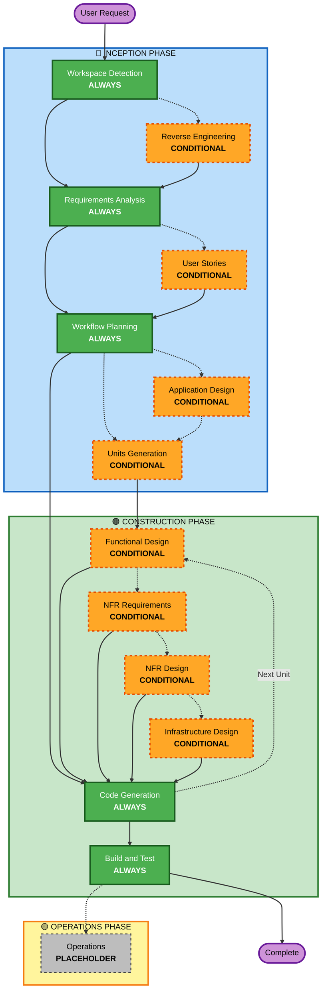
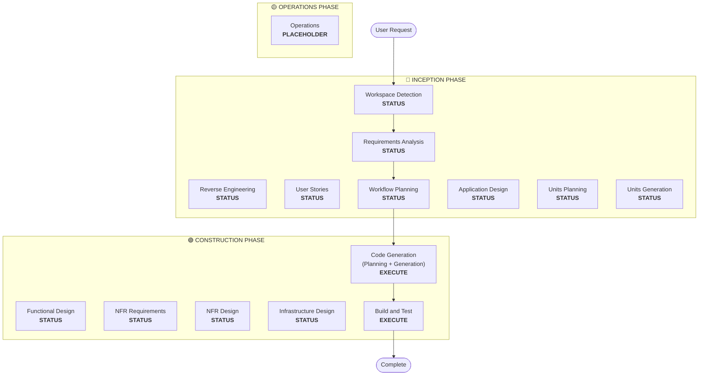

# ijin/aidlc-cc-plugin

Source: https://github.com/ijin/aidlc-cc-plugin
Ingested: 2026-04-24
Type: documentation

---

# README

# AI-DLC Plugin for Claude Code

A structured, adaptive software development methodology guided by AI.

## Installation

First, add the marketplace to your Claude Code (one-time setup):

```bash
/plugin marketplace add ijin/aidlc-cc-plugin
```

Then install the plugin:

```bash
/plugin install aidlc@aidlc-cc-plugin
```

## Quick Start

Start a new AI-DLC workflow:

```bash
/aidlc:start Develop a recommendation engine for cross-selling products
```

Or resume an existing session:

```bash
/aidlc:start
```

Claude will automatically detect your previous session (via `aidlc-docs/aidlc-state.md`) and offer to resume where you left off.

## How It Works

AI-DLC guides you through a three-phase adaptive workflow:

```
┌─────────────────────────────────────────────────────────────┐
│                      USER REQUEST                           │
│         "Develop a recommendation engine..."                │
└────────────────────────┬────────────────────────────────────┘
                         │
                         ▼
┌─────────────────────────────────────────────────────────────┐
│                  INCEPTION PHASE                            │
│           Planning & Architecture                           │
├─────────────────────────────────────────────────────────────┤
│  • Workspace Detection (greenfield/brownfield)              │
│  • Reverse Engineering (brownfield only)                    │
│  • Requirements Analysis (adaptive depth)                   │
│  • User Stories (conditional)                               │
│  • Workflow Planning (adaptive - user approval)             │
│  • Application Design (conditional)                         │
│  • Units Generation (conditional)                           │
└────────────────────────┬────────────────────────────────────┘
                         │
                         ▼
┌─────────────────────────────────────────────────────────────┐
│                 CONSTRUCTION PHASE                          │
│            Design & Implementation                          │
├─────────────────────────────────────────────────────────────┤
│  Per-Unit Loop:                                             │
│    • Functional Design (conditional)                        │
│    • NFR Requirements (conditional)                         │
│    • NFR Design (conditional)                               │
│    • Infrastructure Design (conditional)                    │
│    • Code Generation (always - with plan approval)          │
│                                                             │
│  After All Units:                                           │
│    • Build and Test (always)                                │
└────────────────────────┬────────────────────────────────────┘
                         │
                         ▼
┌─────────────────────────────────────────────────────────────┐
│                  OPERATIONS PHASE                           │
│               (Placeholder for Future)                      │
└─────────────────────────────────────────────────────────────┘
```

### Key Principles

**Adaptive Workflow** — Stages execute only when they add value. Simple changes skip unnecessary planning. Complex projects get full treatment.

**User Control** — Approve execution plans before work begins. Request changes at any approval gate. Resume anytime after closing your session.

**Complete Audit Trail** — All decisions, user inputs, and stage transitions logged with timestamps in `aidlc-docs/audit.md`.

**Chat-Based Interaction** — Answer questions directly in conversation. No file editing required.

## Managing Artifacts

AI-DLC creates comprehensive documentation in the `aidlc-docs/` directory:

```
<workspace-root>/
├── [your application code]
└── aidlc-docs/
    ├── aidlc-state.md           # Progress tracking with checkboxes
    ├── audit.md                 # Complete audit trail with timestamps
    ├── inception/
    │   ├── workspace-analysis.md
    │   ├── reverse-engineering/  # (brownfield only)
    │   ├── requirements/
    │   ├── user-stories/         # (if executed)
    │   ├── application-design/   # (if executed)
    │   └── plans/
    ├── construction/
    │   ├── unit-01/
    │   │   ├── functional-design/
    │   │   ├── nfr-requirements/
    │   │   ├── nfr-design/
    │   │   └── infrastructure-design/
    │   └── build-and-test/
    └── operations/               # (placeholder)
```

### Should you commit aidlc-docs/?

**Option 1: Commit Everything (Recommended for team projects)**
- Full audit trail and design documentation for the team
- Enables review of AI decisions
- Provides onboarding context for new team members

```bash
git add aidlc-docs/
git commit -m "Add AI-DLC artifacts"
```

**Option 2: Gitignore (Recommended for personal projects)**
- Treat as local working notes
- Reduces repository size
- Regenerate on demand

```bash
echo "aidlc-docs/" >> .gitignore
```

**Option 3: Selective Commit**
- Commit key design documents (`application-design`, `functional-design`)
- Ignore temporary artifacts (`workspace-analysis.md`, `audit.md`)

```bash
# Add to .gitignore
aidlc-docs/audit.md
aidlc-docs/aidlc-state.md
aidlc-docs/inception/workspace-analysis.md
```

## Examples

### Greenfield Project
```bash
/aidlc:start Build a REST API for managing customer subscriptions with Stripe integration
```

AI-DLC will guide you through requirements, design high-level architecture, break work into units, and generate code.

### Brownfield Enhancement
```bash
/aidlc:start Add user authentication with OAuth2 to the existing API
```

AI-DLC will analyze your codebase first, then adapt the workflow to integrate with your existing architecture.

### Simple Bug Fix
```bash
/aidlc:start Fix the race condition in the payment processing queue
```

AI-DLC will skip unnecessary stages and focus on the specific issue.

## Acknowledgments

This plugin is adapted from the [AWS AI-DLC Workflows](https://github.com/awslabs/aidlc-workflows) reference implementation, originally designed for Amazon Q Developer / Kiro CLI. It has been adapted for Claude Code's plugin system with chat-based interaction patterns.

For more information about AI-DLC methodology, see:
- [AI-DLC Methodology Blog](https://aws.amazon.com/blogs/devops/ai-driven-development-life-cycle/)
- [AI-DLC Open-source Launch Blog](https://aws.amazon.com/blogs/devops/open-sourcing-adaptive-workflows-for-ai-driven-development-life-cycle-ai-dlc/)
- [AI-DLC Example Walkthrough Blog](https://aws.amazon.com/blogs/devops/building-with-ai-dlc-using-amazon-q-developer/)

Original methodology developed by the AWS team.

## Contributing

Contributions are welcome! To contribute:

1. Fork the repository
2. Create a feature branch (`git checkout -b feature/amazing-improvement`)
3. Make your changes
4. Test thoroughly with `claude --plugin-dir .`
5. Submit a pull request

No DCO or formal process required — just good code and clear commit messages.

## License

This project is licensed under MIT-0 - see the [LICENSE](LICENSE) file for details.

MIT-0 is a permissive license that allows use without attribution requirements.


> **Deep fetch: 30 key files fetched beyond README.**


---

# FILE: CHANGELOG.md

# Changelog

All notable changes to this project will be documented in this file.

The format is based on [Keep a Changelog](https://keepachangelog.com/en/1.0.0/),
and this project adheres to [Semantic Versioning](https://semver.org/spec/v2.0.0.html).

## [0.1.8] - 2026-04-20

### Changed
- Opt-in prompts must be presented in the same language as the user's conversation (upstream `requirements-analysis.md` Step 5.1)

### Upstream
- Synced with [aidlc-workflows v0.1.8](https://github.com/awslabs/aidlc-workflows/releases/tag/v0.1.8)

## [0.1.7] - 2026-04-02

### Added
- Property-based testing extension with opt-in mechanism (upstream)
- Security baseline opt-in file for context-optimized extension loading (upstream)
- Additional resources links in README (AI-DLC blog posts)

### Changed
- Updated all rule files to latest upstream main (awslabs/aidlc-workflows, 30 commits ahead of v0.1.6)
- Context-optimized extensions loading: opt-in files loaded first, full rules deferred until user opts in (upstream)
- "Code Planning/Generation" stage consolidated into "Code Generation" (upstream)
- "phase" terminology standardized to "stage" in error-handling and workflow-changes (upstream)
- Stale artifact detection added to workspace-detection and reverse-engineering (upstream)
- New completion message format in build-and-test and workflow-planning (upstream)

### Fixed
- Repository URL updated from aws-samples/aidlc-workflows to awslabs/aidlc-workflows in README and CHANGELOG

### Upstream
- Synced with [aidlc-workflows main](https://github.com/awslabs/aidlc-workflows) (2026-03-31)

## [0.1.6] - 2026-03-05

### Fixed
- Copy-paste error in error-handling.md that duplicated content into wrong section (upstream)

### Added
- Consolidated application-design.md doc instruction in application design phase (upstream)

### Changed
- Removed placeholder .gitkeep files for HIPAA, PCI-DSS, SOC2, and customer-specific compliance directories (upstream cleanup)

### Upstream
- Synced with [aidlc-workflows v0.1.6](https://github.com/awslabs/aidlc-workflows/releases/tag/v0.1.6)

## [0.1.5] - 2026-02-24

### Added
- Security extensions framework with OWASP Top 10 baseline rules (15 SECURITY rules)
- Extensions loading and enforcement mechanism in core workflow
- Extension applicability questions in requirements analysis (adapted for AskUserQuestion)
- Placeholder directories for HIPAA, PCI-DSS, SOC2, and customer-specific security extensions

### Upstream
- Synced with [aidlc-workflows v0.1.5](https://github.com/awslabs/aidlc-workflows/releases/tag/v0.1.5)
- Skipped v0.1.3 (bug fix reverted, net zero rule changes) and v0.1.4 (path resolution only, not applicable)

## [0.1.2] - 2026-02-08

### Added
- Frontend components generation steps in code-generation (upstream)
- Automation-friendly code rules with `data-testid` attributes (upstream)
- Frontend components section in functional-design (upstream)
- ⛔ GATE between clarifying questions and requirements generation to prevent premature proceeding (upstream, adapted for chat-based flow)

### Fixed
- "busienss" typo in core-workflow.md (upstream, already fixed in v0.1.0)

### Upstream
- Synced with [aidlc-workflows v0.1.2](https://github.com/awslabs/aidlc-workflows/releases/tag/v0.1.2)

## [0.1.0] - 2026-02-03

### Added
- Initial marketplace release
- Core AI-DLC methodology with three phases: Inception, Construction, Operations
- Adaptive workflow planning based on project complexity
- Chat-based Q&A interaction model
- Approval gates at major stage transitions
- Progress tracking with `aidlc-docs/aidlc-state.md`
- Complete audit trail with timestamps
- Session continuity (resume capability)
- Brownfield project support with reverse engineering
- Per-unit construction loop with conditional stages
- Adapted from AWS AI-DLC Workflows for Claude Code plugin system

### Notes
- This is a pre-1.0 release - breaking changes may occur
- Based on AWS AI-DLC Workflows reference implementation


---

# FILE: skills/start/SKILL.md

---
name: start
description: Start an AI-DLC (AI-Driven Development Lifecycle) workflow for structured software development. Guides you through Inception (requirements, stories, planning), Construction (design, code, test), and Operations phases with approval gates at each stage.
argument-hint: [describe your intent]
disable-model-invocation: true
---

# AI-DLC Workflow Skill

You are now executing the AI-DLC (AI-Driven Development Lifecycle) workflow. This is a structured, adaptive software development methodology that guides development through three major phases: Inception, Construction, and Operations.

## Your Role

You will act as an AI development guide, orchestrating the workflow by:
1. Reading and following the rules defined in the supporting rule-detail files
2. Asking clarifying questions directly in conversation (chat-based Q&A)
3. Creating deliverables in the `aidlc-docs/` directory
4. Tracking progress in `aidlc-docs/aidlc-state.md`
5. Waiting for user approval at designated approval gates
6. Maintaining an audit trail in `aidlc-docs/audit.md`

## Rule Detail Files

The full AI-DLC methodology is documented in supporting files that you MUST read on demand:

### Core Orchestration
- **[rule-details/core-workflow.md](rule-details/core-workflow.md)** - Main workflow orchestration logic (READ THIS FIRST)

### Common Rules (read at workflow start)
- **[rule-details/common/welcome-message.md](rule-details/common/welcome-message.md)** - Welcome message to display
- **[rule-details/common/process-overview.md](rule-details/common/process-overview.md)** - High-level process overview
- **[rule-details/common/session-continuity.md](rule-details/common/session-continuity.md)** - Session resumption logic
- **[rule-details/common/question-format-guide.md](rule-details/common/question-format-guide.md)** - How to ask questions (chat-based)
- **[rule-details/common/content-validation.md](rule-details/common/content-validation.md)** - Content quality standards
- **[rule-details/common/terminology.md](rule-details/common/terminology.md)** - AI-DLC terminology
- **[rule-details/common/depth-levels.md](rule-details/common/depth-levels.md)** - Content depth guidance
- **[rule-details/common/ascii-diagram-standards.md](rule-details/common/ascii-diagram-standards.md)** - Diagram formatting
- **[rule-details/common/error-handling.md](rule-details/common/error-handling.md)** - Error handling approach
- **[rule-details/common/overconfidence-prevention.md](rule-details/common/overconfidence-prevention.md)** - Avoiding overconfidence
- **[rule-details/common/workflow-changes.md](rule-details/common/workflow-changes.md)** - Handling workflow deviations

### Inception Phase Rules (read when entering inception stages)
- **[rule-details/inception/workspace-detection.md](rule-details/inception/workspace-detection.md)** - Detect greenfield vs brownfield
- **[rule-details/inception/reverse-engineering.md](rule-details/inception/reverse-engineering.md)** - Analyze existing codebases
- **[rule-details/inception/requirements-analysis.md](rule-details/inception/requirements-analysis.md)** - Requirements gathering
- **[rule-details/inception/user-stories.md](rule-details/inception/user-stories.md)** - User story generation
- **[rule-details/inception/workflow-planning.md](rule-details/inception/workflow-planning.md)** - Plan workflow stages
- **[rule-details/inception/application-design.md](rule-details/inception/application-design.md)** - Application architecture
- **[rule-details/inception/units-generation.md](rule-details/inception/units-generation.md)** - Break down into units of work

### Construction Phase Rules (read when entering construction stages)
- **[rule-details/construction/functional-design.md](rule-details/construction/functional-design.md)** - Functional specifications
- **[rule-details/construction/nfr-requirements.md](rule-details/construction/nfr-requirements.md)** - Non-functional requirements
- **[rule-details/construction/nfr-design.md](rule-details/construction/nfr-design.md)** - Non-functional design
- **[rule-details/construction/infrastructure-design.md](rule-details/construction/infrastructure-design.md)** - Infrastructure specs
- **[rule-details/construction/code-generation.md](rule-details/construction/code-generation.md)** - Code implementation
- **[rule-details/construction/build-and-test.md](rule-details/construction/build-and-test.md)** - Testing instructions

### Operations Phase Rules (read when entering operations)
- **[rule-details/operations/operations.md](rule-details/operations/operations.md)** - Operations phase guidance

### Extensions (opt-in files loaded at workflow start, full rules loaded on-demand)
- **[rule-details/extensions/security/baseline/security-baseline.opt-in.md](rule-details/extensions/security/baseline/security-baseline.opt-in.md)** - Security baseline opt-in prompt
- **[rule-details/extensions/security/baseline/security-baseline.md](rule-details/extensions/security/baseline/security-baseline.md)** - OWASP Top 10 baseline security rules (loaded after opt-in)
- **[rule-details/extensions/testing/property-based/property-based-testing.opt-in.md](rule-details/extensions/testing/property-based/property-based-testing.opt-in.md)** - Property-based testing opt-in prompt
- **[rule-details/extensions/testing/property-based/property-based-testing.md](rule-details/extensions/testing/property-based/property-based-testing.md)** - Property-based testing rules (loaded after opt-in)

## User Intent

The user has provided the following intent for this workflow:

```
$ARGUMENTS
```

## Initialization Sequence

Follow these steps in order:

### 1. Display Welcome Message

Read and display the content from `rule-details/common/welcome-message.md` to introduce the AI-DLC workflow to the user.

### 2. Check for Session Resumption

Check if `aidlc-docs/aidlc-state.md` exists:
- **If it exists**: Read `rule-details/common/session-continuity.md` and follow its instructions for resuming the previous session
- **If it does NOT exist**: This is a new workflow - proceed to step 3

### 3. Ask User Preference for Question Style

Before loading the full workflow rules, ask the user how they prefer to answer questions using `AskUserQuestion`:

```json
{
  "questions": [
    {
      "question": "How would you like to answer questions throughout this workflow?",
      "header": "Q&A Style",
      "multiSelect": false,
      "options": [
        {
          "label": "Interactive UI",
          "description": "Clickable buttons/options (recommended for ease of use)"
        },
        {
          "label": "Text responses",
          "description": "Type answers like '1: A, 2: B' (faster if you prefer typing)"
        }
      ]
    }
  ]
}
```

Store the user's preference in a variable to reference throughout the workflow. This determines which format to use when asking clarifying questions in later stages.

### 4. Load Core Rules

Read the following files to understand the workflow and common rules:
1. `rule-details/core-workflow.md` - The main orchestration logic (CRITICAL)
2. `rule-details/common/process-overview.md` - High-level overview
3. `rule-details/common/question-format-guide.md` - How to interact with users (respects user's preference from Step 3)
4. `rule-details/common/content-validation.md` - Quality standards
5. `rule-details/common/terminology.md` - Key terms

### 5. Initialize Workspace

Create the `aidlc-docs/` directory if it doesn't exist:

```bash
mkdir -p aidlc-docs
```

Store the user's question preference in `aidlc-docs/aidlc-preferences.md` for session continuity:

```markdown
# AI-DLC User Preferences

**Question Style**: [Interactive UI / Text responses]
**Set on**: [ISO timestamp]
```

### 6. Begin Inception Phase

Read `rule-details/inception/workspace-detection.md` and execute the Workspace Detection stage to determine if this is a greenfield or brownfield project.

### 7. Follow Core Workflow

From this point forward, follow the orchestration logic defined in `rule-details/core-workflow.md`. This will guide you through:
- Remaining Inception stages (Requirements Analysis, User Stories, Workflow Planning, Application Design, Units Generation)
- Construction stages (per unit: Functional Design → NFR Requirements → NFR Design → Infrastructure Design → Code Generation)
- Build and Test
- Operations (if applicable)

## Key Principles

1. **Chat-Based Q&A**: Always ask questions directly in the conversation. Never ask users to edit files to answer questions.

2. **Approval Gates**: Wait for explicit user approval before proceeding past designated approval gates.

3. **Progress Tracking**: Update `aidlc-docs/aidlc-state.md` at every stage transition with checkbox format:
   ```markdown
   - [x] Workspace Detection - COMPLETED
   - [ ] Requirements Analysis - NEXT
   ```

4. **Audit Trail**: Log all major decisions and stage transitions in `aidlc-docs/audit.md` with timestamps.

5. **Read Before Execute**: Always read the relevant rule-detail file for a stage before executing that stage.

6. **Quality Standards**: Follow content validation rules from `rule-details/common/content-validation.md` for all deliverables.

7. **Error Handling**: If you encounter issues, read `rule-details/common/error-handling.md` for guidance.

8. **Workflow Changes**: If the user requests deviations from the standard workflow, read `rule-details/common/workflow-changes.md`.

## Session Continuity

If this session ends and is resumed later:
- The user can run `/aidlc:start` again without arguments
- You will detect `aidlc-docs/aidlc-state.md` and resume from the last checkpoint
- Follow the session resumption logic in `rule-details/common/session-continuity.md`

## Deliverables Directory Structure

All deliverables will be created in:

```
aidlc-docs/
├── aidlc-state.md              # Progress tracking (checkboxes)
├── audit.md                    # Audit trail with timestamps
├── workspace-analysis.md       # Workspace detection results
├── requirements.md             # Requirements analysis
├── user-stories.md             # User stories (if applicable)
├── workflow-plan.md            # Planned stages
├── application-design.md       # Application architecture
├── units.md                    # Units of work breakdown
└── units/                      # Per-unit deliverables
    ├── unit-01/
    │   ├── functional-design.md
    │   ├── nfr-requirements.md
    │   ├── nfr-design.md
    │   ├── infrastructure-design.md
    │   └── implementation-notes.md
    └── unit-02/
        └── ...
```

## Important Notes

- **File References**: When referencing rule-detail files in your responses to the user, use relative paths from the skill directory (e.g., "rule-details/common/welcome-message.md")
- **No Hallucination**: Only follow rules that are explicitly written in the rule-detail files. Never invent or assume workflow steps.
- **Read On Demand**: You don't need to read all rule files at once. Read them as you enter each stage.
- **User-Driven**: The user is in control. Always wait for approval at gates before proceeding.

---

**NOW BEGIN**: Start by reading and displaying `rule-details/common/welcome-message.md`, then proceed with the initialization sequence above.


---

# FILE: skills/start/rule-details/common/ascii-diagram-standards.md

# ASCII Diagram Standards

## MANDATORY: Use Basic ASCII Only

**CRITICAL**: ALWAYS use basic ASCII characters for diagrams (maximum compatibility).

### ✅ ALLOWED: `+` `-` `|` `^` `v` `<` `>` and alphanumeric text

### ❌ FORBIDDEN: Unicode box-drawing characters
- NO: `┌` `─` `│` `└` `┐` `┘` `├` `┤` `┬` `┴` `┼` `▼` `▲` `►` `◄`
- Reason: Inconsistent rendering across fonts/platforms

## Standard ASCII Diagram Patterns

### CRITICAL: Character Width Rule
**Every line in a box MUST have EXACTLY the same character count (including spaces)**

✅ CORRECT (all lines = 67 chars):
```
+---------------------------------------------------------------+
|                      Component Name                           |
|  Description text here                                        |
+---------------------------------------------------------------+
```

❌ WRONG (inconsistent widths):
```
+---------------------------------------------------------------+
|                      Component Name                           |
|  Description text here                                   |
+---------------------------------------------------------------+
```

### Box Pattern
```
+-----------------------------------------------------+
|                                                     |
|              Calculator Application                 |
|                                                     |
|  Provides basic arithmetic operations for users     |
|  through a web-based interface                      |
|                                                     |
+-----------------------------------------------------+
```

### Nested Boxes
```
+-------------------------------------------------------+
|              Web Server (PHP Runtime)                 |
|  +-------------------------------------------------+  |
|  |  index.php (Monolithic Application)             |  |
|  |  +-------------------------------------------+  |  |
|  |  |  HTML Template (View Layer)               |  |  |
|  |  |  - Form rendering                         |  |  |
|  |  |  - Result display                         |  |  |
|  |  +-------------------------------------------+  |  |
|  +-------------------------------------------------+  |
+-------------------------------------------------------+
```

### Arrows and Connections
```
+----------+
|  Source  |
+----------+
     |
     | HTTP POST
     v
+----------+
|  Target  |
+----------+
```

### Horizontal Flow
```
+-------+     +-------+     +-------+
| Step1 | --> | Step2 | --> | Step3 |
+-------+     +-------+     +-------+
```

### Vertical Flow with Labels
```
User Action Flow:
    |
    v
+----------+
|  Input   |
+----------+
    |
    | validates
    v
+----------+
| Process  |
+----------+
    |
    | returns
    v
+----------+
|  Output  |
+----------+
```

## Validation

Before creating diagrams:
- [ ] Basic ASCII only: `+` `-` `|` `^` `v` `<` `>`
- [ ] No Unicode box-drawing
- [ ] Spaces (not tabs) for alignment
- [ ] Corners use `+`
- [ ] **ALL box lines same character width** (count characters including spaces)
- [ ] Test: Verify corners align vertically in monospace font

## Alternative

For complex diagrams, use Mermaid (see `content-validation.md`)


---

# FILE: skills/start/rule-details/common/content-validation.md

# Content Validation Rules

## MANDATORY: Content Validation Before File Creation

**CRITICAL**: All generated content MUST be validated before writing to files to prevent parsing errors.

## ASCII Diagram Standards

**CRITICAL**: Before creating ANY file with ASCII diagrams:

1. **LOAD** `common/ascii-diagram-standards.md`
2. **VALIDATE** each diagram:
   - Count characters per line (all lines MUST be same width)
   - Use ONLY: `+` `-` `|` `^` `v` `<` `>` and spaces
   - NO Unicode box-drawing characters
   - Spaces only (NO tabs)
3. **TEST** alignment by verifying box corners align vertically

**See `common/ascii-diagram-standards.md` for patterns and validation checklist.**

## Mermaid Diagram Validation

### Required Validation Steps
1. **Syntax Check**: Validate Mermaid syntax before file creation
2. **Character Escaping**: Ensure special characters are properly escaped
3. **Fallback Content**: Provide text alternative if Mermaid fails validation

### Mermaid Validation Rules
```markdown
## BEFORE creating any file with Mermaid diagrams:

1. Check for invalid characters in node IDs (use alphanumeric + underscore only)
2. Escape special characters in labels: " → \" and ' → \'
3. Validate flowchart syntax: node connections must be valid
4. Test diagram parsing with simple validation

## FALLBACK: If Mermaid validation fails, use text-based workflow representation
```

### Implementation Pattern
```markdown
## Workflow Visualization

### Mermaid Diagram (if syntax valid)
```mermaid
[validated diagram content]
```

### Text Alternative (always include)
```
Phase 1: INCEPTION
- Stage 1: Workspace Detection (COMPLETED)
- Stage 2: Requirements Analysis (COMPLETED)
[continue with text representation]
```

## General Content Validation

### Pre-Creation Validation Checklist
- [ ] Validate embedded code blocks (Mermaid, JSON, YAML)
- [ ] Check special character escaping
- [ ] Verify markdown syntax correctness
- [ ] Test content parsing compatibility
- [ ] Include fallback content for complex elements

### Error Prevention Rules
1. **Always validate before using tools/commands to write files**: Never write unvalidated content
2. **Escape special characters**: Particularly in diagrams and code blocks
3. **Provide alternatives**: Include text versions of visual content
4. **Test syntax**: Validate complex content structures

## Validation Failure Handling

### When Validation Fails
1. **Log the error**: Record what failed validation
2. **Use fallback content**: Switch to text-based alternative
3. **Continue workflow**: Don't block on content validation failures
4. **Inform user**: Mention simplified content was used due to parsing constraints


---

# FILE: skills/start/rule-details/common/depth-levels.md

# Adaptive Depth

**Purpose**: Explain how AI-DLC adapts detail level to problem complexity

## Core Principle

**When a stage executes, ALL its defined artifacts are created. The "depth" refers to the level of detail and rigor within those artifacts, which adapts to the problem's complexity.**

## Stage Selection vs Detail Level

### Stage Selection (Binary)
- **Workflow Planning** decides: EXECUTE or SKIP for each stage
- **If EXECUTE**: Stage runs and creates ALL its defined artifacts
- **If SKIP**: Stage doesn't run at all

### Detail Level (Adaptive)
- **Simple problems**: Concise artifacts with essential detail
- **Complex problems**: Comprehensive artifacts with extensive detail
- **Model decides**: Based on problem characteristics, not prescriptive rules

## Factors Influencing Detail Level

The model considers these factors when determining appropriate detail:

1. **Request Clarity**: How clear and complete is the user's request?
2. **Problem Complexity**: How intricate is the solution space?
3. **Scope**: Single file, component, multiple components, or system-wide?
4. **Risk Level**: What's the impact of errors or omissions?
5. **Available Context**: Greenfield vs brownfield, existing documentation
6. **User Preferences**: Has user expressed preference for brevity or detail?

## Example: Requirements Analysis Artifacts

**All scenarios create the same artifacts**:
- `requirement-verification-questions.md` (if needed)
- `requirements.md`

**Note**: User's initial request is captured in `audit.md` (no separate user-intent.md needed)

**Detail level varies by complexity**:

### Simple Scenario (Bug Fix)
- **requirement-verification-questions.md**: necessary clarifying questions
- **requirements.md**: Concise functional requirement, minimal sections

### Complex Scenario (System Migration)
- **requirement-verification-questions.md**: Multiple rounds, 10+ questions
- **requirements.md**: Comprehensive functional + non-functional requirements, traceability, acceptance criteria

## Example: Application Design Artifacts

**All scenarios create the same artifacts**:
- `application-design.md`
- `component-diagram.md`

**Detail level varies by complexity**:

### Simple Scenario (Single Component)
- **application-design.md**: Basic component description, key methods
- **component-diagram.md**: Simple diagram with essential relationships

### Complex Scenario (Multi-Component System)
- **application-design.md**: Detailed component responsibilities, all methods with signatures, design patterns, alternatives considered
- **component-diagram.md**: Comprehensive diagram with all relationships, data flows, integration points

## Guiding Principle for Model

**"Create exactly the detail needed for the problem at hand - no more, no less."**

- Don't artificially inflate simple problems with unnecessary detail
- Don't shortchange complex problems by omitting critical detail
- Let problem characteristics drive detail level naturally
- All required artifacts are always created when stage executes


---

# FILE: skills/start/rule-details/common/error-handling.md

# Error Handling and Recovery Procedures

## General Error Handling Principles

### When Errors Occur
1. **Identify the error**: Clearly state what went wrong
2. **Assess impact**: Determine if the error is blocking or can be worked around
3. **Communicate**: Inform the user about the error and options
4. **Offer solutions**: Provide clear steps to resolve or work around the error
5. **Document**: Log the error and resolution in `audit.md`

### Error Severity Levels

**Critical**: Workflow cannot continue
- Missing required files or artifacts
- Invalid user input that cannot be processed
- System errors preventing file operations

**High**: Stage cannot complete as planned
- Incomplete answers to required questions
- Contradictory user responses
- Missing dependencies from prior stages

**Medium**: Stage can continue with workarounds
- Optional artifacts missing
- Non-critical validation failures
- Partial completion possible

**Low**: Minor issues that don't block progress
- Formatting inconsistencies
- Optional information missing
- Non-blocking warnings

## Stage-Specific Error Handling

### Workspace Detection Errors

**Error**: Cannot read workspace files
- **Cause**: Permission issues, missing directories
- **Solution**: Ask user to verify workspace path and permissions
- **Workaround**: Proceed with user-provided information only

**Error**: Existing `aidlc-state.md` is corrupted
- **Cause**: Manual editing, incomplete previous run
- **Solution**: Ask user if they want to start fresh or attempt recovery
- **Recovery**: Create backup, start new state file

**Error**: Cannot determine required stages
- **Cause**: Insufficient information from user
- **Solution**: Ask clarifying questions about intent and scope
- **Workaround**: Default to comprehensive execution plan

### Requirements Analysis Errors

**Error**: User provides contradictory requirements
- **Cause**: Unclear understanding, changing needs
- **Solution**: Create follow-up questions to resolve contradictions
- **Do Not Proceed**: Until contradictions are resolved

**Error**: Requirements document cannot be converted
- **Cause**: Unsupported format, corrupted file
- **Solution**: Ask user to provide requirements in supported format
- **Workaround**: Work with user's verbal description

**Error**: Incomplete answers to verification questions
- **Cause**: User skipped questions, unclear what to answer
- **Solution**: Highlight unanswered questions, provide examples
- **Do Not Proceed**: Until all required questions are answered

### User Stories Errors

**Error**: Cannot map requirements to stories
- **Cause**: Requirements too vague, missing functional details
- **Solution**: Return to Requirements Analysis for clarification
- **Workaround**: Create stories based on available information, mark as incomplete

**Error**: User provides ambiguous story planning answers
- **Cause**: Unclear options, complex decision
- **Solution**: Add follow-up questions with specific examples
- **Do Not Proceed**: Until ambiguities are resolved

**Error**: Story generation plan has uncompleted steps
- **Cause**: Execution interrupted, steps skipped
- **Solution**: Resume from first uncompleted step
- **Recovery**: Review completed steps, continue from checkpoint

### Application Design Errors

**Error**: Architectural decision is unclear or contradictory
- **Cause**: Ambiguous answers, conflicting requirements
- **Solution**: Add follow-up questions to clarify decision
- **Do Not Proceed**: Until decision is clear and documented

**Error**: Cannot determine number of services/units
- **Cause**: Insufficient information about boundaries
- **Solution**: Ask specific questions about deployment, team structure, scaling
- **Workaround**: Default to monolith, allow change later

### Design Errors

**Error**: Unit dependencies are circular
- **Cause**: Poor boundary definition, tight coupling
- **Solution**: Identify circular dependencies, suggest refactoring
- **Recovery**: Revise unit boundaries to break cycles

**Error**: Unit design plan has missing steps
- **Cause**: Plan generation incomplete, template error
- **Solution**: Regenerate plan with all required steps
- **Recovery**: Add missing steps to existing plan

**Error**: Cannot generate design artifacts
- **Cause**: Missing unit information, unclear requirements
- **Solution**: Return to Units Planning to clarify unit definition
- **Workaround**: Generate partial design, mark gaps

### NFR Implementation Errors

**Error**: Technology stack choices are incompatible
- **Cause**: Conflicting requirements, platform limitations
- **Solution**: Highlight incompatibilities, ask user to choose
- **Do Not Proceed**: Until compatible choices are made

**Error**: Organizational constraints cannot be met
- **Cause**: Network restrictions, security policies
- **Solution**: Document constraints, ask user for workarounds
- **Escalation**: May require human intervention for setup

**Error**: NFR implementation step requires human action
- **Cause**: AI cannot perform certain tasks (network config, credentials)
- **Solution**: Clearly mark as **HUMAN TASK**, provide instructions
- **Wait**: For user confirmation before proceeding

### Code Generation Planning Errors

**Error**: Code generation plan is incomplete
- **Cause**: Missing design artifacts, unclear requirements
- **Solution**: Return to Design stage to complete artifacts
- **Recovery**: Generate plan with available information, mark gaps

**Error**: Unit dependencies not satisfied
- **Cause**: Dependent units not yet generated
- **Solution**: Reorder generation sequence to respect dependencies
- **Workaround**: Generate with stub dependencies, integrate later

### Code Generation Errors (Part 2: Code Generation)

**Error**: Cannot generate code for a step
- **Cause**: Insufficient design information, unclear requirements
- **Solution**: Skip step, document as incomplete, continue
- **Recovery**: Return to step after gathering more information

**Error**: Generated code has syntax errors
- **Cause**: Template issues, language-specific problems
- **Solution**: Fix syntax errors, regenerate if needed
- **Validation**: Verify code compiles before proceeding

**Error**: Test generation fails
- **Cause**: Complex logic, missing test framework setup
- **Solution**: Generate basic test structure, mark for manual completion
- **Workaround**: Proceed without tests, add in Operations phase

### Operations Errors

**Error**: Cannot determine build tool
- **Cause**: Unusual project structure, multiple build systems
- **Solution**: Ask user to specify build tool and commands
- **Workaround**: Provide generic instructions, user adapts

**Error**: Deployment target is unclear
- **Cause**: Multiple environments, complex infrastructure
- **Solution**: Ask user to specify deployment targets and methods
- **Workaround**: Provide instructions for common platforms

## Recovery Procedures

### Partial Stage Completion

**Scenario**: Stage was interrupted mid-execution

**Recovery Steps**:
1. Load the stage plan file
2. Identify last completed step (last [x] checkbox)
3. Resume from next uncompleted step
4. Verify all prior steps are actually complete
5. Continue execution normally

### Corrupted State File

**Scenario**: `aidlc-state.md` is corrupted or inconsistent

**Recovery Steps**:
1. Create backup: `aidlc-state.md.backup`
2. Ask user which stage they're actually on
3. Regenerate state file from scratch
4. Mark completed stages based on existing artifacts
5. Resume from current stage

### Missing Artifacts

**Scenario**: Required artifacts from prior stage are missing

**Recovery Steps**:
1. Identify which artifacts are missing
2. Determine if they can be regenerated
3. If yes: Return to that stage, regenerate artifacts
4. If no: Ask user to provide information manually
5. Document the gap in `audit.md`

### User Wants to Restart Stage

**Scenario**: User is unhappy with stage results and wants to redo

**Recovery Steps**:
1. Confirm user wants to restart (data will be lost)
2. Archive existing artifacts: `{artifact}.backup`
3. Reset stage status in `aidlc-state.md`
4. Clear stage checkboxes in plan files
5. Re-execute stage from beginning

### User Wants to Skip Stage

**Scenario**: User wants to skip a stage that was planned

**Recovery Steps**:
1. Confirm user understands implications
2. Document skip reason in `audit.md`
3. Mark stage as "SKIPPED" in `aidlc-state.md`
4. Proceed to next stage
5. Note: May cause issues in later stages if dependencies missing

## Escalation Guidelines

### When to Ask for User Help

**Immediately**:
- Contradictory or ambiguous user input
- Missing required information
- Technical constraints AI cannot resolve
- Decisions requiring business judgment

**After Attempting Resolution**:
- Repeated errors in same step
- Complex technical issues
- Unusual project structures
- Integration with external systems

### When to Suggest Starting Over

**Consider Fresh Start If**:
- Multiple stages have errors
- State file is severely corrupted
- User requirements have changed significantly
- Architectural decision needs to be reversed
- User cannot provide missing information
- Artifacts are inconsistent across phases

**Before Starting Over**:
1. Archive all existing work
2. Document lessons learned
3. Identify what to preserve
4. Get user confirmation
5. Create new execution plan

## Session Resumption Errors

### Missing Artifacts During Resumption

**Error**: Required artifacts from previous stages are missing
- **Cause**: Files deleted, moved, or never created
- **Solution**: 
  1. Identify which stage created the missing artifacts
  2. Check if stage was marked complete in aidlc-state.md
  3. If marked complete but artifacts missing: Regenerate that stage
  4. If not marked complete: Resume from that stage
- **Recovery**: Return to the stage that creates missing artifacts and re-execute

**Error**: Artifact file exists but is empty or corrupted
- **Cause**: Interrupted write, manual editing, file system issues
- **Solution**:
  1. Create backup of corrupted file
  2. Attempt to regenerate from stage that creates it
  3. If cannot regenerate: Ask user for information to recreate
- **Recovery**: Re-execute the stage that creates the artifact

### Inconsistent State During Resumption

**Error**: aidlc-state.md shows stage complete but artifacts don't exist
- **Cause**: State file updated but artifact generation failed
- **Solution**:
  1. Mark stage as incomplete in aidlc-state.md
  2. Re-execute the stage to generate artifacts
  3. Verify artifacts exist before marking complete
- **Recovery**: Reset stage status and re-execute

**Error**: Artifacts exist but aidlc-state.md shows stage incomplete
- **Cause**: Artifact generation succeeded but state update failed
- **Solution**:
  1. Verify artifacts are complete and valid
  2. Update aidlc-state.md to mark stage complete
  3. Proceed to next stage
- **Recovery**: Update state file to reflect actual completion

**Error**: Multiple stages marked as "current" in aidlc-state.md
- **Cause**: State file corruption, manual editing
- **Solution**:
  1. Review artifacts to determine actual progress
  2. Ask user which stage they're actually on
  3. Correct aidlc-state.md to show single current stage
- **Recovery**: Rebuild state file based on existing artifacts

### Context Loading Errors

**Error**: Cannot load required context from previous stages
- **Cause**: Missing files, corrupted content, wrong file paths
- **Solution**:
  1. List which artifacts are needed for current stage
  2. Check which ones are missing or corrupted
  3. Regenerate missing artifacts or ask user for information
- **Recovery**: Complete prerequisite stages before resuming current stage

**Error**: Loaded artifacts contain contradictory information
- **Cause**: Manual editing, multiple people working, incomplete updates
- **Solution**:
  1. Identify contradictions and present to user
  2. Ask user which information is correct
  3. Update artifacts to resolve contradictions
- **Recovery**: Reconcile contradictions before proceeding

### Resumption Best Practices

1. **Always validate state**: Check aidlc-state.md matches actual artifacts
2. **Load incrementally**: Load artifacts stage-by-stage, validate each
3. **Fail fast**: Stop immediately if critical artifacts are missing
4. **Communicate clearly**: Tell user exactly what's missing and why it's needed
5. **Offer options**: Regenerate, provide manually, or start fresh
6. **Document recovery**: Log all recovery actions in audit.md

## Logging Requirements

### Error Logging Format

```markdown
## Error - [Stage Name]
**Timestamp**: [ISO timestamp]
**Error Type**: [Critical/High/Medium/Low]
**Description**: [What went wrong]
**Cause**: [Why it happened]
**Resolution**: [How it was resolved]
**Impact**: [Effect on workflow]

---
```

### Recovery Logging Format

```markdown
## Recovery - [Stage Name]
**Timestamp**: [ISO timestamp]
**Issue**: [What needed recovery]
**Recovery Steps**: [What was done]
**Outcome**: [Result of recovery]
**Artifacts Affected**: [List of files]

---
```

## Prevention Best Practices

1. **Validate Early**: Check inputs and dependencies before starting work
2. **Checkpoint Often**: Update checkboxes immediately after completing steps
3. **Communicate Clearly**: Explain what you're doing and why
4. **Ask Questions**: Don't assume - clarify ambiguities immediately
5. **Document Everything**: Log all decisions and changes in `audit.md`


---

# FILE: skills/start/rule-details/common/overconfidence-prevention.md

# Overconfidence Prevention Guide

## Problem Statement

AI-DLC was exhibiting overconfidence by not asking enough clarifying questions, even for complex project intent statements. This led to assumptions being made instead of gathering proper requirements.

## Root Cause Analysis

The overconfidence issue was caused by directives in multiple stages that encouraged skipping questions:

1. **Functional Design**: "Skip entire categories if not applicable"
2. **User Stories**: "Use categories as inspiration, NOT as mandatory checklist"
3. **Requirements Analysis**: Similar patterns encouraging minimal questioning
4. **NFR Requirements**: "Only if" conditions that discouraged thorough analysis

These directives were telling the AI to avoid asking questions rather than encouraging comprehensive requirements gathering.

## Solution Implemented

### Updated Question Generation Philosophy

**OLD APPROACH**: "Only ask questions if absolutely necessary"
**NEW APPROACH**: "When in doubt, ask the question - overconfidence leads to poor outcomes"

### Key Changes Made

#### 1. Requirements Analysis Stage
- Changed from "only if needed" to "ALWAYS create questions unless exceptionally clear"
- Added comprehensive evaluation areas (functional, non-functional, business context, technical context)
- Emphasized proactive questioning approach

#### 2. User Stories Stage
- Removed "skip entire categories" directive
- Added comprehensive question categories to evaluate
- Enhanced answer analysis requirements
- Strengthened follow-up question mandates

#### 3. Functional Design Stage
- Replaced "only if" conditions with comprehensive evaluation
- Added more question categories (data flow, integration points, error handling)
- Strengthened ambiguity detection and resolution requirements

#### 4. NFR Requirements Stage
- Expanded question categories beyond basic NFRs
- Added reliability, maintainability, and usability considerations
- Enhanced answer analysis for technical ambiguities

### New Guiding Principles

1. **Default to Asking**: When there's any ambiguity, ask clarifying questions
2. **Comprehensive Coverage**: Evaluate ALL relevant categories, don't skip areas
3. **Thorough Analysis**: Carefully analyze ALL user responses for ambiguities
4. **Mandatory Follow-up**: Create follow-up questions for ANY unclear responses
5. **No Proceeding with Ambiguity**: Don't move forward until ALL ambiguities are resolved

## Implementation Guidelines

### For Question Generation
- Evaluate ALL question categories, don't skip any
- Ask questions wherever clarification would improve quality
- Include comprehensive question categories in each stage
- Default to inclusion rather than exclusion of questions

### For Answer Analysis
- Look for vague responses: "depends", "maybe", "not sure", "mix of", "somewhere between"
- Detect undefined terms and references to external concepts
- Identify contradictory or incomplete answers
- Create follow-up questions for ANY ambiguities

### For Follow-up Questions
- Create separate clarification files when ambiguities are detected
- Ask specific questions to resolve each ambiguity
- Don't proceed until ALL unclear responses are clarified
- Be thorough - better to over-clarify than under-clarify

## Quality Assurance

### Red Flags to Watch For
- Stages completing without asking any questions on complex projects
- Proceeding with vague or ambiguous user responses
- Skipping entire question categories without justification
- Making assumptions instead of asking for clarification

### Success Indicators
- Appropriate number of clarifying questions for project complexity
- Thorough analysis of user responses with follow-up when needed
- Clear, unambiguous requirements before proceeding to implementation
- Reduced need for changes during later stages due to better upfront clarification

## Maintenance

This guide should be referenced when:
- Adding new stages to AI-DLC
- Updating existing stage instructions
- Reviewing AI-DLC performance for overconfidence issues
- Training team members on AI-DLC question generation principles

## Key Takeaway

**It's better to ask too many questions than to make incorrect assumptions.** The cost of asking clarifying questions upfront is far less than the cost of implementing the wrong solution based on assumptions.


---

# FILE: skills/start/rule-details/common/process-overview.md

# AI-DLC Adaptive Workflow Overview

**Purpose**: Technical reference for AI model and developers to understand complete workflow structure.

**Note**: Similar content exists in welcome-message.md (user welcome message) and README.md (documentation). This duplication is INTENTIONAL - each file serves a different purpose:
- **This file**: Detailed technical reference with Mermaid diagram for AI model context loading
- **welcome-message.md**: User-facing welcome message with ASCII diagram
- **README.md**: Human-readable documentation for repository

## The Three-Phase Lifecycle:
• **INCEPTION PHASE**: Planning and architecture (Workspace Detection + conditional phases + Workflow Planning)
• **CONSTRUCTION PHASE**: Design, implementation, build and test (per-unit design + Code Generation + Build & Test)
• **OPERATIONS PHASE**: Placeholder for future deployment and monitoring workflows

## The Adaptive Workflow:
• **Workspace Detection** (always) → **Reverse Engineering** (brownfield only) → **Requirements Analysis** (always, adaptive depth) → **Conditional Phases** (as needed) → **Workflow Planning** (always) → **Code Generation** (always, per-unit) → **Build and Test** (always)

## How It Works:
• **AI analyzes** your request, workspace, and complexity to determine which stages are needed
• **These stages always execute**: Workspace Detection, Requirements Analysis (adaptive depth), Workflow Planning, Code Generation (per-unit), Build and Test
• **All other stages are conditional**: Reverse Engineering, User Stories, Application Design, Units Generation, per-unit design stages (Functional Design, NFR Requirements, NFR Design, Infrastructure Design)
• **No fixed sequences**: Stages execute in the order that makes sense for your specific task

## Your Team's Role:
• **Answer questions** directly in conversation when prompted by Claude
• **"Other" option available**: Choose "Other" and describe your custom response if provided options don't match
• **Work as a team** to review and approve each phase before proceeding
• **Collectively decide** on architectural approach when needed
• **Important**: This is a team effort - involve relevant stakeholders for each phase

## AI-DLC Three-Phase Workflow:



**Stage Descriptions:**

**🔵 INCEPTION PHASE** - Planning and Architecture
- Workspace Detection: Analyze workspace state and project type (ALWAYS)
- Reverse Engineering: Analyze existing codebase (CONDITIONAL - Brownfield only)
- Requirements Analysis: Gather and validate requirements (ALWAYS - Adaptive depth)
- User Stories: Create user stories and personas (CONDITIONAL)
- Workflow Planning: Create execution plan (ALWAYS)
- Application Design: High-level component identification and service layer design (CONDITIONAL)
- Units Generation: Decompose into units of work (CONDITIONAL)

**🟢 CONSTRUCTION PHASE** - Design, Implementation, Build and Test
- Functional Design: Detailed business logic design per unit (CONDITIONAL, per-unit)
- NFR Requirements: Determine NFRs and select tech stack (CONDITIONAL, per-unit)
- NFR Design: Incorporate NFR patterns and logical components (CONDITIONAL, per-unit)
- Infrastructure Design: Map to actual infrastructure services (CONDITIONAL, per-unit)
- Code Generation: Generate code with Part 1 - Planning, Part 2 - Generation (ALWAYS, per-unit)
- Build and Test: Build all units and execute comprehensive testing (ALWAYS)

**🟡 OPERATIONS PHASE** - Placeholder
- Operations: Placeholder for future deployment and monitoring workflows (PLACEHOLDER)

**Key Principles:**
- Phases execute only when they add value
- Each phase independently evaluated
- INCEPTION focuses on "what" and "why"
- CONSTRUCTION focuses on "how" plus "build and test"
- OPERATIONS is placeholder for future expansion
- Simple changes may skip conditional INCEPTION stages
- Complex changes get full INCEPTION and CONSTRUCTION treatment


---

# FILE: skills/start/rule-details/common/question-format-guide.md

# Question Format Guide

## MANDATORY: Check User's Question Preference First

**CRITICAL**: Before asking any questions, check the user's preferred question style from `aidlc-docs/aidlc-preferences.md`:
- **If preference is "Interactive UI"**: Use the `AskUserQuestion` tool (Section A below)
- **If preference is "Text responses"**: Use text-based questions (Section B below)

---

# SECTION A: Interactive UI Format (AskUserQuestion Tool)

## When User Prefers Interactive UI

### Rule: Use Claude Code's Native Question Tool
**CRITICAL**: You must use the `AskUserQuestion` tool to ask questions. This provides clickable options for easy selection. DO NOT create question files for users to fill out.

### Using AskUserQuestion Tool

#### When to Use
- **Requirements gathering**: Any time you need to clarify user requirements
- **Design decisions**: When multiple valid approaches exist
- **Ambiguity resolution**: When user responses need clarification
- **Planning questions**: During inception or construction planning phases

#### Tool Parameters

```json
{
  "questions": [
    {
      "question": "What is the primary user authentication method?",
      "header": "Auth Method",
      "multiSelect": false,
      "options": [
        {
          "label": "Username and password",
          "description": "Traditional credentials-based authentication"
        },
        {
          "label": "Social media login",
          "description": "OAuth with Google, Facebook, etc."
        },
        {
          "label": "Single Sign-On (SSO)",
          "description": "Enterprise SSO integration"
        },
        {
          "label": "Multi-factor authentication",
          "description": "Enhanced security with 2FA/MFA"
        }
      ]
    }
  ]
}
```

**CRITICAL Guidelines**:
- Ask 1-4 questions per `AskUserQuestion` call (tool limit)
- Each question gets a short `header` (max 12 chars) displayed as a chip
- Each question must have 2-4 `options` (tool enforces this)
- Each option needs a `label` (1-5 words) and `description` (explains the choice)
- Set `multiSelect: false` for single-choice questions (default)
- Set `multiSelect: true` when multiple options can be selected
- The tool automatically provides an "Other" option for custom responses

#### Question Grouping Strategy

**Simple Sets (1-4 questions)**: Use single `AskUserQuestion` call
```
Use AskUserQuestion tool with all questions in one call
```

**Medium Sets (5-8 questions)**: Break into 2 groups by topic
```
First, use AskUserQuestion for core questions (1-4)
Then, use AskUserQuestion for follow-up questions (1-4)
```

**Large Sets (9+ questions)**: Break into 3+ logical phases
```
Phase 1: Use AskUserQuestion for first topic (1-4 questions)
Phase 2: Use AskUserQuestion for second topic (1-4 questions)
Phase 3: Use AskUserQuestion for third topic (1-4 questions)
```

### Complete Example

#### Example 1: Requirements Clarification (3 questions)

```json
{
  "questions": [
    {
      "question": "What is the primary user authentication method?",
      "header": "Auth",
      "multiSelect": false,
      "options": [
        {
          "label": "Username/password",
          "description": "Traditional credentials-based authentication"
        },
        {
          "label": "Social login",
          "description": "OAuth with Google, Facebook, etc."
        },
        {
          "label": "SSO",
          "description": "Enterprise Single Sign-On"
        },
        {
          "label": "MFA",
          "description": "Multi-factor authentication"
        }
      ]
    },
    {
      "question": "Will this be a web or mobile application?",
      "header": "Platform",
      "multiSelect": false,
      "options": [
        {
          "label": "Web application",
          "description": "Browser-based application"
        },
        {
          "label": "Mobile app",
          "description": "iOS/Android native or hybrid"
        },
        {
          "label": "Both",
          "description": "Web and mobile applications"
        }
      ]
    },
    {
      "question": "Is this a new project or existing codebase?",
      "header": "Type",
      "multiSelect": false,
      "options": [
        {
          "label": "Greenfield",
          "description": "New project from scratch"
        },
        {
          "label": "Brownfield",
          "description": "Existing codebase with changes"
        }
      ]
    }
  ]
}
```

#### Example 2: Multi-Select Question

```json
{
  "questions": [
    {
      "question": "Which features do you want to enable?",
      "header": "Features",
      "multiSelect": true,
      "options": [
        {
          "label": "User profiles",
          "description": "User account management and profiles"
        },
        {
          "label": "Notifications",
          "description": "Email and push notifications"
        },
        {
          "label": "Analytics",
          "description": "Usage tracking and reporting"
        },
        {
          "label": "API access",
          "description": "Programmatic API for integrations"
        }
      ]
    }
  ]
}
```

### Processing User Responses

After calling `AskUserQuestion`, the tool returns user answers. Process them as follows:

1. **Parse responses**: Extract user selections from the `answers` object
2. **Validate completeness**: Ensure all questions were answered
3. **Check for "Other"**: If user selected "Other", they provided custom text
4. **Analyze for contradictions**: Check for logically inconsistent answers
5. **Ask follow-ups if needed**: Use another `AskUserQuestion` call for clarifications

### Recording Q&A for Audit Trail

After collecting all answers, create a summary file:

**File**: `aidlc-docs/{phase-name}/questions-summary.md`

**Format**:
```markdown
# [Phase Name] Questions and Answers

**Date**: [ISO timestamp]

## Question 1
**Question**: What is the primary user authentication method?
**Answer**: Single Sign-On (SSO)
**Reasoning**: Enterprise SSO integration

## Question 2
**Question**: Will this be a web or mobile application?
**Answer**: Web application
**Reasoning**: Browser-based application

## Question 3
**Question**: Is this a new project or existing codebase?
**Answer**: Existing codebase (brownfield)
**Reasoning**: Working with existing code

---
**Summary**: User confirmed SSO authentication for a web-based brownfield project.
```

### Error Handling

#### Missing Answers
If any question is not answered (shouldn't happen with the tool, but check):
```
I noticed Question [X] wasn't answered. Let me ask that again.
[Use AskUserQuestion with just that question]
```

#### Ambiguous Custom Responses
If user provided "Other" text that's unclear:
```
Thank you for that context. Let me clarify with a follow-up question.
[Use AskUserQuestion with clarification question]
```

### Contradiction and Ambiguity Detection

**MANDATORY**: After receiving user responses, you MUST check for contradictions and ambiguities.

#### Detecting Contradictions
Look for logically inconsistent answers:
- Scope mismatch: "Bug fix" but "Entire codebase affected"
- Risk mismatch: "Low risk" but "Breaking changes"
- Timeline mismatch: "Quick fix" but "Multiple subsystems"
- Impact mismatch: "Single component" but "Significant architecture changes"

#### Detecting Ambiguities
Look for unclear or borderline responses:
- Answers that could fit multiple classifications
- Responses that lack specificity
- Conflicting indicators across multiple questions

#### Handling Contradictions and Ambiguities

If contradictions or ambiguities detected, ask clarifying questions immediately using `AskUserQuestion`:

**Example**:
```json
{
  "questions": [
    {
      "question": "I noticed you indicated 'bug fix' but also 'entire codebase affected'. Which better describes the scope?",
      "header": "Scope",
      "multiSelect": false,
      "options": [
        {
          "label": "Isolated bug fix",
          "description": "Small, single-component fix"
        },
        {
          "label": "Multi-component fix",
          "description": "Bug fix requiring changes across components"
        },
        {
          "label": "Large refactoring",
          "description": "Major changes disguised as a bug fix"
        }
      ]
    }
  ]
}
```

#### Workflow for Clarifications

1. **Detect**: Analyze all responses for contradictions/ambiguities immediately
2. **Ask**: Use `AskUserQuestion` to present clarifying questions right away
3. **Wait**: Tool handles waiting for user response automatically
4. **Re-validate**: After clarifications, check again for consistency
5. **Record**: Include clarifications in the questions-summary.md file
6. **Proceed**: Only move forward when all contradictions are resolved

### Best Practices

1. **Be Specific**: Questions should be clear and unambiguous
2. **Be Comprehensive**: Cover all necessary information, but respect the 1-4 question limit per call
3. **Be Concise**: Use short headers (max 12 chars) and clear labels (1-5 words)
4. **Be Practical**: Options should be realistic and actionable
5. **Be Descriptive**: Provide helpful descriptions for each option
6. **Be Flexible**: The tool provides "Other" option automatically
7. **Be Thorough**: Always check for contradictions before proceeding

### Phase-Specific Examples

#### Example: Requirements with 2 options

```json
{
  "questions": [
    {
      "question": "Is this a new project or existing codebase?",
      "header": "Type",
      "multiSelect": false,
      "options": [
        {
          "label": "Greenfield",
          "description": "New project from scratch"
        },
        {
          "label": "Brownfield",
          "description": "Existing codebase"
        }
      ]
    }
  ]
}
```

#### Example: Architecture with 3 options

```json
{
  "questions": [
    {
      "question": "What is the deployment target?",
      "header": "Deploy",
      "multiSelect": false,
      "options": [
        {
          "label": "Cloud",
          "description": "AWS, Azure, or GCP"
        },
        {
          "label": "On-premises",
          "description": "Self-hosted servers"
        },
        {
          "label": "Hybrid",
          "description": "Both cloud and on-premises"
        }
      ]
    }
  ]
}
```

#### Example: Pattern with 4 options

```json
{
  "questions": [
    {
      "question": "What architectural pattern should be used?",
      "header": "Architecture",
      "multiSelect": false,
      "options": [
        {
          "label": "Monolithic",
          "description": "Single unified application"
        },
        {
          "label": "Microservices",
          "description": "Distributed service architecture"
        },
        {
          "label": "Serverless",
          "description": "Function-as-a-Service approach"
        },
        {
          "label": "Event-driven",
          "description": "Message-based architecture"
        }
      ]
    }
  ]
}
```

---

# SECTION B: Text-Based Format

## When User Prefers Text Responses

### Rule: Use Conversational Text-Based Questions
If the user prefers text responses, present questions in a clear numbered format that allows them to respond with letter choices or descriptions.

### Text-Based Question Format

Present questions clearly in the conversation with this structure:

```
I need to clarify [X] items to proceed with [stage name]:

**Question 1: [Clear, specific question text]**
A) [First meaningful option]
B) [Second meaningful option]
C) [Additional options as needed]
D) Other (please describe)

**Question 2: [Next question]**
A) [Option 1]
B) [Option 2]
C) Other (please describe)

Please answer each question by providing the letter choice (e.g., "1: A, 2: B") or describe your answer if choosing "Other".
```

**Guidelines**:
- Present questions in a clear, numbered format
- Always include "Other" as the last option for flexibility
- Only include meaningful options - don't make up options to fill slots
- Use as many or as few options as make sense (minimum 2 + Other)
- For simple questions (1-3), present all at once
- For complex question sets (4+), consider grouping into logical sets

### User Response Format
Users will answer directly in conversation:

**Concise Format**:
```
1: C, 2: A, 3: B
```

**Detailed Format**:
```
Question 1: C (SSO)
Question 2: A (Web application)
Question 3: B (Brownfield)
```

**Mixed with "Other"**:
```
1: D - We want to use OAuth 2.0 with Google Workspace
2: A
3: B
```

### Processing User Responses
After receiving answers:
1. Parse and validate all responses
2. Check for contradictions and ambiguities
3. If clarification needed, ask follow-up questions immediately
4. Record Q&A summary in `aidlc-docs/{phase-name}/questions-summary.md` for audit trail

### Contradiction Detection (Same as Section A)
Follow the same contradiction detection and resolution process as described in Section A above.

---

## Summary

**Remember**:
- ✅ Always check user preference in `aidlc-docs/aidlc-preferences.md` first
- ✅ Use `AskUserQuestion` if user prefers "Interactive UI"
- ✅ Use text-based questions if user prefers "Text responses"
- ✅ Validate responses for contradictions immediately
- ✅ Ask follow-up questions using the same format user prefers
- ✅ Record Q&A summary in aidlc-docs/ for audit trail
- ❌ Never create question files for users to edit
- ❌ Never proceed without answers
- ❌ Never proceed with unresolved contradictions
- ❌ Never make assumptions about ambiguous responses


---

# FILE: skills/start/rule-details/common/session-continuity.md

# Session Continuity Templates

## Welcome Back Prompt Template
When a user returns to continue work on an existing AI-DLC project, present this prompt:

```markdown
**Welcome back! I can see you have an existing AI-DLC project in progress.**

Based on your aidlc-state.md, here's your current status:
- **Project**: [project-name]
- **Current Phase**: [INCEPTION/CONSTRUCTION/OPERATIONS]
- **Current Stage**: [Stage Name]
- **Last Completed**: [Last completed step]
- **Next Step**: [Next step to work on]

**What would you like to work on today?**

A) Continue where you left off ([Next step description])
B) Review a previous stage ([Show available stages])
C) Other (please describe)

Please let me know your choice.
```

## MANDATORY: Session Continuity Instructions
1. **Always read aidlc-state.md first** when detecting existing project
2. **Load user preferences** from `aidlc-docs/aidlc-preferences.md` to restore their question style preference
3. **Parse current status** from the workflow file to populate the prompt
3. **MANDATORY: Load Previous Stage Artifacts** - Before resuming any stage, automatically read all relevant artifacts from previous stages:
   - **Reverse Engineering**: Read architecture.md, code-structure.md, api-documentation.md
   - **Requirements Analysis**: Read requirements.md, requirement-verification-questions.md
   - **User Stories**: Read stories.md, personas.md, story-generation-plan.md
   - **Application Design**: Read application-design artifacts (components.md, component-methods.md, services.md)
   - **Design (Units)**: Read unit-of-work.md, unit-of-work-dependency.md, unit-of-work-story-map.md
   - **Per-Unit Design**: Read functional-design.md, nfr-requirements.md, nfr-design.md, infrastructure-design.md
   - **Code Stages**: Read all code files, plans, AND all previous artifacts
4. **Smart Context Loading by Stage**:
   - **Early Stages (Workspace Detection, Reverse Engineering)**: Load workspace analysis
   - **Requirements/Stories**: Load reverse engineering + requirements artifacts
   - **Design Stages**: Load requirements + stories + architecture + design artifacts
   - **Code Stages**: Load ALL artifacts + existing code files
5. **Adapt options** based on architectural choice and current phase
6. **Show specific next steps** rather than generic descriptions
7. **Log the continuity prompt** in audit.md with timestamp
8. **Context Summary**: After loading artifacts, provide brief summary of what was loaded for user awareness
9. **Asking questions**: ALWAYS ask clarification or user feedback questions directly in conversation (chat-based). DO NOT create question files for users to edit.

## Error Handling
If artifacts are missing or corrupted during session resumption, see [error-handling.md](error-handling.md) for guidance on recovery procedures.


---

# FILE: skills/start/rule-details/common/terminology.md

# AI-DLC Terminology Glossary

## Core Terminology

### Phase vs Stage

**Phase**: One of the three high-level lifecycle phases in AI-DLC
- 🔵 **INCEPTION PHASE** - Planning & Architecture (WHAT and WHY)
- 🟢 **CONSTRUCTION PHASE** - Design, Implementation & Test (HOW)
- 🟡 **OPERATIONS PHASE** - Deployment & Monitoring (future expansion)

**Stage**: An individual workflow activity within a phase
- Examples: Context Assessment stage, Requirements Assessment stage, Code Generation stage
- Each stage has specific prerequisites, steps, and outputs
- Stages can be ALWAYS-EXECUTE or CONDITIONAL

**Usage Examples**:
- ✅ "The CONSTRUCTION phase contains 7 stages"
- ✅ "The Code Generation stage is always executed"
- ✅ "We're in the INCEPTION phase, executing the Requirements Assessment stage"
- ❌ "The Requirements Assessment phase" (should be "stage")
- ❌ "The CONSTRUCTION stage" (should be "phase")

## Three-Phase Lifecycle

### INCEPTION PHASE
**Purpose**: Planning and architectural decisions  
**Focus**: Determine WHAT to build and WHY  
**Location**: `inception/` directory

**Stages**:
- Workspace Detection (ALWAYS)
- Reverse Engineering (CONDITIONAL - Brownfield only)
- Requirements Analysis (ALWAYS - Adaptive depth)
- User Stories (CONDITIONAL)
- Workflow Planning (ALWAYS)
- Application Design (CONDITIONAL)
- Design - Units Planning/Generation (CONDITIONAL)

**Outputs**: Requirements, user stories, architectural decisions, unit definitions

### CONSTRUCTION PHASE
**Purpose**: Detailed design and implementation  
**Focus**: Determine HOW to build it  
**Location**: `construction/` directory

**Stages**:
- Functional Design (CONDITIONAL, per-unit)
- NFR Requirements (CONDITIONAL, per-unit)
- NFR Design (CONDITIONAL, per-unit)
- Infrastructure Design (CONDITIONAL, per-unit)
- Code Generation (ALWAYS) — includes Part 1: Planning and Part 2: Generation
- Build and Test (ALWAYS)

**Outputs**: Design artifacts, NFR implementations, code, tests

### OPERATIONS PHASE
**Purpose**: Deployment and operational readiness  
**Focus**: How to DEPLOY and RUN it  
**Location**: `operations/` directory

**Stages**:
- Operations (PLACEHOLDER)

**Outputs**: Build instructions, deployment guides, monitoring setup, verification procedures

---

## Workflow Stages

### Always-Execute Stages
- **Workspace Detection**: Initial analysis of workspace state and project type
- **Requirements Analysis**: Gathering requirements (depth varies based on complexity)
- **Workflow Planning**: Creating execution plan for which phases to run
- **Code Generation**: Single stage with two parts — Part 1 (Planning) creates detailed implementation plans, Part 2 (Generation) generates actual code based on plans and prior artifacts
- **Build and Test**: Building all units and executing comprehensive testing

### Conditional Stages
- **Reverse Engineering**: Analyzing existing codebase (brownfield projects only)
- **User Stories**: Creating user stories and personas (includes Story Planning and Story Generation)
- **Application Design**: Designing application components, methods, business rules, and services
- **Design**: Designing system components (includes Units Planning, Units Generation, per-unit design)
- **Functional Design**: Technology-agnostic business logic design (per-unit)
- **NFR Requirements**: Determining NFRs and selecting tech stack (per-unit)
- **NFR Design**: Incorporating NFR patterns and logical components (per-unit)
- **Infrastructure Design**: Mapping to actual infrastructure services (per-unit)

## Application Design Terms

- **Component**: A functional unit with specific responsibilities
- **Method**: A function or operation within a component with defined business rules
- **Business Rule**: Logic that governs method behavior and validation
- **Service**: Orchestration layer that coordinates business logic across components
- **Component Dependency**: Relationship and communication pattern between components

## Architecture Terms (Infrastructure)

### Unit of Work
A logical grouping of user stories for development purposes. The term used during planning and decomposition.

**Usage**: "We need to decompose the system into units of work"

### Service
An independently deployable component in a microservices architecture. Each service is a separate unit of work.

**Usage**: "The Payment Service handles all payment processing"

### Module
A logical grouping of functionality within a single service or monolith. Modules are not independently deployable.

**Usage**: "The authentication module within the User Service"

### Component
A reusable building block within a service or module. Components are classes, functions, or packages that provide specific functionality.

**Usage**: "The EmailValidator component validates email addresses"

## Terminology Guidelines

### When to Use Each Term

**Unit of Work**:
- During Units Planning and Units Generation stages
- When discussing system decomposition
- In planning documents and discussions
- Example: "How should we decompose this into units of work?"

**Service**:
- When referring to independently deployable components
- In microservices architecture contexts
- In deployment and infrastructure discussions
- Example: "The Order Service will be deployed to ECS"

**Module**:
- When referring to logical groupings within a service
- In monolith architecture contexts
- When discussing internal organization
- Example: "The reporting module generates all reports"

**Component**:
- When referring to specific classes, functions, or packages
- In design and implementation discussions
- When discussing reusable building blocks
- Example: "The DatabaseConnection component manages connections"

## Stage Terminology

### Planning vs Generation
- **Planning**: Creating a plan with questions and checkboxes for execution
- **Generation**: Executing the plan to create artifacts

Examples:
- Story Planning → Story Generation
- Units Planning → Units Generation
- Unit Design Planning → Unit Design Generation
- NFR Planning → NFR Generation
- Code Generation Part 1 (Planning) → Code Generation Part 2 (Generation)

### Depth Levels
- **Minimal**: Quick, focused execution for simple changes
- **Standard**: Normal depth with standard artifacts for typical projects
- **Comprehensive**: Full depth with all artifacts for complex/high-risk projects

## Artifact Types

### Plans
Documents with checkboxes and questions that guide execution.
- Located in `aidlc-docs/plans/`
- Examples: `story-generation-plan.md`, `unit-of-work-plan.md`

### Artifacts
Generated outputs from executing plans.
- Located in various `aidlc-docs/` subdirectories
- Examples: `requirements.md`, `stories.md`, `design.md`

### State Files
Files tracking workflow progress and status.
- `aidlc-state.md`: Overall workflow state
- `audit.md`: Complete audit trail of all interactions

## Common Abbreviations

- **AI-DLC**: AI-Driven Development Life Cycle
- **NFR**: Non-Functional Requirements
- **UOW**: Unit of Work
- **API**: Application Programming Interface
- **CDK**: Cloud Development Kit (AWS)


---

# FILE: skills/start/rule-details/common/welcome-message.md

# AI-DLC Welcome Message

**Purpose**: This file contains the user-facing welcome message that should be displayed ONCE at the start of any AI-DLC workflow.

---

# 👋 Welcome to AI-DLC (AI-Driven Development Life Cycle)! 👋

I'll guide you through an adaptive software development workflow that intelligently tailors itself to your specific needs.

## What is AI-DLC?

AI-DLC is a structured yet flexible software development process that adapts to your project's needs. Think of it as having an experienced software architect who:

- **Analyzes your requirements** and asks clarifying questions when needed
- **Plans the optimal approach** based on complexity and risk
- **Skips unnecessary steps** for simple changes while providing comprehensive coverage for complex projects
- **Documents everything** so you have a complete record of decisions and rationale
- **Guides you through each phase** with clear checkpoints and approval gates

## The Three-Phase Lifecycle

```
                         User Request
                              |
                              v
        +---------------------------------------+
        |     INCEPTION PHASE                   |
        |     Planning & Application Design     |
        +---------------------------------------+
        | * Workspace Detection (ALWAYS)        |
        | * Reverse Engineering (COND)          |
        | * Requirements Analysis (ALWAYS)      |
        | * User Stories (CONDITIONAL)          |
        | * Workflow Planning (ALWAYS)          |
        | * Application Design (CONDITIONAL)    |
        | * Units Generation (CONDITIONAL)      |
        +---------------------------------------+
                              |
                              v
        +---------------------------------------+
        |     CONSTRUCTION PHASE                |
        |     Design, Implementation & Test     |
        +---------------------------------------+
        | * Per-Unit Loop (for each unit):      |
        |   - Functional Design (COND)          |
        |   - NFR Requirements Assess (COND)    |
        |   - NFR Design (COND)                 |
        |   - Infrastructure Design (COND)      |
        |   - Code Generation (ALWAYS)          |
        | * Build and Test (ALWAYS)             |
        +---------------------------------------+
                              |
                              v
        +---------------------------------------+
        |     OPERATIONS PHASE                  |
        |     Placeholder for Future            |
        +---------------------------------------+
        | * Operations (PLACEHOLDER)            |
        +---------------------------------------+
                              |
                              v
                          Complete
```

### Phase Breakdown:

**INCEPTION PHASE** - *Planning & Application Design*
- **Purpose**: Determines WHAT to build and WHY
- **Activities**: Understanding requirements, analyzing existing code (if any), planning the approach
- **Output**: Clear requirements, execution plan, decisions on the number of units of work for parallel development
- **Your Role**: Answer questions in conversation, review plans, approve direction

**CONSTRUCTION PHASE** - *Detailed Design, Implementation & Test*
- **Purpose**: Determines HOW to build it
- **Activities**: Detailed design (when needed), code generation, comprehensive testing
- **Output**: Working code, tests, build instructions
- **Your Role**: Review designs, approve implementation plans, validate results

**OPERATIONS PHASE** - *Deployment & Monitoring (Future)*
- **Purpose**: How to DEPLOY and RUN it
- **Status**: Placeholder for future deployment and monitoring workflows
- **Current State**: Build and test activities handled in CONSTRUCTION phase

## Key Principles:

- ⚡ **Fully Adaptive**: Each stage independently evaluated based on your needs
- 🎯 **Efficient**: Simple changes execute only essential stages
- 📋 **Comprehensive**: Complex changes get full treatment with all safeguards
- 🔍 **Transparent**: You see and approve the execution plan before work begins
- 📝 **Documented**: Complete audit trail of all decisions and changes
- 🎛️ **User Control**: You can request stages be included or excluded

## What Happens Next:

1. **I'll analyze your workspace** to understand if this is a new or existing project
2. **I'll gather requirements** by asking clarifying questions in conversation as needed
3. **I'll create an execution plan** showing which stages I propose to run and why
4. **You'll review and approve** the plan (or request changes)
5. **We'll execute the plan** with checkpoints at each major stage
6. **You'll get working code** with complete documentation and tests

The AI-DLC process adapts to:
- 📋 Your intent clarity and complexity
- 🔍 Existing codebase state
- 🎯 Scope and impact of changes
- ⚡ Risk and quality requirements

Let's begin!


---

# FILE: skills/start/rule-details/common/workflow-changes.md

# Mid-Workflow Changes and Stage Management

## Overview

Users may request changes to the execution plan or stage execution during the workflow. This document provides guidance on handling these requests safely and effectively.

---

## Types of Mid-Workflow Changes

### 1. Adding a Skipped Stage

**Scenario**: User wants to add a stage that was originally skipped

**Example**: "Actually, I want to add user stories even though we skipped that stage"

**Handling**:
1. **Confirm Request**: "You want to add User Stories stage. This will create user stories and personas. Confirm?"
2. **Check Dependencies**: Verify all prerequisite stages are complete
3. **Update Execution Plan**: Add stage to `execution-plan.md` with rationale
4. **Update State**: Mark stage as "PENDING" in `aidlc-state.md`
5. **Execute Stage**: Follow normal stage execution process
6. **Log Change**: Document in `audit.md` with timestamp and reason

**Considerations**:
- May need to update later stages that could benefit from new artifacts
- Existing artifacts may need revision to incorporate new information
- Timeline will be extended

---

### 2. Skipping a Planned Stage

**Scenario**: User wants to skip a stage that was planned to execute

**Example**: "Let's skip the NFR Design stage for now"

**Handling**:
1. **Confirm Request**: "You want to skip NFR Design. This means no NFR patterns or logical components will be incorporated. Confirm?"
2. **Warn About Impact**: Explain what will be missing and potential consequences
3. **Get Explicit Confirmation**: User must explicitly confirm understanding of impact
4. **Update Execution Plan**: Mark stage as "SKIPPED" with reason
5. **Update State**: Mark stage as "SKIPPED" in `aidlc-state.md`
6. **Adjust Later Stages**: Note that later stages may need manual setup
7. **Log Change**: Document in `audit.md` with timestamp and reason

**Considerations**:
- Later stages may fail or require manual intervention
- User accepts responsibility for missing artifacts
- Can be added back later if needed

---

### 3. Restarting Current Stage

**Scenario**: User is unhappy with current stage results and wants to redo it

**Example**: "I don't like these user stories. Can we start over?"

**Handling**:
1. **Understand Concern**: "What specifically would you like to change about the stories?"
2. **Offer Options**:
   - **Option A**: Modify existing artifacts (faster, preserves some work)
   - **Option B**: Complete restart (clean slate, more time)
3. **If Restart Chosen**:
   - Archive existing artifacts: `{artifact}.backup.{timestamp}`
   - Reset stage checkboxes in plan file
   - Mark stage as "IN PROGRESS" in `aidlc-state.md`
   - Clear stage completion status
   - Re-execute from beginning
4. **Log Change**: Document reason for restart and what will change

**Considerations**:
- Existing work will be lost (but backed up)
- May need to redo dependent stages
- Timeline will be extended

---

### 4. Restarting Previous Stage

**Scenario**: User wants to go back and redo a completed stage

**Example**: "I want to change the architectural decision we made earlier"

**Handling**:
1. **Assess Impact**: Identify all stages that depend on the stage to be restarted
2. **Warn User**: "Restarting Application Design will require redoing: Units Planning, Units Generation, per-unit design (all units), Code Generation. Confirm?"
3. **Get Explicit Confirmation**: User must understand full impact
4. **If Confirmed**:
   - Archive all affected artifacts
   - Reset all affected stages in `aidlc-state.md`
   - Clear checkboxes in all affected plan files
   - Return to the stage to restart
   - Re-execute from that point forward
5. **Log Change**: Document full impact and reason for restart

**Considerations**:
- Significant rework required
- All dependent stages must be redone
- Timeline will be significantly extended
- Consider if modification is better than restart

---

### 5. Changing Stage Depth

**Scenario**: User wants to change the depth level of current or upcoming stage

**Example**: "Let's do a comprehensive requirements analysis instead of standard"

**Handling**:
1. **Confirm Request**: "You want to change Requirements Analysis from Standard to Comprehensive depth. This will be more thorough but take longer. Confirm?"
2. **Update Execution Plan**: Change depth level in `workflow-planning.md`
3. **Adjust Approach**: Follow comprehensive depth guidelines for the stage
4. **Update Estimates**: Inform user of new timeline estimate
5. **Log Change**: Document depth change and reason

**Considerations**:
- More depth = more time but better quality
- Less depth = faster but may miss details
- Can only change before or during stage, not after completion

---

### 6. Pausing Workflow

**Scenario**: User needs to pause and resume later

**Example**: "I need to stop for now and continue tomorrow"

**Handling**:
1. **Complete Current Step**: Finish the current step in progress if possible
2. **Update Checkboxes**: Mark all completed steps with [x]
3. **Update State**: Ensure `aidlc-state.md` reflects current status
4. **Log Pause**: Document pause point in `audit.md`
5. **Provide Resume Instructions**: "When you return, I'll detect your existing project and offer to continue from: [current stage, current step]"

**On Resume**:
1. **Detect Existing Project**: Check for `aidlc-state.md`
2. **Load Context**: Read all artifacts from completed stages
3. **Show Status**: Display current stage and next step
4. **Offer Options**: Continue where left off or review previous work
5. **Log Resume**: Document resume point in `audit.md`

---

### 7. Changing Architectural Decision

**Scenario**: User wants to change from monolith to microservices (or vice versa)

**Example**: "Actually, let's do microservices instead of a monolith"

**Handling**:
1. **Assess Current Progress**: Determine how far into workflow
2. **Explain Impact**: 
   - If before Units Planning: Minimal impact, just update decision
   - If after Units Planning: Must redo Units Planning, Units Generation, all per-unit design
   - If after Code Generation: Significant rework required
3. **Recommend Approach**:
   - Early in workflow: Restart from Application Design stage
   - Late in workflow: Consider if modification is feasible vs. restart
4. **Get Confirmation**: User must understand full scope of change
5. **Execute Change**: Follow restart procedures for affected stages

**Considerations**:
- Architectural changes have cascading effects
- Earlier in workflow = easier to change
- Later in workflow = consider cost vs. benefit

---

### 8. Adding/Removing Units

**Scenario**: User wants to add or remove units after Units Generation

**Example**: "We need to split the Payment unit into Payment and Billing"

**Handling**:
1. **Assess Impact**: Determine which units have completed design/code
2. **Explain Consequences**:
   - Adding unit: Need to do full design and code for new unit
   - Removing unit: Need to redistribute functionality to other units
   - Splitting unit: Need to redo design and code for both resulting units
3. **Update Unit Artifacts**:
   - Modify `unit-of-work.md`
   - Update `unit-of-work-dependency.md`
   - Revise `unit-of-work-story-map.md`
4. **Reset Affected Units**: Mark affected units as needing redesign
5. **Execute Changes**: Follow normal unit design and code process for affected units

**Considerations**:
- Affects all downstream stages for those units
- May affect other units if dependencies change
- Timeline impact depends on how many units affected

---

## General Guidelines for Handling Changes

### Before Making Changes

1. **Understand the Request**: Ask clarifying questions about what user wants to change and why
2. **Assess Impact**: Identify all affected stages, artifacts, and dependencies
3. **Explain Consequences**: Clearly communicate what will need to be redone and timeline impact
4. **Offer Alternatives**: Sometimes modification is better than restart
5. **Get Explicit Confirmation**: User must understand and accept the impact

### During Changes

1. **Archive Existing Work**: Always backup before making destructive changes
2. **Update All Tracking**: Keep `aidlc-state.md`, plan files, and `audit.md` in sync
3. **Communicate Progress**: Keep user informed about what's happening
4. **Validate Changes**: Ensure changes are consistent across all artifacts
5. **Test Continuity**: Verify workflow can continue smoothly after changes

### After Changes

1. **Verify Consistency**: Check that all artifacts are aligned with changes
2. **Update Documentation**: Ensure all references are updated
3. **Log Completely**: Document full change history in `audit.md`
4. **Confirm with User**: Verify changes meet user's expectations
5. **Resume Workflow**: Continue with normal execution from new state

---

## Change Request Decision Tree

```
User requests change
    |
    ├─ Is it current stage?
    |   ├─ Yes: Can modify or restart current stage
    |   └─ No: Go to next question
    |
    ├─ Is it a completed stage?
    |   ├─ Yes: Assess impact on dependent stages
    |   |   ├─ Low impact: Modify and update dependents
    |   |   └─ High impact: Recommend restart from that stage
    |   └─ No: Go to next question
    |
    ├─ Is it adding a skipped stage?
    |   ├─ Yes: Check prerequisites, add to plan, execute
    |   └─ No: Go to next question
    |
    ├─ Is it skipping a planned stage?
    |   ├─ Yes: Warn about impact, get confirmation, skip
    |   └─ No: Go to next question
    |
    └─ Is it changing depth level?
        ├─ Yes: Update plan, adjust approach
        └─ No: Clarify request with user
```

---

## Logging Requirements

### Change Request Log Format

```markdown
## Change Request - [Stage Name]
**Timestamp**: [ISO timestamp]
**Request**: [What user wants to change]
**Current State**: [Where we are in workflow]
**Impact Assessment**: [What will be affected]
**User Confirmation**: [User's explicit confirmation]
**Action Taken**: [What was done]
**Artifacts Affected**: [List of files changed/reset]

---
```

---

## Best Practices

1. **Always Confirm**: Never make destructive changes without explicit user confirmation
2. **Explain Impact**: Users need to understand consequences before deciding
3. **Offer Options**: Sometimes there are multiple ways to handle a change
4. **Archive First**: Always backup before making destructive changes
5. **Update Everything**: Keep all tracking files in sync
6. **Log Thoroughly**: Document all changes for audit trail
7. **Validate After**: Ensure workflow can continue smoothly
8. **Be Flexible**: Workflow should adapt to user needs, not force rigid process


---

# FILE: skills/start/rule-details/construction/code-generation.md

# Code Generation - Detailed Steps

## Overview
This stage generates code for each unit of work through two integrated parts:
- **Part 1 - Planning**: Create detailed code generation plan with explicit steps
- **Part 2 - Generation**: Execute approved plan to generate code, tests, and artifacts

**Note**: For brownfield projects, "generate" means modify existing files when appropriate, not create duplicates.

## Prerequisites
- Unit Design Generation must be complete for the unit
- NFR Implementation (if executed) must be complete for the unit
- All unit design artifacts must be available
- Unit is ready for code generation

---

# PART 1: PLANNING

## Step 1: Analyze Unit Context
- [ ] Read unit design artifacts from Unit Design Generation
- [ ] Read unit story map to understand assigned stories
- [ ] Identify unit dependencies and interfaces
- [ ] Validate unit is ready for code generation

## Step 2: Create Detailed Unit Code Generation Plan
- [ ] Read workspace root and project type from `aidlc-docs/aidlc-state.md`
- [ ] Determine code location (see Critical Rules for structure patterns)
- [ ] **Brownfield only**: Review reverse engineering code-structure.md for existing files to modify
- [ ] Document exact paths (never aidlc-docs/)
- [ ] Create explicit steps for unit generation:
  - Project Structure Setup (greenfield only)
  - Business Logic Generation
  - Business Logic Unit Testing
  - Business Logic Summary
  - API Layer Generation
  - API Layer Unit Testing
  - API Layer Summary
  - Repository Layer Generation
  - Repository Layer Unit Testing
  - Repository Layer Summary
  - Frontend Components Generation (if applicable)
  - Frontend Components Unit Testing (if applicable)
  - Frontend Components Summary (if applicable)
  - Database Migration Scripts (if data models exist)
  - Documentation Generation (API docs, README updates)
  - Deployment Artifacts Generation
- [ ] Number each step sequentially
- [ ] Include story mapping references
- [ ] Add checkboxes [ ] for each step

## Step 3: Include Unit Generation Context
- [ ] For this unit, include:
  - Stories implemented by this unit
  - Dependencies on other units/services
  - Expected interfaces and contracts
  - Database entities owned by this unit
  - Service boundaries and responsibilities

## Step 4: Create Unit Plan Document
- [ ] Save complete plan as `aidlc-docs/construction/plans/{unit-name}-code-generation-plan.md`
- [ ] Include step numbering (Step 1, Step 2, etc.)
- [ ] Include unit context and dependencies
- [ ] Include story traceability
- [ ] Ensure plan is executable step-by-step
- [ ] Emphasize that this plan is the single source of truth for Code Generation

## Step 5: Summarize Unit Plan
- [ ] Provide summary of the unit code generation plan to the user
- [ ] Highlight unit generation approach
- [ ] Explain step sequence and story coverage
- [ ] Note total number of steps and estimated scope

## Step 6: Log Approval Prompt
- [ ] Before asking for approval, log the prompt with timestamp in `aidlc-docs/audit.md`
- [ ] Include reference to the complete unit code generation plan
- [ ] Use ISO 8601 timestamp format

## Step 7: Wait for Explicit Approval
- [ ] Do not proceed until the user explicitly approves the unit code generation plan
- [ ] Approval must cover the entire plan and generation sequence
- [ ] If user requests changes, update the plan and repeat approval process

## Step 8: Record Approval Response
- [ ] Log the user's approval response with timestamp in `aidlc-docs/audit.md`
- [ ] Include the exact user response text
- [ ] Mark the approval status clearly

## Step 9: Update Progress
- [ ] Mark Code Generation Part 1 (Planning) complete in `aidlc-state.md`
- [ ] Update the "Current Status" section
- [ ] Prepare for transition to Code Generation

---

# PART 2: GENERATION

## Step 10: Load Unit Code Generation Plan
- [ ] Read the complete plan from `aidlc-docs/construction/plans/{unit-name}-code-generation-plan.md`
- [ ] Identify the next uncompleted step (first [ ] checkbox)
- [ ] Load the context for that step (unit, dependencies, stories)

## Step 11: Execute Current Step
- [ ] Verify target directory from plan (never aidlc-docs/)
- [ ] **Brownfield only**: Check if target file exists
- [ ] Generate exactly what the current step describes:
  - **If file exists**: Modify it in-place (never create `ClassName_modified.java`, `ClassName_new.java`, etc.)
  - **If file doesn't exist**: Create new file
- [ ] Write to correct locations:
  - **Application Code**: Workspace root per project structure
  - **Documentation**: `aidlc-docs/construction/{unit-name}/code/` (markdown only)
  - **Build/Config Files**: Workspace root
- [ ] Follow unit story requirements
- [ ] Respect dependencies and interfaces

## Step 12: Update Progress
- [ ] Mark the completed step as [x] in the unit code generation plan
- [ ] Mark associated unit stories as [x] when their generation is finished
- [ ] Update `aidlc-docs/aidlc-state.md` current status
- [ ] **Brownfield only**: Verify no duplicate files created (e.g., no `ClassName_modified.java` alongside `ClassName.java`)
- [ ] Save all generated artifacts

## Step 13: Continue or Complete Generation
- [ ] If more steps remain, return to Step 10
- [ ] If all steps complete, proceed to present completion message

## Step 14: Present Completion Message
- Present completion message in this structure:
     1. **Completion Announcement** (mandatory): Always start with this:

```markdown
# 💻 Code Generation Complete - [unit-name]
```

     2. **AI Summary** (optional): Provide structured bullet-point summary
        - **Brownfield**: Distinguish modified vs created files (e.g., "• Modified: `src/services/user-service.ts`", "• Created: `src/services/auth-service.ts`")
        - **Greenfield**: List created files with paths (e.g., "• Created: `src/services/user-service.ts`")
        - List tests, documentation, deployment artifacts with paths
        - Keep factual, no workflow instructions
     3. **Formatted Workflow Message** (mandatory): Always end with this exact format:

```markdown
> **📋 <u>**REVIEW REQUIRED:**</u>**  
> Please examine the generated code at:
> - **Application Code**: `[actual-workspace-path]`
> - **Documentation**: `aidlc-docs/construction/[unit-name]/code/`


> **🚀 <u>**WHAT'S NEXT?**</u>**
>
> **You may:**
>
> 🔧 **Request Changes** - Ask for modifications to the generated code based on your review  
> ✅ **Continue to Next Stage** - Approve code generation and proceed to **[next-unit/Build & Test]**

---
```

## Step 15: Wait for Explicit Approval
- Do not proceed until the user explicitly approves the generated code
- Approval must be clear and unambiguous
- If user requests changes, update the code and repeat the approval process

## Step 16: Record Approval and Update Progress
- Log approval in audit.md with timestamp
- Record the user's approval response with timestamp
- Mark Code Generation stage as complete for this unit in aidlc-state.md

---

## Critical Rules

### Code Location Rules
- **Application code**: Workspace root only (NEVER aidlc-docs/)
- **Documentation**: aidlc-docs/ only (markdown summaries)
- **Read workspace root** from aidlc-state.md before generating code

**Structure patterns by project type**:
- **Brownfield**: Use existing structure (e.g., `src/main/java/`, `lib/`, `pkg/`)
- **Greenfield single unit**: `src/`, `tests/`, `config/` in workspace root
- **Greenfield multi-unit (microservices)**: `{unit-name}/src/`, `{unit-name}/tests/`
- **Greenfield multi-unit (monolith)**: `src/{unit-name}/`, `tests/{unit-name}/`

### Brownfield File Modification Rules
- Check if file exists before generating
- If exists: Modify in-place (never create copies like `ClassName_modified.java`)
- If doesn't exist: Create new file
- Verify no duplicate files after generation (Step 12)

### Planning Phase Rules
- Create explicit, numbered steps for all generation activities
- Include story traceability in the plan
- Document unit context and dependencies
- Get explicit user approval before generation

### Generation Phase Rules
- **NO HARDCODED LOGIC**: Only execute what's written in the unit plan
- **FOLLOW PLAN EXACTLY**: Do not deviate from the step sequence
- **UPDATE CHECKBOXES**: Mark [x] immediately after completing each step
- **STORY TRACEABILITY**: Mark unit stories [x] when functionality is implemented
- **RESPECT DEPENDENCIES**: Only implement when unit dependencies are satisfied

### Automation Friendly Code Rules
When generating UI code (web, mobile, desktop), ensure elements are automation-friendly:
- Add `data-testid` attributes to interactive elements (buttons, inputs, links, forms)
- Use consistent naming: `{component}-{element-role}` (e.g., `login-form-submit-button`, `user-list-search-input`)
- Avoid dynamic or auto-generated IDs that change between renders
- Keep `data-testid` values stable across code changes (only change when element purpose changes)

## Completion Criteria
- Complete unit code generation plan created and approved
- All steps in unit code generation plan marked [x]
- All unit stories implemented according to plan
- All code and tests generated (tests will be executed in Build & Test phase)
- Deployment artifacts generated
- Complete unit ready for build and verification


---

# FILE: skills/start/rule-details/construction/functional-design.md

# Functional Design

## Purpose
**Detailed business logic design per unit**

Functional Design focuses on:
- Detailed business logic and algorithms for the unit
- Domain models with entities and relationships
- Detailed business rules, validation logic, and constraints
- Technology-agnostic design (no infrastructure concerns)

**Note**: This builds upon high-level component design from Application Design (INCEPTION phase)

## Prerequisites
- Units Generation must be complete
- Unit of work artifacts must be available
- Application Design recommended (provides high-level component structure)
- Execution plan must indicate Functional Design stage should execute

## Overview
Design detailed business logic for the unit, technology-agnostic and focused purely on business functions.

## Steps to Execute

### Step 1: Analyze Unit Context
- Read unit definition from `aidlc-docs/inception/application-design/unit-of-work.md`
- Read assigned stories from `aidlc-docs/inception/application-design/unit-of-work-story-map.md`
- Understand unit responsibilities and boundaries

### Step 2: Create Functional Design Plan
- Generate plan with checkboxes [] for functional design
- Focus on business logic, domain models, business rules
- Each step should have a checkbox []

### Step 3: Generate Context-Appropriate Questions
**DIRECTIVE**: Thoroughly analyze the unit definition and functional design artifacts to identify ALL areas where clarification would improve the functional design. Be proactive in asking questions to ensure comprehensive understanding.

**CRITICAL**: Default to asking questions when there is ANY ambiguity or missing detail that could affect functional design quality. It's better to ask too many questions than to make incorrect assumptions.

- EMBED questions using [Answer]: tag format
- Focus on ANY ambiguities, missing information, or areas needing clarification
- Generate questions wherever user input would improve functional design decisions
- **When in doubt, ask the question** - overconfidence leads to poor designs

**Question categories to consider** (evaluate ALL categories):
- **Business Logic Modeling** - Ask about core entities, workflows, data transformations, and business processes
- **Domain Model** - Ask about domain concepts, entity relationships, data structures, and business objects
- **Business Rules** - Ask about decision rules, validation logic, constraints, and business policies
- **Data Flow** - Ask about data inputs, outputs, transformations, and persistence requirements
- **Integration Points** - Ask about external system interactions, APIs, and data exchange
- **Error Handling** - Ask about error scenarios, validation failures, and exception handling
- **Business Scenarios** - Ask about edge cases, alternative flows, and complex business situations
- **Frontend Components** (if applicable) - Ask about UI component structure, user interactions, state management, and form handling

### Step 4: Store Plan
- Save as `aidlc-docs/construction/plans/{unit-name}-functional-design-plan.md`
- Include all [Answer]: tags for user input

### Step 5: Collect and Analyze Answers
- Wait for user to complete all [Answer]: tags
- **MANDATORY**: Carefully review ALL responses for vague or ambiguous answers
- **CRITICAL**: Add follow-up questions for ANY unclear responses - do not proceed with ambiguity
- Look for responses like "depends", "maybe", "not sure", "mix of", "somewhere between"
- Create clarification questions file if ANY ambiguities are detected
- **Do not proceed until ALL ambiguities are resolved**

### Step 6: Generate Functional Design Artifacts
- Create `aidlc-docs/construction/{unit-name}/functional-design/business-logic-model.md`
- Create `aidlc-docs/construction/{unit-name}/functional-design/business-rules.md`
- Create `aidlc-docs/construction/{unit-name}/functional-design/domain-entities.md`
- If unit includes frontend/UI: Create `aidlc-docs/construction/{unit-name}/functional-design/frontend-components.md`
  - Component hierarchy and structure
  - Props and state definitions for each component
  - User interaction flows
  - Form validation rules
  - API integration points (which backend endpoints each component uses)

### Step 7: Present Completion Message
- Present completion message in this structure:
     1. **Completion Announcement** (mandatory): Always start with this:

```markdown
# 🔧 Functional Design Complete - [unit-name]
```

     2. **AI Summary** (optional): Provide structured bullet-point summary of functional design
        - Format: "Functional design has created [description]:"
        - List key business logic models and entities (bullet points)
        - List business rules and validation logic defined
        - Mention domain model structure and relationships
        - DO NOT include workflow instructions ("please review", "let me know", "proceed to next phase", "before we proceed")
        - Keep factual and content-focused
     3. **Formatted Workflow Message** (mandatory): Always end with this exact format:

```markdown
> **📋 <u>**REVIEW REQUIRED:**</u>**  
> Please examine the functional design artifacts at: `aidlc-docs/construction/[unit-name]/functional-design/`


> **🚀 <u>**WHAT'S NEXT?**</u>**
>
> **You may:**
>
> 🔧 **Request Changes** - Ask for modifications to the functional design based on your review  
> ✅ **Continue to Next Stage** - Approve functional design and proceed to **[next-stage-name]**

---
```

### Step 8: Wait for Explicit Approval
- Do not proceed until the user explicitly approves the functional design
- Approval must be clear and unambiguous
- If user requests changes, update the design and repeat the approval process

### Step 9: Record Approval and Update Progress
- Log approval in audit.md with timestamp
- Record the user's approval response with timestamp
- Mark Functional Design stage complete in aidlc-state.md


---

# FILE: skills/start/rule-details/construction/infrastructure-design.md

# Infrastructure Design

## Prerequisites
- Functional Design must be complete for the unit
- NFR Design recommended (provides logical components to map)
- Execution plan must indicate Infrastructure Design stage should execute

## Overview
Map logical software components to actual infrastructure choices for deployment environments.

## Steps to Execute

### Step 1: Analyze Design Artifacts
- Read functional design from `aidlc-docs/construction/{unit-name}/functional-design/`
- Read NFR design from `aidlc-docs/construction/{unit-name}/nfr-design/` (if exists)
- Identify logical components needing infrastructure

### Step 2: Create Infrastructure Design Plan
- Generate plan with checkboxes [] for infrastructure design
- Focus on mapping to actual services (AWS, Azure, GCP, on-premise)
- Each step should have a checkbox []

### Step 3: Generate Context-Appropriate Questions
**DIRECTIVE**: Thoroughly analyze the functional and NFR design to identify ALL areas where clarification would improve infrastructure decisions. Be proactive in asking questions to ensure comprehensive infrastructure coverage.

**CRITICAL**: Default to asking questions when there is ANY ambiguity or missing detail that could affect infrastructure quality. It's better to ask too many questions than to make incorrect infrastructure assumptions.

**MANDATORY**: Evaluate ALL of the following categories by asking targeted questions about each. For each category, determine applicability based on evidence from the functional and NFR design artifacts -- do not skip categories without explicit justification:

- EMBED questions using [Answer]: tag format
- Focus on ANY ambiguities, missing information, or areas needing clarification
- Generate questions wherever user input would improve infrastructure decisions
- **When in doubt, ask the question** - overconfidence leads to poor infrastructure choices

**Question categories to evaluate** (consider ALL categories):
- **Deployment Environment** - Ask about cloud provider preferences, environment setup, and deployment targets
- **Compute Infrastructure** - Ask about compute service choices, sizing, and scaling requirements
- **Storage Infrastructure** - Ask about database selection, storage patterns, and data lifecycle needs
- **Messaging Infrastructure** - Ask about messaging/queuing services, event-driven patterns, and async processing
- **Networking Infrastructure** - Ask about load balancing, API gateway approach, and network topology
- **Monitoring Infrastructure** - Ask about observability tooling, alerting strategy, and logging requirements
- **Shared Infrastructure** - Ask about infrastructure sharing strategy, multi-tenancy, and resource isolation

### Step 4: Store Plan
- Save as `aidlc-docs/construction/plans/{unit-name}-infrastructure-design-plan.md`
- Include all [Answer]: tags for user input

### Step 5: Collect and Analyze Answers
- Wait for user to complete all [Answer]: tags
- Review for vague or ambiguous responses
- Add follow-up questions if needed

### Step 6: Generate Infrastructure Design Artifacts
- Create `aidlc-docs/construction/{unit-name}/infrastructure-design/infrastructure-design.md`
- Create `aidlc-docs/construction/{unit-name}/infrastructure-design/deployment-architecture.md`
- If shared infrastructure: Create `aidlc-docs/construction/shared-infrastructure.md`

### Step 7: Present Completion Message
- Present completion message in this structure:
     1. **Completion Announcement** (mandatory): Always start with this:

```markdown
# 🏢 Infrastructure Design Complete - [unit-name]
```

     2. **AI Summary** (optional): Provide structured bullet-point summary of infrastructure design
        - Format: "Infrastructure design has mapped [description]:"
        - List key infrastructure services and components (bullet points)
        - List deployment architecture decisions and rationale
        - Mention cloud provider choices and service mappings
        - DO NOT include workflow instructions ("please review", "let me know", "proceed to next phase", "before we proceed")
        - Keep factual and content-focused
     3. **Formatted Workflow Message** (mandatory): Always end with this exact format:

```markdown
> **📋 <u>**REVIEW REQUIRED:**</u>**  
> Please examine the infrastructure design at: `aidlc-docs/construction/[unit-name]/infrastructure-design/`


> **🚀 <u>**WHAT'S NEXT?**</u>**
>
> **You may:**
>
> 🔧 **Request Changes** - Ask for modifications to the infrastructure design based on your review  
> ✅ **Continue to Next Stage** - Approve infrastructure design and proceed to **Code Generation**

---
```

### Step 8: Wait for Explicit Approval
- Do not proceed until the user explicitly approves the infrastructure design
- Approval must be clear and unambiguous
- If user requests changes, update the design and repeat the approval process

### Step 9: Record Approval and Update Progress
- Log approval in audit.md with timestamp
- Record the user's approval response with timestamp
- Mark Infrastructure Design stage complete in aidlc-state.md


---

# FILE: skills/start/rule-details/construction/nfr-design.md

# NFR Design

## Prerequisites
- NFR Requirements must be complete for the unit
- NFR requirements artifacts must be available
- Execution plan must indicate NFR Design stage should execute

## Overview
Incorporate NFR requirements into unit design using patterns and logical components.

## Steps to Execute

### Step 1: Analyze NFR Requirements
- Read NFR requirements from `aidlc-docs/construction/{unit-name}/nfr-requirements/`
- Understand scalability, performance, availability, security needs

### Step 2: Create NFR Design Plan
- Generate plan with checkboxes [] for NFR design
- Focus on design patterns and logical components
- Each step should have a checkbox []

### Step 3: Generate Context-Appropriate Questions
**DIRECTIVE**: Thoroughly analyze the NFR requirements to identify ALL areas where clarification would improve NFR design quality. Be proactive in asking questions to ensure comprehensive non-functional design coverage.

**CRITICAL**: Default to asking questions when there is ANY ambiguity or missing detail that could affect NFR design quality. It's better to ask too many questions than to make incorrect assumptions about non-functional patterns.

**MANDATORY**: Evaluate ALL of the following categories by asking targeted questions about each. For each category, determine applicability based on evidence from the NFR requirements -- do not skip categories without explicit justification:

- EMBED questions using [Answer]: tag format
- Focus on ANY ambiguities, missing information, or areas needing clarification
- Generate questions wherever user input would improve pattern and component decisions
- **When in doubt, ask the question** - overconfidence leads to poor non-functional designs

**Question categories to evaluate** (consider ALL categories):
- **Resilience Patterns** - Ask about fault tolerance approach, retry strategies, and failure recovery expectations
- **Scalability Patterns** - Ask about scaling mechanisms, load boundaries, and growth projections
- **Performance Patterns** - Ask about optimization strategy, latency targets, and throughput requirements
- **Security Patterns** - Ask about security implementation approach, threat model, and compliance constraints
- **Logical Components** - Ask about infrastructure components (queues, caches, circuit breakers, etc.) and their integration patterns

### Step 4: Store Plan
- Save as `aidlc-docs/construction/plans/{unit-name}-nfr-design-plan.md`
- Include all [Answer]: tags for user input

### Step 5: Collect and Analyze Answers
- Wait for user to complete all [Answer]: tags
- Review for vague or ambiguous responses
- Add follow-up questions if needed

### Step 6: Generate NFR Design Artifacts
- Create `aidlc-docs/construction/{unit-name}/nfr-design/nfr-design-patterns.md`
- Create `aidlc-docs/construction/{unit-name}/nfr-design/logical-components.md`

### Step 7: Present Completion Message
- Present completion message in this structure:
     1. **Completion Announcement** (mandatory): Always start with this:

```markdown
# 🎨 NFR Design Complete - [unit-name]
```

     2. **AI Summary** (optional): Provide structured bullet-point summary of NFR design
        - Format: "NFR design has incorporated [description]:"
        - List key design patterns implemented (bullet points)
        - List logical components and infrastructure elements
        - Mention resilience, scalability, and performance patterns applied
        - DO NOT include workflow instructions ("please review", "let me know", "proceed to next phase", "before we proceed")
        - Keep factual and content-focused
     3. **Formatted Workflow Message** (mandatory): Always end with this exact format:

```markdown
> **📋 <u>**REVIEW REQUIRED:**</u>**  
> Please examine the NFR design at: `aidlc-docs/construction/[unit-name]/nfr-design/`


> **🚀 <u>**WHAT'S NEXT?**</u>**
>
> **You may:**
>
> 🔧 **Request Changes** - Ask for modifications to the NFR design based on your review  
> ✅ **Continue to Next Stage** - Approve NFR design and proceed to **[next-stage-name]**

---
```

### Step 8: Wait for Explicit Approval
- Do not proceed until the user explicitly approves the NFR design
- Approval must be clear and unambiguous
- If user requests changes, update the design and repeat the approval process

### Step 9: Record Approval and Update Progress
- Log approval in audit.md with timestamp
- Record the user's approval response with timestamp
- Mark NFR Design stage complete in aidlc-state.md


---

# FILE: skills/start/rule-details/construction/nfr-requirements.md

# NFR Requirements

## Prerequisites
- Functional Design must be complete for the unit
- Unit functional design artifacts must be available
- Execution plan must indicate NFR Requirements stage should execute

## Overview
Determine non-functional requirements for the unit and make tech stack choices.

## Steps to Execute

### Step 1: Analyze Functional Design
- Read functional design artifacts from `aidlc-docs/construction/{unit-name}/functional-design/`
- Understand business logic complexity and requirements

### Step 2: Create NFR Requirements Plan
- Generate plan with checkboxes [] for NFR assessment
- Focus on scalability, performance, availability, security
- Each step should have a checkbox []

### Step 3: Generate Context-Appropriate Questions
**DIRECTIVE**: Thoroughly analyze the functional design to identify ALL areas where NFR clarification would improve system quality and architecture decisions. Be proactive in asking questions to ensure comprehensive NFR coverage.

**CRITICAL**: Default to asking questions when there is ANY ambiguity or missing detail that could affect system quality. It's better to ask too many questions than to make incorrect NFR assumptions.

- EMBED questions using [Answer]: tag format
- Focus on ANY ambiguities, missing information, or areas needing clarification
- Generate questions wherever user input would improve NFR and tech stack decisions
- **When in doubt, ask the question** - overconfidence leads to poor system quality

**Question categories to evaluate** (consider ALL categories):
- **Scalability Requirements** - Ask about expected load, growth patterns, scaling triggers, and capacity planning
- **Performance Requirements** - Ask about response times, throughput, latency, and performance benchmarks
- **Availability Requirements** - Ask about uptime expectations, disaster recovery, failover, and business continuity
- **Security Requirements** - Ask about data protection, compliance, authentication, authorization, and threat models
- **Tech Stack Selection** - Ask about technology preferences, constraints, existing systems, and integration requirements
- **Reliability Requirements** - Ask about error handling, fault tolerance, monitoring, and alerting needs
- **Maintainability Requirements** - Ask about code quality, documentation, testing, and operational requirements
- **Usability Requirements** - Ask about user experience, accessibility, and interface requirements

### Step 4: Store Plan
- Save as `aidlc-docs/construction/plans/{unit-name}-nfr-requirements-plan.md`
- Include all [Answer]: tags for user input

### Step 5: Collect and Analyze Answers
- Wait for user to complete all [Answer]: tags
- **MANDATORY**: Carefully review ALL responses for vague or ambiguous answers
- **CRITICAL**: Add follow-up questions for ANY unclear responses - do not proceed with ambiguity
- Look for responses like "depends", "maybe", "not sure", "mix of", "somewhere between", "standard", "typical"
- Create clarification questions file if ANY ambiguities are detected
- **Do not proceed until ALL ambiguities are resolved**

### Step 6: Generate NFR Requirements Artifacts
- Create `aidlc-docs/construction/{unit-name}/nfr-requirements/nfr-requirements.md`
- Create `aidlc-docs/construction/{unit-name}/nfr-requirements/tech-stack-decisions.md`

### Step 7: Present Completion Message
- Present completion message in this structure:
     1. **Completion Announcement** (mandatory): Always start with this:

```markdown
# 📊 NFR Requirements Complete - [unit-name]
```

     2. **AI Summary** (optional): Provide structured bullet-point summary of NFR requirements
        - Format: "NFR requirements assessment has identified [description]:"
        - List key scalability, performance, availability requirements (bullet points)
        - List security and compliance requirements identified
        - Mention tech stack decisions and rationale
        - DO NOT include workflow instructions ("please review", "let me know", "proceed to next phase", "before we proceed")
        - Keep factual and content-focused
     3. **Formatted Workflow Message** (mandatory): Always end with this exact format:

```markdown
> **📋 <u>**REVIEW REQUIRED:**</u>**  
> Please examine the NFR requirements at: `aidlc-docs/construction/[unit-name]/nfr-requirements/`


> **🚀 <u>**WHAT'S NEXT?**</u>**
>
> **You may:**
>
> 🔧 **Request Changes** - Ask for modifications to the NFR requirements based on your review  
> ✅ **Continue to Next Stage** - Approve NFR requirements and proceed to **[next-stage-name]**

---
```

### Step 8: Wait for Explicit Approval
- Do not proceed until the user explicitly approves the NFR requirements
- Approval must be clear and unambiguous
- If user requests changes, update the requirements and repeat the approval process

### Step 9: Record Approval and Update Progress
- Log approval in audit.md with timestamp
- Record the user's approval response with timestamp
- Mark NFR Requirements stage complete in aidlc-state.md


---

# FILE: skills/start/rule-details/core-workflow.md

# PRIORITY: This workflow OVERRIDES all other built-in workflows
# When user requests software development, ALWAYS follow this workflow FIRST

## Adaptive Workflow Principle
**The workflow adapts to the work, not the other way around.**

The AI model intelligently assesses what stages are needed based on:
1. User's stated intent and clarity
2. Existing codebase state (if any)
3. Complexity and scope of change
4. Risk and impact assessment

## MANDATORY: Rule Details Loading
**CRITICAL**: When performing any phase, you MUST read and use relevant content from rule detail files in `rule-details/` directory.

**Common Rules**: ALWAYS load common rules at workflow start:
- Read the file `rule-details/common/process-overview.md` for workflow overview
- Read the file `rule-details/common/session-continuity.md` for session resumption guidance
- Read the file `rule-details/common/content-validation.md` for content validation requirements
- Read the file `rule-details/common/question-format-guide.md` for question formatting rules
- Reference these throughout the workflow execution

## MANDATORY: Extensions Loading (Context-Optimized)
**CRITICAL**: At workflow start, scan the `rule-details/extensions/` directory recursively but load ONLY lightweight opt-in files — NOT full rule files. Full rule files are loaded on-demand after the user opts in.

**Loading process**:
1. List all subdirectories under `rule-details/extensions/` (e.g., `rule-details/extensions/security/`, `rule-details/extensions/compliance/`)
2. In each subdirectory, load ONLY `*.opt-in.md` files — these contain the extension's opt-in prompt. The corresponding rules file is derived by convention: strip the `.opt-in.md` suffix and append `.md` (e.g., `security-baseline.opt-in.md` → `security-baseline.md`)
3. Do NOT load full rule files (e.g., `security-baseline.md`) at this stage

**Deferred Rule Loading**:
- During Requirements Analysis, opt-in prompts from the loaded `*.opt-in.md` files are presented to the user
- When the user opts IN for an extension, load the corresponding rules file (derived by naming convention) at that point
- When the user opts OUT, the full rules file is never loaded — saving context
- Extensions without a matching `*.opt-in.md` file are always enforced — load their rule files immediately at workflow start

**Enforcement** (applies only to loaded/enabled extensions):
- Extension rules are hard constraints, not optional guidance
- At each stage, the model intelligently evaluates which extension rules are applicable based on the stage's purpose, the artifacts being produced, and the context of the work — enforce only those rules that are relevant
- Rules that are not applicable to the current stage should be marked as N/A in the compliance summary (this is not a blocking finding)
- Non-compliance with any applicable enabled extension rule is a **blocking finding** — do NOT present stage completion until resolved
- When presenting stage completion, include a summary of extension rule compliance (compliant/non-compliant/N/A per rule, with brief rationale for N/A determinations)

**Conditional Enforcement**: Extensions may be conditionally enabled/disabled. See `rule-details/inception/requirements-analysis.md` for the opt-in mechanism. Before enforcing any extension at ANY stage, check its `Enabled` status in `aidlc-docs/aidlc-state.md` under `## Extension Configuration`. Skip disabled extensions and log the skip in audit.md. Default to enforced if no configuration exists.

## MANDATORY: Content Validation
**CRITICAL**: Before creating ANY file, you MUST validate content according to `rule-details/common/content-validation.md` rules:
- Validate Mermaid diagram syntax
- Validate ASCII art diagrams (see `rule-details/common/ascii-diagram-standards.md`)
- Escape special characters properly
- Provide text alternatives for complex visual content
- Test content parsing compatibility

## MANDATORY: Question Format
**CRITICAL**: When asking questions at any phase, you MUST follow question format guidelines.

**See `rule-details/common/question-format-guide.md` for complete question formatting rules including**:
- How to ask questions directly in conversation (chat-based)
- Question grouping for complex question sets
- Answer validation and ambiguity resolution

## MANDATORY: Custom Welcome Message
**CRITICAL**: When starting ANY software development request, you MUST display the welcome message.

**How to Display Welcome Message**:
1. Read the file `rule-details/common/welcome-message.md`
2. Display the complete message to the user
3. This should only be done ONCE at the start of a new workflow
4. Do NOT load this file in subsequent interactions to save context space

# Adaptive Software Development Workflow

---

# INCEPTION PHASE

**Purpose**: Planning, requirements gathering, and architectural decisions

**Focus**: Determine WHAT to build and WHY

**Stages in INCEPTION PHASE**:
- Workspace Detection (ALWAYS)
- Reverse Engineering (CONDITIONAL - Brownfield only)
- Requirements Analysis (ALWAYS - Adaptive depth)
- User Stories (CONDITIONAL)
- Workflow Planning (ALWAYS)
- Application Design (CONDITIONAL)
- Units Generation (CONDITIONAL)

---

## Workspace Detection (ALWAYS EXECUTE)

1. **MANDATORY**: Log initial user request in audit.md with complete raw input
2. Read the file `rule-details/inception/workspace-detection.md` and follow all steps
3. Execute workspace detection:
   - Check for existing aidlc-state.md (resume if found)
   - Scan workspace for existing code
   - Determine if brownfield or greenfield
   - Check for existing reverse engineering artifacts
4. Determine next phase: Reverse Engineering (if brownfield and no artifacts) OR Requirements Analysis
5. **MANDATORY**: Log findings in audit.md
6. Present completion message to user (see workspace-detection.md for message formats)
7. Automatically proceed to next phase

## Reverse Engineering (CONDITIONAL - Brownfield Only)

**Execute IF**:
- Existing codebase detected
- No previous reverse engineering artifacts found

**Skip IF**:
- Greenfield project
- Previous reverse engineering artifacts exist

**Execution**:
1. **MANDATORY**: Log start of reverse engineering in audit.md
2. Read the file `rule-details/inception/reverse-engineering.md` and follow all steps
3. Execute reverse engineering:
   - Analyze all packages and components
   - Generate a business overview of the whole system covering the business transactions
   - Generate architecture documentation
   - Generate code structure documentation
   - Generate API documentation
   - Generate component inventory
   - Generate Interaction Diagrams depicting how business transactions are implemented across components
   - Generate technology stack documentation
   - Generate dependencies documentation

4. **Wait for Explicit Approval**: Present detailed completion message (see reverse-engineering.md for message format) - DO NOT PROCEED until user confirms
5. **MANDATORY**: Log user's response in audit.md with complete raw input

## Requirements Analysis (ALWAYS EXECUTE - Adaptive Depth)

**Always executes** but depth varies based on request clarity and complexity:
- **Minimal**: Simple, clear request - just document intent analysis
- **Standard**: Normal complexity - gather functional and non-functional requirements
- **Comprehensive**: Complex, high-risk - detailed requirements with traceability

**Execution**:
1. **MANDATORY**: Log any user input during this phase in audit.md
2. Read the file `rule-details/inception/requirements-analysis.md` and follow all steps
3. Execute requirements analysis:
   - Load reverse engineering artifacts (if brownfield)
   - Analyze user request (intent analysis)
   - Determine requirements depth needed
   - Assess current requirements
   - Ask clarifying questions directly in conversation (if needed)
   - Generate requirements document
4. Execute at appropriate depth (minimal/standard/comprehensive)
5. **Wait for Explicit Approval**: Follow approval format from requirements-analysis.md detailed steps - DO NOT PROCEED until user confirms
6. **MANDATORY**: Log user's response in audit.md with complete raw input

## User Stories (CONDITIONAL)

**INTELLIGENT ASSESSMENT**: Use multi-factor analysis to determine if user stories add value:

**ALWAYS Execute IF** (High Priority Indicators):
- New user-facing features or functionality
- Changes affecting user workflows or interactions
- Multiple user types or personas involved
- Complex business requirements with acceptance criteria needs
- Cross-functional team collaboration required
- Customer-facing API or service changes
- New product capabilities or enhancements

**LIKELY Execute IF** (Medium Priority - Assess Complexity):
- Modifications to existing user-facing features
- Backend changes that indirectly affect user experience
- Integration work that impacts user workflows
- Performance improvements with user-visible benefits
- Security enhancements affecting user interactions
- Data model changes affecting user data or reports

**COMPLEXITY-BASED ASSESSMENT**: For medium priority cases, execute user stories if:
- Request involves multiple components or services
- Changes span multiple user touchpoints
- Business logic is complex or has multiple scenarios
- Requirements have ambiguity that stories could clarify
- Implementation affects multiple user journeys
- Change has significant business impact or risk

**SKIP ONLY IF** (Low Priority - Simple Cases):
- Pure internal refactoring with zero user impact
- Simple bug fixes with clear, isolated scope
- Infrastructure changes with no user-facing effects
- Technical debt cleanup with no functional changes
- Developer tooling or build process improvements
- Documentation-only updates

**ASSESSMENT CRITERIA**: When in doubt, favor inclusion of user stories for:
- Requests with business stakeholder involvement
- Changes requiring user acceptance testing
- Features with multiple implementation approaches
- Work that benefits from shared team understanding
- Projects where requirements clarity is valuable

**ASSESSMENT PROCESS**:
1. Analyze request complexity and scope
2. Identify user impact (direct or indirect)
3. Evaluate business context and stakeholder needs
4. Consider team collaboration benefits
5. Default to inclusion for borderline cases

**Note**: If Requirements Analysis executed, Stories can reference and build upon those requirements.

**User Stories has two parts within one stage**:
1. **Part 1 - Planning**: Create story plan with questions, collect answers, analyze for ambiguities, get approval
2. **Part 2 - Generation**: Execute approved plan to generate stories and personas

**Execution**:
1. **MANDATORY**: Log any user input during this phase in audit.md
2. Read the file `rule-details/inception/user-stories.md` and follow all steps
3. **MANDATORY**: Perform intelligent assessment (Step 1 in user-stories.md) to validate user stories are needed
4. Load reverse engineering artifacts (if brownfield)
5. If Requirements exist, reference them when creating stories
6. Execute at appropriate depth (minimal/standard/comprehensive)
7. **PART 1 - Planning**: Create story plan with questions, ask questions directly in conversation, wait for user answers, analyze for ambiguities, get approval
8. **PART 2 - Generation**: Execute approved plan to generate stories and personas
9. **Wait for Explicit Approval**: Follow approval format from user-stories.md detailed steps - DO NOT PROCEED until user confirms
10. **MANDATORY**: Log user's response in audit.md with complete raw input

## Workflow Planning (ALWAYS EXECUTE)

1. **MANDATORY**: Log any user input during this phase in audit.md
2. Read the file `rule-details/inception/workflow-planning.md` and follow all steps
3. **MANDATORY**: Read the file `rule-details/common/content-validation.md` for validation rules
4. Load all prior context:
   - Reverse engineering artifacts (if brownfield)
   - Intent analysis
   - Requirements (if executed)
   - User stories (if executed)
5. Execute workflow planning:
   - Determine which phases to execute
   - Determine depth level for each phase
   - Create multi-package change sequence (if brownfield)
   - Generate workflow visualization (VALIDATE Mermaid syntax before writing)
6. **MANDATORY**: Validate all content before file creation per content-validation.md rules
7. **Wait for Explicit Approval**: Present recommendations using language from workflow-planning.md Step 9, emphasizing user control to override recommendations - DO NOT PROCEED until user confirms
8. **MANDATORY**: Log user's response in audit.md with complete raw input

## Application Design (CONDITIONAL)

**Execute IF**:
- New components or services needed
- Component methods and business rules need definition
- Service layer design required
- Component dependencies need clarification

**Skip IF**:
- Changes within existing component boundaries
- No new components or methods
- Pure implementation changes

**Execution**:
1. **MANDATORY**: Log any user input during this phase in audit.md
2. Read the file `rule-details/inception/application-design.md` and follow all steps
3. Load reverse engineering artifacts (if brownfield)
4. Execute at appropriate depth (minimal/standard/comprehensive)
5. **Wait for Explicit Approval**: Present detailed completion message (see application-design.md for message format) - DO NOT PROCEED until user confirms
6. **MANDATORY**: Log user's response in audit.md with complete raw input

## Units Generation (CONDITIONAL)

**Execute IF**:
- System needs decomposition into multiple units of work
- Multiple services or modules required
- Complex system requiring structured breakdown

**Skip IF**:
- Single simple unit
- No decomposition needed
- Straightforward single-component implementation

**Execution**:
1. **MANDATORY**: Log any user input during this phase in audit.md
2. Read the file `rule-details/inception/units-generation.md` and follow all steps
3. Load reverse engineering artifacts (if brownfield)
4. Execute at appropriate depth (minimal/standard/comprehensive)
5. **Wait for Explicit Approval**: Present detailed completion message (see units-generation.md for message format) - DO NOT PROCEED until user confirms
6. **MANDATORY**: Log user's response in audit.md with complete raw input

---

# 🟢 CONSTRUCTION PHASE

**Purpose**: Detailed design, NFR implementation, and code generation

**Focus**: Determine HOW to build it

**Stages in CONSTRUCTION PHASE**:
- Per-Unit Loop (executes for each unit):
  - Functional Design (CONDITIONAL, per-unit)
  - NFR Requirements (CONDITIONAL, per-unit)
  - NFR Design (CONDITIONAL, per-unit)
  - Infrastructure Design (CONDITIONAL, per-unit)
  - Code Generation (ALWAYS, per-unit)
- Build and Test (ALWAYS - after all units complete)

**Note**: Each unit is completed fully (design + code) before moving to the next unit.

---

## Per-Unit Loop (Executes for Each Unit)

**For each unit of work, execute the following stages in sequence:**

### Functional Design (CONDITIONAL, per-unit)

**Execute IF**:
- New data models or schemas
- Complex business logic
- Business rules need detailed design

**Skip IF**:
- Simple logic changes
- No new business logic

**Execution**:
1. **MANDATORY**: Log any user input during this stage in audit.md
2. Read the file `rule-details/construction/functional-design.md` and follow all steps
3. Execute functional design for this unit
4. **MANDATORY**: Present standardized 2-option completion message as defined in functional-design.md - DO NOT use emergent 3-option behavior
5. **Wait for Explicit Approval**: User must choose between "Request Changes" or "Continue to Next Stage" - DO NOT PROCEED until user confirms
6. **MANDATORY**: Log user's response in audit.md with complete raw input

### NFR Requirements (CONDITIONAL, per-unit)

**Execute IF**:
- Performance requirements exist
- Security considerations needed
- Scalability concerns present
- Tech stack selection required

**Skip IF**:
- No NFR requirements
- Tech stack already determined

**Execution**:
1. **MANDATORY**: Log any user input during this stage in audit.md
2. Read the file `rule-details/construction/nfr-requirements.md` and follow all steps
3. Execute NFR assessment for this unit
4. **MANDATORY**: Present standardized 2-option completion message as defined in nfr-requirements.md - DO NOT use emergent behavior
5. **Wait for Explicit Approval**: User must choose between "Request Changes" or "Continue to Next Stage" - DO NOT PROCEED until user confirms
6. **MANDATORY**: Log user's response in audit.md with complete raw input

### NFR Design (CONDITIONAL, per-unit)

**Execute IF**:
- NFR Requirements was executed
- NFR patterns need to be incorporated

**Skip IF**:
- No NFR requirements
- NFR Requirements was skipped

**Execution**:
1. **MANDATORY**: Log any user input during this stage in audit.md
2. Read the file `rule-details/construction/nfr-design.md` and follow all steps
3. Execute NFR design for this unit
4. **MANDATORY**: Present standardized 2-option completion message as defined in nfr-design.md - DO NOT use emergent behavior
5. **Wait for Explicit Approval**: User must choose between "Request Changes" or "Continue to Next Stage" - DO NOT PROCEED until user confirms
6. **MANDATORY**: Log user's response in audit.md with complete raw input

### Infrastructure Design (CONDITIONAL, per-unit)

**Execute IF**:
- Infrastructure services need mapping
- Deployment architecture required
- Cloud resources need specification

**Skip IF**:
- No infrastructure changes
- Infrastructure already defined

**Execution**:
1. **MANDATORY**: Log any user input during this stage in audit.md
2. Read the file `rule-details/construction/infrastructure-design.md` and follow all steps
3. Execute infrastructure design for this unit
4. **MANDATORY**: Present standardized 2-option completion message as defined in infrastructure-design.md - DO NOT use emergent behavior
5. **Wait for Explicit Approval**: User must choose between "Request Changes" or "Continue to Next Stage" - DO NOT PROCEED until user confirms
6. **MANDATORY**: Log user's response in audit.md with complete raw input

### Code Generation (ALWAYS EXECUTE, per-unit)

**Always executes for each unit**

**Code Generation has two parts within one stage**:
1. **Part 1 - Planning**: Create detailed code generation plan with explicit steps
2. **Part 2 - Generation**: Execute approved plan to generate code, tests, and artifacts

**Execution**:
1. **MANDATORY**: Log any user input during this stage in audit.md
2. Read the file `rule-details/construction/code-generation.md` and follow all steps
3. **PART 1 - Planning**: Create code generation plan with checkboxes, get user approval
4. **PART 2 - Generation**: Execute approved plan to generate code for this unit
5. **MANDATORY**: Present standardized 2-option completion message as defined in code-generation.md - DO NOT use emergent behavior
6. **Wait for Explicit Approval**: User must choose between "Request Changes" or "Continue to Next Stage" - DO NOT PROCEED until user confirms
7. **MANDATORY**: Log user's response in audit.md with complete raw input

---

## Build and Test (ALWAYS EXECUTE)

1. **MANDATORY**: Log any user input during this phase in audit.md
2. Read the file `rule-details/construction/build-and-test.md` and follow all steps
3. Generate comprehensive build and test instructions:
   - Build instructions for all units
   - Unit test execution instructions
   - Integration test instructions (test interactions between units)
   - Performance test instructions (if applicable)
   - Additional test instructions as needed (contract tests, security tests, e2e tests)
4. Create instruction files in build-and-test/ subdirectory: build-instructions.md, unit-test-instructions.md, integration-test-instructions.md, performance-test-instructions.md, build-and-test-summary.md
5. **Wait for Explicit Approval**: Ask: "**Build and test instructions complete. Ready to proceed to Operations stage?**" - DO NOT PROCEED until user confirms
6. **MANDATORY**: Log user's response in audit.md with complete raw input

---

# 🟡 OPERATIONS PHASE

**Purpose**: Placeholder for future deployment and monitoring workflows

**Focus**: How to DEPLOY and RUN it (future expansion)

**Stages in OPERATIONS PHASE**:
- Operations (PLACEHOLDER)

---

## Operations (PLACEHOLDER)

**Status**: This stage is currently a placeholder for future expansion.

The Operations stage will eventually include:
- Deployment planning and execution
- Monitoring and observability setup
- Incident response procedures
- Maintenance and support workflows
- Production readiness checklists

**Current State**: All build and test activities are handled in the CONSTRUCTION phase.

## Key Principles

- **Adaptive Execution**: Only execute stages that add value
- **Transparent Planning**: Always show execution plan before starting
- **User Control**: User can request stage inclusion/exclusion
- **Progress Tracking**: Update aidlc-state.md with executed and skipped stages
- **Complete Audit Trail**: Log ALL user inputs and AI responses in audit.md with timestamps
  - **CRITICAL**: Capture user's COMPLETE RAW INPUT exactly as provided
  - **CRITICAL**: Never summarize or paraphrase user input in audit log
  - **CRITICAL**: Log every interaction, not just approvals
- **Quality Focus**: Complex changes get full treatment, simple changes stay efficient
- **Content Validation**: Always validate content before file creation per content-validation.md rules
- **NO EMERGENT BEHAVIOR**: Construction phases MUST use standardized 2-option completion messages as defined in their respective rule files. DO NOT create 3-option menus or other emergent navigation patterns.

## MANDATORY: Plan-Level Checkbox Enforcement

### MANDATORY RULES FOR PLAN EXECUTION
1. **NEVER complete any work without updating plan checkboxes**
2. **IMMEDIATELY after completing ANY step described in a plan file, mark that step [x]**
3. **This must happen in the SAME interaction where the work is completed**
4. **NO EXCEPTIONS**: Every plan step completion MUST be tracked with checkbox updates

### Two-Level Checkbox Tracking System
- **Plan-Level**: Track detailed execution progress within each stage
- **Stage-Level**: Track overall workflow progress in aidlc-state.md
- **Update immediately**: All progress updates in SAME interaction where work is completed

## Prompts Logging Requirements
- **MANDATORY**: Log EVERY user input (prompts, questions, responses) with timestamp in audit.md
- **MANDATORY**: Capture user's COMPLETE RAW INPUT exactly as provided (never summarize)
- **MANDATORY**: Log every approval prompt with timestamp before asking the user
- **MANDATORY**: Record every user response with timestamp after receiving it
- **CRITICAL**: ALWAYS append changes to EDIT audit.md file, NEVER use tools and commands that completely overwrite its contents
- **CRITICAL**: NEVER use file writing tools and commands that overwrite the entire contents of audit.md, as this causes duplication
- Use ISO 8601 format for timestamps (YYYY-MM-DDTHH:MM:SSZ)
- Include stage context for each entry

### Audit Log Format:
```markdown
## [Stage Name or Interaction Type]
**Timestamp**: [ISO timestamp]
**User Input**: "[Complete raw user input - never summarized]"
**AI Response**: "[AI's response or action taken]"
**Context**: [Stage, action, or decision made]

---
```

### Correct Tool Usage for audit.md

✅ CORRECT:

1. Read the audit.md file
2. Append/Edit the file to make changes

❌ WRONG:

1. Read the audit.md file
2. Completely overwrite the audit.md with the contents of what you read, plus the new changes you want to add to it

## Directory Structure

```text
<WORKSPACE-ROOT>/                   # ⚠️ APPLICATION CODE HERE
├── [project-specific structure]    # Varies by project (see code-generation.md)
│
├── aidlc-docs/                     # 📄 DOCUMENTATION ONLY
│   ├── inception/                  # 🔵 INCEPTION PHASE
│   │   ├── plans/
│   │   ├── reverse-engineering/    # Brownfield only
│   │   ├── requirements/
│   │   ├── user-stories/
│   │   └── application-design/
│   ├── construction/               # 🟢 CONSTRUCTION PHASE
│   │   ├── plans/
│   │   ├── {unit-name}/
│   │   │   ├── functional-design/
│   │   │   ├── nfr-requirements/
│   │   │   ├── nfr-design/
│   │   │   ├── infrastructure-design/
│   │   │   └── code/               # Markdown summaries only
│   │   └── build-and-test/
│   ├── operations/                 # 🟡 OPERATIONS PHASE (placeholder)
│   ├── aidlc-state.md
│   └── audit.md
```

**CRITICAL RULE**:
- Application code: Workspace root (NEVER in aidlc-docs/)
- Documentation: aidlc-docs/ only
- Project structure: See code-generation.md for patterns by project type


---

# FILE: skills/start/rule-details/extensions/security/baseline/security-baseline.md

# Baseline Security Rules

## Overview
These security rules are MANDATORY cross-cutting constraints that apply across all AI-DLC phases. They are not optional guidance — they are hard constraints that stages MUST enforce when generating questions, producing design artifacts, generating code, and presenting completion messages.

**Enforcement**: At each applicable stage, the model MUST verify compliance with these rules before presenting the stage completion message to the user.

### Blocking Security Finding Behavior
A **blocking security finding** means:
1. The finding MUST be listed in the stage completion message under a "Security Findings" section with the SECURITY rule ID and description
2. The stage MUST NOT present the "Continue to Next Stage" option until all blocking findings are resolved
3. The model MUST present only the "Request Changes" option with a clear explanation of what needs to change
4. The finding MUST be logged in `aidlc-docs/audit.md` with the SECURITY rule ID, description, and stage context

If a SECURITY rule is not applicable to the current project (e.g., SECURITY-01 when no data stores exist), mark it as **N/A** in the compliance summary — this is not a blocking finding.

### Default Enforcement
All rules in this document are **blocking** by default. If any rule's verification criteria are not met, it is a blocking security finding — follow the blocking finding behavior defined above.

### Verification Criteria Format
Verification items in this document are plain bullet points describing compliance checks. They are distinct from the `- [ ]` / `- [x]` progress-tracking checkboxes used in stage plan files. Each item should be evaluated as compliant or non-compliant during review.

---

## Rule SECURITY-01: Encryption at Rest and in Transit

**Rule**: Every data persistence store (databases, object storage, file systems, caches, or any equivalent) MUST have:
- Encryption at rest enabled using a managed key service or customer-managed keys
- Encryption in transit enforced (TLS 1.2+ for all data movement in and out of the store)

**Verification**:
- No storage resource is defined without an encryption configuration block
- No database connection string uses an unencrypted protocol
- Object storage enforces encryption at rest and rejects non-TLS requests via policy
- Database instances have storage encryption enabled and enforce TLS connections

---

## Rule SECURITY-02: Access Logging on Network Intermediaries

**Rule**: Every network-facing intermediary that handles external traffic MUST have access logging enabled. This includes:
- Load balancers → access logs to a persistent store
- API gateways → execution logging and access logging to a centralized log service
- CDN distributions → standard logging or real-time logs

**Verification**:
- No load balancer resource is defined without access logging enabled
- No API gateway stage is defined without access logging configured
- No CDN distribution is defined without logging configuration

---

## Rule SECURITY-03: Application-Level Logging

**Rule**: Every deployed application component MUST include structured logging infrastructure:
- A logging framework MUST be configured
- Log output MUST be directed to a centralized log service
- Logs MUST include: timestamp, correlation/request ID, log level, and message
- Sensitive data (passwords, tokens, PII) MUST NOT appear in log output

**Verification**:
- Every service/function entry point includes a configured logger
- No ad-hoc logging statements used as the primary logging mechanism in production code
- Log configuration routes output to a centralized log service
- No secrets, tokens, or PII are logged

---

## Rule SECURITY-04: HTTP Security Headers for Web Applications

**Rule**: The following HTTP response headers MUST be set on all HTML-serving endpoints:

| Header | Required Value |
|---|---|
| `Content-Security-Policy` | Define a restrictive policy (at minimum: `default-src 'self'`) |
| `Strict-Transport-Security` | `max-age=31536000; includeSubDomains` |
| `X-Content-Type-Options` | `nosniff` |
| `X-Frame-Options` | `DENY` (or `SAMEORIGIN` if framing is required) |
| `Referrer-Policy` | `strict-origin-when-cross-origin` |

**Note**: `X-XSS-Protection` is deprecated in modern browsers. Use `Content-Security-Policy` instead.

**Verification**:
- Middleware or response interceptor sets all required headers
- CSP policy does not use `unsafe-inline` or `unsafe-eval` without documented justification
- HSTS max-age is at least 31536000 (1 year)

---

## Rule SECURITY-05: Input Validation on All API Parameters

**Rule**: Every API endpoint (REST, GraphQL, gRPC, WebSocket) MUST validate all input parameters before processing. Validation MUST include:
- **Type checking**: Reject unexpected types
- **Length/size bounds**: Enforce maximum lengths on strings, maximum sizes on arrays and payloads
- **Format validation**: Use allowlists (regex or schema) for structured inputs (emails, dates, IDs)
- **Sanitization**: Escape or reject HTML/script content in user-supplied strings to prevent XSS
- **Injection prevention**: Use parameterized queries for all database operations (never string concatenation)

**Verification**:
- Every API handler uses a validation library or schema
- No raw user input is concatenated into SQL, NoSQL, or OS commands
- String inputs have explicit max-length constraints
- Request body size limits are configured at the framework or gateway level

---

## Rule SECURITY-06: Least-Privilege Access Policies

**Rule**: Every identity and access management policy, role, or permission boundary MUST follow least privilege:
- Use specific resource identifiers — NEVER use wildcard resources unless the API does not support resource-level permissions (document the exception)
- Use specific actions — NEVER use wildcard actions
- Scope conditions where possible
- Separate read and write permissions into distinct policy statements

**Verification**:
- No policy contains wildcard actions or wildcard resources without a documented exception
- No service role has broader permissions than what the service actually calls
- Inline policies are avoided in favor of managed policies where possible
- Every role has a trust policy scoped to the specific service or account

---

## Rule SECURITY-07: Restrictive Network Configuration

**Rule**: All network configurations (security groups, network ACLs, route tables) MUST follow deny-by-default:
- Firewall rules: Only open specific ports required by the application
- No inbound rule with source `0.0.0.0/0` except for public-facing load balancers on ports 80/443
- No outbound rule with `0.0.0.0/0` on all ports unless explicitly justified
- Private subnets MUST NOT have direct internet gateway routes
- Use private endpoints for cloud service access where available

**Verification**:
- No firewall rule allows inbound `0.0.0.0/0` on any port other than 80/443 on a public load balancer
- Database and application firewall rules restrict source to specific CIDR blocks or security group references
- Private subnets route through a NAT gateway (not an internet gateway)
- Private endpoints are used for high-traffic cloud service calls

---

## Rule SECURITY-08: Application-Level Access Control

**Rule**: Every application endpoint that accesses or mutates a resource MUST enforce authorization checks at the application layer:
- **Deny by default**: All routes/endpoints MUST require authentication unless explicitly marked as public
- **Object-level authorization**: Every request that references a resource by ID MUST verify the requesting user/principal owns or has permission to access that resource (prevent IDOR)
- **Function-level authorization**: Administrative or privileged operations MUST check the caller's role/permissions server-side — never rely on client-side hiding
- **CORS policy**: Cross-origin resource sharing MUST be restricted to explicitly allowed origins — never use `Access-Control-Allow-Origin: *` on authenticated endpoints
- **Token validation**: JWTs or session tokens MUST be validated server-side on every request (signature, expiration, audience, issuer)

**Verification**:
- Every controller/handler has an authorization middleware or guard applied
- No endpoint returns data for a resource ID without verifying the caller's ownership or permission
- Admin/privileged routes have explicit role checks enforced server-side
- CORS configuration does not use wildcard origins on authenticated endpoints
- Token validation occurs server-side on every request (not just at login)

---

## Rule SECURITY-09: Security Hardening and Misconfiguration Prevention

**Rule**: All deployed components MUST follow a hardening baseline:
- **No default credentials**: Default usernames/passwords MUST be changed or disabled before deployment
- **Minimal installation**: Remove or disable unused features, frameworks, sample applications, and documentation endpoints
- **Error handling**: Production error responses MUST NOT expose stack traces, internal paths, framework versions, or database details to end users
- **Directory listing**: Web servers MUST disable directory listing
- **Cloud storage**: Cloud object storage MUST block public access unless explicitly required and documented
- **Patch management**: Runtime environments, frameworks, and OS images MUST use current, supported versions

**Verification**:
- No default credentials exist in configuration files, environment variables, or IaC templates
- Error responses in production return generic messages (no stack traces or internal details)
- Cloud object storage has public access blocked unless a documented exception exists
- No sample/demo applications or default pages are deployed
- Framework and runtime versions are current and supported


---

## Rule SECURITY-10: Software Supply Chain Security

**Rule**: Every project MUST manage its software supply chain:
- **Dependency pinning**: All dependencies MUST use exact versions or lock files
- **Vulnerability scanning**: A dependency vulnerability scanner MUST be configured 
- **No unused dependencies**: Remove packages that are not actively used
- **Trusted sources only**: Dependencies MUST be pulled from official registries or verified private registries — no unvetted third-party sources
- **SBOM**: Projects MUST generate a Software Bill of Materials for production deployments
- **CI/CD integrity**: Build pipelines MUST use pinned tool versions and verified base images — no `latest` tags in production Dockerfiles or CI configurations

**Verification**:
- A lock file exists and is committed to version control
- A dependency vulnerability scanning step is included in CI/CD or documented in build instructions
- No unused or abandoned dependencies are included
- Dockerfiles and CI configs do not use `latest` or unpinned image tags for production
- Dependencies are sourced from official or verified registries

---

## Rule SECURITY-11: Secure Design Principles

**Rule**: Application design MUST incorporate security from the start:
- **Separation of concerns**: Security-critical logic (authentication, authorization, payment processing) MUST be isolated in dedicated modules — not scattered across the codebase
- **Defense in depth**: No single control should be the sole line of defense — layer controls (validation + authorization + encryption)
- **Rate limiting**: Public-facing endpoints MUST implement rate limiting or throttling to prevent abuse
- **Business logic abuse**: Design MUST consider misuse cases — not just happy-path scenarios

**Verification**:
- Security-critical logic is encapsulated in dedicated modules or services
- Rate limiting is configured on public-facing APIs
- Design documentation addresses at least one misuse/abuse scenario

---

## Rule SECURITY-12: Authentication and Credential Management

**Rule**: Every application with user authentication MUST implement:
- **Password policy**: Minimum 8 characters, check against breached password lists
- **Credential storage**: Passwords MUST be hashed using adaptive algorithms — never weak or non-adaptive hashing
- **Multi-factor authentication**: MFA MUST be supported for administrative accounts and SHOULD be available for all users
- **Session management**: Sessions MUST have server-side expiration, be invalidated on logout, and use secure/httpOnly/sameSite cookie attributes
- **Brute-force protection**: Login endpoints MUST implement account lockout, progressive delays, or CAPTCHA after repeated failures
- **No hardcoded credentials**: No passwords, API keys, or secrets in source code or IaC templates — use a secrets manager

**Verification**:
- Password hashing uses adaptive algorithms (not weak or non-adaptive hashing)
- Session cookies set `Secure`, `HttpOnly`, and `SameSite` attributes
- Login endpoints have brute-force protection (lockout, delay, or CAPTCHA)
- No hardcoded credentials in source code or configuration files
- MFA is supported for admin accounts
- Sessions are invalidated on logout and have a defined expiration

---

## Rule SECURITY-13: Software and Data Integrity Verification

**Rule**: Systems MUST verify the integrity of software and data:
- **Deserialization safety**: Untrusted data MUST NOT be deserialized without validation — use safe deserialization libraries or allowlists of permitted types
- **Artifact integrity**: Downloaded dependencies, plugins, and updates MUST be verified via checksums or digital signatures
- **CI/CD pipeline security**: Build pipelines MUST restrict who can modify pipeline definitions — separate duties between code authors and deployment approvers
- **CDN and external resources**: Scripts or resources loaded from external CDNs MUST use Subresource Integrity (SRI) hashes
- **Data integrity**: Critical data modifications MUST be auditable (who changed what, when)

**Verification**:
- No unsafe deserialization of untrusted input
- External scripts include SRI integrity attributes when loaded from CDNs
- CI/CD pipeline definitions are access-controlled and changes are auditable
- Critical data changes are logged with actor, timestamp, and before/after values

---

## Rule SECURITY-14: Alerting and Monitoring

**Rule**: In addition to logging (SECURITY-02, SECURITY-03), systems MUST include:
- **Security event alerting**: Alerts MUST be configured for high-value security events: repeated authentication failures, privilege escalation attempts, access from unusual locations, and authorization failures
- **Log integrity**: Logs MUST be stored in append-only or tamper-evident storage — application code MUST NOT be able to delete or modify its own audit logs
- **Log retention**: Logs MUST be retained for a minimum period appropriate to the application's compliance requirements (default: 90 days minimum)
- **Monitoring dashboards**: A monitoring dashboard or alarm configuration MUST be defined for key operational and security metrics

**Verification**:
- Alerting is configured for authentication failures and authorization violations
- Application log groups have retention policies set (minimum 90 days)
- Application roles do not have permission to delete their own log groups/streams
- Security-relevant events (login failures, access denied, privilege changes) generate alerts

---

## Rule SECURITY-15: Exception Handling and Fail-Safe Defaults

**Rule**: Every application MUST handle exceptional conditions safely:
- **Catch and handle**: All external calls (database, API, file I/O) MUST have explicit error handling — no unhandled promise rejections or uncaught exceptions in production
- **Fail closed**: On error, the system MUST deny access or halt the operation — never fail open
- **Resource cleanup**: Error paths MUST release resources (connections, file handles, locks) — use try/finally, using statements, or equivalent patterns
- **User-facing errors**: Error messages shown to users MUST be generic — no internal details or system information
- **Global error handler**: Applications MUST have a global/top-level error handler that catches unhandled exceptions, logs them (per SECURITY-03), and returns a safe response

**Verification**:
- All external calls (DB, HTTP, file I/O) have explicit error handling (try/catch, .catch(), error callbacks)
- A global error handler is configured at the application entry point
- Error paths do not bypass authorization or validation checks (fail closed)
- Resources are cleaned up in error paths (connections closed, transactions rolled back)
- No unhandled promise rejections or uncaught exception warnings in application code

---

## Enforcement Integration

These rules are cross-cutting constraints that apply to every AI-DLC stage. At each stage:
- Evaluate all SECURITY rule verification criteria against the artifacts produced
- Include a "Security Compliance" section in the stage completion summary listing each rule as compliant, non-compliant, or N/A
- If any rule is non-compliant, this is a blocking security finding — follow the blocking finding behavior defined in the Overview
- Include security rule references in design documentation and test instructions

---

## Appendix: OWASP Reference Mapping

<!-- TODO: CRITICAL - This entire OWASP mapping table needs verification. The "2025" edition may not exist; the latest published OWASP Top 10 is 2021. Category IDs (A01-A10), numbering, and names must be validated against the actual published standard before relying on this mapping. -->
For human reviewers, the following maps SECURITY rules to OWASP Top 10 (2025) categories:

| SECURITY Rule | OWASP Category |
|---|---|
| SECURITY-08 | A01:2025 – Broken Access Control |
| SECURITY-09 | A02:2025 – Security Misconfiguration |
| SECURITY-10 | A03:2025 – Software Supply Chain Failures |
| SECURITY-11 | A06:2025 – Insecure Design |
| SECURITY-12 | A07:2025 – Authentication Failures |
| SECURITY-13 | A08:2025 – Software or Data Integrity Failures |
| SECURITY-14 | A09:2025 – Logging & Alerting Failures |
| SECURITY-15 | A10:2025 – Mishandling of Exceptional Conditions |


---

# FILE: skills/start/rule-details/extensions/security/baseline/security-baseline.opt-in.md

# Security Baseline — Opt-In

**Extension**: Security Baseline

## Opt-In Prompt

The following question is automatically included in the Requirements Analysis clarifying questions when this extension is loaded. Present this question using the `AskUserQuestion` tool:

**Question**: Should security extension rules be enforced for this project?

**Options**:
- **Yes** — enforce all SECURITY rules as blocking constraints (recommended for production-grade applications)
- **No** — skip all SECURITY rules (suitable for PoCs, prototypes, and experimental projects)


---

# FILE: skills/start/rule-details/extensions/testing/property-based/property-based-testing.md

# Property-Based Testing Rules

## Overview

These property-based testing (PBT) rules are cross-cutting constraints that apply across applicable AI-DLC phases. They ensure that code with identifiable properties is tested using property-based techniques, complementing (not replacing) traditional example-based tests.

Property-based testing defines invariants that must hold for all valid inputs, then uses a framework to generate random inputs and search for counterexamples. When a failure is found, the framework shrinks the input to a minimal reproducing case. This approach uncovers edge cases and subtle bugs that example-based testing routinely misses.

**Enforcement**: At each applicable stage, the model MUST verify compliance with these rules before presenting the stage completion message to the user.

### Blocking PBT Finding Behavior

A **blocking PBT finding** means:
1. The finding MUST be listed in the stage completion message under a "PBT Findings" section with the PBT rule ID and description
2. The stage MUST NOT present the "Continue to Next Stage" option until all blocking findings are resolved
3. The model MUST present only the "Request Changes" option with a clear explanation of what needs to change
4. The finding MUST be logged in `aidlc-docs/audit.md` with the PBT rule ID, description, and stage context

If a PBT rule is not applicable to the current project or unit (e.g., PBT-06 when no stateful components exist), mark it as **N/A** in the compliance summary — this is not a blocking finding.

### Default Enforcement

All rules in this document are **blocking** by default. If any rule's verification criteria are not met, it is a blocking PBT finding — follow the blocking finding behavior defined above.

### Partial Enforcement Mode

If the user selected **Partial** enforcement during opt-in, only rules PBT-02, PBT-03, PBT-07, PBT-08, and PBT-09 are enforced. All other rules are treated as advisory (non-blocking). Log the enforcement mode in `aidlc-docs/aidlc-state.md` under `## Extension Configuration`.

### Verification Criteria Format

Verification items in this document are plain bullet points describing compliance checks. Each item should be evaluated as compliant or non-compliant during review.

---

## Rule PBT-01: Property Identification During Design

**Rule**: Every unit containing business logic, data transformations, or algorithmic operations MUST be analyzed for testable properties during the Functional Design stage. The analysis MUST identify which of the following property categories apply:

| Category | Description | Example |
|---|---|---|
| Round-trip | An operation paired with its inverse yields the original value | serialize → deserialize = identity |
| Invariant | A transformation preserves some measurable characteristic | sort preserves collection size and elements |
| Idempotence | Applying an operation twice yields the same result as once | dedup(dedup(list)) = dedup(list) |
| Commutativity | Different operation orderings produce the same result | add(a, b) = add(b, a) |
| Oracle | A reference implementation or simplified model can verify results | optimized algorithm vs brute-force |
| Induction | A property proven for smaller inputs extends to larger ones | recursive structures, divide-and-conquer |
| Easy verification | The result is hard to compute but easy to check | maze solver output can be walked to verify |

The identified properties MUST be documented in the functional design artifacts for the unit, and carried forward into code generation as PBT test requirements.

**Verification**:
- Functional design artifacts include a "Testable Properties" section listing identified properties per component
- Each identified property references one of the categories above
- Components with no identifiable properties are explicitly marked as "No PBT properties identified" with a brief rationale
- The property list is referenced during code generation planning

---

## Rule PBT-02: Round-Trip Properties

**Rule**: Any operation that has a logical inverse MUST have a property-based test verifying the round-trip. This includes but is not limited to:
- Serialization / deserialization (JSON, XML, Protobuf, binary formats)
- Encoding / decoding (Base64, URL encoding, compression)
- Parsing / formatting (date parsing, number formatting, template rendering with structured input)
- Encryption / decryption (where key is available)
- Database write / read (for the data transformation layer, not the I/O itself)
- Any pair of functions where `f_inverse(f(x)) = x` for all valid `x`

The property-based test MUST generate random valid inputs using a domain-appropriate generator (see PBT-07) and assert that the round-trip produces a value equal to the original input.

**Verification**:
- Every serialization/deserialization pair has a round-trip property test
- Every encoding/decoding pair has a round-trip property test
- Every parsing/formatting pair has a round-trip property test (or documents why the transformation is lossy)
- Round-trip tests use generated inputs, not hardcoded examples
- Lossy transformations (e.g., float formatting with precision loss) document the acceptable deviation and test within tolerance

---

## Rule PBT-03: Invariant Properties

**Rule**: Functions with documented invariants MUST have property-based tests verifying those invariants hold across generated inputs. Common invariants include:
- **Size preservation**: output collection has the same size as input (e.g., map, sort)
- **Element preservation**: output contains exactly the same elements as input, possibly reordered (e.g., sort, shuffle)
- **Ordering guarantees**: output satisfies an ordering constraint (e.g., sort produces non-decreasing order)
- **Range constraints**: output values fall within a defined range (e.g., normalize produces values in [0, 1])
- **Type preservation**: output type matches expected type for all valid inputs
- **Business rule invariants**: domain-specific rules that must always hold (e.g., "account balance never goes negative after a valid transaction", "discount never exceeds item price")

**Verification**:
- Each documented invariant has a corresponding property-based test
- Invariant tests generate a wide range of inputs including boundary values
- Business rule invariants identified in functional design are covered by PBT
- Invariant tests do not duplicate exact assertions from example-based tests — they test the general rule, not specific cases

---

## Rule PBT-04: Idempotency Properties

**Rule**: Any operation that claims or requires idempotency MUST have a property-based test proving it. The test MUST verify that `f(f(x)) = f(x)` for all valid generated inputs. This applies to:
- API endpoints documented as idempotent (PUT, DELETE)
- Data normalization or sanitization functions
- Cache population operations
- Deduplication logic
- Configuration application (applying config twice should not change state)
- Message processing in at-least-once delivery systems

**Verification**:
- Every operation documented as idempotent has a PBT asserting `f(f(x)) = f(x)`
- Idempotency tests use domain-appropriate generators (not just primitives)
- For stateful operations, the test verifies observable state equivalence after single vs repeated application

---

## Rule PBT-05: Oracle and Model-Based Testing

**Rule**: When a reference implementation, simplified model, or known-correct algorithm exists, property-based tests MUST compare the system under test against the oracle. This applies to:
- Optimized algorithms replacing a known brute-force version
- Refactored code replacing legacy implementations
- Parallel/concurrent implementations compared against sequential versions
- Custom implementations of well-known algorithms (sorting, searching, graph traversal)
- New query engines compared against a reference database

The property-based test MUST generate random valid inputs and assert that the system under test produces equivalent results to the oracle for all generated inputs.

**Verification**:
- When a reference implementation exists (or can be trivially written), an oracle PBT is present
- Oracle tests generate diverse inputs covering normal, boundary, and adversarial cases
- Equivalence is defined precisely (exact equality, structural equality, or documented tolerance)
- If no oracle exists, this rule is marked N/A with rationale

---

## Rule PBT-06: Stateful Property Testing

**Rule**: Components that manage mutable state MUST be evaluated for stateful property testing. Stateful PBT generates random sequences of commands (operations) against the system and verifies that invariants hold after each step. This applies to:
- In-memory caches and data stores
- State machines and workflow engines
- Queue and buffer implementations
- Session management systems
- Shopping carts, order pipelines, and similar stateful business objects
- Any component where the result of an operation depends on prior operations

Stateful PBT MUST:
- Define a simplified model (reference state) that mirrors the system under test
- Generate random sequences of valid commands (add, remove, update, query, etc.)
- Execute each command against both the real system and the model
- Assert that observable state or query results match between system and model after each command
- Test sequences of varying lengths, including empty sequences

**Verification**:
- Stateful components identified in functional design have stateful PBT or document why it is not applicable
- A simplified model is defined for comparison
- Command generators produce valid operation sequences with realistic parameter distributions
- Invariants are checked after each command in the sequence, not just at the end
- If no stateful components exist, this rule is marked N/A

---

## Rule PBT-07: Generator Quality

**Rule**: Property-based tests MUST use domain-specific generators that produce realistic, structured inputs — not just primitive types. Poor generators (e.g., random strings for email fields, unbounded integers for age fields) produce meaningless test cases and miss real bugs.

Generator requirements:
- **Domain types**: Custom generators MUST be created for domain objects (e.g., User, Order, Transaction) that respect business constraints (valid email format, positive amounts, valid date ranges)
- **Constrained primitives**: Numeric generators MUST be constrained to realistic ranges where the domain requires it
- **Structured data**: Generators for complex inputs (nested objects, lists of domain objects) MUST produce structurally valid data
- **Edge case inclusion**: Generators SHOULD be configured to include boundary values (empty collections, zero, maximum values, Unicode strings) alongside normal values
- **Reusability**: Domain generators SHOULD be defined as reusable test utilities, not duplicated across test files

**Verification**:
- No PBT uses only raw primitive generators (e.g., `st.integers()` alone) for domain-typed parameters
- Custom generators exist for domain objects used in PBT
- Generators respect documented business constraints (e.g., positive amounts, valid formats)
- Generator definitions are centralized and reusable where multiple tests share the same domain types

---

## Rule PBT-08: Shrinking and Reproducibility

**Rule**: All property-based tests MUST support shrinking and deterministic reproducibility.

- **Shrinking**: When a property fails, the PBT framework MUST automatically reduce the failing input to a minimal reproducing case. Tests MUST NOT disable or bypass the framework's shrinking mechanism unless there is a documented technical reason (e.g., shrinking is incompatible with external service calls in integration tests).
- **Reproducibility**: Every PBT run MUST be reproducible via a seed value. The seed MUST be logged on failure so that the exact failing scenario can be replayed. CI configurations MUST either use a fixed seed for deterministic runs or log the random seed on every run for post-failure reproduction.
- **CI integration**: PBT MUST be included in the project's CI pipeline. Flaky PBT failures (tests that pass on retry without code changes) MUST be investigated, not suppressed.

**Verification**:
- PBT framework's shrinking is enabled (not overridden or disabled)
- Test output on failure includes the seed value and the shrunk minimal failing input
- CI configuration logs the seed for every PBT run or uses a fixed seed
- No PBT is excluded from CI without documented justification
- Flaky PBT failures are tracked and investigated, not silently retried

---

## Rule PBT-09: Framework Selection

**Rule**: The project MUST select and configure an appropriate property-based testing framework for its primary language(s). The framework MUST support:
- Custom generators / strategies for domain types
- Automatic shrinking of failing cases
- Seed-based reproducibility
- Integration with the project's existing test runner

Recommended frameworks by language (non-exhaustive):

| Language | Framework | Notes |
|---|---|---|
| Python | Hypothesis | Mature, excellent shrinking, Django integration |
| JavaScript / TypeScript | fast-check | Integrates with Jest, Vitest, Mocha |
| Java | jqwik | JUnit 5 integration, stateful testing support |
| Kotlin | Kotest Property Testing | Kotest framework integration |
| Scala | ScalaCheck | SBT integration, widely adopted |
| Rust | proptest | Macro-based, good shrinking |
| Go | rapid | Lightweight, idiomatic Go |
| Haskell | QuickCheck | The original PBT framework |
| C# / .NET | FsCheck | Works with xUnit, NUnit |
| Erlang / Elixir | PropEr / StreamData | OTP-aware, stateful testing |

The selected framework MUST be documented in the tech stack decisions and included as a project dependency.

**Verification**:
- A PBT framework is selected and documented in tech stack decisions
- The framework is included in project dependencies (package.json, pom.xml, requirements.txt, etc.)
- The framework supports custom generators, shrinking, and seed-based reproducibility
- If the project uses multiple languages, each language with PBT-applicable code has a framework selected

---

## Rule PBT-10: Complementary Testing Strategy

**Rule**: Property-based tests MUST complement, not replace, example-based tests. The two approaches serve different purposes:

- **Example-based tests**: Document specific known scenarios, regression cases, and business-critical edge cases with explicit expected values. They serve as executable documentation of concrete behavior.
- **Property-based tests**: Verify general invariants across a wide input space. They find unknown edge cases and validate that properties hold universally.

Requirements:
- Critical business scenarios identified in user stories or requirements MUST have explicit example-based tests, even if a PBT covers the same property
- PBT MUST NOT be the sole test for any business-critical path — at least one example-based test must pin the expected behavior for key scenarios
- When a PBT discovers a failing case, the shrunk minimal example SHOULD be added as a permanent example-based regression test
- Test documentation MUST clearly distinguish between example-based and property-based tests (separate test files, test classes, or clearly named test functions)

**Verification**:
- Business-critical paths have both example-based and property-based tests
- PBT is not used as the only test coverage for any critical feature
- Test files or test classes clearly separate or label PBT vs example-based tests
- Regression tests from PBT-discovered failures are captured as permanent example-based tests

---

## Enforcement Integration

These rules are cross-cutting constraints that apply to the following AI-DLC stages:

| Stage | Applicable Rules | Enforcement |
|---|---|---|
| Functional Design | PBT-01 | Property identification must appear in design artifacts |
| NFR Requirements | PBT-09 | Framework selection must be included in tech stack decisions |
| Code Generation (Planning) | PBT-01 through PBT-10 | Code generation plan must include PBT test steps for identified properties |
| Code Generation (Generation) | PBT-02 through PBT-08, PBT-10 | Generated tests must include PBT alongside example-based tests |
| Build and Test | PBT-08 | Test execution instructions must include PBT with seed logging and CI integration |

At each applicable stage:
- Evaluate all PBT rule verification criteria against the artifacts produced
- Include a "PBT Compliance" section in the stage completion summary listing each rule as compliant, non-compliant, or N/A
- If any rule is non-compliant, this is a blocking PBT finding — follow the blocking finding behavior defined in the Overview
- Include PBT rule references in design documentation and test instructions

---

## Appendix: Property Category Quick Reference

For developers and AI models identifying properties during Functional Design (PBT-01):

| Pattern Name | Formal Term | Test Shape | When to Use |
|---|---|---|---|
| There and back again | Invertible function | `f_inv(f(x)) == x` | Serialization, encoding, parsing |
| Some things never change | Invariant | `measure(f(x)) == measure(x)` | Sort, map, filter, transform |
| The more things change, the more they stay the same | Idempotence | `f(f(x)) == f(x)` | Normalization, dedup, cache writes |
| Different paths, same destination | Commutativity | `f(g(x)) == g(f(x))` | Arithmetic, set operations, independent transforms |
| Solve a smaller problem first | Structural induction | Property on `x` implies property on `x + element` | Recursive structures, lists, trees |
| Hard to prove, easy to verify | Verification | `verify(solve(x)) == true` | Solvers, optimizers, search algorithms |
| The test oracle | Reference comparison | `f(x) == oracle(x)` | Optimized vs brute-force, refactored vs legacy |

Source: Property category taxonomy adapted from Scott Wlaschin's "Choosing properties for property-based testing" ([fsharpforfunandprofit.com](https://fsharpforfunandprofit.com/posts/property-based-testing-2/)).


---

# FILE: skills/start/rule-details/extensions/testing/property-based/property-based-testing.opt-in.md

# Property-Based Testing — Opt-In

**Extension**: Property-Based Testing

## Opt-In Prompt

The following question is automatically included in the Requirements Analysis clarifying questions when this extension is loaded. Present this question using the `AskUserQuestion` tool:

**Question**: Should property-based testing (PBT) rules be enforced for this project?

**Options**:
- **Yes** — enforce all PBT rules as blocking constraints (recommended for projects with business logic, data transformations, serialization, or stateful components)
- **Partial** — enforce PBT rules only for pure functions and serialization round-trips (suitable for projects with limited algorithmic complexity)
- **No** — skip all PBT rules (suitable for simple CRUD applications, UI-only projects, or thin integration layers with no significant business logic)


---

# FILE: skills/start/rule-details/inception/application-design.md

# Application Design - Detailed Steps

## Purpose
**High-level component identification and service layer design**

Application Design focuses on:
- Identifying main functional components and their responsibilities
- Defining component interfaces (not detailed business logic)
- Designing service layer for orchestration
- Establishing component dependencies and communication patterns

**Note**: Detailed business logic design happens later in Functional Design (per-unit, CONSTRUCTION phase)

## Prerequisites
- Workspace Detection must be complete
- Requirements Analysis recommended (provides functional context)
- User Stories recommended (user stories guide design decisions)
- Execution plan must indicate Application Design stage should execute

## Step-by-Step Execution

### 1. Analyze Context
- Read `aidlc-docs/inception/requirements/requirements.md` and `aidlc-docs/inception/user-stories/stories.md`
- Identify key business capabilities and functional areas
- Determine design scope and complexity

### 2. Create Application Design Plan
- Generate plan with checkboxes [] for application design
- Focus on components, responsibilities, methods, business rules, and services
- Each step and sub-step should have a checkbox []

### 3. Include Mandatory Design Artifacts in Plan
- **ALWAYS** include these mandatory artifacts in the design plan:
  - [ ] Generate components.md with component definitions and high-level responsibilities
  - [ ] Generate component-methods.md with method signatures (business rules detailed later in Functional Design)
  - [ ] Generate services.md with service definitions and orchestration patterns
  - [ ] Generate component-dependency.md with dependency relationships and communication patterns
  - [ ] Validate design completeness and consistency

### 4. Generate Context-Appropriate Questions
**DIRECTIVE**: Analyze the requirements and stories to generate questions relevant to THIS specific application design. Use the categories below as guidance. Evaluate each category and, when in doubt about applicability, ask the question rather than skipping it — overconfidence leads to poor outcomes (see overconfidence-prevention.md).

- EMBED questions using [Answer]: tag format
- Focus on ANY ambiguities, missing information, or areas needing clarification
- Generate questions wherever user input would improve design decisions
- **When in doubt, ask the question** - overconfidence leads to poor designs

**Question categories to evaluate** (consider ALL categories):
- **Component Identification** - Ask about component boundaries, organization, and grouping strategies
- **Component Methods** - Ask about method signatures, input/output expectations, and interface contracts (detailed business rules come later)
- **Service Layer Design** - Ask about service orchestration, boundaries, and coordination patterns
- **Component Dependencies** - Ask about communication patterns, dependency management, and coupling concerns
- **Design Patterns** - Ask about architectural style preferences, pattern choices, and design constraints

### 5. Store Application Design Plan
- Save as `aidlc-docs/inception/plans/application-design-plan.md`
- Include all [Answer]: tags for user input
- Ensure plan covers all design aspects

### 6. Request User Input
- Ask user to fill [Answer]: tags directly in the plan document
- Emphasize importance of design decisions
- Provide clear instructions on completing the [Answer]: tags

### 7. Collect Answers
- Wait for user to provide answers to all questions using [Answer]: tags in the document
- Do not proceed until ALL [Answer]: tags are completed
- Review the document to ensure no [Answer]: tags are left blank

### 8. ANALYZE ANSWERS (MANDATORY)
Before proceeding, you MUST carefully review all user answers for:
- **Vague or ambiguous responses**: "mix of", "somewhere between", "not sure", "depends"
- **Undefined criteria or terms**: References to concepts without clear definitions
- **Contradictory answers**: Responses that conflict with each other
- **Missing design details**: Answers that lack specific guidance
- **Answers that combine options**: Responses that merge different approaches without clear decision rules

### 9. MANDATORY Follow-up Questions
If the analysis in step 8 reveals ANY ambiguous answers, you MUST:
- Add specific follow-up questions to the plan document using [Answer]: tags
- DO NOT proceed to approval until all ambiguities are resolved
- Examples of required follow-ups:
  - "You mentioned 'mix of A and B' - what specific criteria should determine when to use A vs B?"
  - "You said 'somewhere between A and B' - can you define the exact middle ground approach?"
  - "You indicated 'not sure' - what additional information would help you decide?"
  - "You mentioned 'depends on complexity' - how do you define complexity levels?"

### 10. Generate Application Design Artifacts
- Execute the approved plan to generate design artifacts
- Create `aidlc-docs/inception/application-design/components.md` with:
  - Component name and purpose
  - Component responsibilities
  - Component interfaces
- Create `aidlc-docs/inception/application-design/component-methods.md` with:
  - Method signatures for each component
  - High-level purpose of each method
  - Input/output types
  - Note: Detailed business rules will be defined in Functional Design (per-unit, CONSTRUCTION phase)
- Create `aidlc-docs/inception/application-design/services.md` with:
  - Service definitions
  - Service responsibilities
  - Service interactions and orchestration
- Create `aidlc-docs/inception/application-design/component-dependency.md` with:
  - Dependency matrix showing relationships
  - Communication patterns between components
  - Data flow diagrams
- Create `aidlc-docs/inception/application-design/application-design.md` that consolidates the multiple design docs created above in a single doc.

### 11. Log Approval
- Log approval prompt with timestamp in `aidlc-docs/audit.md`
- Include complete approval prompt text
- Use ISO 8601 timestamp format

### 12. Present Completion Message

```markdown
# 🏗️ Application Design Complete

[AI-generated summary of application design artifacts created in bullet points]

> **📋 <u>**REVIEW REQUIRED:**</u>**  
> Please examine the application design artifacts at: `aidlc-docs/inception/application-design/`

> **🚀 <u>**WHAT'S NEXT?**</u>**
>
> **You may:**
>
> 🔧 **Request Changes** - Ask for modifications to the application design if required
> [IF Units Generation is skipped:]
> 📝 **Add Units Generation** - Choose to include **Units Generation** stage (currently skipped)
> ✅ **Approve & Continue** - Approve design and proceed to **[Units Generation/CONSTRUCTION PHASE]**
```

### 13. Wait for Explicit Approval
- Do not proceed until the user explicitly approves the application design
- Approval must be clear and unambiguous
- If user requests changes, update the design and repeat the approval process

### 14. Record Approval Response
- Log the user's approval response with timestamp in `aidlc-docs/audit.md`
- Include the exact user response text
- Mark the approval status clearly

### 15. Update Progress
- Mark Application Design stage complete in `aidlc-docs/aidlc-state.md`
- Update the "Current Status" section
- Prepare for transition to next stage


---

# FILE: skills/start/rule-details/inception/requirements-analysis.md

# Requirements Analysis (Adaptive)

**Assume the role** of a product owner

**Adaptive Phase**: Always executes. Detail level adapts to problem complexity.

**See [depth-levels.md](../common/depth-levels.md) for adaptive depth explanation**

## Prerequisites
- Workspace Detection must be complete
- Reverse Engineering must be complete (if brownfield)

## Execution Steps

### Step 1: Load Reverse Engineering Context (if available)

**IF brownfield project**:
- Load `aidlc-docs/inception/reverse-engineering/architecture.md`
- Load `aidlc-docs/inception/reverse-engineering/component-inventory.md`
- Load `aidlc-docs/inception/reverse-engineering/technology-stack.md`
- Use these to understand existing system when analyzing request

### Step 2: Analyze User Request (Intent Analysis)

#### 2.1 Request Clarity
- **Clear**: Specific, well-defined, actionable
- **Vague**: General, ambiguous, needs clarification
- **Incomplete**: Missing key information

#### 2.2 Request Type
- **New Feature**: Adding new functionality
- **Bug Fix**: Fixing existing issue
- **Refactoring**: Improving code structure
- **Upgrade**: Updating dependencies or frameworks
- **Migration**: Moving to different technology
- **Enhancement**: Improving existing feature
- **New Project**: Starting from scratch

#### 2.3 Initial Scope Estimate
- **Single File**: Changes to one file
- **Single Component**: Changes to one component/package
- **Multiple Components**: Changes across multiple components
- **System-wide**: Changes affecting entire system
- **Cross-system**: Changes affecting multiple systems

#### 2.4 Initial Complexity Estimate
- **Trivial**: Simple, straightforward change
- **Simple**: Clear implementation path
- **Moderate**: Some complexity, multiple considerations
- **Complex**: Significant complexity, many considerations

### Step 3: Determine Requirements Depth

**Based on request analysis, determine depth:**

**Minimal Depth** - Use when:
- Request is clear and simple
- No detailed requirements needed
- Just document the basic understanding

**Standard Depth** - Use when:
- Request needs clarification
- Functional and non-functional requirements needed
- Normal complexity

**Comprehensive Depth** - Use when:
- Complex project with multiple stakeholders
- High risk or critical system
- Detailed requirements with traceability needed

### Step 4: Assess Current Requirements

Analyze whatever the user has provided:
   - Intent statements or descriptions (already logged in audit.md)
   - Existing requirements documents (search workspace if mentioned)
   - Pasted content or file references
   - Convert any non-markdown documents to markdown format

### Step 5: Thorough Completeness Analysis

**CRITICAL**: Use comprehensive analysis to evaluate requirements completeness. Default to asking questions when there is ANY ambiguity or missing detail.

**MANDATORY**: Evaluate ALL of these areas and ask questions for ANY that are unclear:
- **Functional Requirements**: Core features, user interactions, system behaviors
- **Non-Functional Requirements**: Performance, security, scalability, usability
- **User Scenarios**: Use cases, user journeys, edge cases, error scenarios
- **Business Context**: Goals, constraints, success criteria, stakeholder needs
- **Technical Context**: Integration points, data requirements, system boundaries
- **Quality Attributes**: Reliability, maintainability, testability, accessibility

**When in doubt, ask questions** - incomplete requirements lead to poor implementations.

### Step 5.1: Extension Opt-In Prompts

**MANDATORY**: Scan all loaded `*.opt-in.md` files (loaded at workflow start from `rule-details/extensions/` subdirectories) for an `## Opt-In Prompt` section. For each extension that declares one, include that question in the clarifying questions asked in Step 6 using `AskUserQuestion`. Present each opt-in question in the same language as the user's conversation.

After receiving answers:
1. Record each extension's enablement status in `aidlc-docs/aidlc-state.md` under `## Extension Configuration`:

```markdown
## Extension Configuration
| Extension | Enabled | Decided At |
|---|---|---|
| [Extension Name] | [Yes/No] | Requirements Analysis |
```

2. **Deferred Rule Loading**: For each extension the user opted IN, load the full rules file now. The rules file is derived by naming convention: strip `.opt-in.md` from the opt-in filename and append `.md` (e.g., `security-baseline.opt-in.md` → `security-baseline.md`). For extensions the user opted OUT, do NOT load the full rules file.

### Step 6: Ask Clarifying Questions (PROACTIVE APPROACH)
   - **ALWAYS** ask clarifying questions using the `AskUserQuestion` tool unless requirements are exceptionally clear and complete
   - Ask questions about ANY missing, unclear, or ambiguous areas
   - Focus on functional requirements, non-functional requirements, user scenarios, and business context
   - **CRITICAL**: Use the `AskUserQuestion` tool (NOT text-based questions) - see `common/question-format-guide.md` for complete instructions
   - Structure questions following these guidelines:
     - Ask 1-4 questions per `AskUserQuestion` call (tool limit)
     - Provide a short header (max 12 chars) for each question
     - Include 2-4 options per question with labels and descriptions
     - Tool automatically provides "Other" option for custom responses
   - **MANDATORY**: Analyze ALL answers for ambiguities and use `AskUserQuestion` again for follow-up questions if needed
   - **MANDATORY**: Keep asking questions until ALL ambiguities are resolved OR user explicitly asks to proceed
   - **AFTER collecting answers**: Create `aidlc-docs/inception/requirements/questions-summary.md` to record the Q&A for audit trail

### ⛔ GATE: Await User Answers
DO NOT proceed to Step 7 until all clarifying questions are answered and validated.
Present the questions to the user and STOP.

### Step 7: Generate Requirements Document
   - **PREREQUISITE**: Step 6 gate must be passed — all answers received and analyzed
   - Create `aidlc-docs/inception/requirements/requirements.md`
   - Include intent analysis summary at the top:
     - User request
     - Request type
     - Scope estimate
     - Complexity estimate
   - Include both functional and non-functional requirements
   - Incorporate user's answers to clarifying questions
   - Provide brief summary of key requirements

### Step 8: Update State Tracking

Update `aidlc-docs/aidlc-state.md`:

```markdown
## Stage Progress
### 🔵 INCEPTION PHASE
- [x] Workspace Detection
- [x] Reverse Engineering (if applicable)
- [x] Requirements Analysis
```

### Step 9: Log and Proceed
   - Log approval prompt with timestamp in `aidlc-docs/audit.md`
   - Present completion message in this structure:
     1. **Completion Announcement** (mandatory): Always start with this:

```markdown
# 🔍 Requirements Analysis Complete
```

     2. **AI Summary** (optional): Provide structured bullet-point summary of requirements
        - Format: "Requirements analysis has identified [project type/complexity]:"
        - List key functional requirements (bullet points)
        - List key non-functional requirements (bullet points)
        - Mention architectural considerations or technical decisions if relevant
        - DO NOT include workflow instructions ("please review", "let me know", "proceed to next phase", "before we proceed")
        - Keep factual and content-focused
     3. **Formatted Workflow Message** (mandatory): Always end with this exact format:

```markdown
> **📋 <u>**REVIEW REQUIRED:**</u>**
> Please examine the requirements document at: `aidlc-docs/inception/requirements/requirements.md`


> **🚀 <u>**WHAT'S NEXT?**</u>**
>
> **You may:**
>
> 🔧 **Request Changes** -  Ask for modifications to the requirements if required based on your review
> [IF User Stories will be skipped, add this option:]
> 📝 **Add User Stories** - Choose to Include **User Stories** stage (currently skipped based on project simplicity)
> ✅ **Approve & Continue** - Approve requirements and proceed to **[User Stories/Workflow Planning]**

---
```

**Note**: Include the "Add User Stories" option only when User Stories stage will be skipped. Replace [User Stories/Workflow Planning] with the actual next stage name.

   - Wait for explicit user approval before proceeding
   - Record approval response with timestamp
   - Update Requirements Analysis stage complete in aidlc-state.md


---

# FILE: skills/start/rule-details/inception/reverse-engineering.md

# Reverse Engineering

**Purpose**: Analyze existing codebase and generate comprehensive design artifacts

**Execute when**: Brownfield project detected (existing code found in workspace)

**Skip when**: Greenfield project (no existing code)

**Rerun behavior**: Rerun is controlled by workspace-detection.md. If existing reverse engineering artifacts are found and are still current, they are loaded and reverse engineering is skipped. If artifacts are stale (older than the codebase's last significant modification) or the user explicitly requests a rerun, reverse engineering executes again to ensure artifacts reflect current code state

## Step 1: Multi-Package Discovery

### 1.1 Scan Workspace
- All packages (not just mentioned ones)
- Package relationships via config files
- Package types: Application, CDK/Infrastructure, Models, Clients, Tests

### 1.2 Understand the Business Context
- The core business that the system is implementing overall
- The business overview of every package
- List of Business Transactions that are implemented in the system

### 1.3 Infrastructure Discovery
- CDK packages (package.json with CDK dependencies)
- Terraform (.tf files)
- CloudFormation (.yaml/.json templates)
- Deployment scripts

### 1.4 Build System Discovery
- Build systems: Brazil, Maven, Gradle, npm
- Config files for build-system declarations
- Build dependencies between packages

### 1.5 Service Architecture Discovery
- Lambda functions (handlers, triggers)
- Container services (Docker/ECS configs)
- API definitions (Smithy models, OpenAPI specs)
- Data stores (DynamoDB, S3, etc.)

### 1.6 Code Quality Analysis
- Programming languages and frameworks
- Test coverage indicators
- Linting configurations
- CI/CD pipelines

## Step 2: Generate Business Overview Documentation

Create `aidlc-docs/inception/reverse-engineering/business-overview.md`:

```markdown
# Business Overview

## Business Context Diagram
[Mermaid diagram showing the Business Context]

## Business Description
- **Business Description**: [Overall Business description of what the system does]
- **Business Transactions**: [List of Business Transactions that the system implements and their descriptions]
- **Business Dictionary**: [Business dictionary terms that the system follows and their meaning]

## Component Level Business Descriptions
### [Package/Component Name]
- **Purpose**: [What it does from the business perspective]
- **Responsibilities**: [Key responsibilities]
```

## Step 3: Generate Architecture Documentation

Create `aidlc-docs/inception/reverse-engineering/architecture.md`:

```markdown
# System Architecture

## System Overview
[High-level description of the system]

## Architecture Diagram
[Mermaid diagram showing all packages, services, data stores, relationships]

## Component Descriptions
### [Package/Component Name]
- **Purpose**: [What it does]
- **Responsibilities**: [Key responsibilities]
- **Dependencies**: [What it depends on]
- **Type**: [Application/Infrastructure/Model/Client/Test]

## Data Flow
[Mermaid sequence diagram of key workflows]

## Integration Points
- **External APIs**: [List with purposes]
- **Databases**: [List with purposes]
- **Third-party Services**: [List with purposes]

## Infrastructure Components
- **CDK Stacks**: [List with purposes]
- **Deployment Model**: [Description]
- **Networking**: [VPC, subnets, security groups]
```

## Step 4: Generate Code Structure Documentation

Create `aidlc-docs/inception/reverse-engineering/code-structure.md`:

```markdown
# Code Structure

## Build System
- **Type**: [Maven/Gradle/npm/Brazil]
- **Configuration**: [Key build files and settings]

## Key Classes/Modules
[Mermaid class diagram or module hierarchy]

### Existing Files Inventory
[List all source files with their purposes - these are candidates for modification in brownfield projects]

**Example format**:
- `[path/to/file]` - [Purpose/responsibility]

## Design Patterns
### [Pattern Name]
- **Location**: [Where used]
- **Purpose**: [Why used]
- **Implementation**: [How implemented]

## Critical Dependencies
### [Dependency Name]
- **Version**: [Version number]
- **Usage**: [How and where used]
- **Purpose**: [Why needed]
```

## Step 5: Generate API Documentation

Create `aidlc-docs/inception/reverse-engineering/api-documentation.md`:

```markdown
# API Documentation

## REST APIs
### [Endpoint Name]
- **Method**: [GET/POST/PUT/DELETE]
- **Path**: [/api/path]
- **Purpose**: [What it does]
- **Request**: [Request format]
- **Response**: [Response format]

## Internal APIs
### [Interface/Class Name]
- **Methods**: [List with signatures]
- **Parameters**: [Parameter descriptions]
- **Return Types**: [Return type descriptions]

## Data Models
### [Model Name]
- **Fields**: [Field descriptions]
- **Relationships**: [Related models]
- **Validation**: [Validation rules]
```

## Step 6: Generate Component Inventory

Create `aidlc-docs/inception/reverse-engineering/component-inventory.md`:

```markdown
# Component Inventory

## Application Packages
- [Package name] - [Purpose]

## Infrastructure Packages
- [Package name] - [CDK/Terraform] - [Purpose]

## Shared Packages
- [Package name] - [Models/Utilities/Clients] - [Purpose]

## Test Packages
- [Package name] - [Integration/Load/Unit] - [Purpose]

## Total Count
- **Total Packages**: [Number]
- **Application**: [Number]
- **Infrastructure**: [Number]
- **Shared**: [Number]
- **Test**: [Number]
```

## Step 7: Generate Technology Stack Documentation

Create `aidlc-docs/inception/reverse-engineering/technology-stack.md`:

```markdown
# Technology Stack

## Programming Languages
- [Language] - [Version] - [Usage]

## Frameworks
- [Framework] - [Version] - [Purpose]

## Infrastructure
- [Service] - [Purpose]

## Build Tools
- [Tool] - [Version] - [Purpose]

## Testing Tools
- [Tool] - [Version] - [Purpose]
```

## Step 8: Generate Dependencies Documentation

Create `aidlc-docs/inception/reverse-engineering/dependencies.md`:

```markdown
# Dependencies

## Internal Dependencies
[Mermaid diagram showing package dependencies]

### [Package A] depends on [Package B]
- **Type**: [Compile/Runtime/Test]
- **Reason**: [Why dependency exists]

## External Dependencies
### [Dependency Name]
- **Version**: [Version]
- **Purpose**: [Why used]
- **License**: [License type]
```

## Step 9: Generate Code Quality Assessment

Create `aidlc-docs/inception/reverse-engineering/code-quality-assessment.md`:

```markdown
# Code Quality Assessment

## Test Coverage
- **Overall**: [Percentage or Good/Fair/Poor/None]
- **Unit Tests**: [Status]
- **Integration Tests**: [Status]

## Code Quality Indicators
- **Linting**: [Configured/Not configured]
- **Code Style**: [Consistent/Inconsistent]
- **Documentation**: [Good/Fair/Poor]

## Technical Debt
- [Issue description and location]

## Patterns and Anti-patterns
- **Good Patterns**: [List]
- **Anti-patterns**: [List with locations]
```

## Step 10: Create Timestamp File

Create `aidlc-docs/inception/reverse-engineering/reverse-engineering-timestamp.md`:

```markdown
# Reverse Engineering Metadata

**Analysis Date**: [ISO timestamp]
**Analyzer**: AI-DLC
**Workspace**: [Workspace path]
**Total Files Analyzed**: [Number]

## Artifacts Generated
- [x] architecture.md
- [x] code-structure.md
- [x] api-documentation.md
- [x] component-inventory.md
- [x] technology-stack.md
- [x] dependencies.md
- [x] code-quality-assessment.md
```

## Step 11: Update State Tracking

Update `aidlc-docs/aidlc-state.md`:

```markdown
## Reverse Engineering Status
- [x] Reverse Engineering - Completed on [timestamp]
- **Artifacts Location**: aidlc-docs/inception/reverse-engineering/
```

## Step 12: Present Completion Message to User

```markdown
# 🔍 Reverse Engineering Complete

[AI-generated summary of key findings from analysis in the form of bullet points]

> **📋 <u>**REVIEW REQUIRED:**</u>**  
> Please examine the reverse engineering artifacts at: `aidlc-docs/inception/reverse-engineering/`

> **🚀 <u>**WHAT'S NEXT?**</u>**
>
> **You may:**
>
> 🔧 **Request Changes** - Ask for modifications to the reverse engineering analysis if required
> ✅ **Approve & Continue** - Approve analysis and proceed to **Requirements Analysis**
```

## Step 13: Wait for User Approval

- **MANDATORY**: Do not proceed until user explicitly approves
- **MANDATORY**: Log user's response in audit.md with complete raw input


---

# FILE: skills/start/rule-details/inception/units-generation.md

# Units Generation - Detailed Steps

## Overview
This stage decomposes the system into manageable units of work through two integrated parts:
- **Part 1 - Planning**: Create decomposition plan with questions, collect answers, analyze for ambiguities, get approval
- **Part 2 - Generation**: Execute approved plan to generate unit artifacts

**DEFINITION**: A unit of work is a logical grouping of stories for development purposes. For microservices, each unit becomes an independently deployable service. For monoliths, the single unit represents the entire application with logical modules.

**Terminology**: Use "Service" for independently deployable components, "Module" for logical groupings within a service, "Unit of Work" for planning context.

## Prerequisites
- Workspace Detection must be complete
- Requirements Analysis recommended (provides functional scope)
- User Stories recommended (stories map to units)
- Application Design stage REQUIRED (determines components, methods, and services)
- Execution plan must indicate Design stage should execute

---

# PART 1: PLANNING

## Step 1: Create Unit of Work Plan
- Generate plan with checkboxes [] for decomposing system into units of work
- Focus on breaking down the system into manageable development units
- Each step and sub-step should have a checkbox []

## Step 2: Include Mandatory Unit Artifacts in Plan
**ALWAYS** include these mandatory artifacts in the unit plan:
- [ ] Generate `aidlc-docs/inception/application-design/unit-of-work.md` with unit definitions and responsibilities
- [ ] Generate `aidlc-docs/inception/application-design/unit-of-work-dependency.md` with dependency matrix
- [ ] Generate `aidlc-docs/inception/application-design/unit-of-work-story-map.md` mapping stories to units
- [ ] **Greenfield only**: Document code organization strategy in `unit-of-work.md` (see code-generation.md for structure patterns)
- [ ] Validate unit boundaries and dependencies
- [ ] Ensure all stories are assigned to units

## Step 3: Generate Context-Appropriate Questions
**DIRECTIVE**: Thoroughly analyze the requirements, stories, and application design to identify ALL areas where clarification would improve unit decomposition quality. Be proactive in asking questions to ensure comprehensive coverage of decomposition concerns.

**CRITICAL**: Default to asking questions when there is ANY ambiguity or missing detail that could affect unit boundaries or decomposition quality. It's better to ask too many questions than to make incorrect assumptions about how the system should be decomposed.

**MANDATORY**: Evaluate ALL of the following categories by asking targeted questions about each. For each category, determine applicability based on evidence from the requirements, stories, and application design -- do not skip categories without explicit justification:

- EMBED questions using [Answer]: tag format
- Focus on ANY ambiguities, missing information, or areas needing clarification
- Generate questions wherever user input would improve decomposition decisions
- **When in doubt, ask the question** - overconfidence leads to poor unit boundaries

**Question categories to evaluate** (consider ALL categories):
- **Story Grouping** - Ask about grouping strategy, story affinity, and logical clustering approaches
- **Dependencies** - Ask about integration approach, shared resources, and inter-unit communication patterns
- **Team Alignment** - Ask about team structure, ownership boundaries, and collaboration models
- **Technical Considerations** - Ask about scalability/deployment requirements that may differ across units
- **Business Domain** - Ask about domain boundaries, bounded contexts, and business capability alignment
- **Code Organization (Greenfield multi-unit only)** - Ask about deployment model and directory structure preferences

## Step 4: Store UOW Plan
- Save as `aidlc-docs/inception/plans/unit-of-work-plan.md`
- Include all [Answer]: tags for user input
- Ensure plan covers all aspects of system decomposition

## Step 5: Request User Input
- Ask user to fill [Answer]: tags directly in the plan document
- Emphasize importance of decomposition decisions
- Provide clear instructions on completing the [Answer]: tags

## Step 6: Collect Answers
- Wait for user to provide answers to all questions using [Answer]: tags in the document
- Do not proceed until ALL [Answer]: tags are completed
- Review the document to ensure no [Answer]: tags are left blank

## Step 7: ANALYZE ANSWERS (MANDATORY)
Before proceeding, you MUST carefully review all user answers for:
- **Vague or ambiguous responses**: "mix of", "somewhere between", "not sure", "depends"
- **Undefined criteria or terms**: References to concepts without clear definitions
- **Contradictory answers**: Responses that conflict with each other
- **Missing generation details**: Answers that lack specific guidance
- **Answers that combine options**: Responses that merge different approaches without clear decision rules

## Step 8: MANDATORY Follow-up Questions
If the analysis in step 7 reveals ANY ambiguous answers, you MUST:
- Add specific follow-up questions to the plan document using [Answer]: tags
- DO NOT proceed to approval until all ambiguities are resolved
- Examples of required follow-ups:
  - "You mentioned 'mix of A and B' - what specific criteria should determine when to use A vs B?"
  - "You said 'somewhere between A and B' - can you define the exact middle ground approach?"
  - "You indicated 'not sure' - what additional information would help you decide?"
  - "You mentioned 'depends on complexity' - how do you define complexity levels?"

## Step 9: Request Approval
- Ask: "**Unit of work plan complete. Review the plan in aidlc-docs/inception/plans/unit-of-work-plan.md. Ready to proceed to generation?**"
- DO NOT PROCEED until user confirms

## Step 10: Log Approval
- Log prompt and response in audit.md with timestamp
- Use ISO 8601 timestamp format
- Include complete approval prompt text

## Step 11: Update Progress
- Mark Units Planning complete in aidlc-state.md
- Update the "Current Status" section
- Prepare for transition to Units Generation

---

# PART 2: GENERATION

## Step 12: Load Unit of Work Plan
- [ ] Read the complete plan from `aidlc-docs/inception/plans/unit-of-work-plan.md`
- [ ] Identify the next uncompleted step (first [ ] checkbox)
- [ ] Load the context and requirements for that step

## Step 13: Execute Current Step
- [ ] Perform exactly what the current step describes
- [ ] Generate unit artifacts as specified in the plan
- [ ] Follow the approved decomposition approach from Planning
- [ ] Use the criteria and boundaries specified in the plan

## Step 14: Update Progress
- [ ] Mark the completed step as [x] in the unit of work plan
- [ ] Update `aidlc-docs/aidlc-state.md` current status
- [ ] Save all generated artifacts

## Step 15: Continue or Complete
- [ ] If more steps remain, return to Step 12
- [ ] If all steps complete, verify units are ready for design stages
- [ ] Mark Units Generation stage as complete

## Step 16: Present Completion Message

```markdown
# 🔧 Units Generation Complete

[AI-generated summary of units and decomposition created in bullet points]

> **📋 <u>**REVIEW REQUIRED:**</u>**  
> Please examine the units generation artifacts at: `aidlc-docs/inception/application-design/`

> **🚀 <u>**WHAT'S NEXT?**</u>**
>
> **You may:**
>
> 🔧 **Request Changes** - Ask for modifications to the units generation if required
> ✅ **Approve & Continue** - Approve units and proceed to **CONSTRUCTION PHASE**
```

## Step 17: Wait for Explicit Approval
- Do not proceed until the user explicitly approves the units generation
- Approval must be clear and unambiguous
- If user requests changes, update the units and repeat the approval process

## Step 18: Record Approval Response
- Log the user's approval response with timestamp in `aidlc-docs/audit.md`
- Include the exact user response text
- Mark the approval status clearly

## Step 19: Update Progress
- Mark Units Generation stage complete in `aidlc-docs/aidlc-state.md`
- Update the "Current Status" section
- Prepare for transition to CONSTRUCTION PHASE

---

## Critical Rules

### Planning Phase Rules
- Generate ONLY context-relevant questions
- Use [Answer]: tag format for all questions
- Analyze all answers for ambiguities before proceeding
- Resolve ALL ambiguities with follow-up questions
- Get explicit user approval before generation

### Generation Phase Rules
- **NO HARDCODED LOGIC**: Only execute what's written in the unit of work plan
- **FOLLOW PLAN EXACTLY**: Do not deviate from the step sequence
- **UPDATE CHECKBOXES**: Mark [x] immediately after completing each step
- **USE APPROVED APPROACH**: Follow the decomposition methodology from Planning
- **VERIFY COMPLETION**: Ensure all unit artifacts are complete before proceeding

## Completion Criteria
- All planning questions answered and ambiguities resolved
- User approval obtained for the plan
- All steps in unit of work plan marked [x]
- All unit artifacts generated according to plan:
  - `unit-of-work.md` with unit definitions
  - `unit-of-work-dependency.md` with dependency matrix
  - `unit-of-work-story-map.md` with story mappings
- Units verified and ready for per-unit design stages


---

# FILE: skills/start/rule-details/inception/user-stories.md

# User Stories - Detailed Steps

## Purpose
**Convert requirements into user-centered stories with acceptance criteria**

User Stories focus on:
- Translating business requirements into user-centered narratives
- Defining clear acceptance criteria for each story
- Creating user personas that represent different stakeholder types
- Establishing shared understanding across teams
- Providing testable specifications for implementation

## Prerequisites
- Workspace Detection must be complete
- Requirements Analysis recommended (provides functional context)
- User Stories recommended (user stories guide design decisions)

## Intelligent Assessment Guidelines

**WHEN TO EXECUTE USER STORIES**: Use this enhanced assessment before proceeding:

### High Priority Execution (ALWAYS Execute)
- **New User Features**: Any new functionality users will directly interact with
- **User Experience Changes**: Modifications to existing user workflows or interfaces
- **Multi-Persona Systems**: Applications serving different types of users
- **Customer-Facing APIs**: Services that external users or systems will consume
- **Complex Business Logic**: Requirements with multiple scenarios or business rules
- **Cross-Team Projects**: Work requiring shared understanding across multiple teams

### Medium Priority Execution (Assess Complexity)
- **Backend User Impact**: Internal changes that indirectly affect user experience
- **Performance Improvements**: Enhancements with user-visible benefits
- **Integration Work**: Connecting systems that affect user workflows
- **Data Changes**: Modifications affecting user data, reports, or analytics
- **Security Enhancements**: Changes affecting user authentication or permissions

### Complexity Assessment Factors
For medium priority cases, execute user stories if ANY of these apply:
- **Scope**: Changes span multiple components or user touchpoints
- **Ambiguity**: Requirements have unclear aspects that stories could clarify
- **Risk**: High business impact or potential for misunderstanding
- **Stakeholders**: Multiple business stakeholders involved in requirements
- **Testing**: User acceptance testing will be required
- **Options**: Multiple valid implementation approaches exist

### Skip Only For Simple Cases
- **Pure Refactoring**: Internal code improvements with zero user impact
- **Isolated Bug Fixes**: Simple, well-defined fixes with clear scope
- **Infrastructure Only**: Changes with no user-facing effects
- **Developer Tooling**: Build processes, CI/CD, or development environment changes
- **Documentation**: Updates that don't affect functionality

### Default Decision Rule
**When in doubt, include user stories AND ask clarifying questions.** The overhead of creating comprehensive stories with proper clarification is typically outweighed by the benefits of:
- Clearer requirements understanding
- Better team alignment
- Improved testing criteria
- Enhanced stakeholder communication
- Reduced implementation risks
- Fewer costly changes during development
- Better user experience outcomes

---

# PART 1: PLANNING

## Step 1: Validate User Stories Need (MANDATORY)

**CRITICAL**: Before proceeding with user stories, perform this assessment:

### Assessment Process
1. **Analyze Request Context**:
   - Review the original user request and requirements
   - Identify user-facing vs internal-only changes
   - Assess complexity and scope of the work
   - Evaluate business stakeholder involvement

2. **Apply Assessment Criteria**:
   - Check against High Priority indicators (always execute)
   - Evaluate Medium Priority factors (complexity-based decision)
   - Confirm this isn't a simple case that should be skipped

3. **Document Assessment Decision**:
   - Create `aidlc-docs/inception/plans/user-stories-assessment.md`
   - Include reasoning for why user stories are valuable for this request
   - Reference specific assessment criteria that apply
   - Explain expected benefits (clarity, testing, stakeholder alignment)

4. **Proceed Only If Justified**:
   - User stories must add clear value to the project
   - Assessment must show concrete benefits outweigh overhead
   - Decision should be defensible to project stakeholders

### Assessment Documentation Template
```markdown
# User Stories Assessment

## Request Analysis
- **Original Request**: [Brief summary]
- **User Impact**: [Direct/Indirect/None]
- **Complexity Level**: [Simple/Medium/Complex]
- **Stakeholders**: [List involved parties]

## Assessment Criteria Met
- [ ] High Priority: [List applicable criteria]
- [ ] Medium Priority: [List applicable criteria with complexity justification]
- [ ] Benefits: [Expected value from user stories]

## Decision
**Execute User Stories**: [Yes/No]
**Reasoning**: [Detailed justification]

## Expected Outcomes
- [List specific benefits user stories will provide]
- [How stories will improve project success]
```

## Step 2: Create Story Plan
- Assume the role of a product owner
- Generate a comprehensive plan with step-by-step execution checklist for story development
- Each step and sub-step should have a checkbox []
- Focus on methodology and approach for converting requirements into user stories

## Step 3: Generate Context-Appropriate Questions
**DIRECTIVE**: Thoroughly analyze the requirements and context to identify ALL areas where clarification would improve story quality and team understanding. Be proactive in asking questions to ensure comprehensive user story development.

**CRITICAL**: Default to asking questions when there is ANY ambiguity or missing detail that could affect story quality. It's better to ask too many questions than to create incomplete or unclear stories.

**See `common/question-format-guide.md` for complete question formatting rules**

- **CRITICAL**: Prepare questions to ask using the `AskUserQuestion` tool (NOT text-based questions)
- Focus on ANY ambiguities, missing information, or areas needing clarification
- Generate questions wherever user input would improve story creation decisions
- **When in doubt, ask the question** - overconfidence leads to poor stories

**Question categories to evaluate** (consider ALL categories):
- **User Personas** - Ask about user types, roles, characteristics, and motivations
- **Story Granularity** - Ask about appropriate level of detail, story size, and breakdown approach
- **Story Format** - Ask about format preferences, template usage, and documentation standards
- **Breakdown Approach** - Ask about organization method, prioritization, and grouping strategies
- **Acceptance Criteria** - Ask about detail level, format, testing approach, and validation methods
- **User Journeys** - Ask about user workflows, interaction patterns, and experience flows
- **Business Context** - Ask about business goals, success metrics, and stakeholder needs
- **Technical Constraints** - Ask about technical limitations, integration requirements, and system boundaries

## Step 4: Include Mandatory Story Artifacts in Plan
- **ALWAYS** include these mandatory artifacts in the story plan:
  - [ ] Generate stories.md with user stories following INVEST criteria
  - [ ] Generate personas.md with user archetypes and characteristics
  - [ ] Ensure stories are Independent, Negotiable, Valuable, Estimable, Small, Testable
  - [ ] Include acceptance criteria for each story
  - [ ] Map personas to relevant user stories

## Step 5: Present Story Options
- Include different approaches for story breakdown in the plan document:
  - **User Journey-Based**: Stories follow user workflows and interactions
  - **Feature-Based**: Stories organized around system features and capabilities
  - **Persona-Based**: Stories grouped by different user types and their needs
  - **Domain-Based**: Stories organized around business domains or contexts
  - **Epic-Based**: Stories structured as hierarchical epics with sub-stories
- Explain trade-offs and benefits of each approach
- Allow for hybrid approaches with clear decision criteria

## Step 6: Store Story Plan
- Save the complete story plan in `aidlc-docs/inception/plans/` directory
- Filename: `story-generation-plan.md`
- Ensure plan is comprehensive and covers all story development aspects

## Step 7: Ask Questions Using AskUserQuestion Tool
- **CRITICAL**: Use the `AskUserQuestion` tool (NOT text-based questions) to present all planning questions
- See `common/question-format-guide.md` for complete instructions on using the tool
- Structure questions following these guidelines:
  - Ask 1-4 questions per `AskUserQuestion` call (tool limit)
  - Provide a short header (max 12 chars) for each question
  - Include 2-4 options per question with labels and descriptions
  - Tool automatically provides "Other" option for custom responses
- Emphasize importance of audit trail and decision documentation
- Explain that all questions must be answered before proceeding

## Step 8: Collect Answers from AskUserQuestion Tool
- The `AskUserQuestion` tool handles waiting for and collecting user responses automatically
- Do not proceed until ALL questions are answered (tool enforces this)
- After collecting answers, create `aidlc-docs/inception/plans/story-questions-summary.md` to record the Q&A for audit trail

## Step 9: ANALYZE ANSWERS (MANDATORY)
Before proceeding, you MUST carefully review all user answers for:
- **Vague or ambiguous responses**: "mix of", "somewhere between", "not sure", "depends", "maybe", "probably"
- **Undefined criteria or terms**: References to concepts without clear definitions
- **Contradictory answers**: Responses that conflict with each other
- **Missing generation details**: Answers that lack specific guidance for implementation
- **Answers that combine options**: Responses that merge different approaches without clear decision rules
- **Incomplete explanations**: Answers that reference external factors without defining them
- **Assumption-based responses**: Answers that assume knowledge not explicitly stated

## Step 10: MANDATORY Follow-up Questions
If the analysis in step 9 reveals ANY ambiguous answers, you MUST:
- Use the `AskUserQuestion` tool to ask clarification questions immediately
- DO NOT proceed to approval until ALL ambiguities are completely resolved
- **CRITICAL**: Be thorough - ask follow-up questions for every unclear response using `AskUserQuestion`
- Examples of required follow-ups:
  - "You mentioned 'mix of A and B' - what specific criteria should determine when to use A vs B?"
  - "You said 'somewhere between A and B' - can you define the exact middle ground approach?"
  - "You indicated 'not sure' - what additional information would help you decide?"
  - "You mentioned 'depends on complexity' - how do you define complexity levels and thresholds?"
  - "You chose 'hybrid approach' - what are the specific rules for when to use each method?"
  - "You said 'probably X' - what factors would make it definitely X vs definitely not X?"
  - "You referenced 'standard practice' - can you define what that standard practice is?"

## Step 11: Avoid Implementation Details
- Focus on story creation methodology, not prioritization or development tasks
- Do not discuss technical generation at this stage
- Avoid creating development timelines or sprint planning
- Keep focus on story structure and format decisions

## Step 12: Log Approval Prompt
- Before asking for approval, log the prompt with timestamp in `aidlc-docs/audit.md`
- Include the complete approval prompt text
- Use ISO 8601 timestamp format

## Step 13: Wait for Explicit Approval of Plan
- Do not proceed until the user explicitly approves the story approach
- Approval must be clear and unambiguous
- If user requests changes, update the plan and repeat the approval process

## Step 14: Record Approval Response
- Log the user's approval response with timestamp in `aidlc-docs/audit.md`
- Include the exact user response text
- Mark the approval status clearly

---

# PART 2: GENERATION

## Step 15: Load Story Generation Plan
- [ ] Read the complete story plan from `aidlc-docs/inception/plans/story-generation-plan.md`
- [ ] Identify the next uncompleted step (first [ ] checkbox)
- [ ] Load the context and requirements for that step

## Step 16: Execute Current Step
- [ ] Perform exactly what the current step describes
- [ ] Generate story artifacts as specified in the plan
- [ ] Follow the approved methodology and format from Planning
- [ ] Use the story breakdown approach specified in the plan

## Step 17: Update Progress
- [ ] Mark the completed step as [x] in the story generation plan
- [ ] Update `aidlc-docs/aidlc-state.md` current status
- [ ] Save all generated artifacts

## Step 18: Continue or Complete Generation
- [ ] If more steps remain, return to Step 15
- [ ] If all steps complete, verify stories are ready for next stage
- [ ] Ensure all mandatory artifacts are generated

## Step 19: Log Approval Prompt
- Before asking for approval, log the prompt with timestamp in `aidlc-docs/audit.md`
- Include the complete approval prompt text
- Use ISO 8601 timestamp format

## Step 20: Present Completion Message
- Present completion message in this structure:
     1. **Completion Announcement** (mandatory): Always start with this:

```markdown
# 📚 User Stories Complete
```

     2. **AI Summary** (optional): Provide structured bullet-point summary of generated stories
        - Format: "User stories generation has created [description]:"
        - List key personas generated (bullet points)
        - List user stories created with counts and organization
        - Mention story structure and compliance (INVEST criteria, acceptance criteria)
        - DO NOT include workflow instructions ("please review", "let me know", "proceed to next phase", "before we proceed")
        - Keep factual and content-focused
     3. **Formatted Workflow Message** (mandatory): Always end with this exact format:

```markdown
> **📋 <u>**REVIEW REQUIRED:**</u>**  
> Please examine the user stories and personas at: `aidlc-docs/inception/user-stories/stories.md` and `aidlc-docs/inception/user-stories/personas.md`


> **🚀 <u>**WHAT'S NEXT?**</u>**
>
> **You may:**
>
> 🔧 **Request Changes** -  Ask for modifications to the stories or personas based on your review  
> ✅ **Approve & Continue** - Approve user stories and proceed to **Workflow Planning**

---
```

## Step 21: Wait for Explicit Approval of Generated Stories
- Do not proceed until the user explicitly approves the generated stories
- Approval must be clear and unambiguous
- If user requests changes, update stories and repeat the approval process

## Step 22: Record Approval Response
- Log the user's approval response with timestamp in `aidlc-docs/audit.md`
- Include the exact user response text
- Mark the approval status clearly

## Step 23: Update Progress
- Mark User Stories stage complete in `aidlc-state.md`
- Update the "Current Status" section
- Prepare for transition to next stage

---

# CRITICAL RULES

## Planning Phase Rules
- **CONTEXT-APPROPRIATE QUESTIONS**: Only ask questions relevant to this specific context
- **MANDATORY ANSWER ANALYSIS**: Always analyze answers for ambiguities before proceeding
- **NO PROCEEDING WITH AMBIGUITY**: Must resolve all vague answers before generation
- **EXPLICIT APPROVAL REQUIRED**: User must approve plan before generation starts

## Generation Phase Rules
- **NO HARDCODED LOGIC**: Only execute what's written in the story generation plan
- **FOLLOW PLAN EXACTLY**: Do not deviate from the step sequence
- **UPDATE CHECKBOXES**: Mark [x] immediately after completing each step
- **USE APPROVED METHODOLOGY**: Follow the story approach from Planning
- **VERIFY COMPLETION**: Ensure all story artifacts are complete before proceeding

## Completion Criteria
- All planning questions answered and ambiguities resolved
- Story plan explicitly approved by user
- All steps in story generation plan marked [x]
- All story artifacts generated according to plan (stories.md, personas.md)
- Generated stories explicitly approved by user
- Stories verified and ready for next stage


---

# FILE: skills/start/rule-details/inception/workflow-planning.md

# Workflow Planning

**Purpose**: Determine which phases to execute and create comprehensive execution plan

**Always Execute**: This phase always runs after understanding requirements and scope

## Step 1: Load All Prior Context

### 1.1 Load Reverse Engineering Artifacts (if brownfield)
- architecture.md
- component-inventory.md
- technology-stack.md
- dependencies.md

### 1.2 Load Requirements Analysis
- requirements.md (includes intent analysis)
- requirement-verification-questions.md (with answers)

### 1.3 Load User Stories (if executed)
- stories.md
- personas.md

## Step 2: Detailed Scope and Impact Analysis

**Now that we have complete context (requirements + stories), perform detailed analysis:**

### 2.1 Transformation Scope Detection (Brownfield Only)

**IF brownfield project**, analyze transformation scope:

#### Architectural Transformation
- **Single component change** vs **architectural transformation**
- **Infrastructure changes** vs **application changes**
- **Deployment model changes** (Lambda→Container, EC2→Serverless, etc.)

#### Related Component Identification
For transformations, identify:
- **Infrastructure code** that needs updates
- **CDK stacks** requiring changes
- **API Gateway** configurations
- **Load balancer** requirements
- **Networking** changes needed
- **Monitoring/logging** adaptations

#### Cross-Package Impact
- **CDK infrastructure** packages requiring updates
- **Shared models** needing version updates
- **Client libraries** requiring endpoint changes
- **Test packages** needing new test scenarios

### 2.2 Change Impact Assessment

#### Impact Areas
1. **User-facing changes**: Does this affect user experience?
2. **Structural changes**: Does this change system architecture?
3. **Data model changes**: Does this affect database schemas or data structures?
4. **API changes**: Does this affect interfaces or contracts?
5. **NFR impact**: Does this affect performance, security, or scalability?

#### Application Layer Impact (if applicable)
- **Code changes**: New entry points, adapters, configurations
- **Dependencies**: New libraries, framework changes
- **Configuration**: Environment variables, config files
- **Testing**: Unit tests, integration tests

#### Infrastructure Layer Impact (if applicable)
- **Deployment model**: Lambda→ECS, EC2→Fargate, etc.
- **Networking**: VPC, security groups, load balancers
- **Storage**: Persistent volumes, shared storage
- **Scaling**: Auto-scaling policies, capacity planning

#### Operations Layer Impact (if applicable)
- **Monitoring**: CloudWatch, custom metrics, dashboards
- **Logging**: Log aggregation, structured logging
- **Alerting**: Alarm configurations, notification channels
- **Deployment**: CI/CD pipeline changes, rollback strategies

### 2.3 Component Relationship Mapping (Brownfield Only)

**IF brownfield project**, create component dependency graph:

```markdown
## Component Relationships
- **Primary Component**: [Package being changed]
- **Infrastructure Components**: [CDK/Terraform packages]
- **Shared Components**: [Models, utilities, clients]
- **Dependent Components**: [Services that call this component]
- **Supporting Components**: [Monitoring, logging, deployment]
```

For each related component:
- **Change Type**: Major, Minor, Configuration-only
- **Change Reason**: Direct dependency, deployment model, networking
- **Change Priority**: Critical, Important, Optional

### 2.4 Risk Assessment

Evaluate risk level:
1. **Low**: Isolated change, easy rollback, well-understood
2. **Medium**: Multiple components, moderate rollback, some unknowns
3. **High**: System-wide impact, complex rollback, significant unknowns
4. **Critical**: Production-critical, difficult rollback, high uncertainty

## Step 3: Phase Determination

### 3.1 User Stories - Already Executed or Skip?
**Already executed**: Move to next determination
**Not executed - Execute IF**:
- Multiple user personas
- User experience impact
- Acceptance criteria needed
- Team collaboration required

**Skip IF**:
- Internal refactoring
- Bug fix with clear reproduction
- Technical debt reduction
- Infrastructure changes

### 3.2 Application Design - Execute IF:
- New components or services needed
- Component methods and business rules need definition
- Service layer design required
- Component dependencies need clarification

**Skip IF**:
- Changes within existing component boundaries
- No new components or methods
- Pure implementation changes

### 3.3 Design (Units Planning/Generation) - Execute IF:
- New data models or schemas
- API changes or new endpoints
- Complex algorithms or business logic
- State management changes
- Multiple packages require changes
- Infrastructure-as-code updates needed

**Skip IF**:
- Simple logic changes
- UI-only changes
- Configuration updates
- Straightforward implementations

### 3.4 NFR Implementation - Execute IF:
- Performance requirements
- Security considerations
- Scalability concerns
- Monitoring/observability needed

**Skip IF**:
- Existing NFR setup sufficient
- No new NFR requirements
- Simple changes with no NFR impact

## Step 4: Note Adaptive Detail

**See [depth-levels.md](../common/depth-levels.md) for adaptive depth explanation**

For each stage that will execute:
- All defined artifacts will be created
- Detail level within artifacts adapts to problem complexity
- Model determines appropriate detail based on problem characteristics

## Step 5: Multi-Module Coordination Analysis (Brownfield Only)

**IF brownfield with multiple modules/packages**, analyze dependencies and determine optimal update strategy:

### 5.1 Analyze Module Dependencies
- Examine build system dependencies and dependency manifests
- Identify build-time vs runtime dependencies
- Map API contracts and shared interfaces between modules

### 5.2 Determine Update Strategy
Based on dependency analysis, decide:
- **Update sequence**: Which modules must be updated first due to dependencies
- **Parallelization opportunities**: Which modules can be updated simultaneously
- **Coordination requirements**: Version compatibility, API contracts, deployment order
- **Testing strategy**: Per-module vs integrated testing approach
- **Rollback strategy**: Recovery plan if mid-sequence failures occur

### 5.3 Document Coordination Plan
```markdown
## Module Update Strategy
- **Update Approach**: [Sequential/Parallel/Hybrid]
- **Critical Path**: [Modules that block other updates]
- **Coordination Points**: [Shared APIs, infrastructure, data contracts]
- **Testing Checkpoints**: [When to validate integration]
```

Identify for each affected module:
- **Update priority**: Must-update-first vs can-update-later
- **Dependency constraints**: What it depends on, what depends on it
- **Change scope**: Major (breaking), Minor (compatible), Patch (fixes)

## Step 6: Generate Workflow Visualization

Create Mermaid flowchart showing:
- All phases in sequence
- EXECUTE or SKIP decision for each conditional phase
- Proper styling for each phase state

**Styling rules** (add after flowchart):
```
style WD fill:#4CAF50,stroke:#1B5E20,stroke-width:3px,color:#fff
style CG fill:#4CAF50,stroke:#1B5E20,stroke-width:3px,color:#fff
style BT fill:#4CAF50,stroke:#1B5E20,stroke-width:3px,color:#fff
style US fill:#BDBDBD,stroke:#424242,stroke-width:2px,stroke-dasharray: 5 5,color:#000
style Start fill:#CE93D8,stroke:#6A1B9A,stroke-width:3px,color:#000
style End fill:#CE93D8,stroke:#6A1B9A,stroke-width:3px,color:#000

linkStyle default stroke:#333,stroke-width:2px
```

**Style Guidelines**:
- Completed/Always execute: `fill:#4CAF50,stroke:#1B5E20,stroke-width:3px,color:#fff` (Material Green with white text)
- Conditional EXECUTE: `fill:#FFA726,stroke:#E65100,stroke-width:3px,stroke-dasharray: 5 5,color:#000` (Material Orange with black text)
- Conditional SKIP: `fill:#BDBDBD,stroke:#424242,stroke-width:2px,stroke-dasharray: 5 5,color:#000` (Material Gray with black text)
- Start/End: `fill:#CE93D8,stroke:#6A1B9A,stroke-width:3px,color:#000` (Material Purple with black text)
- Phase containers: Use lighter Material colors (INCEPTION: #BBDEFB, CONSTRUCTION: #C8E6C9, OPERATIONS: #FFF59D)

## Step 7: Create Execution Plan Document

Create `aidlc-docs/inception/plans/execution-plan.md`:

```markdown
# Execution Plan

## Detailed Analysis Summary

### Transformation Scope (Brownfield Only)
- **Transformation Type**: [Single component/Architectural/Infrastructure]
- **Primary Changes**: [Description]
- **Related Components**: [List]

### Change Impact Assessment
- **User-facing changes**: [Yes/No - Description]
- **Structural changes**: [Yes/No - Description]
- **Data model changes**: [Yes/No - Description]
- **API changes**: [Yes/No - Description]
- **NFR impact**: [Yes/No - Description]

### Component Relationships (Brownfield Only)
[Component dependency graph]

### Risk Assessment
- **Risk Level**: [Low/Medium/High/Critical]
- **Rollback Complexity**: [Easy/Moderate/Difficult]
- **Testing Complexity**: [Simple/Moderate/Complex]

## Workflow Visualization



**Note**: Replace STATUS placeholders with actual phase status (COMPLETED/SKIP/EXECUTE) and apply appropriate styling

## Phases to Execute

### 🔵 INCEPTION PHASE
- [x] Workspace Detection (COMPLETED)
- [x] Reverse Engineering (COMPLETED/SKIPPED)
- [x] Requirements Analysis (COMPLETED)
- [x] User Stories (COMPLETED/SKIPPED)
- [x] Execution Plan (IN PROGRESS)
- [ ] Application Design - [EXECUTE/SKIP]
  - **Rationale**: [Why executing or skipping]
- [ ] Units Planning - [EXECUTE/SKIP]
  - **Rationale**: [Why executing or skipping]
- [ ] Units Generation - [EXECUTE/SKIP]
  - **Rationale**: [Why executing or skipping]

### 🟢 CONSTRUCTION PHASE
- [ ] Functional Design - [EXECUTE/SKIP]
  - **Rationale**: [Why executing or skipping]
- [ ] NFR Requirements - [EXECUTE/SKIP]
  - **Rationale**: [Why executing or skipping]
- [ ] NFR Design - [EXECUTE/SKIP]
  - **Rationale**: [Why executing or skipping]
- [ ] Infrastructure Design - [EXECUTE/SKIP]
  - **Rationale**: [Why executing or skipping]
- [ ] Code Generation - EXECUTE (ALWAYS)
  - **Rationale**: Implementation planning and code generation needed
- [ ] Build and Test - EXECUTE (ALWAYS)
  - **Rationale**: Build, test, and verification needed

### 🟡 OPERATIONS PHASE
- [ ] Operations - PLACEHOLDER
  - **Rationale**: Future deployment and monitoring workflows

## Package Change Sequence (Brownfield Only)
[If applicable, list package update sequence with dependencies]

## Estimated Timeline
- **Total Phases**: [Number]
- **Estimated Duration**: [Time estimate]

## Success Criteria
- **Primary Goal**: [Main objective]
- **Key Deliverables**: [List]
- **Quality Gates**: [List]

[IF brownfield]
- **Integration Testing**: All components working together
- **Operational Readiness**: Monitoring, logging, alerting working
```

## Step 8: Initialize State Tracking

Update `aidlc-docs/aidlc-state.md`:

```markdown
# AI-DLC State Tracking

## Project Information
- **Project Type**: [Greenfield/Brownfield]
- **Start Date**: [ISO timestamp]
- **Current Stage**: INCEPTION - Workflow Planning

## Execution Plan Summary
- **Total Stages**: [Number]
- **Stages to Execute**: [List]
- **Stages to Skip**: [List with reasons]

## Stage Progress

### 🔵 INCEPTION PHASE
- [x] Workspace Detection
- [x] Reverse Engineering (if applicable)
- [x] Requirements Analysis
- [x] User Stories (if applicable)
- [x] Workflow Planning
- [ ] Application Design - [EXECUTE/SKIP]
- [ ] Units Planning - [EXECUTE/SKIP]
- [ ] Units Generation - [EXECUTE/SKIP]

### 🟢 CONSTRUCTION PHASE
- [ ] Functional Design - [EXECUTE/SKIP]
- [ ] NFR Requirements - [EXECUTE/SKIP]
- [ ] NFR Design - [EXECUTE/SKIP]
- [ ] Infrastructure Design - [EXECUTE/SKIP]
- [ ] Code Generation - EXECUTE
- [ ] Build and Test - EXECUTE

### 🟡 OPERATIONS PHASE
- [ ] Operations - PLACEHOLDER

## Current Status
- **Lifecycle Phase**: INCEPTION
- **Current Stage**: Workflow Planning Complete
- **Next Stage**: [Next stage to execute]
- **Status**: Ready to proceed
```

## Step 9: Present Plan to User

```markdown
# 📋 Workflow Planning Complete

I've created a comprehensive execution plan based on:
- Your request: [Summary]
- Existing system: [Summary if brownfield]
- Requirements: [Summary if executed]
- User stories: [Summary if executed]

**Detailed Analysis**:
- Risk level: [Level]
- Impact: [Summary of key impacts]
- Components affected: [List]

**Recommended Execution Plan**:

I recommend executing [X] stages:

🔵 **INCEPTION PHASE:**
1. [Stage name] - *Rationale:* [Why executing]
2. [Stage name] - *Rationale:* [Why executing]
...

🟢 **CONSTRUCTION PHASE:**
3. [Stage name] - *Rationale:* [Why executing]
4. [Stage name] - *Rationale:* [Why executing]
...

I recommend skipping [Y] stages:

🔵 **INCEPTION PHASE:**
1. [Stage name] - *Rationale:* [Why skipping]
2. [Stage name] - *Rationale:* [Why skipping]
...

🟢 **CONSTRUCTION PHASE:**
3. [Stage name] - *Rationale:* [Why skipping]
4. [Stage name] - *Rationale:* [Why skipping]
...

[IF brownfield with multiple packages]
**Recommended Package Update Sequence**:
1. [Package] - [Reason]
2. [Package] - [Reason]
...

**Estimated Timeline**: [Duration]

> **📋 <u>**REVIEW REQUIRED:**</u>**  
> Please examine the execution plan at: `aidlc-docs/inception/plans/execution-plan.md`

> **🚀 <u>**WHAT'S NEXT?**</u>**
>
> **You may:**
>
> 🔧 **Request Changes** - Ask for modifications to the execution plan if required
> [IF any stages are skipped:]
> 📝 **Add Skipped Stages** - Choose to include stages currently marked as SKIP
> ✅ **Approve & Continue** - Approve plan and proceed to **[Next Stage Name]**
```

## Step 10: Handle User Response

- **If approved**: Proceed to next stage in execution plan
- **If changes requested**: Update execution plan and re-confirm
- **If user wants to force include/exclude stages**: Update plan accordingly

## Step 11: Log Interaction

Log in `aidlc-docs/audit.md`:

```markdown
## Workflow Planning - Approval
**Timestamp**: [ISO timestamp]
**AI Prompt**: "Ready to proceed with this plan?"
**User Response**: "[User's COMPLETE RAW response]"
**Status**: [Approved/Changes Requested]
**Context**: Workflow plan created with [X] stages to execute

---
```


---

# FILE: skills/start/rule-details/inception/workspace-detection.md

# Workspace Detection

**Purpose**: Determine workspace state and check for existing AI-DLC projects

## Step 1: Check for Existing AI-DLC Project

Check if `aidlc-docs/aidlc-state.md` exists:
- **If exists**: Resume from last phase (load context from previous phases)
- **If not exists**: Continue with new project assessment

## Step 2: Scan Workspace for Existing Code

**Determine if workspace has existing code:**
- Scan workspace for source code files (.java, .py, .js, .ts, .jsx, .tsx, .kt, .kts, .scala, .groovy, .go, .rs, .rb, .php, .c, .h, .cpp, .hpp, .cc, .cs, .fs, etc.)
- Check for build files (pom.xml, package.json, build.gradle, etc.)
- Look for project structure indicators
- Identify workspace root directory (NOT aidlc-docs/)

**Record findings:**
```markdown
## Workspace State
- **Existing Code**: [Yes/No]
- **Programming Languages**: [List if found]
- **Build System**: [Maven/Gradle/npm/etc. if found]
- **Project Structure**: [Monolith/Microservices/Library/Empty]
- **Workspace Root**: [Absolute path]
```

## Step 3: Determine Next Phase

**IF workspace is empty (no existing code)**:
- Set flag: `brownfield = false`
- Next phase: Requirements Analysis

**IF workspace has existing code**:
- Set flag: `brownfield = true`
- Check for existing reverse engineering artifacts in `aidlc-docs/inception/reverse-engineering/`
- **IF reverse engineering artifacts exist**:
    - Check if artifacts are stale (compare artifact timestamps against codebase's last significant modification)
    - **IF artifacts are current**: Load them, skip to Requirements Analysis
    - **IF artifacts are stale**: Next phase is Reverse Engineering (rerun to refresh artifacts)
    - **IF user explicitly requests rerun**: Next phase is Reverse Engineering regardless of staleness
- **IF no reverse engineering artifacts**: Next phase is Reverse Engineering

## Step 4: Create Initial State File

Create `aidlc-docs/aidlc-state.md`:

```markdown
# AI-DLC State Tracking

## Project Information
- **Project Type**: [Greenfield/Brownfield]
- **Start Date**: [ISO timestamp]
- **Current Stage**: INCEPTION - Workspace Detection

## Workspace State
- **Existing Code**: [Yes/No]
- **Reverse Engineering Needed**: [Yes/No]
- **Workspace Root**: [Absolute path]

## Code Location Rules
- **Application Code**: Workspace root (NEVER in aidlc-docs/)
- **Documentation**: aidlc-docs/ only
- **Structure patterns**: See code-generation.md Critical Rules

## Stage Progress
[Will be populated as workflow progresses]
```

## Step 5: Present Completion Message

**For Brownfield Projects:**
```markdown
# 🔍 Workspace Detection Complete

Workspace analysis findings:
• **Project Type**: Brownfield project
• [AI-generated summary of workspace findings in bullet points]
• **Next Step**: Proceeding to **Reverse Engineering** to analyze existing codebase...
```

**For Greenfield Projects:**
```markdown
# 🔍 Workspace Detection Complete

Workspace analysis findings:
• **Project Type**: Greenfield project
• **Next Step**: Proceeding to **Requirements Analysis**...
```

## Step 6: Automatically Proceed

- **No user approval required** - this is informational only
- Automatically proceed to next phase:
  - **Brownfield**: Reverse Engineering (if no existing artifacts) or Requirements Analysis (if artifacts exist)
  - **Greenfield**: Requirements Analysis
