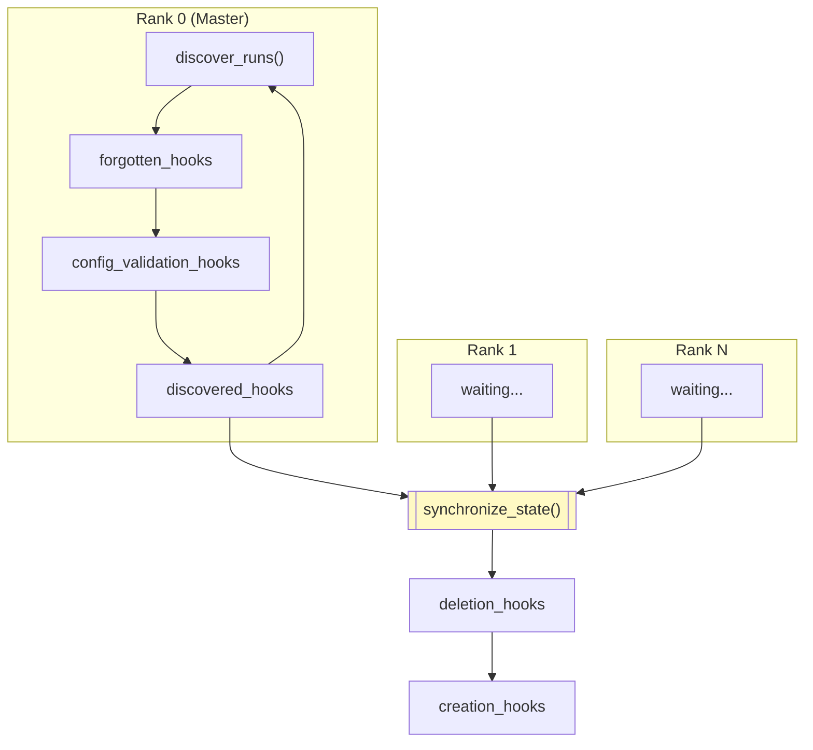

# PrimeIntellect-ai/prime-rl

Source: https://github.com/PrimeIntellect-ai/prime-rl
Ingested: 2026-04-27
Type: documentation

---

# README

<p align="center">
</p>

<p align="center">
  
  
</p>

---

<h3 align="center">
PRIME-RL: Async RL Training at Scale
</h3>

---

</br>
<p align="center">
  <a href="https://github.com/PrimeIntellect-ai/prime-rl/actions/workflows/style.yaml">
    
  </a>
  <a href="https://github.com/PrimeIntellect-ai/prime-rl/actions/workflows/cpu_tests.yaml">
    
  </a>
  <a href="https://github.com/PrimeIntellect-ai/prime-rl/actions/workflows/gpu_tests.yaml">
    
  </a>
</p>

## Overview

PRIME-RL is a framework for large-scale reinforcement learning. It is designed to be easy to use and hackable, yet capable of scaling to 1000+ GPUs. Here is what we think sets it apart:

1. Fully asynchronous RL for high-throughput agentic training at scale.
2. Performant: built to train 1T+ MoE models on 1000+ GPUs with [FSDP2](https://docs.pytorch.org/tutorials/intermediate/FSDP_tutorial.html) for training and [vLLM](https://github.com/vllm-project/vllm) for inference, with FP8 inference, PD disaggregation, EP and CP parallelism, and more.
3. Native integration with [`verifiers`](https://github.com/PrimeIntellect-ai/verifiers) environments through the [Environments Hub](https://app.primeintellect.ai/dashboard/environments?ex_sort=most_stars), including built-in support for SWE and agentic environments.
4. End-to-end post-training: SFT, RL training, and evals.
5. Multi-node deployment with Slurm and Kubernetes support.
6. Multimodal support for VLMs such as Qwen3-VL.
7. Hackable, modular, and extensible by design.


## Models support


The trainer works with both Hugging Face and Prime custom `ModelForCausalLM` out of the box. For selected families (especially large MoE) we also ship highly optimized training code under `src/prime_rl/trainer/models/`, including expert parallelism (EP) for MoE layers and context parallelism (CP) for long sequences (see the table), and additional kernels like [quack-kernels](https://github.com/quack-kernels/quack-kernels).

With `[model] impl = "auto"` (the default), the trainer selects that custom stack when the Hugging Face config type is registered.

| Family | Example IDs | MoE | EP | CP |
|--------|-------------|-----|----|-----|
| GLM-5 (`glm_moe_dsa`) | `zai-org/GLM-5`, `zai-org/GLM-5-FP8` | yes | ✅ | ✅ |
| Qwen3 MoE (`qwen3_moe`) | `Qwen/Qwen3-30B-A3B`, … | yes | ✅ | ✅ |
| Qwen3.5 MoE (`qwen3_5_moe`) | `Qwen/Qwen3.5-35B-A3B`, … | yes | ✅ | ✅ |
| Qwen3 / Qwen3.5 VLMs | [multimodal.md](docs/multimodal.md) (`qwen3_vl`, `qwen3_5`, `qwen3_5_moe`) | MoE only on MoE VLMs | MoE only | ✅ |
| MiniMax M2 (`minimax_m2`) | `MiniMax/MiniMax-M2` | yes | ✅ | ✅ |
| Nemotron H (`nemotron_h`) | `nvidia/Nemotron-3-Nano-30B-A3B`, `nvidia/Nemotron-3-Super-120B-A12B`, … | yes | ✅ | ❌ |
| Trinity (`afmoe`) | `arcee-ai/Trinity-Mini`, … | yes | ✅ | ✅ |
| GLM-4 · GLM-4.5 MoE · INTELLECT-3 (`glm4_moe`) | `THUDM/GLM-4-9B-0414`, `zai-org/GLM-4.5-Air`, `zai-org/GLM-4.5`, `PrimeIntellect/INTELLECT-3`, … | yes | ✅ | ✅ |
| GPT-OSS (HF, MoE) | `openai/gpt-oss-20b`, `openai/gpt-oss-120b` | yes | ❌ | ✅ |
| Other HF causal LMs | Qwen3 dense, Mistral, … (`impl = "hf"`) | varies | ❌ | ✅ |


## Setup

> *We develop and test on NVIDIA RTX 3090/4090/5090, A100, H100, H200, and B200. If your setup fails, please create an [issue](https://github.com/PrimeIntellect-ai/prime-rl/issues).*

### Prerequisites

Currently, you **need at least one NVIDIA GPU to use PRIME-RL**. If you don't already have access to one, we recommend our [compute platform](https://app.primeintellect.ai) for everything from renting on-demand single GPUs for developing, debugging and small ablations, to [reserving 1000+ GPU clusters](https://app.primeintellect.ai/dashboard/quotes) for production-scale training.

### Quick Setup

Set up PRIME-RL in a single command.

```bash
curl -sSL https://raw.githubusercontent.com/PrimeIntellect-ai/prime-rl/main/scripts/install.sh | bash
```

<details>
<summary>
Manual Setup
</summary>
<br>

1. Clone the repository

```bash
git clone https://github.com/PrimeIntellect-ai/prime-rl.git
cd prime-rl
```

2. Install [uv](https://docs.astral.sh/uv/)

```bash
curl -LsSf https://astral.sh/uv/install.sh | sh
source $HOME/.local/bin/env
```

3. Install dependencies from the lock file

```bash
uv sync --all-extras
```

3.1. Optional: Install Flash Attention 3 (on Hopper GPUs only, for flash_attention_3 attention backend)

> *NOTE*: This step will take a while, as it builds the Flash Attention 3 extension from source, as it has no wheels prebuilt.
> *NOTE*: After this step, you can't run `uv sync --all-extras` or `uv run` as it will uninstall the package, you can avoid it by running `uv sync --inexact` or `uv run --no-sync`

```bash
uv pip install "flash-attn-3 @ git+https://github.com/Dao-AILab/flash-attention.git@main#subdirectory=hopper" --no-build-isolation
```

</details>

<details>
<summary>
Validate your environment setup
</summary>
<br>

1. Check that the environment uses Python 3.12

```bash
uv run python -V
```

2. Check that `flash-attn` is installed

```bash
uv run python -c "import flash_attn"
```

3. Check that you can run SFT trainer  (*this requires 1 GPU*)

```bash
uv run sft @ configs/debug/sft/train.toml
```

4. Check that you can run the RL trainer (*this requires 1 GPU*)

```bash
uv run trainer @ configs/debug/rl/train.toml
```

5. Check that you can run the inference server (*this requires 1 GPU*)

```bash
uv run inference @ configs/debug/infer.toml
```

*Keep the inference server running in the background for the next steps.*

5.1. Check that you can run the orchestrator against the inference server

```bash
uv run orchestrator @ configs/debug/orch.toml
```

5.2. Check that you can run evals against the inference server

```bash
uv run eval @ configs/debug/eval.toml
```

</details>

### Additional Setup

1. If you want to log your runs to [W&B](https://wandb.ai), log in

```bash
uv run wandb login
# Or set `export WANDB_API_KEY=...`
```

2. If you require gated/ private models or datasets from [HuggingFace](https://huggingface.co), log in

```bash
uv run hf auth login
# Or set `export HF_TOKEN=...`
```

## Training Examples
We provide end-to-end training examples in the [`examples`](examples) directory to highlight features of the framework and guide you through the process of training your own models.

### Basic Training: 1 to 8 GPUs

Follow this guide to learn the basics of Prime-RL. You can train your own models on 1 to 8 GPUs. Ideal for getting started and exploring the capabilities of the framework. These guides cover most use cases -- single-turn, multi-turn, tool calling, etc. -- on toy environments and small models.

1. [**Reverse Text**](examples/reverse_text/README.md): Train `Qwen3-0.6B` to reverse a small chunk of text. Demonstrates tiny-scale single-turn SFT and RL training. Can be trained on a single consumer GPU in a few minutes, and is ideal for getting started.
2. [**Wordle**](examples/wordle/README.md): Train `Qwen3-1.7B` to play Wordle. A fun example of multi-turn SFT and RL training. Can be trained on a 2-4 H100 GPUs in a few hours. Ideal for exploring the multi-turn training capabilities of the framework.
3. [**Alphabet Sort**](examples/alphabet_sort/README.md): Train `Qwen3-4B-Instruct-2507` to sort names alphabetically. Demonstrates multi-turn RL training via LoRA without SFT warmup. Can be trained on a single H100 GPU in just over an hour. Ideal for exploring LoRA-based training.
4. [**Wiki Search**](examples/wiki_search/README.md): Train `Qwen3-4B-Instruct-2507` to answer trivia questions by searching through a Wikipedia. Demonstrates multi-turn with web search tool use.
5. [**Hendrycks Sanity**](examples/hendrycks_sanity/README.md): Run a sanity check experiment on `DeepSeek-R1-Distill-Qwen-1.5B` using a filtered subset of MATH where the model already partially solves 20-80% of problems. Useful for algorithm ablations.

### Advanced Training: 32 - 2048 GPUs:

Follow this guide to train large models on hard reasoning and agentic / swe environments.
These guides are designed to be run from a Slurm cluster but can also be adapted to k8s deployments.

1. [**Qwen 3 30B - A3B Math**](examples/qwen30b_math/README.md): Train `Qwen3-30B-A3B` to solve hard math problems.
2. [**Qwen 3 30B - A3B SWE**](examples/qwen30b_swe/README.md): Train `Qwen3-30B-A3B` to solve hard SWE problems.
3. [**Intellect-3.1**](examples/Intellect-3.1/README.md): Reproduce our `INTELLECT-3.1` training run.
4. [**MiniMax-M2.5 SWE**](examples/minimax_m2.5_swe/README.md): Train `MiniMax-M2.5` on agentic SWE tasks.
5. [**High-throughput GLM-5**](examples/glm5_pd_disag/README.md): Train `GLM-5` with PD disaggregation and FP8 inference on SWE.

## Docs

Check out the [docs](docs) directory for in-depth guides on how to use PRIME-RL.

- [**Entrypoints**](docs/entrypoints.md) - Overview of the main components (orchestrator, trainer, inference) and how to run SFT, RL, and evals
- [**Configs**](docs/configs.md) - Configuration system using TOML files, CLI arguments, and environment variables
- [**Environments**](docs/environments.md) - Installing and using verifiers environments from the Environments Hub
- [**Async Training**](docs/async.md) - Understanding asynchronous off-policy training and step semantics
- [**Logging**](docs/logging.md) - Logging with loguru, torchrun, and Weights & Biases
- [**Checkpointing**](docs/checkpointing.md) - Saving and resuming training from checkpoints
- [**Benchmarking**](docs/benchmarking.md) - Performance benchmarking and throughput measurement
- [**Deployment**](docs/deployment.md) - Training deployment on single-GPU, multi-GPU, and multi-node clusters
- [**Memory Usage**](docs/memory_usage.md) - Techniques for reducing memory usage (activation checkpointing, offloading, EP, CP, LoRA, etc.)
- [**Troubleshooting**](docs/troubleshooting.md) - Common issues and their solutions
- [**Multimodal**](docs/multimodal.md) - Training VLMs like Qwen3-VL

## Contributing

We warmly welcome community contributions! We use [issues](https://github.com/PrimeIntellect-ai/prime-rl/issues) to track bugs, feature requests, and share our internal roadmap. If you encounter bugs, have pain points during development, or have ideas for new features, please open an issue.

Contributions are welcome via PR. Please follow these guidelines:
1. Install the [pre-commit hooks](#pre-commit-hooks) to ensure your code is formatted correctly.
2. Please keep your PR in "Draft" until it is ready for review.
3. If your PR resolves an issue, please link the issue in the PR description
4. If you can, try running the [test suite](#tests) locally to ensure your changes are working as expected.

### Pre-Commit Hooks

Please install the [pre-commit](https://pre-commit.com) hooks to ensure your code is formatted correctly.

```bash
uv run pre-commit install
```

### Tests

Run the full test suite 

```bash
uv run pytest -v
```

To run unit tests, run

```bash
uv run pytest tests/unit -v
```

To run integration tests, run

```bash
uv run pytest tests/integration -v
```

To run CPU-only tests, use the inverse of the `gpu` marker:

```bash
uv run pytest -v -m "not gpu"
```

## License

This project is licensed under the Apache 2.0 license, as found in the [License](LICENSE) file.

## Citation

If you find our work useful, feel free to cite it using

```tex
@misc{primeintellect2025prime-rl,
  author = {Prime Intellect},
  title = {PRIME-RL},
  url = {https://github.com/PrimeIntellect-ai/prime-rl},
  year = {2025}
}
```


> **Deep fetch: 30 key files fetched beyond README.**


---

# FILE: .pre-commit-config.yaml

repos:
- repo: https://github.com/astral-sh/ruff-pre-commit
  # Ruff version.
  rev: v0.13.0
  hooks:
    # Run the linter.
    - id: ruff-check
      args: [ --fix, --config=pyproject.toml ]
    # Run the formatter.
    - id: ruff-format
      args: [ --config=pyproject.toml ]


---

# FILE: AGENTS.md

# AGENTS.md

## Writing code

- **Minimal try/except**: let errors propagate — silent failures hide bugs. Only catch exceptions for intentional fault tolerance (retries, robustness).
- **Targeted comments**: don't explain your work process or reference old code. Use targeted comments sparingly to clarify ambiguous logic.
- **Zen of Python**: remember the Zen of Python when writing code.
```
Beautiful is better than ugly.
Explicit is better than implicit.
Simple is better than complex.
Complex is better than complicated.
Flat is better than nested.
Sparse is better than dense.
Readability counts.
Special cases aren't special enough to break the rules.
Although practicality beats purity.
Errors should never pass silently.
Unless explicitly silenced.
In the face of ambiguity, refuse the temptation to guess.
There should be one-- and preferably only one --obvious way to do it.
Although that way may not be obvious at first unless you're Dutch.
Now is better than never.
Although never is often better than *right* now.
If the implementation is hard to explain, it's a bad idea.
If the implementation is easy to explain, it may be a good idea.
Namespaces are one honking great idea -- let's do more of those!
```

## Running code

- **Always use uv**: run code with `uv run` or `uv run <command>`, never raw `python`.
- **Adding dependencies**: add to `pyproject.toml` and run `uv sync --all-extras` to install and lock them.
- **Git dependency pins**: when pinning git dependencies in `pyproject.toml`, always use a small (7-char) commit hash for the `rev` field.

## Skills

Skills live in `skills/` and are symlinked to `.claude/skills/`. They teach agents how to handle specific workflows (e.g. starting the inference server, writing configs). When you make changes to the codebase, check if any skills need to be updated to stay accurate.

You are responsible for maintaining the skills folder. When a workflow fails and you fix it – whether with help from the user or through trial and error – you must update the skills to make implicit knowledge explicit. You are also responsible for keeping the skills up to date whenever you or anyone else modifies the code.

## Testing

Write tests as plain functions with pytest fixtures. Don't use class-based tests.

- **Conservative test additions**: don't add new tests unless the user explicitly asks for them or it's clearly necessary. Editing existing tests is fine, but adding new test files or test functions should be the exception, not the default.
- **Test what matters**: only test code with clear, isolated logic — pure functions, abstract base classes, data transformations, well-defined algorithms. Don't test runtime-level code, framework glue, or anything that requires extensive mocking/patching just to get a test to pass. If you need to patch everything out to make it testable, it's probably not worth testing.

## Git

- **Branch prefixes**: use the following prefixes for branches: `feat/`, `fix/`, `chore/`

## GitHub

- **Draft PRs**: always create PRs as drafts (`gh pr create --draft`) to avoid triggering CI unnecessarily.
- **Pull requests**: do not include a "test plan" section in PR descriptions unless you actually ran tests to verify the changes or the user explicitly asked for one.


---

# FILE: CHANGELOG.md

# Changelog

Documenting **breaking** configuration changes — renamed, removed, or moved fields that require users to update existing configs.

- **`model.attn = "eager"` (NEW option)**: Added `eager` as a valid value for the `model.attn` field. Required for GPT-OSS models on non-Hopper GPUs, since the only flash attention kernel GPT-OSS supports (`kernels-community/vllm-flash-attn3`) is Hopper-only. A clear error message is raised at model load time if GPT-OSS is used without `eager` on unsupported hardware. Also added `kernels` as a core dependency. (2026-04-05)
- **`[[orchestrator.env]]` → `[[orchestrator.train.env]]`**: Training environments and sampling are now configured under `[orchestrator.train]`. The old `[[orchestrator.env]]` and `[orchestrator.sampling]` paths are auto-translated with a deprecation warning and will be removed in a future release. (2026-04-09)
- **Per-env sampling overrides (NEW)**: Both `TrainEnvConfig` and `EvalEnvConfig` now accept a `[sampling]` section for per-env overrides. Unset fields inherit from the group-level sampling config (`[orchestrator.train.sampling]` or `[orchestrator.eval.sampling]`). (2026-04-09)
- **Per-env eval sampling overrides**: `EvalEnvConfig` now accepts a `[sampling]` section. Unset fields inherit from `[orchestrator.eval.sampling]`. All `EvalSamplingConfig` fields remain nullable (None = defer to inference server default). (2026-04-09)
- **`orchestrator.buffer.env_ratios` → per-env `orchestrator.train.env[].ratio`**: `buffer.env_ratios` has been removed. Set `ratio` on each `[[orchestrator.train.env]]` entry instead. Ratios must be all-or-nothing across envs (either all have a ratio or none do). (2026-04-05)
- **`orchestrator.val` removed**: The `[orchestrator.val]` config section (`ValConfig`) has been removed. Existing configs must delete this section. (2026-04-05)
- **`orchestrator.max_concurrent` removed**: Concurrency limiting via `max_concurrent` and the global semaphore have been removed. Existing configs must delete this field. (2026-04-05)
- **`orchestrator.buffer.hash_keys` default changed**: Default changed from `["task", "prompt"]` to `["env_name", "prompt"]`. The `task` field is no longer overridden by the orchestrator for env identification; `env_name` is used instead. Buffer checkpoints using the old default may not resume correctly. (2026-04-05)
- **`orchestrator.eval.env[].failed_rollouts` metric is now a ratio**: The `eval/{name}/failed_rollouts` metric now reports a ratio (0.0–1.0) instead of a raw count. Dashboards keying on this metric should be updated. (2026-04-05)
- **`orchestrator.sampling.temp_scheduler` removed**: Temperature scheduling (`TemperatureSchedulerConfig`) has been removed. `sampling.temperature` is now a required `float` (default `1.0`). Existing configs using `temp_scheduler` must replace it with a fixed `temperature` value. (2026-04-05)
- **`orchestrator.verification` removed**: The `[orchestrator.verification]` config section (`VerificationConfig`) has been removed. Rollout scoring is now always enabled. Existing configs must delete this section. (2026-04-05)
- **`orchestrator.eval.env[].skip_first` removed**: The `skip_first` field on `EvalEnvConfig` has been removed. Existing configs using this field must delete it. (2026-04-05)
- **`EvalSaveHFConfig` removed**: Unused config class removed. (2026-04-09)
- **`orchestrator.env[].max_total_completion_tokens` (NEW)**: Added `max_total_completion_tokens: int` to `EnvConfig` (default: `-1`, disabled). Limits the total completion tokens across all turns in a multi-turn rollout. Auto-populated into `extra_env_kwargs` and applied via the verifiers `set_max_total_completion_tokens()` setter. Works for both training and eval environments. (2026-04-06)
- **`sampling.max_tokens` → `sampling.max_completion_tokens`**: Renamed `max_tokens` to `max_completion_tokens` in both `SamplingConfig` and `EvalSamplingConfig` for consistency with OpenAI API naming. The old name is accepted with a deprecation warning. (2026-04-06)
- **`log.file` and `log.env_worker_logs` removed**: Removed `log.file` (from `LogConfig` and `SharedLogConfig`) and `log.env_worker_logs` (from `LogConfig`). Python file logging is replaced by deployment-level capture. Existing configs using these fields must delete them. Log paths unified: `.stdout` files renamed to `.log`, SLURM logs moved from `slurm/` to `logs/`. (2026-03-31)
- **`trainer.log.ranks_filter` (NEW)**: Added `ranks_filter: list[int]` to `TrainerLogConfig` (default: `[0]`). Controls which ranks appear in trainer console output via torchrun's `--local-ranks-filter`. (2026-03-31)
- **`wandb.log_extras.sample_ratio` / monitor sample logging defaults**: `wandb.log_extras.sample_ratio` is now actually applied to W&B sample-table logging via the shared monitor sampler (it was previously a no-op for WandB). Separately, the orchestrator no longer hard-caps sample logging to 8 rollouts before monitor-level sampling runs, so when monitor `sample_ratio` is `None`, monitors now receive and may log the full rollout batch for a step instead of at most 8 rollouts. This affects both W&B and Prime monitor sample logging behavior. (2026-03-27)
- **`[model.vlm].freeze_vision_encoder`**: Added to `VLMConfig`. Controls whether the vision encoder is frozen (default: `true`). When `false`, the vision encoder is trainable and FSDP-sharded per-block. Has no effect with LoRA. Moved from `[trainer.model].freeze_vision_encoder` into the VLM sub-config. (2026-03-25)
- **`loss_impl = "quack_fused"` (SFT)**: Added `quack_fused` option for the SFT `loss_impl` field. Uses quack-kernels for chunked linear + cross-entropy with CuTe DSL CUDA kernels, avoiding full logits materialization. Requires `quack-kernels` package. Does not support Gemma logit softcapping. Custom model impl (`model.impl = "custom"`) also gains quack RMSNorm acceleration on CUDA automatically. (2026-03-26)
- **`model.ac.targets`**: Removed the `mamba` selective activation checkpoint target and folded that behavior into the broader `linear_attn` target. Existing configs using `targets = ["mamba"]` will now fail validation at runtime with `ValueError`; switch them to `targets = ["linear_attn"]`. The `linear_attn` target description now covers supported token mixers outside the standard softmax-attention path, including NemotronH Mamba layers, Qwen3.5-MoE GatedDeltaNet layers, and AFMoE sliding-window attention layers. (2026-03-28)
- **`model.tp` (trainer `ModelConfig`)**: Removed from the trainer model config. Existing trainer configs must delete this field; it is no longer accepted. (2026-03-26)
- **`orchestrator.env[].num_workers`**: Added configurable env server worker count (`int | "auto"`, default: `"auto"`). When `"auto"`, scales based on concurrency (1 worker per 256 concurrent rollouts). Only used when the orchestrator spawns the env server (i.e. `address` is not set). (2026-03-25)
- **`[model.vlm]` (NEW — replaces auto-detection)**: VLM mode is now opt-in via a `[model.vlm]` sub-config with required `vision_encoder_attr` and `language_model_attr` fields. There is no auto-detection — if you train a VLM, you must add `[model.vlm]`. Existing multimodal configs need the new section. See `docs/multimodal.md` for the table of known model attrs. (2026-03-24)
- **`model.optimization_dtype` / `model.reduce_dtype` (VLM models, RL only)**: VLM dtype validation now only applies to RL training (`TrainerConfig`), not SFT. VLM models used with `sft` no longer require `optimization_dtype='bfloat16'` / `reduce_dtype='bfloat16'`. RL training still enforces both to match vLLM inference. (2026-03-24)
- **`model.ep_comm_backend`**: Added expert-parallel communication backend selection. Accepted values are `torch` (default, uses TorchTitan all-to-all collectives) and `deepep` (uses DeepEP custom kernels). This field only affects configurations with expert parallelism enabled via `model.ep > 1`. (2026-03-22)
- **`model.deepep_num_sms`**: Added DeepEP SM allocation control for intranode dispatch/combine kernels (default: `20`, minimum: `1`). This field is only used when `model.ep_comm_backend='deepep'`; it also determines the internode RDMA channel count (`num_channels = num_sms / 2`). (2026-03-22)
- **`model.deepep_token_chunk_size`**: Added optional token chunk size for DeepEP MoE pipelining (default: `None`, minimum: `1`). When set, DeepEP dispatch for chunk `i+1` overlaps expert compute for chunk `i`. This field is only used when `model.ep_comm_backend='deepep'`. (2026-03-22)
- **`model.optimization_dtype` / `model.reduce_dtype` (VLM models)**: Added validation that VLM models must use `optimization_dtype='bfloat16'` and `reduce_dtype='bfloat16'` to match vLLM inference. Previously valid configs with `float32` (the default) are now rejected for VLM model names. Set both fields to `"bfloat16"` when training VLMs. (2026-03-21)
- **`model.ac.mode`** and **`model.ac.targets`**: Added selective activation checkpointing configuration. `model.ac.mode` accepts `full` (default) or `selective`. When `selective`, `model.ac.targets` selects subcomponents to checkpoint. Supported public targets are currently `norm`, `attention_sdpa`, `mla_up_proj`, and `routed_experts`; runtime validation remains the source of truth. `model.ac.targets` defaults to `["norm"]`, and selective mode requires at least one target. (2026-03-20)
- **`orchestrator.advantage.length_shaping_alpha` → `orchestrator.advantage.length_shaping`**: Replaced GR³ (`length_shaping_alpha: float | None`) with correctness-gated efficiency shaping (`length_shaping: bool`, default: `false`). No hyperparameter needed, no `online_difficulty_filtering` requirement. Existing configs using `length_shaping_alpha` must switch to `length_shaping = true`. (2026-04-13)
- **`orchestrator.advantage.length_weighted_mean`**: Removed. The default advantage now always uses the plain per-problem mean baseline unless `orchestrator.advantage.length_shaping` is enabled. Existing configs must delete this field. (2026-03-19)
- **`prime_monitor.log_extras.sample_ratio`**: Added ratio-based rollout sampling (0.0–1.0, default: None). When set, caps the number of rollouts logged per step to `len(rollouts) * sample_ratio`. `None` preserves current behavior (log all rollouts). Interacts with existing `interval` gate which still runs first. (2026-03-12)
- **`client.connect_timeout`**: Added configurable TCP connect timeout for inference API requests (default: 30.0s). Previously hardcoded to 5.0s. Helps with vLLM or cluster flakiness (2026-03-11)
- **`model.fused_lm_head_token_chunk_size`**: Added as the fused LM-head chunking field for the token-chunked implementation. Unlike the removed `model.fused_lm_head_chunk_size`, this chunks over flattened sequence tokens rather than vocabulary rows. `model.fused_lm_head_chunk_size` is no longer accepted; switch configs to `model.fused_lm_head_token_chunk_size` explicitly. (2026-03-09)
- **`slurm.pre_run_command`**: Added optional shell command to run on the head node before starting the job. Useful for cleanup routines (e.g. killing stale processes, removing lock files). For all-nodes execution, wrap with `srun` in the command string (default: None) (2026-03-08)
- **`slurm.nodelist`**, **`slurm.exclude`**, **`slurm.account`**, **`slurm.time`**: Added common SLURM scheduling options (all default: None) (2026-03-08)
- **`orchestrator.verification.enabled`**: Added top-level rollout verification switch. `orchestrator.buffer.skip_verification` has been removed; use `verification.enabled = false` instead. When disabled, rewards are always 0 and reward-dependent buffer features (`online_difficulty_filtering`, `easy_threshold`, `hard_threshold`) must be unset (2026-03-03)
- **`client.dp_rank_count`**: Added configuration for data-parallel inference routing. When > 1, each `client.base_url` is expanded into `dp_rank_count` logical clients and pinned via `X-data-parallel-rank` to keep multi-turn rollouts on a consistent DP rank (default: 1) (2026-03-03)
- **`model.lora`**: Moved from `model.experimental.lora` to `model.lora` (no longer experimental) (#1440, 2025-12-16)
- Auto-set `api_server_count=1` on inference when LoRA is enabled, because vLLM doesn't support hotloading for multiple API servers (#1422, 2025-12-17)
- **`inference.model.rope_scaling`**: Added RoPE scaling configuration passthrough to vLLM (#1447 2025-12-17)
- **`orchestrator.env_mix`**: Deprecated in favor of `orchestrator.buffer.env_ratios` (#1450, 2025-12-18)
- **`orchestrator.buffer.hash_keys`**: Added hash keys configuration for buffer checkpointing (#1450, 2025-12-18)
- **`orchestrator.buffer.env_ratios`**: Added environment ratio configuration for buffer sampling (#1450, 2025-12-18)
- **`orchestrator.buffer.skip_verification`**: Added configuration to skip verification of rollouts using the environment's rubric. If True, rewards are always set to 0. Cannot be used with `online_difficulty_filtering=True` or when `easy_threshold`/`hard_threshold` are set (default: False)
- **`orchestrator.ckpt.buffer_path`**: Deprecated (#1450, 2025-12-18)
- **`orchestrator.buffer.easy_fraction`** and **`orchestrator.buffer.hard_fraction`**: Easy and hard fraction now defines the fraction of easy and hard problems to convert to normal when resuming, whereas previously it was the ratio of easy/ hard samples to sample per step (#1450, 2025-12-18)
- **`orchestrator.teacher_model`**: Added teacher model configuration for computing teacher logprobs (e.g. for distillation). Supports `TeacherModelConfig` (custom model) or `None` (disabled). Renamed from `reference_model` (2025-12-20)
- **`seq_len`**: Added root-level `seq_len` config that sets both `trainer.model.seq_len` and `orchestrator.seq_len`. Added validation that `trainer.model.seq_len >= orchestrator.seq_len` (2025-12-18)
- **`trainer.loss.sequence_mask_ratio_low`** and **`trainer.loss.sequence_mask_ratio_high`**: Renamed to `trainer.loss.sequence_mask_low` and `trainer.loss.sequence_mask_high` (2025-12-19)
- **`trainer.loss.token_mask_high`** and **`trainer.loss.token_mask_low`**: Added token-level importance ratio masking thresholds (2025-12-19)
- **`trainer.loss.sequence_clip_high`**: Added sequence-level importance ratio clipping threshold (2025-12-19)
- **`trainer.loss.geo_mask_high`** and **`trainer.loss.geo_mask_low`**: Added geometric importance ratio masking thresholds (2025-12-19)
- **`trainer.loss.adv_tau`**: Added tau parameter for advantages (default: 1.0)
- **`trainer.loss.teacher_tau`**: Added tau parameter for teacher logprobs (default: 0.0). Renamed from `ref_tau`
- **`teacher_gpu_ids`**: Added GPU IDs for teacher inference server. When set, automatically starts a teacher inference server and configures `orchestrator.teacher_model`
- **`teacher_inference`**: Added optional teacher inference config. Defaults to copying from `inference` config with port 8001
- **`{orchestrator,trainer}.transport.zmq`**: Added ZMQ transport for training batches and micro batches (#1446, 2025-12-22)
- **`model.impl`**: Changed default from `hf` to `auto`. With `auto`, the implementation automatically selects `custom` if supported for the model, otherwise falls back to `hf` (#1488, 2025-12-27)
- **`orchestrator.eval.skip_eval_on_resume`**: Added flag (default `True`) to skip the first potentially redundant online eval immediately after resuming from a checkpoint (#1491, 2025-12-27)
- **`trainer.weight_broadcast.adapter_only`**: Removed. Adapter-only behavior is now automatically derived from the presence of LoRA configuration (2025-12-27)
- **`ckpt.keep`**: Renamed to `ckpt.keep_last`. Added `ckpt.keep_interval` to keep checkpoints at every N steps permanently (2025-12-31)
- **`MultiLoRAMoE`**: QwenMoE now supports training expert loras and this is enabled by default in the `target_modules`. (2026-01-01)
- **`model.fused_lm_head_chunk_size`**: Added chunk size configuration for fused LM head to enable memory-efficient chunked logprob computation. When set, splits vocabulary into chunks to avoid materializing full [N, V] logit tensor (default: None) (#1525, 2026-01-03)
- **`model.fused_lm_head_chunk_size`**: RL training now auto-sets this to 2048 if not specified (except when `impl='liger_kernel'`). SFT training continues to use None (2026-01-05)
- **`trainer.metrics_server`**: Added optional Prometheus metrics server for trainer observability. Exposes `/metrics` endpoint with step, loss, throughput, grad_norm, etc. Disabled by default (default: None) (#1547, 2026-01-06)
- **`model.lora.alpha`**: Changed default from 16.0 to 32.0 (2026-01-10)
- **`orchestrator.env.log`**: Added logging configuration for environment workers. If set, enables logging with `level` (str, default: "warn") and `vf_level` (str, default: "warn") fields. If None (default), logging is disabled (#1561, 2026-01-13)
- **`eval.watcher`**: Added flag (default `False`) to watch `weights_dir` for newly-created stable checkpoints and evaluate them as they appear (2026-01-14)
- **`orchestrator.log.env_worker_logs`**: Added flag (default `False`) to write env worker logs to `logs/env_workers/{env_name}.log` (2026-01-15)
- **`orchestrator.env.log`**: Removed. Use `orchestrator.log` for env worker logging instead (2026-01-15)
- **`orchestrator.eval.retry.reraise`**: Changed default from `True` to `False`. When `False`, raises `tenacity.RetryError` after retries are exhausted instead of the original exception, allowing failed eval environments to be skipped with a warning (#1586, 2026-01-14)
- **`model.ep`**: Expert parallelism now supported (with auto/custom impl only), changed from the old behaviour when `ep>1` was a no-op to a proper parallelization of the MoE layers. (#1595, 2026-01-15)
- **`orchestrator.reload_weights_on_start`**: Removed. The reload was a no-op in practice since vLLM servers already start with base weights, and LoRA runs skipped it. (#1829, 2026-02-19)
- **`orchestrator.client.elastic`**: Added elastic inference pool with DNS-based service discovery. Supports dynamic server scaling via any DNS hostname with multiple A records (Kubernetes headless services, Consul, Route53, etc.). Automatically syncs LoRA adapters on new servers and only exposes ready servers to workers (#1617, 2026-01-19)
- **`model.fused_lm_head_chunk_size`**: Replaced chunk size `int | None` setting with `int | Literal["auto", "disabled"]` setting. `auto` auto-sets to 2048 if possible. `disabled` explicitly disables chunked loss (use vanilla LM head). Default behaviour is to use `auto` for RL training and `disabled` for SFT training. (not changed from previous version) (#1649, 2026-01-23)
- **`client.skip_model_check`**: Added configuration to skip checking if the model is available in the inference pool. Useful for external APIs or API keys that don't support the /models endpoint (default: False) (#1543, 2026-01-06)
- **`orchestrator.sampling.temp_scheduler`**: Added optional temperature schedule configuration with linear and cosine schedules. Set either `sampling.temperature` (constant) or `sampling.temp_scheduler` (schedule), not both. Default remains 1.0 if neither is set. (2026-01-27)
- **`orchestrator.trajectory_strategy`**: Deprecated. Interleaving now automatically handles extension breaks by starting a new sample when the prefix doesn't match, achieving best-of-both behavior. The setting is ignored and interleaved mode is always used. (2026-01-30)
- **`model.impl`**: Removed `liger_kernel` model implementation from supported options. The Liger kernel dependency remains for SFT loss. (2026-01-30)
- **`log.json_logging`**: Added JSON structured logging option for log aggregation systems (Loki, Grafana, etc.). Outputs flat newline-delimited JSON with `timestamp`, `level`, `message`, `module`, `function`, `line` fields. Available on root `log`, `trainer.log`, and `orchestrator.log` (default: False) (2026-01-28)
- **`model.optim_cpu_offload`**: Added flag to offload optimizer states to CPU without moving parameters (default: False) (2026-01-31)
- **`orchestrator.tasks_per_minute`**: Added optional rate limiting for sandbox tasks per environment worker. Uses token bucket algorithm. If None (default), no rate limiting is applied (2026-02-02)
- **`model.cp`**: When `cp>1` with `attn="flash_attention_3"`, require `model.impl="custom"` (FA3 ring-attention kernel only in custom path) (2026-02-06)
- **`model.attn`**: Added `fa4` as an attention implementation option. Flash attention 4 is only supported with the custom implementation (#1726, 2026-02-06)
- **`inference.model.enable_prefix_caching`**: Added flag to enable prefix caching in vLLM. Passed to vLLM as `--enable-prefix-caching` (default: None) (2026-02-08)
- **`orchestrator.env.address`**: Added address field on `EnvConfig`. If set, connect to an environment server at this address; if None, spawn a server in a subprocess (2026-02-06)
- **`orchestrator.env.extra_env_kwargs`**: Added on `EnvConfig`. Extra kwargs passed to the env (e.g. seq_len, interleaved_rollouts, score_rollouts). Auto-populated by the orchestrator for training envs; generally not recommended for user override. Main use case is to match these kwargs when running an env in an isolated environment server (default: {}) (2026-02-06)
- **`OrchestratorConfig`**: Removed `workers_per_env`, `max_env_worker_restarts`, and `mask_env_responses` (2026-02-06)
- **`EvalSaveDiskConfig`**, **`EvalSaveConfig`**, **`RetryConfig`**, **`OnlineEvalConfig`**: Removed (2026-02-06)
- **`TemperatureScheduleConfig`**: Renamed to `TemperatureSchedulerConfig` (2026-02-06)
- **`optim.mu`**: Added Muon momentum (`mu`) config field (default: 0.95). Previously hardcoded to Muon class default. Also fixed `optim.betas1`/`optim.betas2` not being passed through to the Muon optimizer (2026-02-09)
- **`dump_config`**: Added `--dump-config <path>` flag to the `rl` command. When set, writes the resolved subconfigs (trainer, orchestrator, inference, teacher_inference) to the given directory and exits without starting any processes (2026-02-12)
- **`client.api_key_var`**: Changed default from "OPENAI_API_KEY" to "VLLM_API_KEY" (2026-02-12)
- **`orchestrator.filters`**: Added orchestrator-side rollout filters for detecting degenerate generations. Supports `[[filters]] type = "gibberish"` (rare tokens at high entropy) and `[[filters]] type = "repetition"` (high-confidence token streaks). Detected rollouts get reward zeroed and completion mask cleared (2026-02-13)
- **`inference.model.tool_call_parser`**: Changed default from `"hermes"` to auto-detection from model name. Uses `MODEL_TOOL_CALL_PARSER` dict to infer the correct vLLM tool call parser (e.g. Qwen3→`hermes`, GLM-4.5→`glm45`, GLM-4.7→`glm47`, MiniMax-M2→`minimax_m2`, INTELLECT-3→`hermes`). Unknown models default to `None`. Explicit values still take priority. (#1795, 2026-02-16)
- **`orchestrator.eval.cancel_inflight_rollouts_on_eval`**: Added flag to optionally cancel in-flight training rollouts before starting online evals. When enabled, avoids congestion by preventing training and eval rollouts from running simultaneously, but slows training as the rollout pipeline must refill after each eval (default: False) (2026-02-16)
- **`orchestrator.use_token_client`**: Added flag to use the token-in-token-out (TITO) client for training across all environments. When enabled, uses `openai_chat_completions_token` client type instead of `openai_chat_completions`. Only use when environments have linear history and the chat template has the extension property (default: False) (2026-02-21)
- **`model.cp` + AFMoE**: Context parallelism now works with AFMoE models via unified `substitute_ring_attn` which patches `_compute_attention` on both `FlashAttention` and `AfmoeFlashAttention` to use ring attention. Sliding window layers automatically get per-layer `window_size`; full attention layers default to `(-1, -1)`. Also plumbed `window_size` through the FA3 ring attention wrapper (`ring_fa3_varlen_func`). (2026-02-21)
- **`orchestrator.token_batch_size`** and **`orchestrator.max_inflight_rollouts`**: Added token-based batching via `token_batch_size` and explicit in-flight rollout control via `max_inflight_rollouts` (2026-02-23)
- **`orchestrator.batch_size`**: Now optional and mutually exclusive with `token_batch_size`. If neither is set, defaults to rollout mode with `batch_size=128` (2026-02-23)
- **`inference.enable_expert_parallel`**, **`inference.all2all_backend`**, and **`inference.enable_eplb`**: Added expert-parallel inference controls passed to vLLM as `--enable-expert-parallel`, `--all2all-backend`, and `--enable-eplb` (defaults: `False`, `"allgather_reducescatter"`, `False`) (2026-02-23)
- **`rl_slurm` / `sft_slurm` entrypoints**: Removed. SLURM submission is now handled by the unified `rl` and `sft` entrypoints. Add a `[slurm]` section to your config to submit via SLURM instead of running locally (2026-02-23)
- **`inference_gpu_ids` / `trainer_gpu_ids` / `teacher_gpu_ids`**: Removed from `RLConfig`. Replaced by `[deployment]` section with `type = "single_node"` (fields: `num_train_gpus`, `num_infer_gpus`, `num_teacher_gpus`) or `type = "multi_node"` (fields: `num_train_nodes`, `num_infer_nodes`, `num_teacher_nodes`, `nodes_per_fsdp_group`). Default is `single_node` with 1 train GPU and 1 infer GPU (2026-02-23)
- **`RLSLURMConfig`**: Removed. Fields `job_name`, `num_train_nodes`, `num_infer_nodes`, `gpus_per_node`, `nodes_per_fsdp_group`, `project_dir`, `slurm_template`, `dry_run` are now under `[slurm]` and `[deployment]` in the unified `RLConfig` (2026-02-23)
- **`SFTSLURMConfig`**: Removed. Fields `job_name`, `num_nodes`, `gpus_per_node`, `nodes_per_fsdp_group`, `project_dir`, `slurm_template`, `dry_run` are now under `[slurm]` and `[deployment]` in `SFTConfig` (2026-02-23)
- **`[deployment]` (RL)**: Added deployment configuration. `type = "single_node"` auto-derives contiguous GPU assignments from `num_infer_gpus`, `num_train_gpus`, `num_teacher_gpus`. `type = "multi_node"` requires `[slurm]` and uses `num_train_nodes`, `num_infer_nodes` (2026-02-23)
- **`[deployment]` (SFT)**: Added deployment configuration. `type = "single_node"` with `num_gpus` (default: 1). `type = "multi_node"` with `num_nodes`, `nodes_per_fsdp_group`, `hf_hub_offline` (2026-02-23)
- **`[slurm]` (RL)**: Added SLURM configuration with `job_name`, `project_dir`, `template_path`, `partition`, `dry_run`. When present, `uv run rl` generates and submits an sbatch script instead of running locally. Template is auto-selected based on deployment type (2026-02-23)
- **`[slurm]` (SFT)**: Added SLURM configuration with `job_name`, `project_dir`, `template_path`, `partition`, `dry_run`. When present, `uv run sft` generates and submits an sbatch script instead of running locally (2026-02-23)
- **`hf_hub_offline` (RL/SFT SLURM)**: Removed. `HF_HUB_OFFLINE=1` is now hardcoded in the multi-node SLURM templates (2026-02-23)
- **SLURM templates**: Moved from `src/prime_rl/slurm/` to `src/prime_rl/templates/` and renamed to `single_node_rl.sbatch.j2`, `multi_node_rl.sbatch.j2`, `single_node_sft.sbatch.j2`, `multi_node_sft.sbatch.j2` (2026-02-23)
- **Entrypoints**: Moved `rl` and `sft` entrypoints from `prime_rl.rl` / `prime_rl.sft` to `prime_rl.entrypoints.rl` / `prime_rl.entrypoints.sft`. No change to CLI usage (`uv run rl`, `uv run sft`) (2026-02-24)
- **`output_dir` (RL)**: Changed from `Path | None` (default `None`) to `Path` (default `Path("outputs")`). The SLURM-specific validation that rejected the default has been removed — `output_dir` now works the same for local and SLURM runs (2026-02-24)
- **`clean_output_dir`**: Added to `RLConfig` and `SFTConfig` (default: `False`). Training now raises `FileExistsError` when `output_dir` contains checkpoints from a previous run and not resuming. Set `clean_output_dir=true` to delete and start fresh, or set `ckpt.resume_step` to resume (2026-02-24)
- **`clean`**: Removed from `RLConfig`. The old `clean` flag (default: `True`) silently deleted logs, rollouts, and broadcasts on every local RL run. Superseded by the explicit `clean_output_dir` flag (2026-02-24)
- **Config consolidation**: All config modules moved into `prime_rl.configs` subpackage. `utils/config.py` + `transport/config.py` → `configs/shared.py`; `trainer/config.py` + `trainer/rl/config.py` → `configs/trainer.py`; `trainer/sft/config.py` → `configs/sft.py`; `orchestrator/config.py` → `configs/orchestrator.py`; `inference/config.py` → `configs/inference.py`; `rl_config.py` → `configs/rl.py`. Class renames: `SFTTrainerConfig` → `SFTConfig`, `RLTrainerConfig` → `TrainerConfig`. Component prefixes dropped from orchestrator and inference config classes (e.g. `OrchestratorCheckpointConfig` → `CheckpointConfig`). TypeAlias renames: dropped `Type` suffix (e.g. `LossConfigType` → `LossConfig`, `TransportConfigType` → `TransportConfig`), renamed `LossConfig` class → `DefaultLossConfig`. No TOML key changes. (2026-02-24)
- **`trainer.enable_router_replay`**: Added flag to enable router replay. If True, will return routed experts in the batch. This is only supported if `enable_return_routed_experts=True` in the inference config or pass `--enable-return-routed-experts` to vLLM server. This is only supported for custom models. (2026-02-22)
- **`inference.enable_return_routed_experts`**: Added flag to enable return routed experts. Passed to vLLM as `--enable-return-routed-experts` (2026-02-22)
- **`orchestrator.oversampling_factor`**: Added rollout-only over-sampling config that resolves `max_inflight_rollouts = int(batch_size * oversampling_factor)` when `max_inflight_rollouts` is unset. Cannot be used with `token_batch_size` or together with explicit `max_inflight_rollouts` (2026-02-25)
- **`sft.val`**: Added optional periodic SFT validation with `val/loss` and `val/num_tokens` logging. Configure via `sft.val.data` (validation dataset) and `sft.val.interval` (every N steps, default 50). Runs the full validation dataset each pass. (2026-02-26)
- **`model.fused_lm_head_chunk_size`**: Changed default value from 2048 to 8192 for RL training (2026-02-26)
- **`inference.data_parallel_size_local`** and **`inference.data_parallel_rpc_port`**: Added data-parallel node-local controls for vLLM, passed as `--data-parallel-size-local` and `--data-parallel-rpc-port` (defaults: `None`, `13345`) (2026-02-26)
- **`dump_config`**: Removed from `RLConfig`. Replaced by `dry_run` (see below) (2026-02-26)
- **`slurm.dry_run`**: Removed from `SlurmConfig`. Replaced by top-level `dry_run` (see below) (2026-02-26)
- **`dry_run`**: Added to `RLConfig` and `SFTConfig` (default: `False`). When set, validates the config, writes resolved subconfigs to `output_dir/configs/`, and exits without starting any processes. Works the same for both local and SLURM runs (2026-02-26)
- **Config output location**: Resolved subconfigs are now always written to `output_dir/configs/` instead of `.pydantic_config/<uuid>/`. This applies to both local and SLURM entrypoints, and for both single-node and multi-node deployments (2026-02-26)
- **SFT config filename**: The resolved SFT trainer config is now written as `sft.toml` instead of `trainer.toml` (2026-02-26)
- **Inference entrypoint**: Moved from `prime_rl.inference.server` to `prime_rl.entrypoints.inference`. No change to CLI usage (`uv run inference`) (2026-02-26)
- **`[slurm]` (inference)**: Added SLURM configuration to `InferenceConfig`. When present, `uv run inference` generates and submits an sbatch script instead of running locally. Each SLURM node runs an independent vLLM replica (no cross-node parallelism) (2026-02-26)
- **`[deployment]` (inference)**: Added deployment configuration. `type = "single_node"` (default) with `gpus_per_node`. `type = "multi_node"` with `num_nodes` and `gpus_per_node` — requires `[slurm]` (2026-02-26)
- **`inference.output_dir`**: Added directory for SLURM logs and generated scripts (default: `"outputs"`) (2026-02-26)
- **`inference.dry_run`**: Added flag (default: `False`). When set, validates config, writes resolved config to `output_dir/configs/`, and exits without starting inference or submitting SLURM jobs (2026-02-26)
- **`orchestrator.teacher_rollout_model`**: Added optional external rollout model configuration. When set, rollouts are generated from this endpoint/model instead of the student inference server. Accepts a `TeacherRolloutModelConfig` with `client` and `model` sub-fields, or `None` (default: `None`) (2026-02-26)
- **`trainer.loss.type = "sft"`**: Added SFT loss variant. Set `trainer.loss.type = "sft"` to use masked negative log-likelihood loss instead of the default RL loss (2026-02-26)
- **`trainer.loss.type = "custom"`**: Added custom loss variant. Set `trainer.loss.type = "custom"` with `import_path` (e.g. `"my_module.my_loss"`) and optional `kwargs` to use an external loss function (2026-02-26)
- **`trainer.loss` (default loss)**: Made IPO (DPPO-Binary TV variant ([arxiv](https://arxiv.org/pdf/2602.04879)) + Kimi-K2.5 KL ([Kimi-K2.5](https://arxiv.org/pdf/2602.02276))) the default loss. Removed `ratio_type`, `token_mask_low`, `token_mask_high`, `sequence_clip_high`, `geo_mask_low`, `geo_mask_high`, `sequence_mask_low`, `sequence_mask_high`. Added `ipo_mask_low` (default: 0.2) and `ipo_mask_high` (default: 0.2) for token-level probability-difference masking. Changed `kl_tau` default from `0.0` to `1e-3`. (2026-03-02)
- **Metrics logging overhaul**: All orchestrator metrics now follow a `{metric}/{scope}/{stat}` naming convention where scope is `all` (global) or an env name. Per-env breakdowns are always logged (previously only when >1 env). Key renames: `reward/mean` → `reward/all/mean`, `batch/solve_none` → `solve_none/all`, `val_reward/` → `val/reward/`, `metrics/{name}` → `metrics/{env}/{name}`, `stop_condition/{sc}` → `stop_condition/all/{sc}`, `error/mean` → `error/all/mean`. New per-env metrics: `solve_none/{env}`, `solve_all/{env}`, `effective_batch_size/{env}`, `stop_condition/{env}/generation_truncated`, `stop_condition/{env}/{sc}`, `error/{env}/mean`, plus per-env breakdowns for `seq_len`, `prefill_len`, `decode_len`, `is_truncated`, `samples_per_rollout`, `num_turns`, `generation_ms`, `scoring_ms`. Removed: `reward/std`, `reward/median`, per-error-type breakdown (`error/{error_type}`). Env name `"all"` is reserved and rejected at config validation. Env name validation now strips `@version` suffixes to match runtime behavior (e.g. `math@1.0` and `math@2.0` correctly detected as duplicates). Solve stats now use `example_id` grouping instead of index arithmetic (pre-existing bug fix). (2026-03-08)
- **`wandb.shared`** (experimental): Added shared W&B mode that logs trainer and orchestrator metrics to a single W&B run instead of two separate runs. Uses `wandb.Settings(mode="shared")` (requires wandb SDK >= 0.19.9). Enabled by default on the RL entrypoint. Disable with `--wandb.shared False`. Run ID is communicated via `WANDB_SHARED_RUN_ID` env var; process role via `WANDB_SHARED_LABEL`. Non-primary processes retry `wandb.init` up to 30 times waiting for the primary to create the run. Works with multi-node SLURM. (2026-03-18)
- **`wandb.id`**: Removed from `WandbConfig`. Run IDs are now managed internally via env vars for shared mode. (2026-03-18)
- **`trainer.ckpt.skip_optimizer`**: Added flag to skip loading optimizer states when resuming training. When set, only the model weights are loaded from the checkpoint. (2026-03-24)


---

# FILE: CLAUDE.md

@AGENTS.md


---

# FILE: docs/async.md

# Asynchronous Training

PRIME-RL implements asynchronous off-policy training, instead of the traditional synchronous on-policy training. This means that we allow inference to generate rollouts from a stale policy up to $k$ (in the code we call this `max_async_level`) steps ahead of the trainer. With `k=1` and trainer and inference step timings being equal, this allows to run without any idle time on either the trainer or inference. By default, we set `k=2` to allow overlap with a weight broadcast over the Internet, which is needed for decentralized training.


## Loss Objective

We adopt a loss objective capable of handling the natural distribution shift caused by the off-policy nature of the training. By default, we use a token-level loss variant of the [AIPO](https://arxiv.org/abs/2505.24034) training objective introduced in Llama-RL,
but omit the entropy and KL loss terms.

At each step, we sample $N$ prompts from our dataset. For
each prompt $x$, we sample a group of rollouts $\{y_i\}^G_{i=1}$
and use a verifier to assign scores $s_i$ to each $y_i$.
Then, the optimization objective is given by

$$
\mathcal{J}_{\text{AIPO}}(\theta)
= \frac{1}{\sum_{j=1}^N \sum_{i=1}^G |y_i^{(j)}|}
\sum_{j=1}^N 
\sum_{i=1}^G 
\sum_{t=1}^{|y_i^{(j)}|}
\min\left(
\frac{\pi(y^{(j)}_{i,t}\mid x_j, y^{(j)}_{i,<t})}{\mu(y^{(j)}_{i,t}\mid x_j, y^{(j)}_{i,<t})},
\delta
\right)\hat{A}^{(j)}_{i,t}
$$

where $\mu$ refers to the policy that generated the rollout, $\pi$ refers to the current policy, $\hat{A}_{i,t}$ is the token-level advantage, and $\delta$ is the importance sampling clipping ratio.


## Step Semantics

PRIME-RL uses a global training step $n=1,2,3,\dots$ that is used to tag artifacts:

- **Trainer**: Produces policy $\pi_n$ with weights $\theta_n$ from rollouts $(x_n, y_n)$
- **Inference**: Produces rollouts $(x_n, y_n)$ from policy $\pi_{max(0, n-k)}$

Here, $k$ is the `max_async_level` parameter, which defaults to 2. Note that we use 0-indexed steps to cleanly indicate that at each step, the divergence off-policy gap is at most $k$ steps.


---

# FILE: docs/benchmarking.md

# Benchmarking

We provide a convenient way to benchmark the performance, mainly measured in throughput and MFU, of the inference engine and trainer using the `--bench` flag. It will run each module in isolation for a few steps and log performance benchmark results in a rich table to the console.

## SFT

Benchmark on the default fake data configuration

```bash
uv run sft ... --data.type fake --bench
```

Benchmark with variable-length, instead of fixed-length, fake data to more closely simulate real data.

```bash
uv run sft ... --data.type fake --data.length variable --bench
```

Benchmark different batch configurations, i.e. the (micro) batch size and sequence length

```bash
uv run sft ... --data.type fake --data.seq-len 4096 --data.batch-size 64 --data.micro-batch-size 2 --bench
```

Benchmark against a real dataset

```bash
uv run sft ... --data.name PrimeIntellect/Reverse-Text-SFT --bench
```

Benchmark against a training configuration

```bash
uv run sft @ path/to/config.toml --bench
```

## RL

### Trainer

Benchmark on a fake data loader

```bash
uv run trainer ... --data.fake --bench
```

Benchmark different batch configurations, i.e. the (micro) batch size and sequence length

```bash
uv run trainer ... --model.seq-len 4096 --data.fake.batch-size 64 --data.fake.micro-batch-size 2 --bench
```

*Note, that it is not yet possible to benchmark the RL trainer against real data when benchmarking the RL trainer in isolation.*

### Inference

To benchmark the inference engine in isolation, start the inference server with the correct configuration file and run the orchestrator with the `--bench` flag.

```bash
uv run inference @ path/to/config.toml
```

```bash
uv run orchestrator @ path/to/config.toml --bench
```

*Note, that it is not yet possible to benchmark the inference engine against fake data.*

## Trainer + Inference

To benchmark the full RL training, you can add the `--bench` flag to your RL entrypoint. This will benchmark the RL trainer against fake data and the inference engine against real data from the orchestrator.

```bash
uv run rl   \
  --trainer @ path/to/train.toml  \
  --orchestrator @ path/to/orch.toml \
  --inference @ path/to/infer.toml \
  --bench
```


---

# FILE: docs/bring-your-own-algorithms.md

# Bring Your Own Algorithms

Prime-RL supports custom implementations for key algorithmic components, allowing you to experiment with different RL objectives and techniques.

## 1. Custom Loss Functions

The loss is computed **per-sequence** (per-sample). You provide a function that computes the loss for a single sequence, and the framework handles iteration and aggregation.

### Interface

```python
from prime_rl.trainer.rl.loss import LossInputs, LossOutputs

def my_custom_loss(inputs: LossInputs, **kwargs) -> LossOutputs:
    ...
```

#### LossInputs

```python
@dataclass
class LossInputs:
    trainer_logprobs: Float[Tensor, "seq"]      # Log probs from current policy
    inference_logprobs: Float[Tensor, "seq"]    # Log probs from reference policy
    teacher_logprobs: Float[Tensor, "seq"] | None  # Optional teacher log probs
    advantages: Float[Tensor, "seq"]            # Per-token advantages
    loss_mask: Bool[Tensor, "seq"]              # Mask for valid tokens
```

#### LossOutputs

```python
@dataclass
class LossOutputs:
    loss: Float[Tensor, ""]         # Scalar loss for this sequence
    metrics: dict[str, Tensor]      # Metrics to log
```

### Example: PPO Clipped Loss

```python
import torch
from prime_rl.trainer.rl.loss import LossInputs, LossOutputs

def ppo_clip_loss(inputs: LossInputs, clip_eps: float = 0.2) -> LossOutputs:
    ratio = torch.exp(inputs.trainer_logprobs - inputs.inference_logprobs)
    clipped_ratio = torch.clamp(ratio, 1 - clip_eps, 1 + clip_eps)

    surr1 = ratio * inputs.advantages
    surr2 = clipped_ratio * inputs.advantages

    loss = -torch.min(surr1, surr2)[inputs.loss_mask].sum()

    return LossOutputs(
        loss=loss,
        metrics={"clip_frac": (ratio != clipped_ratio)[inputs.loss_mask].float().mean()},
    )
```

### Configuration

```toml
[loss]
type = "custom"
import_path = "my_module.ppo_clip_loss"
kwargs = { clip_eps = 0.2 }
```

---

## 2. Custom Advantage Functions

Advantages are computed **per-example** (grouped by `rollouts_per_example`). You provide a function that computes advantages for a batch of examples.

### Interface

```python
from prime_rl.orchestrator.advantage import AdvantageInputs, AdvantageOutputs

def my_custom_advantage(inputs: AdvantageInputs, **kwargs) -> AdvantageOutputs:
    ...
```

#### AdvantageInputs

```python
@dataclass
class AdvantageInputs:
    rewards: Float[Tensor, "num_examples rollouts_per_example"]
    completion_lengths: Int[Tensor, "num_examples rollouts_per_example"]
```

#### AdvantageOutputs

```python
@dataclass
class AdvantageOutputs:
    advantages: Float[Tensor, "num_examples rollouts_per_example"]
```

### Example: Normalized Advantage

```python
import torch
from prime_rl.orchestrator.advantage import AdvantageInputs, AdvantageOutputs

def normalized_advantage(inputs: AdvantageInputs, eps: float = 1e-8) -> AdvantageOutputs:
    """Normalize advantages to zero mean and unit variance per example."""
    mean = inputs.rewards.mean(dim=1, keepdim=True)
    std = inputs.rewards.std(dim=1, keepdim=True)
    advantages = (inputs.rewards - mean) / (std + eps)
    return AdvantageOutputs(advantages=advantages)
```

### Configuration

```toml
[advantage]
type = "custom"
import_path = "my_module.normalized_advantage"
kwargs = { eps = 1e-8 }
```

---

## Default Implementations

If no custom function is specified:

- **Loss**: Uses `default_loss_fn` (masked importance sampling with KL against the inference policy, and optional masking strategies)
- **Advantage**: Uses `default_advantage_fn` (reward minus per-example baseline, a.k.a. DR-GRPO without std normalization)

See `LossConfig` and `AdvantageConfig` for available parameters.

## Tips

- Your functions receive structured inputs via dataclasses with jaxtyping annotations
- Return metrics as scalars or 1D tensors - they'll be aggregated automatically
- Use the `loss_mask` / tensor shapes to handle variable-length sequences
- Test your custom functions with the provided test patterns before training


---

# FILE: docs/checkpointing.md

# Checkpointing

Checkpointing is non-standard due to trainer/orchestrator separation and natural asynchrony.

- SFT+RL Trainer: Checkpoints FSDP model shard (using DCP), optimizer and scheduler state, and progress (training step, total samples, total tokens)
- Orchestrator: Checkpoints orchestrator progress (training step, total tokens, total samples, total problems)
- Inference: Inference is stateless. Upon restart, the orchestrator will reload the correct weights into the inference engine. No checkpointing is required.

The default checkpoint directory is `checkpoints` and each checkpoint step will live in a step subdirectory, i.e. `checkpoints/step_{step}`.

Checkpointing is configured with the config key `--ckpt`. One can specify the interval (`--ckpt.interval`), whether to save checkpoints asynchronoously  (`--ckpt.save-async`), how many recent step checkpoints to keep on disk (`--ckpt.keep-last`), and keep checkpoints at every N steps permanently (`--ckpt.keep-interval`). By default, we do not checkpoint to save disk space. 

## SFT

Let's split the reverse text training SFT example, which does 40 steps by default, into two runs of 20 steps each. 

First, run the first 20 steps and append  `--ckpt` flag will enable the default checkpoint configuration which will only write the final checkpoint to disk, but no intermediate checkpoints.

```bash
uv run sft ... --max-steps 20 --ckpt
```

Then, to resume the training from step 20, run the following command

```bash
uv run sft ... --max-steps 40 --ckpt.resume-step 20
```

## RL

Similarly, let's split the reverse text training RL example, which does 20 steps by default, into two runs of 10 steps each. 

First, start the inference server. It can stay running across restarts as the orchestrator will automatically send the right checkpoint to the inference server when resuming.

```bash
uv run inference ...
```

Then, run the first 20 steps and write the final checkpoint to disk

```bash
uv run rl \
  --trainer @ path/to/train.toml \
  --orchestrator @ path/to/orch.toml \
  --max-steps 10 \
  --ckpt
```

And finally, resume the training to do the remaining 10 steps

```bash
uv run rl \
  --trainer @ path/to/train.toml \
  --orchestrator @ path/to/orch.toml \
  --max-steps 20 \
  --ckpt.resume-step 10
```


---

# FILE: docs/configs.md

# Configs

We use `pydantic-settings` with some custom functionality for configuring runs. We support the following sources, in this order of precedence:

1. **Command-line arguments**: Pass (nested) arguments as `--key.subkey value` to the script. For example, to set the model name, set `--model.name <model-name>`

2. **Config files**: You can pass TOML config files using the `@` prefix. For example, to set a config, run `uv run inference @ path/to/config.toml`. (*You have to leave a space between the `@` and the config file*)

3. **Environment variables**: You can set environment variables to override the config values. All environment variables must be prefixed with `PRIME_` and use the `__` delimiter to nest the keys. For example, to set the model name you can run `export PRIME_MODEL__NAME=Qwen/Qwen3-0.6B`.

4. **Defaults**: For almost all config arguments, we have a default value which will be used if no other source is provided.

In general we recommend setting configurations via config files to define reproducible experiments and use command-line arguments to override the config values to run variants of the same experiment. Environment variables are usually only used in production settings to communicate with the [Prime Protocol](https://github.com/PrimeIntellect-ai/protocol) worker. In most cases, you should not need to use environment variables.

The precedence order will be important if multiple sources try to configure the same argument. For example, in the following command, all sources will define a model name

```toml
# qwen8b.toml
[model]
name = "Qwen/Qwen3-8B"
```

```toml
# qwen14b.toml
[model]
name = "Qwen/Qwen-14B"
```

```bash
PRIME_MODEL__NAME=Qwen/Qwen3-4B uv run ... @ qwen8b.toml @ qwen14b.toml --model.name Qwen/Qwen3-32B
```

In this example, the CLI argument `--model.name Qwen/Qwen3-32B` will take precedence and the script will use `Qwen/Qwen3-32B` as the model name. If the CLI argument wasn't set, then the second config file would take precedence and the script would use `Qwen/Qwen-14B` as the model name. If the second config file wasn't set, then the first config file would take precedence and the script would use `Qwen/Qwen3-8B` as the model name. Finally, if the first config file wasn't set, then the environment variable would take precedence and the script would use `Qwen/Qwen-4B` as the model name. If the environment variable wasn't set, then the default value would be used and the script would use `Qwen/Qwen3-0.6B` as the model name.


---

# FILE: docs/deployment.md

# Deployment

You can deploy PRIME-RL on a single GPU and larger multi-node clusters.

## SFT

### Single-GPU

For training on a single GPU, no communication orchestration is required and you can choose whether to start your trainer using our trainer entrypoint or using `torchrun`.

To start with our `sft` entrypoint

```bash
uv run sft ...
```

To do the same thing, but using `torchrun`

```bash
uv run torchrun src/prime_rl/trainer/sft/train.py ...
```

### Multi-GPU

For training on multiple GPUs, use `torchrun` with the `--nproc-per-node` flag.

```bash
uv run torchrun \
  --local-rank-filter 0 \
  --nproc-per-node 8 \
  src/prime_rl/trainer/sft/train.py ...
```

*The `--local-rank-filter` flag is used to only log the logs from the master rank, as detailed in [logging](logging.md).*

### Multi-Node

For training on multiple nodes, use `torchrun` with the `--nnodes`, `--node-rank`, and `--rdzv-endpoint` flags.

First, decide which node will be your head node and find a reachable private IP address for it. If your nodes are not colocated, you will likely need to setup VPN (e.g. [Tailscale](https://tailscale.com)) for the nodes to reach each other. 

(*Skip this step if the default network interface is sufficient.*) Make sure to set the network interface for GLOO and NCCL to one that allows all nodes to reach each other.

```bash
# On both nodes
export GLOO_SOCKET_IFNAME=...
export NCCL_SOCKET_IFNAME=...
```
 
Then, configure the rendezvous endpoint to allow the nodes to find each other. Here, `MASTER_ADDR` is the private IP address of the head node and `MASTER_PORT` is a free port on the head node, typically port 29500 for `torchrun`.

```bash
# On both nodes
export MASTER_ADDR=...
export MASTER_PORT=...
```

Then, on the head node, run

```bash
# On node 0
uv run torchrun \
  --nnodes 2 \
  --node-rank 0 \
  --rdzv-endpoint=$MASTER_ADDR:$MASTER_PORT \
  --local-rank-filter 0 \
  --nproc-per-node 8 \
  src/prime_rl/trainer/sft/train.py ...
```

And on the second node, run

```bash
# On node 1
uv run torchrun \
  --nnodes 2 \
  --node-rank 1 \
  --rdzv-endpoint=$MASTER_ADDR:$MASTER_PORT \
  --local-rank-filter 0 \
  --nproc-per-node 8 \
  src/prime_rl/trainer/sft/train.py ...
```

### SLURM

See the dedicated [SLURM guide](slurm.md).

## Inference

For SLURM-based inference deployment, see the [SLURM guide](slurm.md#inference-examples). Each node runs an independent vLLM replica — no manual coordination needed.

For manual multi-node deployment without SLURM, we rely on vLLM's multi-node data parallel deployment primitives ([docs](https://docs.vllm.ai/en/v0.10.0/serving/data_parallel_deployment.html)).

First, decide which node will be your head node and find a reachable private IP address for it. If your nodes are not colocated, you will likely need to setup VPN (e.g. [Tailscale](https://tailscale.com)) for the nodes to reach each other. 

(*Skip this step if the default network interface is sufficient.*) Make sure to set the network interface for GLOO and NCCL to one that allows all nodes to reach each other.

```bash
# On both nodes
export GLOO_SOCKET_IFNAME=...
export NCCL_SOCKET_IFNAME=...
```
 
Then, configure the data parallel address as the private IP address of the head node.

```bash
# On both nodes
export DATA_PARALLEL_ADDRESS=...
export DATA_PARALLEL_RPC_PORT=...
```

To run TP=4 and DP=4 with DP ranks 0 and 1 on the head node and DP ranks 2 and 3 on the second node, run

```bash
# On node 0
uv run inference \
	--data-parallel-size 4 \
	--tensor-parallel-size 4 \
	--data-parallel-size-local 2 \
	--data-parallel-address $DATA_PARALLEL_ADDRESS \
	--data-parallel-rpc-port $DATA_PARALLEL_RPC_PORT
```

```bash
# On node 1
uv run inference \
	--data-parallel-size 4 \
	--tensor-parallel-size 4 \
	--data-parallel-size-local 2 \
	--data-parallel-address $DATA_PARALLEL_ADDRESS \
	--data-parallel-rpc-port $DATA_PARALLEL_RPC_PORT \
	--data-parallel-start-rank 2 \
	--headless
```

## RL

### Single-GPU Training

If you only have access to a single GPU, you may still be able to run small RL experiments. To do so, configure your inference server to use only a fraction of the available memory to leave some space for the trainer.

For example, to run an RL training on a single GPU while using 50% of the available memory for the inference server, run

```bash
bash scripts/tmux.sh
```

```bash
uv run rl \
  --trainer @ path/to/train.toml \
  --orchestrator @ path/to/orch.toml \
  --inference @ path/to/infer.toml \
  --trainer-gpu-ids 0 \
  --inference-gpu-ids 0 \
  --inference.gpu-memory-utilization 0.5
```

*Make sure to tune the `--gpu-memory-utilization` value such that you have enough GPU memory for the RL trainer.* 

You can also set this up by starting each submodule manually.

```bash
# Run this in the `Inference` pane
uv run inference @ path/to/infer.toml --gpu-memory-utilization 0.5
```

```bash
# Run this in the `Orchestrator` pane
uv run orchestrator @ path/to/orch.toml
```

```bash
# Run this in the `Trainer` pane
uv run trainer @ path/to/train.toml
```

### Multi-GPU Training

For single-node training, we recommend using the `rl` entrypoint to conveniently start all components, i.e. the inference server, the orchestrator, and the trainer. 

By default, the inference server starts on GPU ID 0 and the trainer on GPU ID 1.

```bash
uv run rl \
  --trainer @ path/to/train.toml \
  --orchestrator @ path/to/orch.toml \
  --inference @ path/to/infer.toml \
```

You can configure the GPU IDs to use for the inference server and the trainer. For example, to run the inference server on GPUs IDs 0-5 with data parallelism and the trainer on GPUs IDs 6-7

```bash
uv run rl \
  --trainer @ path/to/train.toml \
  --orchestrator @ path/to/orch.toml \
  --inference @ path/to/infer.toml \
  --inference-gpu-ids 0,1,2,3,4,5 \
  --trainer-gpu-ids 6,7 \
  --inference.parallel.dp 6
```

### Parallel Experiments

For quick ablations, it can be more efficient to parallelize experiments within a node (e.g. split your GPUs to run two experiments in parallel). For example, if you have access to 4 GPUs and your experiment fits on 2 GPUs, you can parallelize two experiments as follows:

Start the first experiment in a tmux session `exp1` with outputs directory `outputs1`. Specify it both in the tmux script, as well as in the start command (*will use the first 2 GPUs*)

```bash
bash scripts/tmux.sh -s exp1 -o outputs1
```

```bash
# Run this in the `Trainer` pane
uv run rl \
  --trainer @ path/to/train.toml \
  --orchestrator @ path/to/orch.toml \
  --inference @ path/to/infer.toml \
  --output-dir outputs1
```

For the second experiment, start a second tmux session named `exp2` with outputs directory `outputs2`. In addition, specify a new server port for the inference engine and orchestrator (*will use the last 2 GPUs*)

```bash
bash scripts/tmux.sh -s exp-2 -o outputs2
```

```bash
# Run this in the `Trainer` pane
uv run rl \
  --trainer @ path/to/train.toml \
  --orchestrator @ path/to/orch.toml \
  --inference @ path/to/infer.toml \
  --inference-gpu-ids 2 \
  --trainer-gpu-ids 3 \
  --inference.server.port 8001 \
  --orchestrator.client.base-url http://localhost:8001/v1 \
  --output-dir outputs2
```

### Multi-Node Training

> We currently require a shared file system for multi-node RL training.

To facilitate multi-node RL training, ensure that all nodes have access to a shared file system and that the node that will run the inference server is reachable from the orchestrator via a private or public IP address. Then, set the following environment variables on all nodes:

```bash
# On all nodes
export OUTPUT_DIR=...               # Path to directory in shared file system
export INFERENCE_SERVER_IP=...      # Reachable IP address of the inference node
export INFERENCE_SERVER_API_KEY=... # API key for the inference server
```

Then, start the inference server on one node.

```bash
# On one node
uv run inference ... \
    --api-key $INFERENCE_SERVER_API_KEY --parallel ...
```

Then, start a single orchestrator

```bash
# On either node
uv run orchestrator ... \
    --client.base-url http://$INFERENCE_SERVER_IP:8000/v1 \
    --client.api-key-var INFERENCE_SERVER_API_KEY \
    --output-dir $OUTPUT_DIR
```

Finally, start the trainer on one as described in the [Trainer](#trainer) section.

```bash
# On other node
uv run torchrun \
    --nproc-per-node 8 \
    --local-rank-filter 0 \
    src/prime_rl/trainer/rl/train.py ... \
    --output-dir $OUTPUT_DIR
```

Of course, you can further scale up the number of nodes used by the trainer and inference server, as described in the sections above. However, make sure that there is only a single orchestrator instance.

### SLURM

See the dedicated [SLURM guide](slurm.md).

## Kubernetes

For deployments on Kubernetes clusters, PRIME-RL provides a Helm chart that manages the entire training infrastructure including orchestrator, trainer, and inference components with automatic pod scheduling, GPU allocation, and shared storage.

See the dedicated [Kubernetes guide](kubernetes.md) for complete documentation including:

- Prerequisites and setup
- Quick start examples
- Component architecture
- Scaling and distributed training
- Configuration options
- Troubleshooting


---

# FILE: docs/disaggregated-inference.md

# Disaggregated Prefill/Decode Inference

Run MoE models with separate prefill and decode node groups for higher throughput.

## Quick Start

See [`configs/glm5_disagg_inference/inference.toml`](../configs/glm5_disagg_inference/inference.toml) for an example config.

```bash
uv run inference @ configs/glm5_disagg_inference/inference.toml --output-dir /data/$USER/outputs
```

## Prefill/Decode Ratio

| Workload | Recommended ratio (P:D) | Why |
|---|---|---|
| Agentic (SWE, Lean) | **3:1** | Long growing contexts → prefill-heavy |
| Non-agentic (math, chat) | **1:2** | Short prompts, long generations → decode-heavy |

Monitor live queue depths:
```bash
curl -s http://<prefill_node>:8100/metrics | grep num_requests_waiting
curl -s http://<decode_node>:8200/metrics | grep num_requests_waiting
```

If prefill has queued requests and decode has zero, add more prefill nodes (and vice versa).

For historical averages (cumulative over the entire run), query the histogram metrics:
```bash
# Average queue time per request (seconds)
curl -s http://<node>:<port>/metrics | awk '
  /request_queue_time_seconds_sum\{/  { sum += $2 }
  /request_queue_time_seconds_count\{/ { count += $2 }
  END { if (count > 0) printf "avg queue: %.2fs (%d requests)\n", sum/count, count }
'

# Average prefill/decode compute time
curl -s http://<node>:<port>/metrics | awk '
  /request_prefill_time_seconds_sum\{/  { ps += $2 }
  /request_prefill_time_seconds_count\{/ { pc += $2 }
  /request_decode_time_seconds_sum\{/   { ds += $2 }
  /request_decode_time_seconds_count\{/  { dc += $2 }
  END {
    if (pc > 0) printf "avg prefill: %.2fs\n", ps/pc
    if (dc > 0) printf "avg decode:  %.2fs\n", ds/dc
  }
'
```

Other useful metrics on the `/metrics` endpoint:
- `vllm:e2e_request_latency_seconds` — end-to-end latency
- `vllm:kv_cache_usage_perc` — KV cache memory pressure
- `vllm:nixl_xfer_time_seconds` — NIXL KV transfer duration
- `vllm:nixl_bytes_transferred` — bytes per KV transfer

## UCX 1.19

NVSHMEM requires UCX >= 1.19 for multi-GPU CUDA support. Most clusters ship UCX 1.17 (via HPC-X), which causes `cuStreamCreate: invalid device context` errors during DeepEP internode dispatch.

**Check your version:**
```bash
/opt/hpcx/ucx/bin/ucx_info -v | head -1
# If < 1.19, you need to build from source
```

**Build UCX 1.19 (run once on a GPU node):**
```bash
salloc -N 1 --gres=gpu:1 bash -c 'bash scripts/install_nixl_from_source.sh'
```

This installs UCX 1.19 to `prime-rl/third_party/ucx/`. The sbatch template automatically adds it to `LD_LIBRARY_PATH`, overriding the system version.

## Troubleshooting

### `DeepEP error: timeout (dispatch CPU)`
NVSHMEM internode communication failing. Check:
1. UCX version >= 1.19? (`third_party/ucx/bin/ucx_info -v`)
2. NVSHMEM libs reachable at `/tmp/deepep_build/nvshmem/lib/`? If not:
   ```bash
   ssh <node> 'mkdir -p /tmp/deepep_build/nvshmem && \
       ln -sfn <venv>/lib/python3.12/site-packages/nvidia/nvshmem/lib \
       /tmp/deepep_build/nvshmem/lib'
   ```
3. IBGDA driver enabled? `ssh <node> 'cat /proc/driver/nvidia/params | grep EnableStreamMemOPs'` should show `1`.

### Router healthy but requests hang
NIXL side channel not running on prefill. Check:
```bash
ssh <prefill_node> 'ss -tlnp sport ge :5600 sport le :5608 | grep -c LISTEN'
# Should show 8 (one per DP rank). If 0, check logs for UCX/NVSHMEM errors.
```


---

# FILE: docs/entrypoints.md

# Entrypoints

## RL

The main usecase of PRIME-RL is RL training. Three main abstractions facilitate RL training: the **orchestrator**, the **trainer**, and the **inference** service.


### Orchestrator

The orchestrator is a lightweight CPU process that handles the core data and scheduling logic, serving as an intermediary between the trainer and inference service with bidirectional relays. In one direction, it collects rollouts from the inference server, assembles them into packed batches, and dispatches them to the trainer; in the other direction, it relays updated model weights from the trainer to the inference service. The orchestrator utilizes `verifiers` environments to abstract multi-turn rollout generation and scoring. Each training and evaluation environment is exposed as a `vf.EnvServer` as a sidecar to the orchestrator process (default) or as a standalone process (e.g. used in hosted training to run environments in containers).

### Trainer

The trainer is responsible for producing an updated policy model given rollouts and advantages. We use FSDP2 as the backend with compatibility for any HuggingFace (HF) model. For some models we also provide custom implementations, mostly for performance reasons. FSDP shards model parameters, gradients, and optimizer states, allowing training large models with data parallelism and minimal GPU memory footprint. We support a variety of popular training objectives, such as GRPO, GSPO, OPO, RLOO and [CISPO](https://arxiv.org/abs/2506.13585). The trainer is inspired by [`torchtitan`](https://github.com/pytorch/torchtitan) and relies on native PyTorch features to implement advanced parallelism techniques, such as tensor, context or expert parallelism.

### Inference

The inference service in its simplest form is a standard OpenAI-compatible server with a vLLM backend. The API specification is extended with a custom `update_weights` endpoint to reload model weights from a HF-compatible checkpoint on disk. Otherwise, we rely on vLLM's optimized kernels, parallelism strategies, and scheduling for fast rollout generation. Given the disaggregated nature of the service architecture, it can be directly extended to include multiple engines with a shared request pool, allowing operation across multiple clusters and straightforward integration of alternative inference engines (e.g. SGLang, Tokasaurus). We also heavily rely on native data parallelism in vLLM (also available in SGLang) for orchestrating the fleet of nodes dedicated to inference.

### RL

For doing RL training all components need to be started. One can do this manually:

```bash
uv run inference ...
```

```bash
uv run orchestrator ...
```

```bash
uv run trainer ...
```

Or, alternatively on a single node, use the `rl` entrypoint to start all components.

```bash
uv run rl \
    --trainer @ path/to/train.toml \
    --orchestrator @ path/to/orch.toml \
    --inference @ path/to/infer.toml \
    ...
```

For more details on multi-node deployment options, see the [deployment](deployment.md) documentation and see the [examples](examples) for concrete training configurations. To see all available configuration options, run `uv run rl --help`.

## SFT

We provide a fairly straight-forward SFT trainer which is capable of fine-tuning any conversational model on multi-turn conversation with tool calling. It shares a lot of components with the RL trainer, such as the modeling code, parallelism techniques, checkpoint format, logger, etc. which ensures a seemless post-training workflow.

To start an SFT training, you need to prepare a conversational dataset in either [prompt-completion format](https://huggingface.co/docs/trl/en/dataset_formats#prompt-completion) or raw `messages` format. If `messages` is provided, the trainer interprets the full conversation as a single sample with an empty prompt and applies role-based loss masking across the whole chat. If both `messages` and `prompt` / `completion` are present, `messages` takes precedence. Single-turn fine-tuning should be compatible with the chat templates of most models. However, to properly handle loss masking, we require that the tokenizer's chat template satisfies a prefix property: the tokenization of any conversation prefix must be a prefix of the tokenization of the full conversation. For instance, tokenizing message 1 should yield a token sequence that forms a prefix of tokenizing messages 1 and 2, which in turn should be a prefix of tokenizing messages 1, 2, 3, and so forth. An example of a chat template that *does not* satisfy this property is Qwen3's chat template, as it strips away past think sections.

On a single GPU, start the training with the `sft` entrypoint

```bash
uv run sft ...
```

If you have access to multiple GPUs, use [`torchrun`](https://docs.pytorch.org/docs/stable/elastic/run.html) with `--nproc-per-node` to start the training. 

```bash
uv run torchrun --nproc-per-node 8 src/prime_rl/trainer/sft/train.py ...
```

For more details on multi-node deployment options, see the [deployment](deployment.md) documentation and see the [examples](examples) for concrete training configurations. To see all available configuration options, run `uv run sft --help`.


---

# FILE: docs/environments.md

# Environments

PRIME-RL can train and evaluate in any [`verifiers`](https://github.com/willccbb/verifiers) environments. To train in a new environment, simply install it from the [Environment Hub](https://app.primeintellect.ai/dashboard/environments) or install a local environment.

## Installation

You can explore the installation options using

```bash
prime env info <owner>/<name>
```

To install an environment temporarily

```bash
prime env install <owner>/<name>
# Or: uv pip install <name> --extra-index-url https://hub.primeintellect.ai/<owner>/simple/
```

To install a local environment

```bash
uv pip install -e path/to/env
```

To verify your installation

```bash
uv run python -c "import <name>"
```

For more details on environments, see our Environments Hub documentation [here](https://docs.primeintellect.ai/tutorials-environments/environments).


---

# FILE: docs/index.md

# Docs

This directory maintains the documentation for PRIME-RL. It is organized into the following sections:

- [**Entrypoints**](entrypoints.md) - Overview of the main components (orchestrator, trainer, inference) and how to run SFT, RL, and evals
- [**Configs**](configs.md) - Configuration system using TOML files, CLI arguments, and environment variables
- [**Environments**](environments.md) - Installing and using verifiers environments from the Environments Hub
- [**Async Training**](async.md) - Understanding asynchronous off-policy training and step semantics
- [**Logging**](logging.md) - Logging with loguru, torchrun, and Weights & Biases
- [**Platform Monitoring**](platform-monitoring.md) - Register runs on the Prime Intellect platform and stream training metrics
- [**MultiRunManager**](multi_run_manager.md) - Multi-run training with the MultiRunManager object for concurrent LoRA adapters
- [**Checkpointing**](checkpointing.md) - Saving and resuming training from checkpoints
- [**Benchmarking**](benchmarking.md) - Performance benchmarking and throughput measurement
- [**Deployment**](deployment.md) - Training deployment on single-GPU, multi-GPU, and multi-node clusters
- [**Kubernetes**](kubernetes.md) - Deploying PRIME-RL on Kubernetes with Helm
- [**Troubleshooting**](troubleshooting.md) - Common issues and their solutions


---

# FILE: docs/kubernetes.md

# Kubernetes

This guide covers deploying PRIME-RL training infrastructure on Kubernetes clusters using the provided Helm chart.

## Prerequisites

- Kubernetes cluster with GPU nodes
- [NVIDIA GPU Operator](https://docs.nvidia.com/datacenter/cloud-native/gpu-operator/getting-started.html) installed
- [Helm 3.x](https://helm.sh/docs/intro/install/) installed
- Storage class that supports `ReadWriteMany` (e.g., NFS, CephFS, or cloud provider storage)

### Verify Prerequisites

```bash
# Check Helm installation
helm version

# Check GPU operator
kubectl get pods -n gpu-operator

# Check available storage classes
kubectl get storageclass
```

## Quick Start

### 1. Deploy

```bash
# Deploy with a release name
helm install my-exp ./k8s/prime-rl -f ./k8s/prime-rl/examples/reverse-text.yaml

# Or with defaults (no example-specific config)
helm install my-exp ./k8s/prime-rl --set trainer.replicas=3 --set inference.replicas=2
```

### 2. Verify deployment

```bash
# Check pod status
kubectl get pods -l app.kubernetes.io/instance=my-exp

# Should show 3 pods:
# my-exp-orchestrator-0
# my-exp-inference-0
# my-exp-trainer-0
```

### 3. Run training

```bash
# Exec into trainer
kubectl exec -it my-exp-trainer-0 -- bash

# Inside the pod, run training
cd /data
uv run trainer @ /app/examples/reverse_text/configs/train.toml
```

### 4. Monitor progress

```bash
# Get logs
kubectl logs my-exp-trainer-0

# Follow logs in real-time
kubectl logs -f my-exp-trainer-0
```

## Available Examples

The chart includes pre-configured values for each example:

### reverse-text (Small - 1 GPU)

```bash
helm install my-exp ./k8s/prime-rl -f ./k8s/prime-rl/examples/reverse-text.yaml
```

- Model: Qwen3-0.6B
- GPUs: 1 per component
- Runs on consumer GPUs (RTX 3090/4090)
- **Note:** You can use any release name - the chart automatically configures service URLs

## Configuration

### Storage Configuration

By default, the chart creates a 1TB PVC with NFS storage. To customize:

```yaml
# custom-values.yaml
storage:
  storageClassName: my-storage-class
  size: 500Gi
```

Deploy with custom storage:

```bash
helm install my-release ./k8s/prime-rl -f custom-values.yaml
```

### GPU Configuration

Adjust GPU count per component:

```yaml
# custom-gpu.yaml
inference:
  gpu:
    count: 4  # Use 4 GPUs for inference

trainer:
  gpu:
    count: 2  # Use 2 GPUs for training
```

### Resource Limits

Customize memory and CPU:

```yaml
# custom-resources.yaml
trainer:
  resources:
    requests:
      memory: "64Gi"
      cpu: "16"
    limits:
      memory: "128Gi"
      cpu: "32"
```

### Secrets (Optional)

For W&B and HuggingFace authentication:

```bash
# Create secret
kubectl create secret generic prime-rl-secrets \
  --from-literal=wandb-api-key=YOUR_WANDB_KEY \
  --from-literal=hf-token=YOUR_HF_TOKEN

# Enable in values
helm install my-release ./k8s/prime-rl \
  --set config.secrets.enabled=true \
  --set config.secrets.name=prime-rl-secrets
```

## Common Operations

### Deploy a new experiment

```bash
# With example config
helm install my-exp ./k8s/prime-rl -f ./k8s/prime-rl/examples/reverse-text.yaml

# With custom settings
helm install my-exp ./k8s/prime-rl --set trainer.replicas=10 --set inference.replicas=5
```

### Exec into pods

```bash
# Exec into trainer-0
kubectl exec -it my-exp-trainer-0 -- bash

# Exec into specific trainer pod
kubectl exec -it my-exp-trainer-3 -- bash

# Exec into inference
kubectl exec -it my-exp-inference-0 -- bash
```

### View logs

```bash
# Get logs from trainer-0
kubectl logs my-exp-trainer-0

# Follow logs in real-time
kubectl logs -f my-exp-trainer-2

# Get logs from all trainers
kubectl logs -l app.kubernetes.io/instance=my-exp,role=trainer
```

### List all pods

```bash
# List pods for specific experiment
kubectl get pods -l app.kubernetes.io/instance=my-exp

# List all prime-rl pods
kubectl get pods -l app=prime-rl
```

## Architecture

### Components

The chart deploys three main components (all using StatefulSets):

1. **Orchestrator** (StatefulSet) - Coordinates training workflow
   - Always 1 replica: `prime-rl-orchestrator-0`
   - No GPU required
   - Communicates with trainer and inference

2. **Inference** (StatefulSet) - Runs vLLM inference server
   - Scalable replicas with stable pod names: `prime-rl-inference-0`, `prime-rl-inference-1`, ...
   - Each pod gets predictable DNS: `prime-rl-inference-0.prime-rl-inference-headless.default.svc.cluster.local`
   - Requires GPU(s)
   - Serves model predictions

3. **Trainer** (StatefulSet) - Runs SFT or RL training
   - Scalable replicas with stable pod names: `prime-rl-trainer-0`, `prime-rl-trainer-1`, ...
   - Each pod gets predictable DNS: `prime-rl-trainer-0.prime-rl-trainer-headless.default.svc.cluster.local`
   - Requires GPU(s)
   - Updates model weights on shared storage

**Why StatefulSets for all components?**

- **Consistent naming**: All pods have predictable names (`orchestrator-0`, `trainer-0`, `trainer-1`, ...)
- **Stable networking**: Each pod gets its own DNS hostname via headless service
- **Required for distributed training**: PyTorch/vLLM need to discover peers by stable hostname
- **Clean naming**: No random pod suffixes, easier to identify and debug

### Shared Storage

All components mount the same PVC at `/data` for:

- Model checkpoint sharing
- Training data
- Experiment outputs

This is **required** for coordinating weight updates between trainer and inference.

## Environment Variables

Each pod has these K8s environment variables set:

- `$POD_NAME` - Full pod name (e.g., `my-exp-trainer-3`)
- `$POD_IP` - Pod IP address
- `$STATEFUL_REPLICAS` - Total number of replicas for that component
- `$HEADLESS_SERVICE` - DNS name for peer discovery (e.g., `my-exp-trainer-headless.default.svc.cluster.local`)
- `$INFERENCE_URL` - Full URL to the first inference pod (available in orchestrator and trainer pods)

For distributed training, extract the rank from the pod name:

```bash
# Extract ordinal from pod name
RANK=$(echo $POD_NAME | grep -o '[0-9]*$')  # e.g., "my-exp-trainer-3" -> "3"

# Use in torchrun
torchrun \
  --nnodes=$STATEFUL_REPLICAS \
  --node-rank=$RANK \
  --nproc-per-node=8 \
  --rdzv-endpoint=my-exp-trainer-0.$HEADLESS_SERVICE:29501 \
  src/prime_rl/trainer/sft/train.py @ configs/train.toml
```

## Troubleshooting

### Can't access shared storage

Verify PVC is bound:

```bash
kubectl get pvc prime-rl-shared-data
# STATUS should be "Bound"
```

Check mount inside pod:

```bash
kubectl exec -it prime-rl-trainer-xxx -- df -h /data
```

### Pod stuck in Pending

Check if GPU resources are available:

```bash
kubectl describe pod my-exp-trainer-0
```

Look for events like `Insufficient nvidia.com/gpu`.

### Inference server not responding

Check if the inference pod is ready:

```bash
kubectl get pods -l role=inference
kubectl logs my-exp-inference-0
```

## Uninstalling

```bash
# Remove the Helm release
helm uninstall my-exp

# Delete PVC (data will be lost!)
kubectl delete pvc prime-rl-shared-data
```


---

# FILE: docs/logging.md

# Logging

prime-rl uses [loguru](https://loguru.readthedocs.io/en/stable/) for logging with a global logger pattern. All logs are captured at the deployment level (stdout/stderr redirection for local, `tee` for SLURM) under `{output_dir}/logs/`. For RL training, we recommend streaming logs into tmux panes (as set up by `tmux.sh`).

## Logger Architecture

### `setup_logger` and `get_logger`

We use a **singleton pattern** with a module-level global logger instance (`_LOGGER`).

```python
from prime_rl.utils.logger import setup_logger, get_logger

# At entrypoint - call ONCE
logger = setup_logger("info")

# Anywhere else in codebase
logger = get_logger()
logger.info("Hello world")
```

**How it works:**

1. **`get_logger()`** - Returns the global logger instance. Always works — if `setup_logger` hasn't been called yet, it initializes a default logger automatically. Safe to call from any module at any time.

2. **`setup_logger(log_level)`** - Configures (or reconfigures) the global logger:
   - Creates an isolated loguru `Logger` instance (not the default `loguru.logger`) to prevent third-party code from hijacking our logs
   - Adds a stdout handler with colorized output (or JSON output if `json_logging=True`)
   - Can be called multiple times — cleans up the previous logger before creating a new one

3. **`reset_logger()`** - Resets the global logger to `None`:
   - Used in subprocesses that inherit parent state (e.g., env workers)
   - Used in tests between test cases

## Log File Structure

Logs are captured at the deployment level — the entrypoint redirects subprocess stdout/stderr to files (local) or `tee` captures them (SLURM). The structure is consistent across deployment types: `logs/trainer.log` and `logs/inference.log` always exist, regardless of whether the run is local or multi-node SLURM.

### Local (single node)

```
{output_dir}/logs/
├── trainer.log                  # trainer stdout (rank 0 only)
├── orchestrator.log             # orchestrator stdout
├── inference.log                # vLLM inference server stdout
├── trainer/
│   └── torchrun/                # per-rank stdout/stderr (all ranks)
└── envs/
    ├── train/{env_name}/
    │   ├── env_server.log
    │   └── env_worker_{id}.log
    └── eval/{env_name}/
        └── ...
```

### SLURM multi-node

```
{output_dir}/logs/
├── trainer.log                  -> trainer/node_0.log (symlink)
├── inference.log                -> inference/node_0.log (symlink)
├── orchestrator.log             # orchestrator stdout
├── trainer/
│   ├── node_0.log               # per-node trainer output (rank 0 only)
│   ├── node_1.log
│   └── torchrun/                # per-rank stdout/stderr (all ranks)
├── inference/
│   ├── node_0.log               # per-node inference output
│   ├── node_1.log
│   └── router_0.log             # vllm-router per replica
└── envs/
    └── ...
```

Environment logs live under `logs/envs/train/{env_name}/` and `logs/envs/eval/{env_name}/`. Env log verbosity is controlled by `orchestrator.log.vf_level`.

Only rank 0 output is shown in `trainer.log`. Per-rank logs from all ranks are available under `logs/trainer/torchrun/{rdzv_id}/attempt_0/{rank}/{stdout,stderr}.log`, written by torchrun's `--log-dir`.

## tmux helper (`scripts/tmux.sh`)

`scripts/tmux.sh` sets up a tmux session for RL runs with **four panes**:

- **Trainer**: follows `{output_dir}/logs/trainer.log`
- **Orchestrator**: follows `{output_dir}/logs/orchestrator.log`
- **Envs**: follows `{output_dir}/logs/envs/*/*/*.log`
- **Inference**: follows `{output_dir}/logs/inference.log`


---

# FILE: docs/memory_usage.md

# Reducing memory usage

While most of our parallelism techniques in prime-rl are designed to scale training up (FSDP, EP, CP, ...), we also provide many tools to scale training down that allow training large MoE models on a limited amount of GPUs.

These techniques target the trainer part of prime-rl.


## TLDR: config to use for maximum memory usage reduction with correct throughput

```toml
[trainer.model]
impl = "custom"
attn = "flash_attention_2"
fused_lm_head_token_chunk_size = 1024
ep = 8
cp = 2
optim_cpu_offload = true

[trainer.model.compile]

[trainer.model.ac]
freq = 1

[trainer.model.ac_offloading]
max_inflight_activations = 1
```

## Activation checkpointing

Activation checkpointing discards intermediate activations during the forward pass and recomputes them during the backward pass, trading compute for memory.

To enable it, use:

```toml
[trainer.model.ac]
freq = 1
```

`freq` controls how often layers are checkpointed: every `freq` layers. Lower values yield lower memory usage (e.g. `freq = 1` checkpoints every layer).

## Activation offloading

Activation offloading offloads the activations to CPU to reduce the memory usage of the trainer. It can be used in combination with activation checkpointing.

To enable it, use:

```toml
[trainer.model.ac]
freq = 1

[trainer.model.ac_offloading]
max_inflight_activations = 5
```

## Chunk loss

Chunk loss splits the loss computation into smaller chunks to reduce the memory usage of the trainer.

To enable it, use:

```toml
[trainer.model]
fused_lm_head_token_chunk_size = auto
```


## Expert parallelism

While expert parallelism splits the weights of the experts across all GPUs like FSDP, using EP still reduces memory usage by reducing the communication size and therefore the FSDP buffer.

EP is only available for models with MoE layers using the custom model implementation.

```
[trainer.model]
impl = "custom"
ep = 8
```

## Context parallelism

Context parallelism splits the context into smaller chunks to reduce the memory usage of the activations. We don't advise using CP across multiple nodes (i.e., increasing CP beyond 8).

CP is only available for certain models and only with the custom model implementation.

```
[trainer.model]
impl = "custom"
cp = 2
```

We recommend CP 2 or CP 4 for most 128K sequence length training runs. Can be pushed to 8.


## torch compile

Enabling torch.compile can reduce the memory usage for certain model architectures, especially MoE with the custom model implementation.

```
[trainer.model.compile]
```

## CPU Optimizer offloading

Offloading the optimizer states to CPU can reduce the memory usage of the trainer significantly, especially at low GPU counts where the optimizer states take a lot of memory as they won't be sharded enough.

In RL, in contrast with pretraining, we end up with many gradient accumulation steps, so the cost of offloading the optimizer states is not as high as in pretraining, and indeed barely noticeable.

```
[trainer.optim]
optim_cpu_offload = true
```

## :warning: FSDP CPU offloading

FSDP CPU offloading offloads the parameters, gradients, and optimizer states to CPU to reduce the memory usage of the trainer.

This will make training significantly slower and is not recommended most of the time.

```
[trainer.model]
fsdp_cpu_offload = true
```

## :warning: Lora training

LoRA training significantly reduces the memory usage of the trainer at the cost of smaller gradient updates.

```
[trainer.model.lora]
rank = 8
```


---

# FILE: docs/metrics.md

# Metrics

## W&B

For most runs we recommend logging metrics to [W&B](https://wandb.ai). Before enabling W&B, make sure that you have an account and are logged in.

```bash
uv run wandb login
# Or set `export WANDB_API_KEY=...`
```

### SFT

Logging to W&B is disabled by default. Enable the default configuration with `--wandb`

```bash
uv run sft ... --wandb
```

This will log to the `prime-rl` project with a random run name. You can specify which project and name to log to 

```bash
uv run sft ... --wandb.project my-project --wandb.name my-run
```

The same settings also work for multi-node training with `torchrun`. Note, that we only log global metrics from the master rank (e.g. the all-reduced loss)

```bash
uv run torchrun --nproc-per-node 8 ...  --wandb
```

### RL

For RL training, both the trainer and orchestrator log to W&B as separate runs. Again, logging to W&B is disabled by default. Enable the default configuration with `--wandb`

```bash
uv run rl ... --wandb
```

This will log to the `prime-rl` project with a random run name. The trainer run is suffixed with `-trainer` and the orchestrator run is suffixed with `-orchestrator`. You can specify which project and name to log to using the same flags as for SFT.

```bash
uv run rl ... --wandb.project my-project --wandb.name my-run
```

For the RL trainer, we support logging samples (e.g. prompt, completion, reward, advantage for selected rollouts) and distributions (e.g. reward, advantage, entropy distributions) as W&B tables using the `wandb.log-extras` subconfig. If W&B is setup, this is enabled by default and will log for the RL trainer and orchestrator every 10 steps.

You can configure this on the trainer and orchestrator separately. For example, to only log samples on the orchestrator every 50 steps, but not distribution on either

```bash
uv run rl  ... \
  --no-trainer.wandb.log-extras.distributions \
  --orchestrator.wandb.log-extras.interval 50
```


---

# FILE: docs/mint.json

{
    "$schema": "https://mintlify.com/docs.json",
    "navigation": [
        {
            "group": "PRIME-RL",
            "pages": [
                "index",
                "entrypoints",
                "configs",
                "environments",
                "async",
                "logging",
                "multi_run_manager",
                "checkpointing",
                "benchmarking",
                "deployment",
                "kubernetes",
                "troubleshooting"
            ]
        }
    ]
}


---

# FILE: docs/multi_run_manager.md

# MultiRunManager

The `MultiRunManager` object is a global singleton that manages the parameters and components for multiple concurrent training runs within a single trainer process.
This allows multiple orchestrator deployments to share the same trainer.

When `max_concurrent_runs > 1`, the trainer can train multiple runs in parallel. Each run:

- Has its own LoRA adapter parameters
- Has its own optimizer and scheduler
- Saves its own checkpoints
- Tracks its own training progress (step, tokens, samples)
- Loads its own orchestrator configuration

The `MultiRunManager` object provides:

- **Bidirectional mapping** between run IDs (e.g., `run_abc123`) and run indices (0, 1, 2, ...)
- **Progress tracking** per run (step count, total tokens, total samples)
- **Configuration management** for orchestrator configs
- **Distributed synchronization** across ranks via the PyTorch distributed store
- **LoRA module registration** for multi-adapter parameter management
- **Creation hooks** for initializing per-run resources (optimizers, schedulers)
- **Run eviction** for removing runs that are misbehaving

## **Initialization and run discovery**

The `MultiRunManager` singleton is set up at the start of training:

```python
from prime_rl.trainer.runs import setup_multi_run_manager, get_multi_run_manager

# Initialize with output directory and max concurrent runs
setup_multi_run_manager(output_dir=Path("outputs/my-experiment"), max_runs=4)

# Get the singleton instance anywhere in the codebase
multi_run_manager = get_multi_run_manager()
```

Each run's directory follows this structure:

```
{output_dir}/
├── run_abc123/
│   ├── control/
│   │   ├── orch.toml                    # Orchestrator configuration
│   │   ├── config_validation_error.txt  # Config validation errors (if any)
│   │   └── evicted.txt                  # Eviction reason (if evicted)
│   ├── checkpoints/
│   │   └── step_100/          # Orchestrator checkpoints
│   ├── rollouts/
│   │   └── step_100/          # Rollouts
│   └── broadcast/
│       └── step_100/          # Broadcasted weights for inference
├── run_def456/
│   └── ...
└── ...

```

Runs are discovered by scanning the output directory for the pattern `run_*`. Each run must contain a valid orchestrator config at `{run_dir}/control/orch.toml` before they are added to the active runs otherwise they are ignored. When the maximum number of runs is reached, new `run_*` directories will not be picked up until old ones are deleted.

```python
# Master rank scans for new/deleted runs
multi_run_manager.discover_runs()

# All ranks synchronize state (must be called after discover_runs)
multi_run_manager.synchronize_state()
```

The `discover_runs()` method (master only):

1. Scans the output directory for `run_*` directories
2. Filters out evicted runs (those with `control/evicted.txt`)
3. Detects new runs and deleted runs
4. Calls `forgotten_hook` for deleted runs (master only)
5. Loads and validates the orchestrator config for each new run
6. Updates internal mappings and data structures
7. Calls `discovered_hook` for new runs (master only)

The `synchronize_state()` method (all ranks):

1. Master broadcasts run state to all ranks via the distributed store
2. Non-master ranks catch up by calling internal `_delete_run_data` / `_create_run_data`
3. All ranks execute `deletion_hook` for deleted runs
4. All ranks execute `creation_hook` for new runs (e.g., optimizer setup, LoRA parameter reset)

## Run Eviction

The master proc on the trainer can evict a run using the `evict_run(idx: int, reason: str)` method.
This is useful when the trainer detects an issue with a run that requires it to be stopped (e.g., invalid data, resource constraints, or policy violations).

```python
# Evict a run by its index (master only)
multi_run_manager.evict_run(idx=0, reason="Run exceeded memory limits")
```

The `evict_run()` method (master only):

1. Writes the eviction reason to `{run_dir}/control/evicted.txt`
2. Logs a warning with the eviction details
3. The run is **not** immediately removed from the manager's data structures

The eviction takes effect through two mechanisms:

**On the trainer side:**
- The next `discover_runs()` call will filter out the evicted run (it checks for `evicted.txt`)
- The run will then be treated as deleted, triggering forgotten/deletion hooks
- The run index is returned to the unused pool

**On the orchestrator side:**
- The orchestrator checks for `evicted.txt` at the start of each iteration in its main loop
- If found, it raises a `RuntimeError` with the eviction reason, causing the orchestrator to exit
- This surfaces the eviction reason to the user
- The orchestrator also self-evicts by writing `evicted.txt` if a training batch has no learning signal (all rollouts filtered out) on `MAX_EMPTY_BATCH_ATTEMPTS` (3) consecutive attempts

## LoRA Module Registration

LoRA modules register themselves with `MultiRunManager` for parameter management:

```python
# In apply_lora_to_model()
lora_module = MultiLoRALinear(
    base_layer=base_module,
    rank=config.rank,
    n_adapters=get_multi_run_manager().max_runs,
    ...
)
lora_module.register_with_runs(get_multi_run_manager(), module_name)

```

The `MultiRunManager` object then exposes:

```python
# Get parameters for a specific run (used by optimizer creation)
multi_run_manager.get_named_parameters_for_run(idx)

# Get state dict for a specific run (used by weight broadcast)
multi_run_manager.get_state_dict_for_run(idx)

# Reset parameters for a new run
multi_run_manager.reset_run_parameters(idx)

```

## Hooks

The `MultiRunManager` object supports several types of hooks for different lifecycle events.
Deletion hooks are always called before creation hooks.



### Hook Registration

```python
# These hooks are only called on the master as only master uses `discover_runs()`
# These hooks are thus only relevant to master only components (packer)
multi_run_manager.register_discovered_hook(callback)
multi_run_manager.register_forgotten_hook(callback)

# These hooks are executed by all ranks in the order they were added during `synchronize_state()`
# This ensures DTensor creations and other distributed operations happen together
# Calling torch.dist.barrier() in a hook here should work
multi_run_manager.register_creation_hook(callback)
multi_run_manager.register_deletion_hook(callback)

# These hooks validate the orchestrator config when runs are discovered:
multi_run_manager.register_config_validation_hook(callback)
```

The callback signatures:

```python
def discovered_callback(idx: int, run_id: str, config: OrchestratorConfig) -> None:
    """Called when a new run is discovered (master only).

    Args:
        idx: The run's index (0 to max_runs-1)
        run_id: The run's ID (e.g., "run_abc123")
        config: The orchestrator config for the run
    """
    # Example: Set the scaling factor for the run
    multi_run_manager.scaling_factors[idx] = config.model.lora.alpha / config.model.lora.rank

def forgotten_callback(idx: int, run_id: str) -> None:
    """Called when a run is forgotten/removed (master only).

    Args:
        idx: The run's index (0 to max_runs-1)
        run_id: The run's ID (e.g., "run_abc123")
    """
    pass

def callback(idx: int, run_id: str) -> None:
    """Called when a run is created/deleted.

    Args:
        idx: The run's index (0 to max_runs-1)
        run_id: The run's ID (e.g., "run_abc123")
    """
    pass

def config_validation_callback(config: OrchestratorConfig) -> tuple[bool, str]:
    """Validate an orchestrator config.

    Args:
        config: The orchestrator config to validate

    Returns:
        (is_valid, error_message): If invalid, error_message is written to config dir
    """
    return True, ""
```


---

# FILE: docs/multimodal.md

# Multimodal (VLM) Support

Prime-RL supports training vision-language models (VLMs) like Qwen3-VL.

## VLM Configuration

### Supported Models

The built-in registry supports these model families out of the box:

| Model Family | model_type | Vision Encoder | Language Model |
|-------------|------------|---------------|----------------|
| Qwen3-VL | `qwen3_vl` | `model.visual` | `model.language_model` |
| Qwen3.5 | `qwen3_5` | `model.visual` | `model.language_model` |
| Qwen3.5-MoE | `qwen3_5_moe` | `model.visual` | `model.language_model` |

Enable VLM mode by adding a `[model.vlm]` section. Both fields are required — they tell prime-rl where the vision encoder and language model live on the model object:

```toml
[model]
name = "Qwen/Qwen3-VL-4B-Instruct"

[model.vlm]
vision_encoder_attr = "model.visual"
language_model_attr = "model.language_model"
```

For the registered models in the table above, use the attrs shown there. For custom VLMs, check your model's structure with `model.named_children()`.

Both fields are dotted attribute paths resolved on the loaded model. A bad path raises a `ValueError` immediately — there are no silent fallbacks.

The weight key prefix for NCCL broadcasting is derived automatically as `{language_model_attr}.layers.`.

To add permanent support for a new model family, add an entry to `VLM_REGISTRY` in `src/prime_rl/utils/vlm.py`.

## Current Limitations

- **Vision encoder is frozen by default**: The vision encoder is frozen during training by default. Set `freeze_vision_encoder = false` in `[model.vlm]` to make it trainable. When unfrozen, the vision encoder is FSDP-sharded per-block for proper gradient flow. Note: this has no effect when using LoRA.

- **No multimodal-safe truncation**: Token sequences are truncated to `seq_len`, but `pixel_values` and `image_grid_thw` are passed through unchanged. If a multimodal sample exceeds `seq_len`, image tokens can be dropped while image tensors still describe the full set of images. Ensure `seq_len` covers your longest VLM samples.

- **Optimization dtype must be bfloat16**: Set `optimization_dtype = "bfloat16"` and `reduce_dtype = "bfloat16"` in your trainer config.

- **Higher KL mismatch with multi-image inputs**: VLM training exhibits higher KL mismatch compared to text-only, especially with multiple images.

- **Images are not logged**: The images the VLM sees during training are not logged to monitors.

## How Multi-Turn VLM RL Training Works

VLM training uses the same `interleave_rollout` path as text-only models. Multi-turn trajectory steps are merged into a single training sample wherever the extension property holds.

Images are handled via a `VLMImageCache` built once per batch:

1. **Extract**: Base64 images are decoded from trajectory step prompts into PIL images.
2. **Preprocess**: Images are processed through the HuggingFace image processor, producing `pixel_values` and `image_grid_thw`.
3. **Attach**: Each training sample receives the cumulative `pixel_values` up to its last merged step.

Each multimodal sample becomes its own micro-batch during training (no packing) since image tensor sizes vary.

## vLLM Configuration

`VLLM_WORKER_MULTIPROC_METHOD=spawn` is required for VLM inference. This is set automatically when using `uv run rl @ ...`, but if you start the vLLM server yourself, make sure this environment variable is set.


---

# FILE: docs/platform-monitoring.md

# Platform Monitoring

Use `orchestrator.prime_monitor` to register a run on the Prime Intellect platform and stream training metrics, samples, and distributions.

> **Internal-only for now:** external run registration is currently only enabled for internal / allowlisted teams.

## Prerequisites

You need a Prime API key with `rft:write` scope.

Use the CLI:

```bash
prime login
```

Or set an environment variable directly:

```bash
export PRIME_API_KEY=pit_...
```

## Minimal config

```toml
[orchestrator.prime_monitor]
run_name = "my-experiment"
```

You can also override from the CLI:

```bash
uv run rl @ config.toml --orchestrator.prime_monitor.run_name "my-experiment"
```

## Troubleshooting

### `API key not found`

Set the env var from `api_key_var` or run:

```bash
prime login
```

### `External training runs are not enabled for this team`

Your team is not allowlisted yet. This feature is currently internal-only.


---

# FILE: docs/slurm.md

# SLURM

The `rl`, `sft`, and `inference` entrypoints all have built-in SLURM support. Adding a `[slurm]` section to your config switches from local execution to SLURM job submission — no separate entrypoint needed.

## Quick Start

```bash
# Local run
uv run rl @ examples/reverse_text/rl.toml

# SLURM run (same entrypoint, just add [slurm] to the config)
uv run rl @ examples/reverse_text/slurm_rl.toml
```

The SLURM config is a thin overlay that inherits from a base config and adds `[slurm]` + `[deployment]` sections:

```toml
# examples/reverse_text/slurm_rl.toml
toml_files = ["rl.toml"]

output_dir = "outputs/reverse-text-rl"

[slurm]
job_name = "reverse-text-rl"
```

## How it works

When `[slurm]` is present, the entrypoint:

1. Resolves the full config
2. Renders a SLURM batch script from a Jinja2 template
3. Writes the script and resolved config to `{output_dir}/`
4. Submits via `sbatch` (or prints the script with `--slurm.dry-run`)

For **single-node** jobs, the entire config is dumped to a TOML file and the template simply runs `uv run rl @` or `uv run sft @` on the allocated node.

For **multi-node** jobs, sub-configs are written separately and `srun` dispatches processes across nodes.

## Configuration

### `[slurm]` — Job submission (shared between RL and SFT)

| Field | Description | Default |
|---|---|---|
| `job_name` | SLURM job name | `"prime-rl"` |
| `project_dir` | Path to the project root on the cluster | `"."` |
| `template_path` | Path to a custom Jinja2 template | auto-selected |
| `partition` | SLURM partition | `"cluster"` |
| `nodelist` | Comma-separated list of specific nodes to run on (`--nodelist`) | `None` |
| `exclude` | Comma-separated list of nodes to exclude (`--exclude`) | `None` |
| `account` | SLURM account to charge (`--account`) | `None` |
| `time` | Maximum wall time, e.g. `"24:00:00"` (`--time`) | `None` |
| `pre_run_command` | Shell command to run on head node after env setup, before starting the job (e.g. cleanup) | `None` |

### `[deployment]` — Node and GPU allocation

**RL** uses a discriminated union with `type = "single_node"` (default) or `type = "multi_node"`:

| Field | single_node | multi_node |
|---|---|---|
| `gpus_per_node` | Number of GPUs per node (default: 8) | Same |
| `num_train_gpus` | Training GPUs | — |
| `num_infer_gpus` | Inference GPUs | — |
| `num_train_nodes` | — | Training nodes |
| `num_infer_nodes` | — | Inference nodes |
| `nodes_per_fsdp_group` | — | Nodes per FSDP island (optional) |

**SFT** follows the same pattern but only has training nodes:

| Field | single_node | multi_node |
|---|---|---|
| `gpus_per_node` | Number of GPUs per node (default: 8) | Same |
| `num_gpus` | Number of GPUs (default: 1) | — |
| `num_nodes` | — | Training nodes (default: 2) |
| `nodes_per_fsdp_group` | — | Nodes per FSDP island (optional) |

**Inference** runs independent vLLM replicas per node:

| Field | single_node | multi_node |
|---|---|---|
| `gpus_per_node` | Number of GPUs per node (default: 8) | Same |
| `num_nodes` | — | Number of inference nodes (default: 1) |

The SLURM template is auto-selected based on `deployment.type`. You can override it with `slurm.template_path`.

### Constraints

- `output_dir` should be explicitly set when using SLURM (defaults to `"outputs"`)
- Multi-node deployment requires `[slurm]` to be set

---

## RL Examples

### Single-node SLURM

The simplest case: run on a single allocated node. No `[deployment]` needed — defaults to `single_node`.

```toml
output_dir = "/shared/outputs/my-rl-run"

[slurm]
job_name = "my-rl-run"
```

### Multi-node SLURM (Hendrycks Math)

```toml
output_dir = "outputs/rl-math-moe"
max_steps = 500
seq_len = 2048

[slurm]
job_name = "hendrycks-math-rl-moe"

[deployment]
type = "multi_node"
num_train_nodes = 1
num_infer_nodes = 1

[weight_broadcast]
type = "nccl"

[model]
name = "Qwen/Qwen3-30B-A3B-Thinking-2507"

[trainer.model]
impl = "custom"
attn = "flash_attention_3"
optim_cpu_offload = true

[trainer.model.ac_offloading]
max_inflight_activations = 5

[trainer.model.ac]
freq = 1

[orchestrator]
batch_size = 512
rollouts_per_example = 16

[orchestrator.sampling]
max_tokens = 2048

[[orchestrator.env]]
id = "math-env"
name = "hendrycks-math"
args = { dataset_name = "PrimeIntellect/Hendrycks-Math", dataset_subset = "default" }

[inference.parallel]
tp = 4
dp = 2
```

See [`examples/hendrycks_math/rl.toml`](../examples/hendrycks_math/rl.toml) for the full example.

---

## SFT Examples

### Single-node SLURM

```toml
output_dir = "/shared/outputs/my-sft-run"

[slurm]
job_name = "my-sft-run"
```

### Multi-node SLURM (MoE SFT)

```toml
output_dir = "outputs/sft-moe-math"
max_steps = 500

[slurm]
job_name = "sft-moe-math"

[deployment]
type = "multi_node"
num_nodes = 2

[model]
name = "Qwen/Qwen3-30B-A3B-Thinking-2507"
impl = "custom"
attn = "flash_attention_3"
optim_cpu_offload = true

[model.ac_offloading]
max_inflight_activations = 5

[model.ac]
freq = 1

[data]
type = "sft"
name = "PrimeIntellect/INTELLECT-3-SFT-10K"
subsets = ["default"]
splits = ["math"]
batch_size = 128
seq_len = 8192
```

See [`examples/hendrycks_math/sft.toml`](../examples/hendrycks_math/sft.toml) for the full example.

---

## Inference Examples

### Single-node SLURM

Run a vLLM server on a single allocated node:

```toml
output_dir = "/shared/outputs/my-inference"

[model]
name = "Qwen/Qwen3-8B"

[parallel]
tp = 8

[slurm]
job_name = "my-inference"
```

```bash
uv run inference @ inference_slurm.toml
```

### Multi-node SLURM

Each node runs an independent vLLM replica. TP and DP must fit within a single node — there is no cross-node parallelism.

```toml
output_dir = "/shared/outputs/my-inference"

[model]
name = "PrimeIntellect/INTELLECT-3-RL-600"

[parallel]
tp = 4
dp = 2

[deployment]
type = "multi_node"
num_nodes = 4

[slurm]
job_name = "my-inference"
```

After submission, the SLURM template prints the inference URLs for all nodes (one per node).

### Dry run

Use `dry_run = true` to generate the sbatch script without submitting:

```bash
uv run inference @ config.toml --dry-run true
```

---

## Custom SLURM Templates

The default templates handle standard setups with InfiniBand detection, environment setup, and `srun`-based process dispatch. For advanced use cases (custom partitions, account settings, module loads, etc.), provide your own Jinja2 template:

```bash
uv run rl @ my_config.toml --slurm.template-path path/to/my_template.sbatch.j2
```

See [`src/prime_rl/templates/`](../src/prime_rl/templates/) for the default templates as a starting point.

## Monitoring

After submission, logs are available at:

```bash
# All deployment types (trainer.log and inference.log are symlinks for multi-node)
tail -F {output_dir}/logs/trainer.log
tail -F {output_dir}/logs/orchestrator.log
tail -F {output_dir}/logs/inference.log

# Multi-node: per-node logs
tail -F {output_dir}/logs/trainer/node_*.log
tail -F {output_dir}/logs/inference/node_*.log

# Multi-node inference: per-replica router logs
tail -F {output_dir}/logs/inference/router_*.log
```

For convenience, a tmux launcher sets up a session with all log streams:

```bash
bash scripts/tmux.sh my-rl-job /shared/outputs/my-rl-job
```


---

# FILE: docs/testing-moe-at-small-scale.md

# Testing MoE at Small Scale

When working on MoE architectures (GLM-4, Kimi, etc.), you can't iterate on a 100B+ parameter model locally. This guide shows how to create a small (~0.5B) MoE model with the same architecture, run SFT to warm it up, and run RL on it — all on 1-2 GPUs.

The goal isn't performance. It's catching bugs in modeling code, state dict conversions, and training pipeline integration before running at scale.

## Overview

1. **Create + verify** a mini model with random weights and check HF <-> PrimeRL roundtrip
2. **SFT** to give it a non-trivial distribution
3. **RL** on reverse-text to validate the full pipeline

## Prerequisites

- At least 1 GPU for steps 1-2, 2 GPUs for step 3 (RL)
- Architecture presets are defined in `scripts/mini_moe.py`

## Step 1: Create and verify the mini model

```bash
uv run python scripts/mini_moe.py --arch glm4_moe --output-dir ./mini-glm-moe
```

This creates a ~543M parameter GLM-4 MoE (1024 hidden, 24 layers, 8 experts) with random weights, copies the tokenizer from the original GLM-4 model, then verifies that:
- Logits match between HF and PrimeRL implementations (`convert_to_prime`)
- The HF -> PrimeRL -> HF roundtrip is lossless (`convert_to_hf`)

To re-run verification only (e.g. after a modeling code change):

```bash
uv run python scripts/mini_moe.py --arch glm4_moe --output-dir ./mini-glm-moe --verify-only
```

## Step 2: SFT warmup

Using the existing debug MoE SFT config with overrides for real data:

```bash
uv run sft @ configs/debug/moe/sft/train.toml \
    --model.name ./mini-glm-moe \
    --data.name PrimeIntellect/Reverse-Text-SFT \
    --data.type null \
    --max_steps 200 \
    --optim.lr 1e-4 \
    --ckpt.weights
```

This fine-tunes on [PrimeIntellect/Reverse-Text-SFT](https://huggingface.co/datasets/PrimeIntellect/Reverse-Text-SFT) for 200 steps. Loss should drop from ~12 to ~2.5. The model won't be coherent, but it will have a non-trivial distribution so KL divergence is meaningful during RL.

The latest weight checkpoint is saved under `outputs/weights/step_<N>`. You can verify the roundtrip on it:

```bash
uv run python scripts/mini_moe.py --arch glm4_moe --output-dir outputs/weights/step_200 --verify-only
```

A pre-built SFT'd model is available at [samsja/mini-glm-moe](https://huggingface.co/samsja/mini-glm-moe).

## Step 3: RL (reverse-text)

Requires 2 GPUs (one for inference, one for training).

```bash
uv run rl @ configs/ci/integration/rl/start.toml \
    --model.name samsja/mini-glm-moe \
    --trainer.model.impl custom \
    --inference.gpu-memory-utilization 0.7 \
    --inference.model.max-model-len 2048
```

Or to use the checkpoint from step 2:

```bash
uv run rl @ configs/ci/integration/rl/start.toml \
    --model.name outputs/weights/step_200 \
    --trainer.model.impl custom \
    --inference.gpu-memory-utilization 0.7 \
    --inference.model.max-model-len 2048
```

What to look for:
- **Training runs without crashing** — validates the full pipeline (inference server, orchestrator, trainer)
- **KL divergence is non-zero and finite** — confirms the reference model distribution is working
- **Loss is reasonable** — not NaN, not stuck at a constant value

Don't expect the reward to go up meaningfully in 20 steps on a random model.

## Adding a new architecture

To test a new MoE architecture (e.g., Kimi2.5):

1. Add modeling code under `src/prime_rl/trainer/models/<arch>/`
2. Add a preset to `scripts/mini_moe.py` with the config class, small dimensions, HF model class, PrimeRL model class, and tokenizer source
3. Run steps 1-3 above with `--arch <your_arch>`

The preset defines the small config:

```python
ARCH_PRESETS = {
    "glm4_moe": {
        "config_class": Glm4MoeConfig,
        "config_kwargs": dict(
            hidden_size=1024,
            num_hidden_layers=24,
            n_routed_experts=8,
            # ...
        ),
        "hf_model_class": HFGlm4MoeForCausalLM,
        "prime_model_class": PrimeRLGlm4MoeForCausalLM,
        "tokenizer_source": "THUDM/GLM-4-9B-0414",
    },
    # Add your new arch here
}
```


---

# FILE: docs/trajectories.md

# Trajectories

Verifiers [v0.1.8](https://github.com/PrimeIntellect-ai/verifiers/releases/tag/v0.1.8) introduced trajectory-based rollouts, where each LLM request/response pair in a multi-turn interaction is recorded as an independent step. For details on the design decision, check the detailed [design document](https://github.com/PrimeIntellect-ai/verifiers/blob/main/notes/TRAJECTORIES.md) in the verifiers repository.

## Best-Effort Interleaved Rollouts

PRIME-RL uses a best-effort interleaving strategy that automatically merges consecutive trajectory steps when possible, and starts a new training sample when the extension property breaks.

### The Extension Property

A sequence of trajectory steps has the **extension property** when each successive step's prompt contains all previous prompts and completions as a prefix. When this holds:
- Multiple steps can be merged into a single training sample
- Compute scales as O(T) for a trajectory of length T

When extension breaks (e.g., due to context compaction or thinking being stripped):
- A new training sample is started from that step
- Compute scales as O(T²) in the worst case (every step breaks extension)

### How It Works

```
5-step trajectory where extension breaks at step 4:

Steps 1-3: extension holds → merged into Sample 1
Step 4: extension breaks (e.g., thinking stripped from history)
Steps 4-5: extension holds → merged into Sample 2

Result: 2 training samples instead of 5
```

This approach gives you the best of both worlds:
- When extension holds: O(T) compute, single merged sample
- When extension breaks: graceful fallback, no corrupted data
- Mixed scenarios: optimal merging where possible

### The Exact Prefix Invariant

Interleaving enforces a strict invariant:

> The prompt at turn $t$ must be the exact concatenation of prior messages exactly as the LLM originally generated them

We call this the "exact prefix" invariant. For example, at turn 2, the LLM should see U1,A1,U2 as the prompt, where U1 exactly matches the user message in turn 1 and A1 exactly matches the produced assistant message in turn 1. Any violation to this invariant will result in downstream problems when computing the importance sampling ratio during training.

For example, assume that at turn 2 the prompt is U1,A1',U2 where A1' varies from A1. In this scenario it is not clear whether to add A1 or A1' to the interleaved rollout:
- If we add A1', the logprobs from turn 1 might be off because the inference LLM produced A1 but the trainer LLM is computing logprobs for A1'
- If we add A1, the logprobs from turn 2 might be off because the inference LLM is attending to A1' but the trainer LLM is attending to A1

When the invariant is violated (extension breaks), PRIME-RL automatically starts a new training sample rather than producing corrupted data.

### Arbitrary Chat Templates

There exist chat templates which add, modify, or remove tokens across turns. One good example is the chat template of the Qwen3-series of models, which strips thinking across user turns.

```python
from transformers import AutoTokenizer

tokenizer = AutoTokenizer.from_pretrained("Qwen/Qwen3-0.6B")

messages = [
    {"role": "user", "content": "U1"},
    {"role": "assistant", "content": "<think>R1</think>A1"},
    {"role": "user", "content": "U2"},
]

print(tokenizer.apply_chat_template(messages[:1], tokenize=False))
# <|im_start|>user
# U1<|im_end|>

print(tokenizer.apply_chat_template(messages, tokenize=False))
# <|im_start|>user
# U1<|im_end|>
# <|im_start|>assistant
# A1<|im_end|>
# <|im_start|>user
# U2<|im_end|>
```

The chat template automatically strips away past thinking sections across user turns, which is often referred to as "interleaved thinking". Many chat templates, such as GLM or MiniMax, implement this approach.

With best-effort interleaving, PRIME-RL handles this gracefully: when the thinking is stripped and the prefix no longer matches, a new training sample is started automatically.

### Discontinuous Trajectories by Design

Some multi-turn environments are intentionally discontinuous. For example, in a sub-agent calling scenario:

1. Main agent receives a task and decides to delegate to a sub-agent
2. Sub-agent runs independently (possibly multiple turns with its own context)
3. Control returns to main agent with only the sub-agent's final result

The main agent's trajectory is discontinuous because the sub-agent's internal conversation isn't part of its context. When the main agent resumes, its prompt doesn't extend the previous turn - it contains a summarized result instead.

Best-effort interleaving handles this naturally: each agent's contiguous turns get merged, but the handoff between agents starts a new sample.

## Deprecated: Branching Mode

The `--trajectory-strategy branching` option is deprecated. The best-effort interleaving strategy now handles all cases automatically, falling back to separate samples (equivalent to branching) when the extension property breaks.


---

# FILE: docs/troubleshooting.md

# Troubleshooting

> My API keeps timing out.

We already set much larger timeout limits for the API clients that we use for training and evals. If you still encounter API timeout or connection errors, then this may be caused by your OS limiting the number of open file descriptors. Try increasing the maximum number of open files with

```bash
ulimit -n 32000
```

> I'm getting CUDA out of memory errors.

Assuming this is happening on the RL or SFT trainer, you can try the following:
- Use full activation checkpointing (`--model.ac`)
- Reduce the the micro batch size (`--data.micro-batch-size`) and sequence length (`--data.seq-len`)
- (*Experimental*) Use context parallelism with `--model.cp`

> I cannot pass my TOML config file

Check that you *did* leave a whitespace between the `@` and the config file (e.g. `uv run ... @ path/to/config.toml` instead of `uv run ... @path/to/config.toml`). Also, make sure that your TOML config matches the configuration schema. If not, the Pydantic error message (which arguably is quite ugly) will hopefully point you in the right direction.


---

# FILE: k8s/prime-rl/templates/deployment.yaml

{{- if .Values.orchestrator.enabled }}
apiVersion: apps/v1
kind: StatefulSet
metadata:
  name: {{ .Release.Name }}-orchestrator
  namespace: {{ .Values.namespace }}
  labels:
    {{- include "prime-rl.labels" . | nindent 4 }}
    {{- include "prime-rl.componentLabels" . | nindent 4 }}
    role: orchestrator
spec:
  serviceName: {{ .Release.Name }}-orchestrator-headless
  replicas: {{ .Values.orchestrator.replicas }}
  selector:
    matchLabels:
      {{- include "prime-rl.componentLabels" . | nindent 6 }}
      role: orchestrator
  template:
    metadata:
      labels:
        {{- include "prime-rl.selectorLabels" . | nindent 8 }}
        {{- include "prime-rl.componentLabels" . | nindent 8 }}
        role: orchestrator
    spec:
      {{- with .Values.orchestrator.nodeSelector }}
      nodeSelector:
        {{- toYaml . | nindent 8 }}
      {{- end }}
      containers:
      - name: prime-rl-orchestrator
        image: "{{ .Values.image.repository }}:{{ .Values.image.tag }}"
        imagePullPolicy: {{ .Values.image.pullPolicy }}
        {{- if .Values.orchestrator.autoStart }}
        command: ["/bin/bash", "-c"]
        args:
          - {{ .Values.orchestrator.command }}
        {{- else }}
        command: ["sleep", "infinity"]
        {{- end }}
        ports:
        - containerPort: {{ .Values.orchestrator.service.port }}
          name: api
        - containerPort: {{ .Values.orchestrator.service.ncclPort }}
          name: nccl
        env:
        - name: POD_NAME
          valueFrom:
            fieldRef:
              fieldPath: metadata.name
        - name: POD_IP
          valueFrom:
            fieldRef:
              fieldPath: status.podIP
        - name: ROLE
          value: "orchestrator"
        - name: POD_NAMESPACE
          valueFrom:
            fieldRef:
              fieldPath: metadata.namespace
        - name: STATEFUL_REPLICAS
          value: "{{ .Values.orchestrator.replicas }}"
        - name: HEADLESS_SERVICE
          value: "{{ .Release.Name }}-orchestrator-headless.{{ .Values.namespace }}.svc.cluster.local"
        - name: INFERENCE_URL
          {{- $releaseName := .Release.Name }}
          {{- $namespace := .Values.namespace }}
          {{- $port := int .Values.inference.service.port }}
          {{- $replicas := int .Values.inference.replicas }}
          {{- $urls := list }}
          {{- range $i := until $replicas }}
          {{- $url := printf "http://%s-inference-%d.%s-inference-headless.%s.svc.cluster.local:%d/v1" $releaseName $i $releaseName $namespace $port }}
          {{- $urls = append $urls $url }}
          {{- end }}
          value: {{ $urls | join "," | quote }}
        {{- with .Values.orchestrator.env }}
        {{- toYaml . | nindent 8 }}
        {{- end }}
        {{- if .Values.config.secrets.enabled }}
        - name: WANDB_API_KEY
          valueFrom:
            secretKeyRef:
              name: {{ .Values.config.secrets.name }}
              key: wandb-api-key
              optional: true
        - name: HF_TOKEN
          valueFrom:
            secretKeyRef:
              name: {{ .Values.config.secrets.name }}
              key: hf-token
              optional: true
        {{- end }}
        resources:
          {{- toYaml .Values.orchestrator.resources | nindent 10 }}
        {{- if .Values.storage.enabled }}
        volumeMounts:
        - name: shared-data
          mountPath: {{ .Values.storage.mountPath }}
        {{- end }}
      {{- if .Values.storage.enabled }}
      volumes:
      - name: shared-data
        persistentVolumeClaim:
          claimName: {{ .Release.Name }}-shared-data
      {{- end }}
{{- end }}
---
{{- if .Values.inference.enabled }}
apiVersion: apps/v1
kind: StatefulSet
metadata:
  name: {{ .Release.Name }}-inference
  namespace: {{ .Values.namespace }}
  labels:
    {{- include "prime-rl.labels" . | nindent 4 }}
    {{- include "prime-rl.componentLabels" . | nindent 4 }}
    role: inference
spec:
  serviceName: {{ .Release.Name }}-inference-headless
  replicas: {{ .Values.inference.replicas }}
  podManagementPolicy: Parallel
  selector:
    matchLabels:
      {{- include "prime-rl.componentLabels" . | nindent 6 }}
      role: inference
  template:
    metadata:
      labels:
        {{- include "prime-rl.selectorLabels" . | nindent 8 }}
        {{- include "prime-rl.componentLabels" . | nindent 8 }}
        role: inference
    spec:
      {{- if .Values.inference.runtimeClassName }}
      runtimeClassName: {{ .Values.inference.runtimeClassName }}
      {{- end }}
      containers:
      - name: prime-rl-inference
        image: "{{ .Values.image.repository }}:{{ .Values.image.tag }}"
        imagePullPolicy: {{ .Values.image.pullPolicy }}
        {{- if .Values.inference.autoStart }}
        command: ["/bin/bash", "-c"]
        args:
          - {{ .Values.inference.command }}
        {{- else }}
        command: ["sleep", "infinity"]
        {{- end }}
        ports:
        - containerPort: {{ .Values.inference.service.port }}
          name: api
        env:
        - name: POD_NAME
          valueFrom:
            fieldRef:
              fieldPath: metadata.name
        - name: POD_IP
          valueFrom:
            fieldRef:
              fieldPath: status.podIP
        - name: ROLE
          value: "inference"
        - name: POD_NAMESPACE
          valueFrom:
            fieldRef:
              fieldPath: metadata.namespace
        - name: STATEFUL_REPLICAS
          value: "{{ .Values.inference.replicas }}"
        - name: HEADLESS_SERVICE
          value: "{{ .Release.Name }}-inference-headless.{{ .Values.namespace }}.svc.cluster.local"
        {{- with .Values.inference.env }}
        {{- toYaml . | nindent 8 }}
        {{- end }}
        {{- if .Values.config.secrets.enabled }}
        - name: WANDB_API_KEY
          valueFrom:
            secretKeyRef:
              name: {{ .Values.config.secrets.name }}
              key: wandb-api-key
              optional: true
        - name: HF_TOKEN
          valueFrom:
            secretKeyRef:
              name: {{ .Values.config.secrets.name }}
              key: hf-token
              optional: true
        {{- end }}
        resources:
          requests:
            {{- if .Values.inference.gpu.enabled }}
            nvidia.com/gpu: {{ .Values.inference.gpu.count }}
            {{- end }}
            memory: {{ .Values.inference.resources.requests.memory }}
            cpu: {{ .Values.inference.resources.requests.cpu }}
          limits:
            {{- if .Values.inference.gpu.enabled }}
            nvidia.com/gpu: {{ .Values.inference.gpu.count }}
            {{- end }}
            {{- if .Values.inference.resources.limits }}
            memory: {{ .Values.inference.resources.limits.memory }}
            cpu: {{ .Values.inference.resources.limits.cpu }}
            {{- end }}
        {{- if and .Values.inference.probes .Values.inference.probes.enabled }}
        startupProbe:
          httpGet:
            path: /health
            port: {{ .Values.inference.service.port }}
          periodSeconds: {{ .Values.inference.probes.startup.periodSeconds }}
          failureThreshold: {{ .Values.inference.probes.startup.failureThreshold }}
          timeoutSeconds: {{ .Values.inference.probes.startup.timeoutSeconds }}
        livenessProbe:
          httpGet:
            path: /health
            port: {{ .Values.inference.service.port }}
          periodSeconds: {{ .Values.inference.probes.liveness.periodSeconds }}
          failureThreshold: {{ .Values.inference.probes.liveness.failureThreshold }}
          timeoutSeconds: {{ .Values.inference.probes.liveness.timeoutSeconds }}
        readinessProbe:
          httpGet:
            path: /health
            port: {{ .Values.inference.service.port }}
          periodSeconds: {{ .Values.inference.probes.readiness.periodSeconds }}
          failureThreshold: {{ .Values.inference.probes.readiness.failureThreshold }}
          timeoutSeconds: {{ .Values.inference.probes.readiness.timeoutSeconds }}
        {{- end }}
        {{- if .Values.storage.enabled }}
        volumeMounts:
        - name: shared-data
          mountPath: {{ .Values.storage.mountPath }}
        {{- end }}
      {{- if .Values.storage.enabled }}
      volumes:
      - name: shared-data
        persistentVolumeClaim:
          claimName: {{ .Release.Name }}-shared-data
      {{- end }}
{{- end }}
---
{{- if .Values.trainer.enabled }}
apiVersion: apps/v1
kind: StatefulSet
metadata:
  name: {{ .Release.Name }}-trainer
  namespace: {{ .Values.namespace }}
  labels:
    {{- include "prime-rl.labels" . | nindent 4 }}
    {{- include "prime-rl.componentLabels" . | nindent 4 }}
    role: trainer
spec:
  serviceName: {{ .Release.Name }}-trainer-headless
  replicas: {{ .Values.trainer.replicas }}
  podManagementPolicy: Parallel
  selector:
    matchLabels:
      {{- include "prime-rl.componentLabels" . | nindent 6 }}
      role: trainer
  template:
    metadata:
      labels:
        {{- include "prime-rl.selectorLabels" . | nindent 8 }}
        {{- include "prime-rl.componentLabels" . | nindent 8 }}
        role: trainer
    spec:
      {{- if .Values.trainer.runtimeClassName }}
      runtimeClassName: {{ .Values.trainer.runtimeClassName }}
      {{- end }}
      containers:
      - name: prime-rl-trainer
        image: "{{ .Values.image.repository }}:{{ .Values.image.tag }}"
        imagePullPolicy: {{ .Values.image.pullPolicy }}
        {{- if .Values.trainer.autoStart }}
        command: ["/bin/bash", "-c"]
        args:
          - {{ .Values.trainer.command }}
        {{- else }}
        command: ["sleep", "infinity"]
        {{- end }}
        ports:
        - containerPort: {{ .Values.trainer.service.port }}
          name: api
        - containerPort: {{ .Values.trainer.service.ncclPort }}
          name: nccl
        env:
        - name: POD_NAME
          valueFrom:
            fieldRef:
              fieldPath: metadata.name
        - name: POD_IP
          valueFrom:
            fieldRef:
              fieldPath: status.podIP
        - name: ROLE
          value: "trainer"
        - name: POD_NAMESPACE
          valueFrom:
            fieldRef:
              fieldPath: metadata.namespace
        - name: STATEFUL_REPLICAS
          value: "{{ .Values.trainer.replicas }}"
        - name: HEADLESS_SERVICE
          value: "{{ .Release.Name }}-trainer-headless.{{ .Values.namespace }}.svc.cluster.local"
        {{- if .Values.trainer.pytorchCudaAllocConf }}
        - name: PYTORCH_CUDA_ALLOC_CONF
          value: {{ .Values.trainer.pytorchCudaAllocConf | quote }}
        {{- end }}
        - name: INFERENCE_URL
          {{- $releaseName := .Release.Name }}
          {{- $namespace := .Values.namespace }}
          {{- $port := int .Values.inference.service.port }}
          {{- $replicas := int .Values.inference.replicas }}
          {{- $urls := list }}
          {{- range $i := until $replicas }}
          {{- $url := printf "http://%s-inference-%d.%s-inference-headless.%s.svc.cluster.local:%d/v1" $releaseName $i $releaseName $namespace $port }}
          {{- $urls = append $urls $url }}
          {{- end }}
          value: {{ $urls | join "," | quote }}
        {{- with .Values.trainer.env }}
        {{- toYaml . | nindent 8 }}
        {{- end }}
        {{- if .Values.config.secrets.enabled }}
        - name: WANDB_API_KEY
          valueFrom:
            secretKeyRef:
              name: {{ .Values.config.secrets.name }}
              key: wandb-api-key
              optional: true
        - name: HF_TOKEN
          valueFrom:
            secretKeyRef:
              name: {{ .Values.config.secrets.name }}
              key: hf-token
              optional: true
        {{- end }}
        resources:
          requests:
            {{- if .Values.trainer.gpu.enabled }}
            nvidia.com/gpu: {{ .Values.trainer.gpu.count }}
            {{- end }}
            memory: {{ .Values.trainer.resources.requests.memory }}
            cpu: {{ .Values.trainer.resources.requests.cpu }}
          limits:
            {{- if .Values.trainer.gpu.enabled }}
            nvidia.com/gpu: {{ .Values.trainer.gpu.count }}
            {{- end }}
            {{- if .Values.trainer.resources.limits }}
            memory: {{ .Values.trainer.resources.limits.memory }}
            cpu: {{ .Values.trainer.resources.limits.cpu }}
            {{- end }}
        {{- if and .Values.trainer.probes .Values.trainer.probes.enabled }}
        startupProbe:
          httpGet:
            path: /health
            port: {{ .Values.trainer.service.port }}
          periodSeconds: {{ .Values.trainer.probes.startup.periodSeconds }}
          failureThreshold: {{ .Values.trainer.probes.startup.failureThreshold }}
          timeoutSeconds: {{ .Values.trainer.probes.startup.timeoutSeconds }}
        livenessProbe:
          httpGet:
            path: /health
            port: {{ .Values.trainer.service.port }}
          periodSeconds: {{ .Values.trainer.probes.liveness.periodSeconds }}
          failureThreshold: {{ .Values.trainer.probes.liveness.failureThreshold }}
          timeoutSeconds: {{ .Values.trainer.probes.liveness.timeoutSeconds }}
        readinessProbe:
          httpGet:
            path: /health
            port: {{ .Values.trainer.service.port }}
          periodSeconds: {{ .Values.trainer.probes.readiness.periodSeconds }}
          failureThreshold: {{ .Values.trainer.probes.readiness.failureThreshold }}
          timeoutSeconds: {{ .Values.trainer.probes.readiness.timeoutSeconds }}
        {{- end }}
        {{- if .Values.storage.enabled }}
        volumeMounts:
        - name: shared-data
          mountPath: {{ .Values.storage.mountPath }}
        {{- end }}
      {{- if .Values.storage.enabled }}
      volumes:
      - name: shared-data
        persistentVolumeClaim:
          claimName: {{ .Release.Name }}-shared-data
      {{- end }}
{{- end }}


---

# FILE: k8s/prime-rl/templates/pvc.yaml

{{- if .Values.storage.enabled }}
apiVersion: v1
kind: PersistentVolumeClaim
metadata:
  name: {{ .Release.Name }}-shared-data
  namespace: {{ .Values.namespace }}
  labels:
    {{- include "prime-rl.labels" . | nindent 4 }}
spec:
  accessModes:
    {{- toYaml .Values.storage.accessModes | nindent 4 }}
  storageClassName: {{ .Values.storage.storageClassName }}
  resources:
    requests:
      storage: {{ .Values.storage.size }}
{{- end }}


---

# FILE: k8s/prime-rl/templates/service.yaml

{{- if .Values.orchestrator.enabled }}
{{- if .Values.orchestrator.service.enabled }}
apiVersion: v1
kind: Service
metadata:
  name: {{ .Release.Name }}-orchestrator
  namespace: {{ .Values.namespace }}
  labels:
    {{- include "prime-rl.labels" . | nindent 4 }}
    {{- include "prime-rl.componentLabels" . | nindent 4 }}
    role: orchestrator
spec:
  type: {{ .Values.orchestrator.service.type }}
  selector:
    {{- include "prime-rl.componentLabels" . | nindent 4 }}
    role: orchestrator
  ports:
  - port: {{ .Values.orchestrator.service.port }}
    targetPort: api
    protocol: TCP
    name: api
  - port: {{ .Values.orchestrator.service.ncclPort }}
    targetPort: nccl
    protocol: TCP
    name: nccl
{{- end }}
---
apiVersion: v1
kind: Service
metadata:
  name: {{ .Release.Name }}-orchestrator-headless
  namespace: {{ .Values.namespace }}
  labels:
    {{- include "prime-rl.labels" . | nindent 4 }}
    {{- include "prime-rl.componentLabels" . | nindent 4 }}
    role: orchestrator
spec:
  clusterIP: None  # Headless service for StatefulSet
  selector:
    {{- include "prime-rl.componentLabels" . | nindent 4 }}
    role: orchestrator
  ports:
  - port: {{ .Values.orchestrator.service.port }}
    name: api
  - port: {{ .Values.orchestrator.service.ncclPort }}
    name: nccl
{{- end }}
---
{{- if .Values.inference.enabled }}
{{- if .Values.inference.service.enabled }}
apiVersion: v1
kind: Service
metadata:
  name: {{ .Release.Name }}-inference
  namespace: {{ .Values.namespace }}
  labels:
    {{- include "prime-rl.labels" . | nindent 4 }}
    {{- include "prime-rl.componentLabels" . | nindent 4 }}
    role: inference
spec:
  type: {{ .Values.inference.service.type }}
  selector:
    {{- include "prime-rl.componentLabels" . | nindent 4 }}
    role: inference
  ports:
  - port: {{ .Values.inference.service.port }}
    targetPort: api
    protocol: TCP
    name: api
{{- end }}
{{- end }}
---
{{- if .Values.trainer.enabled }}
{{- if .Values.trainer.service.enabled }}
apiVersion: v1
kind: Service
metadata:
  name: {{ .Release.Name }}-trainer
  namespace: {{ .Values.namespace }}
  labels:
    {{- include "prime-rl.labels" . | nindent 4 }}
    {{- include "prime-rl.componentLabels" . | nindent 4 }}
    role: trainer
spec:
  type: {{ .Values.trainer.service.type }}
  selector:
    {{- include "prime-rl.componentLabels" . | nindent 4 }}
    role: trainer
  ports:
  - port: {{ .Values.trainer.service.port }}
    targetPort: api
    protocol: TCP
    name: api
  - port: {{ .Values.trainer.service.ncclPort }}
    targetPort: nccl
    protocol: TCP
    name: nccl
{{- end }}
{{- end }}
---
{{- if .Values.inference.enabled }}
apiVersion: v1
kind: Service
metadata:
  name: {{ .Release.Name }}-inference-headless
  namespace: {{ .Values.namespace }}
  labels:
    {{- include "prime-rl.labels" . | nindent 4 }}
    {{- include "prime-rl.componentLabels" . | nindent 4 }}
    role: inference
spec:
  clusterIP: None  # Headless service for StatefulSet
  selector:
    {{- include "prime-rl.componentLabels" . | nindent 4 }}
    role: inference
  ports:
  - port: {{ .Values.inference.service.port }}
    name: api
{{- end }}
---
{{- if .Values.trainer.enabled }}
apiVersion: v1
kind: Service
metadata:
  name: {{ .Release.Name }}-trainer-headless
  namespace: {{ .Values.namespace }}
  labels:
    {{- include "prime-rl.labels" . | nindent 4 }}
    {{- include "prime-rl.componentLabels" . | nindent 4 }}
    role: trainer
spec:
  clusterIP: None  # Headless service for StatefulSet
  selector:
    {{- include "prime-rl.componentLabels" . | nindent 4 }}
    role: trainer
  ports:
  - port: {{ .Values.trainer.service.port }}
    name: api
  - port: {{ .Values.trainer.service.ncclPort }}
    name: nccl
{{- end }}


---

# FILE: skills/config/SKILL.md

---
name: config
description: How the prime-rl config system works — TOML files, CLI, config composition, and special patterns. Use when creating configs, debugging config errors, or overriding values via CLI.
---

# Config

prime-rl uses `pydantic_config` (combines `tyro` and `pydantic`) for configuration. 

## Use configs

Every entrypoint accepts TOML files via `@` syntax and CLI overrides to configure it.

```bash
# Configure RL training with a TOML file
uv run rl @ examples/reverse_text/rl.toml

# Override specific fields via CLI
uv run rl @ examples/reverse_text/rl.toml --max-steps 50
```

Config resolve in the following order:

1. CLI arguments
2. Config files (merged left-to-right)
3. Class defaults (lowest)

## Compose configs

Multiple config files are merged left-to-right (later files override earlier ones):

```bash
uv run rl @ examples/reverse_text/rl.toml @ examples/reverse_text/slurm_rl.toml
```

Nested configs can be loaded for specific sections:

```bash
uv run rl --model @ model.toml --data @ data.toml
```

Mixed composition works too:

```bash
uv run rl @ base.toml --trainer @ trainer_override.toml --trainer.lr 1e-3
```

Merging is deep — unset fields in the override are preserved from the base config.

## Inspect & validate configs

Use `--help` to see all available fields and their defaults. When combined with a config file, defaults reflect the TOML values:

```bash
uv run rl --help                                  # shows class defaults
uv run rl @ examples/reverse_text/rl.toml --help  # shows defaults from TOML
```

Use `--dry-run` to validate and dump the fully resolved config:

```bash
uv run rl @ examples/reverse_text/rl.toml --dry-run --output-dir /tmp/test
# Writes resolved TOML to /tmp/test/configs
```

## Naming

CLI uses kebab-case (`--model.max-model-len`), TOML uses snake_case (`max_model_len`). Both refer to the same field.

## General rules

- **Fail early**: incompatible option combinations (e.g. CP requires flash attention, NCCL broadcast requires async level 1) should raise in `model_validator` at config resolution time, not at runtime. When adding new constraints, add a validator to the config class.
- **Deprecation**: when renaming or removing config fields, emit a deprecation warning with a clear migration path (e.g. "field X is deprecated, use Y instead"). Do not silently drop fields — help users update their configs.

## Important patterns

### Boolean fields

```bash
uv run inference --model.enforce-eager          # sets to true
uv run inference --model.no-enforce-eager       # sets to false
```

In TOML, booleans must be explicit:

```toml
[model]
enforce_eager = true
```

### None fields

TOML has no null type. Use the string `"None"`:

```toml
max_model_len = "None"
```

On the CLI, pass `None` as a plain string:

```bash
uv run inference --model.max-model-len None
```

### List fields

In TOML, use `[[double brackets]]` (array of tables) for lists of objects:

```toml
[[orchestrator.env]]
id = "reverse-text"

[[orchestrator.env]]
id = "math-env"
```

On the CLI, list items are indexed: `--env.0.id reverse-text --env.1.id math-env`.

### Dict fields

In TOML, use a section:

```toml
[vllm_extra]
key1 = "value1"
key2 = 123
```

On the CLI, pass as a JSON string:

```bash
uv run inference --vllm-extra '{"key1": "value1", "key2": 123}'
```

### Discriminated unions

Some config fields use discriminated unions (e.g. loss type, data type). Set the `type` field to select the variant:

```toml
[trainer.loss]
type = "sft"

[data]
type = "fake"
batch_size = 2
```

On the CLI:

```bash
uv run sft --data.type fake --data.batch-size 4
```

If you wish to configure values of the default variant, you don't need to set the `type` field.

### Model fields

For `BaseModel | None` fields (like `[ckpt]`, `[wandb]`, `[compile]`), a bare flag enables them with defaults:

```bash
uv run rl @ config.toml --model.compile              # enables compilation with defaults (fullgraph = false)
uv run rl @ config.toml --model.compile.fullgraph    # enables compilation and sets nested field (fullgraph = true)
```

In TOML, an empty section header does the same:

```toml
[ckpt]  # enables checkpointing with defaults
```

## Key files

- `src/prime_rl/utils/config.py` — re-exports `BaseConfig` and `cli` from pydantic_config
- `src/prime_rl/configs/` — all domain-specific config classes
- `configs/debug/` — minimal debug configs for testing
- `examples/` — full example configs for various tasks
