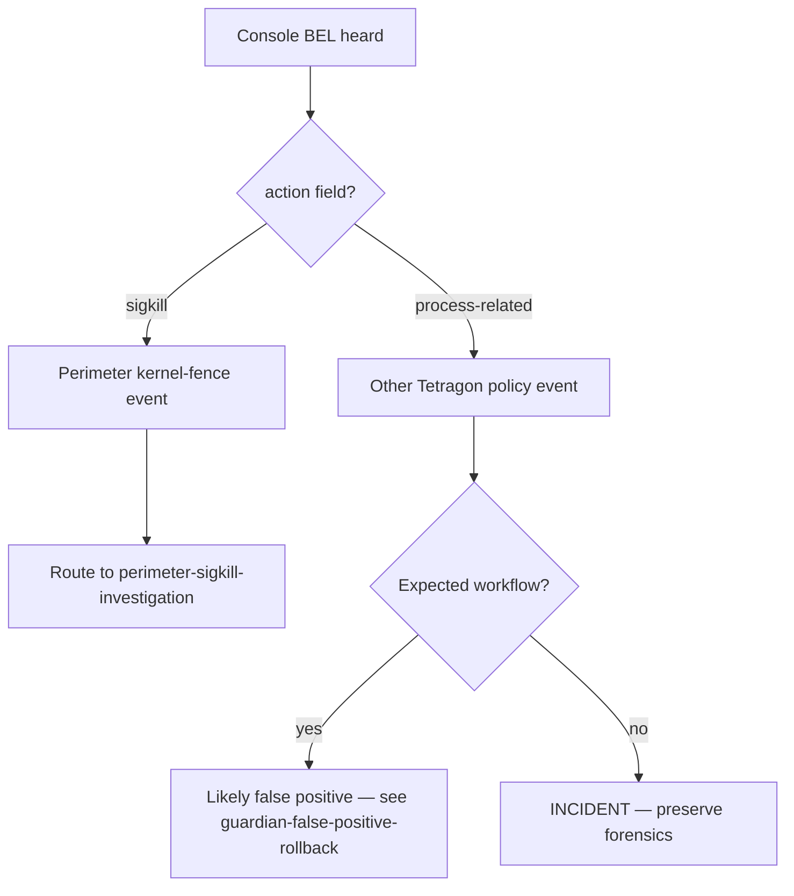

# Operator runbook — Guardian console alert investigation

## Summary

Operator runbook for **Guardian console alert investigation**.  Anchored to: Source dump §10 lines 527-552 (3-step response) + Trinity Genesis Auditor dump 977-981; SDD-029 guardian-daemon specification. Also references: Catalog milestone MS044 R10381-R10410 (3-step response + circuit breaker).

## When this fires

The operator hears the BEL on `/dev/console` OR sees `[Guardian] SIGKILL ...` on the physical console. That means:

1. Tetragon emitted an event (perimeter Sigkill OR process-related)
2. Guardian classified it
3. Guardian fanned out the verbatim 3-step response: SIGKILL (already done in kernel) → audit-log append → console alert (this signal)

This is the **supervisor-tier alarm**. The kernel-level termination already happened. Your role: investigate, decide if action is needed.

## First-look checklist (under 2 minutes)

```bash
# 1. Pull the most recent verdict (the one whose alert you just heard).
selfdefctl guardian show

# 2. Cross-reference with the OCSF event for full process context.
tail -n 1 /var/log/selfdef/guardian.ocsf.jsonl | python3 -m json.tool

# 3. Was this a perimeter Sigkill (kernel-fence) or a different Tetragon event?
selfdefctl perimeter history --limit 3
```

The verdict carries: `event_id`, `action`, `target_pid`, `target_cgroup`, `target_container_id`, `target_binary_path`, `response_steps`, `hostname`.

## Classification triage



## Detailed investigation

### 1. What was killed?

```bash
EVT="$(selfdefctl guardian show --json | python3 -c 'import json,sys; v=json.load(sys.stdin)["verdicts"]; print(v[0]["event_id"]) if v else exit(1)')"
echo "investigating event ${EVT}"

selfdefctl guardian show --json | python3 -c "
import json, sys
d = json.load(sys.stdin)
v = d['verdicts'][0]
print(f\"  action          : {v['action']}\")
print(f\"  target_pid      : {v['target_pid']}\")
print(f\"  target_binary   : {v['target_binary_path']}\")
print(f\"  target_cgroup   : {v['target_cgroup']}\")
print(f\"  target_container: {v['target_container_id']}\")
print('  response steps:')
for s in v['response_steps']:
    out = s['outcome']
    label = out.get('outcome', out) if isinstance(out, dict) else out
    print(f\"    {s['step']:<14}: {label}\")
"
```

### 2. Was any step Failed?

If `response_steps` includes a `Failed` outcome:

| Failed step | What it means | Fix |
|---|---|---|
| SIGKILL Failed | `podman kill` or `kill -9` returned non-zero. Process may still be alive. | Manually verify: `ps -p <pid>`. If alive, `kill -9 <pid>` or the parent process. |
| AuditAppend Failed | ZFS audit log couldn't be written. Most often: dataset not mounted, full disk, ownership wrong. | See [guardian-audit-log-corruption](guardian-audit-log-corruption.md). |
| ConsoleAlert Failed | `/dev/console` not writable. (Skipped is OK — operator-extended. Failed means actual error.) | Operator-extension: drop `DeviceAllow=/dev/console rw` for this host, OR fix the device. |

### 3. Cross-correlate with auditd / journald

```bash
PID="<target_pid>"
journalctl _PID="${PID}" --since "10 minutes ago"
ausearch -p "${PID}" --start recent 2>/dev/null

# Parent process (if still discoverable).
CGROUP="$(grep -E '"target_cgroup"' /var/log/selfdef/guardian.ocsf.jsonl | tail -1 | python3 -c 'import json,sys; print(json.loads(sys.stdin.read().rsplit(\"|\",1)[-1].strip())[\"target_cgroup\"])' 2>/dev/null || echo unknown)"
systemd-cgls --no-pager | grep -B5 "${PID}" 2>/dev/null
```

### 4. Was the SIGKILL a perimeter event?

If yes, route to [perimeter-sigkill-investigation](perimeter-sigkill-investigation.md) for the perimeter-specific triage (default allowlist check, extension lookup, intruder-probe classification).

If no (action == `ProcessRelated`), this is a non-kill Tetragon policy event Guardian still fanned out — examine the cmdline + cgroup to understand what the policy was protecting against.

## Response decision tree

| Pattern | Action |
|---|---|
| All 3 steps OK, expected workflow | Operator-extended ok. Author allowlist extension if recurring — see [perimeter-extension-create](perimeter-extension-create.md). |
| All 3 steps OK, unknown binary | Treat as probable intruder probe; route to [perimeter-sigkill-investigation](perimeter-sigkill-investigation.md). |
| SIGKILL step Failed | The process may still be alive — manually verify + kill. Then investigate why `podman kill` / `kill -9` failed. |
| AuditAppend Failed | Audit trail in question — route to [guardian-audit-log-corruption](guardian-audit-log-corruption.md). |
| Many alerts in tight window same target | Circuit breaker should have opened. Check `selfdefctl guardian show --json` for `circuit-breaker-open` errors. If not, file an issue — the breaker per-target counter may be mis-tracking. |
| BEL but no recent verdict | Audit-chain integrity check first ([guardian-audit-log-corruption](guardian-audit-log-corruption.md)); could be replay artifact. |

## Operator decision tree

- **Console alerts overwhelming the on-call**: that's a signal of EITHER aggressive Tetragon policy OR genuine attack. Don't disable the BEL — diagnose the source.
- **False-positive confirmed**: see [guardian-false-positive-rollback](guardian-false-positive-rollback.md) — record the rollback for audit-trail clarity.
- **No physical console attached**: the BEL is muted but the audit log still records. Subscribe to `journalctl -u selfdef-guardian.service -f` from another host for active monitoring; or wire a notifier integration (selfdef-integration-{ntfy,signal,pagerduty}).

## Relationships

### Cross-references

- SDD-029 §Deliverable 2 (Responder 3-step orchestrator)
- MS044 R10381-R10410 (response orchestrator + circuit breaker)
- Sister runbook: [perimeter-sigkill-investigation](perimeter-sigkill-investigation.md)
- Sister runbook: [guardian-false-positive-rollback](guardian-false-positive-rollback.md)
- Sister runbook: [guardian-audit-log-corruption](guardian-audit-log-corruption.md)
- Sister runbook: [guardian-socket-unreachable](guardian-socket-unreachable.md)
- Sister runbook: [guardian-not-running](guardian-not-running.md)
