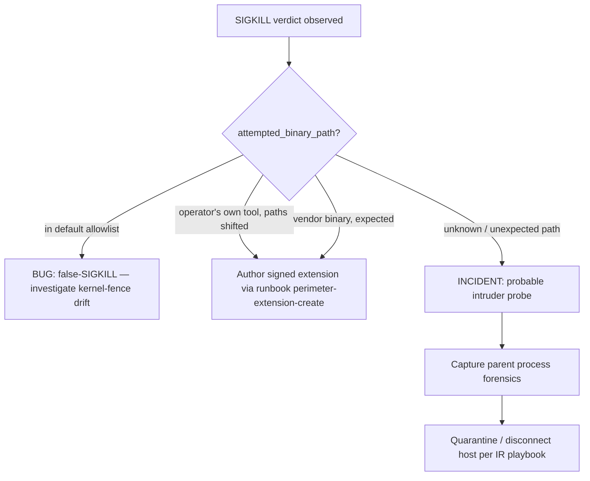

# Operator runbook — perimeter SIGKILL investigation

## When this fires

A SIGKILL verdict from the in-kernel `sovereign-kernel-fence` TracingPolicy means a process attempted to `execve` a binary that:

1. Is NOT in the verbatim sain-01 §6 default allowlist (`{python3, nvidia-smi, vllm, podman}`), AND
2. Is NOT covered by a currently-active operator-signed allowlist extension.

The execve was terminated **in the kernel** — the new process never started. The attempting process is dead. The OCSF Detection 2004 event is at `severity_id=5` (critical).

## First-look checklist (under 2 minutes)

```bash
# 1. Confirm the verdict + dump details.
selfdefctl perimeter history --limit 5

# 2. Inspect the most recent SIGKILL via the OCSF log.
tail -n 1 /var/log/selfdef/perimeter.ocsf.jsonl | python3 -m json.tool

# 3. Cross-correlate with auditd / journald for the parent process.
ausearch -p <attempting_pid> 2>/dev/null
journalctl _PID=<attempting_pid>

# 4. Cgroup membership tells you which service.
cat /proc/<parent_pid>/cgroup 2>/dev/null  # parent may also be dead
```

The OCSF event carries: `process.file.path` (the attempted binary), `process.pid` / `process.parent_process.pid`, `process.cmd_line` (parent's cmdline), `process.container.id`, `process.cgroup`, and `device.hostname`.

## Classification triage



## Detailed investigation

### 1. Is the attempted binary in the default allowlist?

```bash
ATTEMPTED="$(tail -n 1 /var/log/selfdef/perimeter.ocsf.jsonl | python3 -c 'import json,sys; print(json.loads(sys.stdin.read())["process"]["file"]["path"])')"
echo "attempted: ${ATTEMPTED}"

for ok in /usr/bin/python3 /usr/bin/nvidia-smi /usr/local/bin/vllm /usr/bin/podman; do
  if [[ "${ATTEMPTED}" == "${ok}" ]]; then
    echo "MATCH default-allowlist — this should not have SIGKILL'd. KERNEL-FENCE DRIFT."
    exit
  fi
done
echo "NOT in default allowlist."
```

If the attempted path equals a default-allowlist entry but the verdict was SIGKILL: that is a kernel-fence drift bug. Capture state and escalate (the TracingPolicy may have been corrupted; see [perimeter-policy-load-failure](perimeter-policy-load-failure.md)).

### 2. Was an extension expected to cover this path?

```bash
selfdefctl perimeter show --json | \
    python3 -c "import json,sys; p=json.load(sys.stdin); print('\n'.join(p['extension_paths']))"
```

If the path SHOULD have been there but wasn't:

- Extension expired (`expires_at_ms` < now). Re-issue per [perimeter-extension-create](perimeter-extension-create.md).
- Extension manifest failed signature verification. Inspect `journalctl -u selfdefd | grep "extension manifest rejected"`.
- Tetragon was reloaded but didn't pick up the new manifest path. The current contract is that the in-kernel allowlist is the TracingPolicy's verbatim set; extensions are mediated by selfdef-perimeter runtime, not by Tetragon directly. Operator must understand: SDD-028 §Deliverable 3 — runtime crate is the extension authority surface, but the in-kernel kprobe still uses the static YAML allowlist. Future round (MS047 R11084 + R11135) wires extensions into the kernel-loaded set via a Tetragon hot-reload pipeline.

(For Stage-1 deployments today: an "extension" surfaces in CLI/HTTP/cockpit but does NOT yet propagate to Tetragon's loaded YAML. Operators wanting an extension to actually prevent SIGKILL must hot-edit the YAML, which is chattr +i'd — that's intentional friction. The full pipeline lands in a later round.)

### 3. Forensics — who/what tried to exec?

```bash
# Parent process at time of execve.
PARENT_PID="$(tail -n 1 /var/log/selfdef/perimeter.ocsf.jsonl | python3 -c 'import json,sys; print(json.loads(sys.stdin.read())["process"]["parent_process"]["pid"])')"
CGROUP="$(tail -n 1 /var/log/selfdef/perimeter.ocsf.jsonl | python3 -c 'import json,sys; print(json.loads(sys.stdin.read())["process"]["cgroup"])')"
CONTAINER="$(tail -n 1 /var/log/selfdef/perimeter.ocsf.jsonl | python3 -c 'import json,sys; print(json.loads(sys.stdin.read())["process"]["container"]["id"])')"

echo "parent_pid=${PARENT_PID} cgroup=${CGROUP} container=${CONTAINER}"

# Map cgroup to systemd unit.
systemd-cgls --no-pager | grep -B2 "${PARENT_PID}" || true

# auditd evidence.
ausearch -p "${PARENT_PID}" --start recent

# Where did the parent come from?
cat /proc/${PARENT_PID}/cmdline 2>/dev/null | tr '\0' ' ' ; echo
cat /proc/${PARENT_PID}/status 2>/dev/null | head -20
```

### 4. Audit chain integrity

```bash
selfdefctl perimeter audit-cycle replay --json
```

The runtime crate's `audit_chain_check` verifies SHA-256 chained `prev_event_sha256` linking. A chain break is a CRITICAL signal — log tampering is in progress or has happened.

## Response decision tree

| Pattern | Action |
|---|---|
| Operator's own tool, signing pending | Author signed extension per [perimeter-extension-create](perimeter-extension-create.md). Document why the binary path was outside the default set. |
| Container-runtime regression (e.g. podman path changed) | Verify the new path. If sain-01 §6 still names the correct path, the issue is on the host. If sain-01 §6 needs to evolve, that's an operator-level spec amendment (NOT a daily ops task). |
| Unknown path, parent process is sshd / cron | INCIDENT. Treat as a probable intruder probe. Quarantine the parent process's cgroup; preserve the cmdline + auditd trail; escalate per IR playbook. |
| Unknown path, parent process is a known service | Identify the service. If it's an LLM agent / automation that overflowed its scope, this is a service-defect incident (the service tried to exec something it shouldn't); fix the service and document. |
| Repeated SIGKILLs in a tight window | Likely an automated tool retrying. Find and stop the parent; the in-kernel fence is doing its job. |

## Relationships

### Cross-references

- SDD-028 §Deliverable 3 (runtime crate, OCSF Detection 2004 emission)
- SDD-028 §Deliverable 8 (HTTP API `/v1/perimeter/history`)
- MS047 R11088-R11102 (OCSF schema binding)
- MS047 R11103-R11109 (ZFS log bridge, atomic append, audit chain)
- Sister runbook: [perimeter-extension-create](perimeter-extension-create.md)
- Sister runbook: [perimeter-policy-load-failure](perimeter-policy-load-failure.md)
- Hardware-frame sibling: [friction-audit-immutability](friction-audit-immutability.md)
