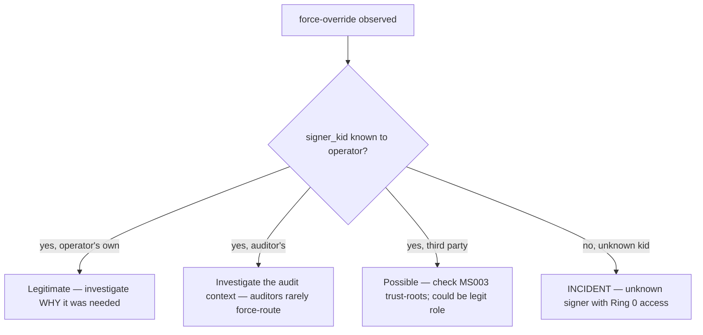

# Operator runbook — scheduler force-override investigation

## When to use this

A `selfdefctl scheduler force <request-id> --route R` was recorded — either by the current operator (as a deliberate override) or someone-else (which itself is an incident signal). This runbook walks the investigation of WHY the force was applied + whether the underlying root cause needs fixing.

## Force-override semantics (MS048 R11399-R11402)

| Property | Behavior |
|---|---|
| Authority required | Ring 0 (User=root on the host) + MS003 signature |
| TTL | Single-request — does NOT alter weight matrix (R11402) |
| Audit | Recorded in audit log with `override_signer_kid` field (R11401) |
| Effect on weight matrix | None — force is a per-request override, not a doctrine change |
| Effect on profile | None — force is a per-request override, not a profile change |
| Reversibility | The force already happened; investigation is reflective. Future requests with same shape will be routed by the normal weight matrix unless another force is applied. |

The force-override is operator's escape-hatch for the dump's `User chooses` Core Law (line 18288):

> Models propose. Runtime routes. CPU enforces. Tools prove. ZFS remembers. **User chooses.**

When the user chooses a route the scheduler wouldn't have picked, that's intentional. This runbook is for the operator who sees a force in the audit log and asks "why?".

## First-look (under 2 minutes)

```bash
# 1. Pull recent decisions with override-signer set.
selfdefctl scheduler history --limit 32 --json | \
    python3 -c '
import json, sys
ds = json.load(sys.stdin)
for d in ds:
    if d.get("override_signer_kid"):
        print(f"  [{d[\"ts_ms\"]}] req={d[\"request_id\"]} route={d[\"route\"]} signer={d[\"override_signer_kid\"]}")
'

# 2. Explain a specific overridden decision.
selfdefctl scheduler explain <request-id>

# 3. Cross-correlate the force signer kid against your trust roots.
ls /etc/selfdef/trust-roots/
```

## Classification triage



## Detailed investigation

### 1. Read the original decision context

```bash
selfdefctl scheduler explain <request-id> --json | jq .
```

Key fields:

- `profile` — what profile was in effect (force often happens to bypass profile-specific routing)
- `route` — the ACTUAL route taken (the forced one)
- `axis_scores` — what the 7-axis breakdown was at decision time
- `backpressure` — what surfaces were under pressure when the force fired

### 2. Run a counterfactual to see what would have happened

```bash
selfdefctl scheduler replay <request-id> --profile careful --json | jq .counterfactual
```

The counterfactual shows where the scheduler WOULD have routed without the force. If the counterfactual matches the actual route, the force was redundant (operator may have lost confidence in the scheduler's normal path). If the counterfactual differs, the force was a real choice deviation.

### 3. Why might a force happen?

| Reason | What to look for |
|---|---|
| Operator wants Blackwell oracle for a sensitive review even though scheduler routed to scout | Look for `--route blackwell` forces; cross-ref `rationale` field |
| Operator wants to bypass cost-budget for a high-stakes decision | Look for `--route blackwell` with `profile=fast` (where fast normally avoids oracle) |
| Operator quarantines a request to CPU-only path to keep VRAM free for another in-flight job | Look for `--route cpu` forces under backpressure |
| Operator hibernates a branch manually (deferred work) | Look for `--route hibernate` |
| Debug/forensics — force-route to gather a specific tier's trace | Look for `--route blackwell` with diverse profiles |

### 4. Audit the signer kid

```bash
SIGNER="$(selfdefctl scheduler explain <request-id> --json | jq -r .override_signer_kid)"
echo "signer: ${SIGNER}"

# Is this kid in the trust roots?
ls /etc/selfdef/trust-roots/ | grep "${SIGNER}" || echo "WARN: signer not in trust-roots/"

# When did the signer's pub key land?
stat /etc/selfdef/trust-roots/${SIGNER}.pub 2>/dev/null
```

If the signer kid is unknown to the operator's trust roots, this is an **INCIDENT** — Ring 0 + MS003 should have rejected the force. Either:
- The trust roots got rotated without removing an old kid
- An intruder added a pub key
- The MS003 verification path has a bug

Treat as INCIDENT and escalate.

### 5. Was the force part of a sequence?

```bash
# Did the same signer force-override multiple recent decisions?
selfdefctl scheduler history --limit 100 --json | \
    python3 -c '
import json, sys
ds = json.load(sys.stdin)
by_signer = {}
for d in ds:
    s = d.get("override_signer_kid")
    if s:
        by_signer.setdefault(s, []).append(d["request_id"])
for s, ids in by_signer.items():
    print(f"  signer={s} count={len(ids)} ids={ids}")
'
```

Many forces from the same signer in tight window = either active debugging, runaway script, or compromised credential.

## Response decision tree

| Pattern | Action |
|---|---|
| Single force, operator's own kid, clear rationale | No action — operator-supervised exception |
| Many forces, operator's own kid, no rationale recorded | Operator habit slippage — discuss in retro. Future forces should include rationale via runtime extension (R11384) |
| Force from auditor kid | Investigate the audit context — auditors rarely route. Possible legitimate forensic capture; possible misuse |
| Force from unknown kid | INCIDENT. Trust-roots rotation per [perimeter-key-rotation](perimeter-key-rotation.md). Audit recent admin actions on the host |
| Force triggers downstream failure | Operator chose a route that violated a backpressure invariant (e.g. forced Blackwell when VRAM stuck high). The force succeeded but caused cascading degradation — file follow-up |

## Operator decision tree

- **Force has become a routine workaround for a recurring routing mismatch**: that's a signal the weight matrix needs rotation. See [scheduler-weight-matrix-rotation](scheduler-weight-matrix-rotation.md).
- **Operator wants to disable force-override entirely** (high-trust profile, no human-in-the-loop routing): operator-decision; would need a Stage-2 catalog amendment (Profile enum extension or new force-disabled flag). Document the request in `wiki/log/` for operator review.
- **Force success rate < 50% (forces routinely produce worse outcomes than the scheduler's default)**: the operator's intuition is mis-calibrated relative to current workload. Consider weight-rotation OR more aggressive replay-feedback loop (R11389-R11390).

## Cross-references

- SDD-031 §Deliverable 3 (`selfdefctl scheduler force` CLI surface)
- MS048 R11399-R11402 (force-override semantics)
- MS039 Ring 0 authority + trust topology
- MS003 selfdef-signing chain-of-trust
- Sister runbook: [scheduler-weight-matrix-rotation](scheduler-weight-matrix-rotation.md)
- Sister runbook: [perimeter-key-rotation](perimeter-key-rotation.md) (trust-roots)
- Sister runbook: [guardian-false-positive-rollback](guardian-false-positive-rollback.md) (similar operator-intent audit pattern)
