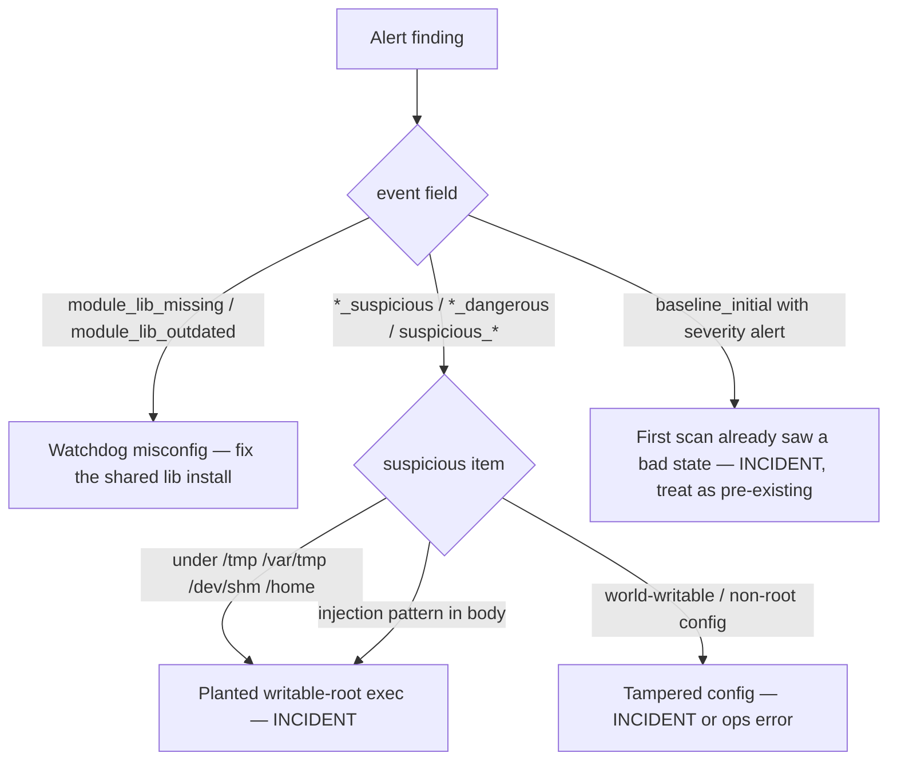

# Operator runbook — selfdef detection-watchdog alert finding

## Summary

Operator response procedure for the `SelfdefWatchdogAlertFinding` Prometheus
alert: triage, investigate, and respond when one of selfdef's ~46 host
detection-watchdogs emits an alert-tier finding (a planted exec under a
writable root, an injection pattern, a tampered/world-writable config, or a
`module_lib_missing` fail-loud) that the SDD-062 Sigma rule promotes to a
High Detection Finding. Covers identifying the watchdog from its journald
tag, comparing against its learned baseline, the misconfiguration vs
intrusion split, and the response decision tree.

## When this fires

`SelfdefWatchdogAlertFinding` (Prometheus) fires when
`increase(selfdef_findings_by_rule_total{rule="selfdef watchdog alert-tier finding"}[10m]) > 0`.

That means one of the host **detection-watchdogs** (the journald
baseline+delta scanners under `modules/*-watchdog/`) emitted a JSON finding
with `"severity":"alert"`, and the `selfdef_watchdog_alert` Sigma rule
(SDD-062) promoted it to a High Detection Finding. The same finding also
travels the in-process notifier chain — this alert is the **metrics-path**
copy, so it survives even if the notifier is degraded.

The SDD-062 rule is **tag-prefix**, not tag-enumerated, so it covers the
whole `selfdef-*` watchdog set — **two axes**, both firing the same alert:

- the **exec/injection axis** (the SDD-061 module-lib scanners: planted
  exec targets, injection patterns, writable configs — the bulk of the
  triage below); and
- the **integrity/baseline axis** (inventory + baseline-delta scanners: a
  new setuid binary, a new file-capability grant, a `+` rhosts trust, a
  root-login TTY widen, a rogue NSS source, a weakened kernel sysctl, …).

Identify which axis from the `selfdef-<tag>` SyslogIdentifier (tables below).

Alert tier means one of:

- a planted **exec target under a writable root** (`/tmp /var/tmp /dev/shm /home`):
  an `execute()` / `RUN+=` / `Exec=` / `ProxyCommand` / `program(...)` /
  `install ... <cmd>` / sudo `secure_path` element / ld.so/ld-musl search
  dir / krb5|pkcs11|gss|openssl|nm-vpn `.so` / xinetd `server=` / autofs
  `program:` / etc.;
- a **relative-with-slash** or **bare** exec target where an absolute path
  is expected;
- a **command-injection pattern** in a config/script surface (curl|sh,
  `/dev/tcp/`, `base64 -d`, `mkfifo`, `bash -i`, …);
- a **world-writable or non-root-owned** config file;
- a **`module_lib_missing` / `module_lib_outdated`** fail-loud (a watchdog
  could not source its shared policy library — see § "module_lib_* findings"
  below; this is a *misconfiguration*, not necessarily an attack).

## First-look checklist (under 2 minutes)

```bash
# 1. Which watchdog(s) alerted, and what did they say? The SyslogIdentifier
#    is selfdef-<tag>; the JSON body carries the event + the suspicious item.
journalctl --since "15 min ago" -o cat \
  | grep -F '"severity":"alert"' | grep -F 'selfdef-'

# 2. The matching Detection Findings (the Sigma rule's output).
selfdefctl findings recent --limit 10 2>/dev/null \
  || journalctl -t selfdef-notifier-engine --since "15 min ago" -o cat | tail

# 3. Per-rule finding rate (what the alert counted).
curl -s localhost:9100/metrics 2>/dev/null \
  | grep 'selfdef_findings_by_rule_total'
```

The watchdog JSON body fields: `tag`, `severity`, `event`, `profile`,
and a `suspicious` / `added_sample` describing the offending item.

## Classification triage



## Detailed investigation

### 1. Identify the watchdog + the offending item

The `selfdef-<tag>` SyslogIdentifier names the surface. Map a few common ones:

| tag prefix | surface | what an alert means |
|---|---|---|
| `selfdef-sshd-config` | sshd effective config | ForceCommand/AuthorizedKeysCommand to attacker code, PermitRootLogin yes |
| `selfdef-sudoers-defaults` / `selfdef-sudo-conf` | sudo Defaults / plugins | writable secure_path, env_keep LD_PRELOAD, writable Plugin/.so |
| `selfdef-ld-preload` / `selfdef-ld-so-conf` / `selfdef-musl-ld-path` | dynamic linker | preload/search-dir hijack — near-total code-exec foothold |
| `selfdef-udev-rules` | udev RUN+=/PROGRAM= | device-event root exec |
| `selfdef-dbus-service` | D-Bus activation | bus-name-call root exec |
| `selfdef-apt-hooks` / `selfdef-dnf-plugins` | package hooks | package-transaction root exec |
| `selfdef-cron-*` / `selfdef-at-jobs` / `selfdef-anacrontab` | schedulers | scheduled root exec / self-resubmission |
| `selfdef-krb5-plugins` / `selfdef-pkcs11-modules` / `selfdef-gss-mech` | auth .so load | code into auth/credential processes |

The **integrity/baseline axis** tags (inventory + baseline-delta scanners)
fire the same alert; their `event` + `suspicious` fields name the change:

| tag prefix | surface | what an alert means |
|---|---|---|
| `selfdef-suid-sgid` | setuid/setgid inventory | new or perm-changed setuid binary (`suid_drift`); 4+ added = `bulk_delta` (bulk-install) |
| `selfdef-file-caps` | file capabilities | a binary granted a dangerous cap (`dangerous_capability_added`: cap_setuid/sys_admin/dac_*/…) |
| `selfdef-world-writable` / `selfdef-unowned-files` | filesystem hygiene | world-writable file outside the sticky whitelist / file owned by a deleted uid (bulk = incident) |
| `selfdef-rhosts` | rsh/rlogin trust | a `+` wildcard trust or a per-user `.rhosts` (`rhosts_trust_backdoor`, T1199) |
| `selfdef-securetty` | root-login TTYs | a newly-permitted pts/network TTY, or the file removed (fail-open) |
| `selfdef-nsswitch` | resolver source map | a rogue `libnss_<x>` source on a db, or a db line removed (`nsswitch_rogue_source`) |
| `selfdef-hosts-file` | `/etc/hosts` | a sensitive package/security/CA domain pinned or blackholed (`hosts_file_sensitive_pin`) |
| `selfdef-access-conf` / `selfdef-sysusers` / `selfdef-capability-conf` | PAM access / declarative users / pam_cap | broad `+` permit / uid-0 declarative account / dangerous capability grant |
| `selfdef-sysctl-hardening` | kernel sysctls | a security sysctl set to its weak value (ASLR off, ptrace_scope 0, suid_dumpable on, …) |
| `selfdef-modules-load` / `selfdef-tmpfiles` / `selfdef-nfs-exports` / `selfdef-polkit-rules` | boot/persistence config | world-writable autoload config / setuid tmpfiles entry / `no_root_squash` export / new polkit YES grant |
| `selfdef-timestomp` | timestamp anomalies | FUTURE/EPOCH/MTIME>CTIME tells of `touch`-based anti-forensics (T1070.006) |

(Full set: `ls modules/*-watchdog/` in the selfdef repo. The exec/injection
axis is the SDD-061 module-lib set; the integrity axis is the remaining
baseline scanners — both proven to route to this alert by the SDD-062
rule-tests.)

### 2. Compare against the watchdog's baseline

Each delta watchdog keeps a learned baseline TSV under
`/var/lib/selfdef/<module>-baseline.tsv`. The `added_sample` /
`removed_sample` in the finding show exactly what changed since the
baseline. A first-run `baseline_initial` with `severity:"alert"` means the
bad state was **already present** when selfdef first scanned — treat as a
pre-existing compromise/misconfig, not a fresh change.

```bash
sudo cat /var/lib/selfdef/<module>-baseline.tsv      # what selfdef considers normal
# the finding's suspicious/added_sample is the deviation
```

### 3. Cross-correlate

```bash
# Who/what wrote the offending file recently?
sudo ls -la --time-style=full-iso <offending-path>
ausearch -f <offending-path> --start recent 2>/dev/null
journalctl --since "1 hour ago" | grep -F '<offending-path>'
```

## module_lib_* findings (misconfiguration, not attack)

`module_lib_missing` / `module_lib_outdated` are emitted when a watchdog
scan script cannot source `/usr/share/selfdef/lib/module-lib.sh` or finds it
older than the required version. Per SDD-061 D-6 / SDD-063 the watchdogs
**fail loud** rather than scan with a divergent/absent policy. This is a
packaging/deployment problem, not (usually) an intrusion:

```bash
ls -l /usr/share/selfdef/lib/module-lib.sh
grep SELFDEF_MODULE_LIB_VERSION= /usr/share/selfdef/lib/module-lib.sh   # expect >= 4
# Fix: reinstall the selfdef package (ships the lib alongside the scan scripts),
# or restore the file. The watchdog resumes normal scanning once present.
```

If the library went missing on a host that was working — that itself is
worth a forensic look (who removed it?), since a watchdog with no policy is
a blinded watchdog.

## Response decision tree

| Pattern | Action |
|---|---|
| `module_lib_missing` / `module_lib_outdated` | Reinstall/restore `/usr/share/selfdef/lib/module-lib.sh`; investigate if it vanished unexpectedly. |
| Writable-root exec target, no known change-window | INCIDENT — preserve the offending file (copy, don't delete), capture `ls -la` + ausearch, then remove the planted entry and re-baseline. |
| Writable-root exec target during a known deploy/ops change | Likely operator/ops error — fix the config to use a non-writable path; re-baseline. |
| Injection pattern in a config you authored | Verify it's intentional (rare); if so it's a true-positive on a risky idiom — move the logic to a vetted script under `/usr/{,local/}{s,}bin`. |
| `baseline_initial` alert on a fresh host | Pre-existing bad state captured at first scan — treat as compromise-until-cleared. |
| Repeated alerts, same tag, tight window | Sustained tamper or a flapping config writer — find the writer (ausearch/inotify), don't just re-baseline in a loop. |

## False positives

- A site-local config legitimately invoking a program under `/usr/local`
  is **not** flagged (the watchdogs treat `/usr/local` as trusted).
- The `warn` tier (config changed but target still trusted) does **not**
  page — it is local-triage signal, by design (mirrors the agent-guard
  audit-mode precedent). Only `alert` reaches this runbook. As of SDD-062
  D-5 (2026-05-27) the warn tier IS now routed to a non-paging Informational
  Detection Finding — visible on the dashboard "detection-watchdog warn
  findings (1h)" panel + the `selfdef watchdog warn-tier finding` metric
  series for trend triage — but it stays below the notifier panic floor and
  carries no Prometheus alert, so it still does not page and does not reach
  this runbook. Investigate a warn trend only if it correlates with an
  alert-tier finding.
- A bare PATH-resolved command in surfaces where that is normal
  (e.g. ssh `ProxyCommand corkscrew …`) is not flagged.

## Relationships

- IMPLEMENTS the operator-response side of selfdef **SDD-062** (watchdog
  severity routing) — `docs/sdd/062-watchdog-severity-routing.md`.
- BUILDS ON selfdef **SDD-061** (shared watchdog scan helpers) —
  `docs/sdd/061-shared-watchdog-scan-helpers.md`.
- RELATES TO selfdef **SDD-063** (writable-dir helper + the
  `module_lib_missing`/`module_lib_outdated` fail-loud) —
  `docs/sdd/063-writable-directory-policy-helper.md`.
- CONSTRAINED BY the Sigma rule that emits the finding — selfdef
  `rules/sigma/execution/selfdef_watchdog_alert.yml`.
- FEEDS INTO the Prometheus alert — selfdef
  `modules/observability/assets/alerts/selfdef.yml.template`
  (`SelfdefWatchdogAlertFinding`).
- PARALLELS the supervisor-tier kill runbook:
  [guardian-console-alert-investigation](guardian-console-alert-investigation.md).
- PARALLELS the kernel-fence runbook:
  [perimeter-sigkill-investigation](perimeter-sigkill-investigation.md).
